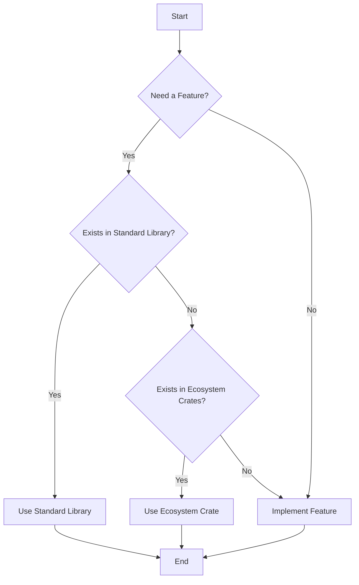

## 25.16. The Inner Platform Effect

### Introduction

In the realm of software development, the **Inner Platform Effect** is a common anti-pattern that can lead to unnecessary complexity and redundancy in your codebase. This phenomenon occurs when developers, often unintentionally, recreate features of the programming language or existing libraries within their projects. In Rust, a language known for its powerful standard library and rich ecosystem of crates, falling into this trap can be particularly counterproductive. In this section, we will define the Inner Platform Effect, explore its implications, and provide guidance on how to avoid it by leveraging Rust's robust features and community-supported solutions.

### Understanding the Inner Platform Effect

The Inner Platform Effect is a situation where a software system is designed to be so customizable and flexible that it ends up replicating the functionality of the platform it is built on. This often results in a system that is overly complex, difficult to maintain, and redundant. In Rust, this can manifest when developers attempt to recreate language features or standard library functionality, leading to bloated code and increased maintenance overhead.

#### Implications of the Inner Platform Effect

1. **Increased Complexity**: By recreating existing features, the codebase becomes more complex, making it harder to understand and maintain.
2. **Redundancy**: Duplicating functionality that already exists in the language or libraries leads to redundant code.
3. **Maintenance Overhead**: Custom implementations require ongoing maintenance and updates, which can be costly and time-consuming.
4. **Reduced Performance**: Custom solutions may not be as optimized as the well-tested implementations provided by the language or libraries.
5. **Missed Opportunities**: By not leveraging existing solutions, developers miss out on the benefits of community support, documentation, and updates.

### How Developers Fall Into the Trap

Developers may inadvertently recreate language features or standard library functionality for several reasons:

- **Lack of Awareness**: Developers may not be fully aware of the capabilities of the language or the available libraries.
- **Desire for Control**: Some developers prefer to have complete control over their code, leading them to implement features from scratch.
- **Misguided Optimization**: In an attempt to optimize performance, developers might create custom solutions without realizing that existing implementations are already optimized.
- **Over-Engineering**: The tendency to over-engineer solutions can lead to unnecessary complexity and feature duplication.

### Examples of Unnecessary Custom Implementations

Let's explore some common scenarios where developers might fall into the Inner Platform Effect in Rust:

#### Example 1: Custom String Manipulation

Rust's standard library provides a comprehensive set of string manipulation functions. However, developers might attempt to implement their own versions of these functions, leading to redundant and potentially less efficient code.

```rust
// Unnecessary custom implementation of string reversal
fn reverse_string(s: &str) -> String {
    s.chars().rev().collect()
}

// Using Rust's standard library
let original = "hello";
let reversed: String = original.chars().rev().collect();
```

In this example, the custom implementation of string reversal is unnecessary because Rust's standard library already provides a straightforward way to reverse a string using iterators.

#### Example 2: Custom Error Handling

Rust's `Result` and `Option` types provide powerful mechanisms for error handling. Developers might be tempted to create their own error handling structures, which can lead to increased complexity and inconsistency.

```rust
// Custom error handling structure
enum MyError {
    NotFound,
    InvalidInput,
}

// Using Rust's standard library
fn find_item(items: &[i32], target: i32) -> Result<i32, &'static str> {
    items.iter().find(|&&x| x == target).map(|&x| x).ok_or("Item not found")
}
```

The custom error handling structure in this example is unnecessary because Rust's `Result` type can be used to handle errors in a consistent and idiomatic way.

### Leveraging Rust's Standard Library and Ecosystem Crates

To avoid the Inner Platform Effect, it's crucial to leverage Rust's standard library and the rich ecosystem of crates available. Here are some strategies to help you make the most of these resources:

#### Embrace the Standard Library

Rust's standard library is designed to provide a wide range of functionality, from data structures and algorithms to concurrency and I/O. Familiarize yourself with the capabilities of the standard library and use it whenever possible.

#### Explore the Ecosystem Crates

The Rust ecosystem is home to a vast array of crates that extend the language's functionality. These crates are often well-tested, optimized, and supported by the community. Before implementing a custom solution, explore the available crates to see if one meets your needs.

#### Follow Community Best Practices

The Rust community is known for its emphasis on best practices and idiomatic code. Follow community guidelines and recommendations to ensure that your code is maintainable, efficient, and consistent with the language's philosophy.

#### Contribute to Existing Projects

Instead of creating custom implementations, consider contributing to existing projects. This not only helps improve the ecosystem but also allows you to benefit from the collective knowledge and experience of the community.

### Benefits of Using Well-Tested, Community-Supported Solutions

By leveraging Rust's standard library and ecosystem crates, you can enjoy several benefits:

- **Reliability**: Well-tested solutions are more reliable and less prone to bugs.
- **Performance**: Community-supported solutions are often optimized for performance.
- **Documentation**: Established libraries and crates come with comprehensive documentation, making them easier to use and integrate.
- **Community Support**: By using popular solutions, you can benefit from community support, including forums, tutorials, and examples.

### Visualizing the Inner Platform Effect

To better understand the Inner Platform Effect, let's visualize the concept using a flowchart. This diagram illustrates the decision-making process that can lead to unnecessary complexity and redundancy.



**Diagram Description**: This flowchart represents the decision-making process when implementing a new feature. It encourages developers to first check if the feature exists in the standard library or ecosystem crates before implementing it themselves.

### Knowledge Check

Before we conclude, let's pose a few questions to reinforce the concepts covered in this section:

1. What is the Inner Platform Effect, and why is it considered an anti-pattern?
2. How can developers avoid falling into the trap of recreating language features or standard library functionality?
3. What are the benefits of using Rust's standard library and ecosystem crates instead of custom implementations?

### Conclusion

The Inner Platform Effect is a common pitfall that can lead to unnecessary complexity and redundancy in your Rust projects. By understanding this anti-pattern and leveraging Rust's powerful standard library and ecosystem crates, you can create more efficient, maintainable, and reliable software. Remember, the key to avoiding the Inner Platform Effect is to embrace existing solutions and contribute to the community whenever possible.

### Embrace the Journey

As you continue your journey in Rust development, keep experimenting, stay curious, and enjoy the process of learning and growing as a developer. Remember, this is just the beginning. By avoiding the Inner Platform Effect and leveraging Rust's robust features, you'll be well-equipped to tackle even the most complex software challenges.

## Quiz Time!



### What is the Inner Platform Effect?

- [x] An anti-pattern where developers recreate language features or libraries within their projects
- [ ] A design pattern for creating flexible software systems
- [ ] A method for optimizing code performance
- [ ] A tool for debugging Rust applications

> **Explanation:** The Inner Platform Effect is an anti-pattern that occurs when developers recreate features of the programming language or existing libraries within their projects, leading to unnecessary complexity and redundancy.

### Why is the Inner Platform Effect considered an anti-pattern?

- [x] It leads to increased complexity and redundancy
- [ ] It improves code readability and maintainability
- [ ] It enhances performance and efficiency
- [ ] It simplifies error handling

> **Explanation:** The Inner Platform Effect is considered an anti-pattern because it leads to increased complexity, redundancy, and maintenance overhead, making the codebase harder to manage.

### How can developers avoid the Inner Platform Effect in Rust?

- [x] By leveraging Rust's standard library and ecosystem crates
- [ ] By implementing custom solutions for every feature
- [ ] By avoiding the use of third-party libraries
- [ ] By focusing solely on performance optimization

> **Explanation:** Developers can avoid the Inner Platform Effect by leveraging Rust's standard library and ecosystem crates, which provide well-tested and optimized solutions.

### What are the benefits of using Rust's standard library?

- [x] Reliability, performance, and community support
- [ ] Increased code complexity and redundancy
- [ ] Reduced documentation and support
- [ ] Limited functionality and flexibility

> **Explanation:** Using Rust's standard library provides benefits such as reliability, performance, comprehensive documentation, and community support.

### What should developers do before implementing a custom solution?

- [x] Check if the feature exists in the standard library or ecosystem crates
- [ ] Immediately start coding the custom solution
- [ ] Avoid using any existing libraries or crates
- [ ] Focus on optimizing the custom solution for performance

> **Explanation:** Before implementing a custom solution, developers should check if the feature exists in the standard library or ecosystem crates to avoid unnecessary complexity and redundancy.

### What is a common reason developers fall into the Inner Platform Effect?

- [x] Lack of awareness of existing language features or libraries
- [ ] Over-reliance on community-supported solutions
- [ ] Excessive use of third-party libraries
- [ ] Strict adherence to coding standards

> **Explanation:** A common reason developers fall into the Inner Platform Effect is a lack of awareness of existing language features or libraries, leading them to recreate functionality unnecessarily.

### What is the role of community support in avoiding the Inner Platform Effect?

- [x] It provides well-tested solutions and comprehensive documentation
- [ ] It discourages the use of standard library features
- [ ] It promotes the creation of custom implementations
- [ ] It limits the flexibility of software systems

> **Explanation:** Community support plays a crucial role in avoiding the Inner Platform Effect by providing well-tested solutions, comprehensive documentation, and guidance on best practices.

### How does the Inner Platform Effect impact performance?

- [x] Custom solutions may not be as optimized as existing implementations
- [ ] It always enhances performance and efficiency
- [ ] It simplifies code and reduces execution time
- [ ] It guarantees optimal performance in all scenarios

> **Explanation:** The Inner Platform Effect can negatively impact performance because custom solutions may not be as optimized as existing implementations provided by the language or libraries.

### What is a key takeaway from understanding the Inner Platform Effect?

- [x] Embrace existing solutions and contribute to the community
- [ ] Always implement custom solutions for every feature
- [ ] Avoid using the standard library and ecosystem crates
- [ ] Focus solely on performance optimization

> **Explanation:** A key takeaway from understanding the Inner Platform Effect is to embrace existing solutions, leverage the standard library and ecosystem crates, and contribute to the community.

### True or False: The Inner Platform Effect is beneficial for software development.

- [ ] True
- [x] False

> **Explanation:** False. The Inner Platform Effect is not beneficial for software development as it leads to unnecessary complexity, redundancy, and maintenance overhead.


