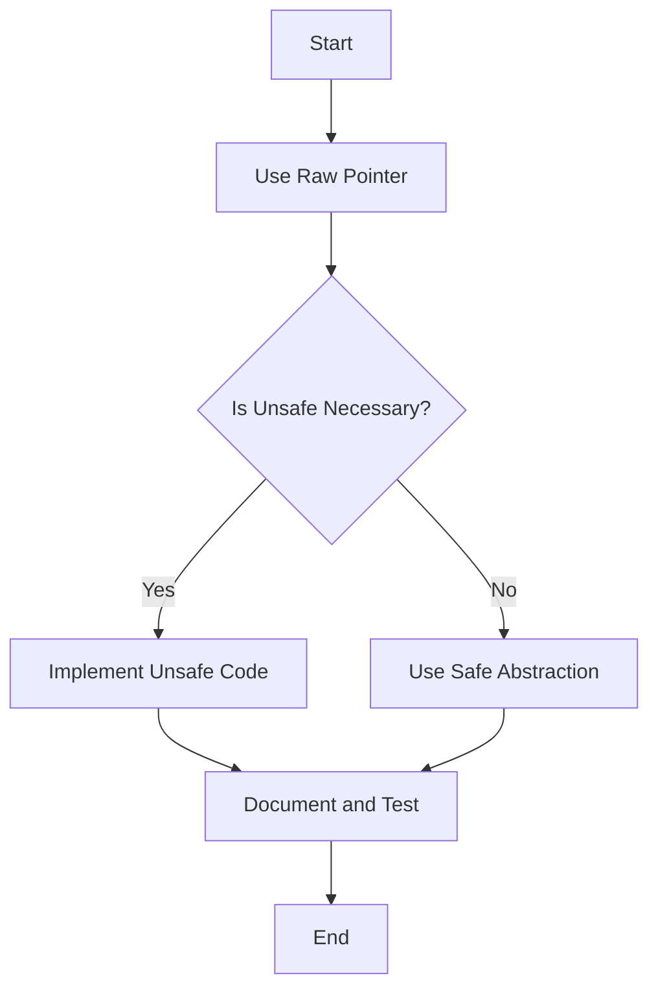

## 25.2. Overusing Unsafe Code

### Introduction

Rust is renowned for its emphasis on safety, particularly memory safety, without sacrificing performance. One of the key features that enable this is the concept of **ownership** and **borrowing**, which the Rust compiler enforces strictly. However, there are scenarios where these safety guarantees might be too restrictive, and developers need to step outside the bounds of Rust's safety net. This is where `unsafe` code comes into play.

### What is Unsafe Code?

In Rust, `unsafe` code is a mechanism that allows developers to perform operations that the Rust compiler cannot guarantee to be safe. This includes:

- Dereferencing raw pointers.
- Calling functions or methods that are marked as `unsafe`.
- Accessing or modifying mutable static variables.
- Implementing unsafe traits.

The `unsafe` keyword is a signal to the developer that they are responsible for upholding Rust's safety guarantees manually. While `unsafe` code can be necessary, it should be used sparingly and with caution.

### Why Unsafe Code Exists

Rust's safety guarantees are powerful, but they can sometimes be limiting, especially in systems programming where low-level memory manipulation is required. `unsafe` code provides a way to:

- Interact with hardware directly.
- Optimize performance-critical sections of code.
- Interface with other languages, such as C, through Foreign Function Interface (FFI).

### Dangers of Overusing Unsafe Code

Overusing `unsafe` code can lead to several issues, including:

1. **Undefined Behavior**: Rust's safety guarantees are bypassed, leading to potential undefined behavior if the developer makes mistakes.
2. **Security Vulnerabilities**: Unsafe code can introduce vulnerabilities such as buffer overflows, use-after-free, and data races.
3. **Maintainability Challenges**: Unsafe code is harder to read and maintain, as it requires a deep understanding of the underlying memory model.
4. **Loss of Compiler Guarantees**: The Rust compiler's ability to catch errors at compile time is diminished, leading to more runtime errors.

### Common Scenarios for Unnecessary Unsafe Usage

Developers might be tempted to use `unsafe` code in the following scenarios:

- **Performance Optimization**: Attempting to optimize code without profiling first to determine if `unsafe` is necessary.
- **Interfacing with C Libraries**: Using `unsafe` for FFI without exploring safe abstractions or wrappers.
- **Bypassing Borrow Checker**: Using `unsafe` to circumvent borrow checker errors without understanding the underlying ownership issues.

### Safer Alternatives and Patterns

#### 1. Use Safe Abstractions

Rust's standard library and ecosystem provide many safe abstractions that can replace `unsafe` code. For example, instead of using raw pointers, consider using smart pointers like `Box`, `Rc`, or `Arc`.

```rust
// Unsafe raw pointer usage
let x: i32 = 42;
let r: *const i32 = &x;
unsafe {
    println!("r points to: {}", *r);
}

// Safe alternative using references
let x: i32 = 42;
let r: &i32 = &x;
println!("r points to: {}", r);
```

#### 2. Leverage Rust's Concurrency Primitives

Instead of using `unsafe` for concurrency, leverage Rust's concurrency primitives like `Mutex`, `RwLock`, and channels, which provide safe concurrency patterns.

```rust
use std::sync::Mutex;
use std::thread;

let counter = Mutex::new(0);

let handles: Vec<_> = (0..10).map(|_| {
    let counter = counter.clone();
    thread::spawn(move || {
        let mut num = counter.lock().unwrap();
        *num += 1;
    })
}).collect();

for handle in handles {
    handle.join().unwrap();
}

println!("Result: {}", *counter.lock().unwrap());
```

#### 3. Use Safe Wrappers for FFI

When interfacing with C libraries, use safe wrappers that encapsulate `unsafe` code. Libraries like `bindgen` can help generate safe bindings.

```rust
extern "C" {
    fn some_c_function(x: i32) -> i32;
}

fn safe_wrapper(x: i32) -> i32 {
    unsafe { some_c_function(x) }
}
```

#### 4. Profile Before Optimizing

Before resorting to `unsafe` for performance reasons, profile your code to identify bottlenecks. Often, algorithmic improvements or using optimized libraries can achieve the desired performance without `unsafe`.

### Best Practices for Minimizing and Isolating Unsafe Code

1. **Isolate Unsafe Code**: Keep `unsafe` code in small, well-documented modules or functions. This makes it easier to audit and maintain.
2. **Document Assumptions**: Clearly document the assumptions and invariants that `unsafe` code relies on.
3. **Test Thoroughly**: Write extensive tests for `unsafe` code to catch potential issues early.
4. **Use Unsafe Sparingly**: Only use `unsafe` when absolutely necessary and when no safe alternatives exist.

### Visualizing Unsafe Code Usage

To better understand the flow and impact of `unsafe` code, let's visualize a simple scenario where `unsafe` is used to manipulate raw pointers.



### Knowledge Check

- **Question**: What are the primary risks associated with overusing `unsafe` code?
- **Question**: How can smart pointers help avoid unnecessary `unsafe` code?
- **Question**: What are some best practices for writing `unsafe` code?

### Embrace the Journey

Remember, `unsafe` is a powerful tool, but with great power comes great responsibility. By understanding when and how to use `unsafe` judiciously, you can harness Rust's full potential while maintaining its safety guarantees. Keep exploring, stay curious, and enjoy the journey of mastering Rust!

## Quiz Time!



### What is the primary purpose of `unsafe` code in Rust?

- [x] To perform operations that the Rust compiler cannot guarantee to be safe.
- [ ] To improve the readability of the code.
- [ ] To automatically optimize performance.
- [ ] To enforce stricter safety checks.

> **Explanation:** `unsafe` code allows developers to perform operations that the Rust compiler cannot guarantee to be safe, such as dereferencing raw pointers.

### Which of the following is a danger of overusing `unsafe` code?

- [x] Undefined behavior
- [ ] Improved readability
- [ ] Automatic error correction
- [ ] Enhanced compiler checks

> **Explanation:** Overusing `unsafe` code can lead to undefined behavior, as it bypasses Rust's safety guarantees.

### What is a safer alternative to using raw pointers in Rust?

- [x] Smart pointers like `Box`, `Rc`, or `Arc`
- [ ] Using more `unsafe` blocks
- [ ] Ignoring compiler warnings
- [ ] Using global variables

> **Explanation:** Smart pointers provide safe abstractions over raw pointers, ensuring memory safety.

### When should you consider using `unsafe` code?

- [x] When no safe alternatives exist and performance or functionality requires it.
- [ ] Whenever you encounter a compiler error.
- [ ] To make the code more complex.
- [ ] To avoid writing tests.

> **Explanation:** `unsafe` should be used only when necessary, and no safe alternatives exist.

### How can you minimize the risks associated with `unsafe` code?

- [x] Isolate `unsafe` code in small, well-documented modules.
- [ ] Use `unsafe` code throughout the entire project.
- [ ] Avoid testing `unsafe` code.
- [ ] Ignore documentation.

> **Explanation:** Isolating `unsafe` code helps in maintaining and auditing it effectively.

### What is a common scenario where developers might use `unsafe` unnecessarily?

- [x] Performance optimization without profiling
- [ ] Writing documentation
- [ ] Using the borrow checker
- [ ] Writing unit tests

> **Explanation:** Developers might use `unsafe` for performance optimization without first profiling to determine if it's necessary.

### Which Rust feature can help avoid data races in concurrent programming?

- [x] Concurrency primitives like `Mutex` and `RwLock`
- [ ] Using more `unsafe` blocks
- [ ] Ignoring compiler warnings
- [ ] Using global variables

> **Explanation:** Rust's concurrency primitives provide safe patterns for concurrent programming, avoiding data races.

### What should you do before resorting to `unsafe` for performance reasons?

- [x] Profile your code to identify bottlenecks.
- [ ] Write more `unsafe` code.
- [ ] Ignore performance issues.
- [ ] Use global variables.

> **Explanation:** Profiling helps identify actual bottlenecks, which might be resolved without `unsafe`.

### What is a key benefit of using safe wrappers for FFI?

- [x] They encapsulate `unsafe` code, providing a safe interface.
- [ ] They make the code harder to read.
- [ ] They automatically optimize performance.
- [ ] They enforce stricter safety checks.

> **Explanation:** Safe wrappers encapsulate `unsafe` code, providing a safe interface for FFI.

### True or False: `unsafe` code should be used whenever you encounter a compiler error.

- [ ] True
- [x] False

> **Explanation:** `unsafe` should not be used to bypass compiler errors without understanding the underlying issue.




