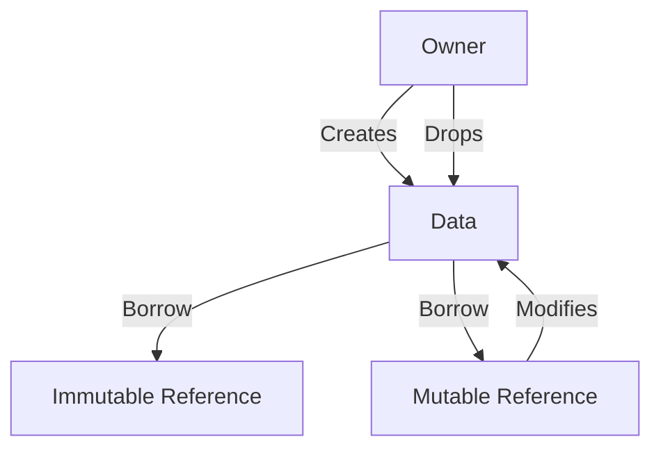

## 25.3. Misusing Ownership and Borrowing

Rust's ownership and borrowing system is one of its most powerful features, providing memory safety without a garbage collector. However, it can also be a source of frustration for developers who are not familiar with its intricacies. In this section, we will delve into the common pitfalls associated with ownership and borrowing in Rust, and provide guidance on how to avoid them.

### Understanding Ownership and Borrowing

Before we explore the common mistakes, let's reiterate the fundamentals of Rust's ownership and borrowing mechanisms.

- **Ownership**: Each value in Rust has a single owner. When the owner goes out of scope, the value is dropped, freeing the memory.
- **Borrowing**: References allow you to access data without taking ownership. Rust enforces borrowing rules to ensure memory safety:
  - You can have either one mutable reference or any number of immutable references to a piece of data at a time.
  - References must always be valid.

### Common Misuse Patterns

#### Unnecessary Cloning

One of the most common mistakes is unnecessary cloning of data. Cloning creates a deep copy of data, which can be expensive in terms of performance.

```rust
fn main() {
    let data = String::from("Hello, Rust!");
    let cloned_data = data.clone(); // Unnecessary clone
    println!("{}", cloned_data);
}
```

**Consequences**: Unnecessary cloning can lead to increased memory usage and slower performance.

**Solution**: Use references instead of cloning when you don't need ownership of the data.

```rust
fn main() {
    let data = String::from("Hello, Rust!");
    let data_ref = &data; // Use a reference
    println!("{}", data_ref);
}
```

#### Dangling References

Dangling references occur when a reference points to data that has been deallocated.

```rust
fn main() {
    let r;
    {
        let x = 5;
        r = &x; // `x` does not live long enough
    }
    println!("{}", r);
}
```

**Consequences**: Dangling references can lead to undefined behavior and runtime crashes.

**Solution**: Ensure that references do not outlive the data they point to.

```rust
fn main() {
    let x = 5;
    let r = &x; // `x` lives long enough
    println!("{}", r);
}
```

#### Incorrect Lifetimes

Lifetimes are a way for Rust to track how long references are valid. Misunderstanding lifetimes can lead to compilation errors.

```rust
fn longest<'a>(s1: &'a str, s2: &'a str) -> &'a str {
    if s1.len() > s2.len() {
        s1
    } else {
        s2
    }
}
```

**Consequences**: Incorrect lifetimes can cause references to be invalidated prematurely.

**Solution**: Use lifetime annotations to explicitly specify how long references should be valid.

### Proper Ownership and Borrowing Practices

#### Embrace the Borrow Checker

The Rust compiler's borrow checker is your ally. It enforces rules that prevent data races and memory safety issues. Pay attention to compiler messages and use them to guide your code design.

#### Use `Rc` and `Arc` for Shared Ownership

When you need multiple owners for a piece of data, use `Rc` (Reference Counted) or `Arc` (Atomic Reference Counted) for thread-safe shared ownership.

```rust
use std::rc::Rc;

fn main() {
    let data = Rc::new(String::from("Shared data"));
    let data_clone = Rc::clone(&data);
    println!("{}", data_clone);
}
```

#### Leverage Rust's Tooling

Rust provides excellent tooling to help you understand and resolve ownership-related errors. Use `rustc` for compiler messages, `cargo check` for quick feedback, and `clippy` for linting and suggestions.

### Visualizing Ownership and Borrowing

To better understand ownership and borrowing, let's visualize the flow of ownership and references using a diagram.



**Diagram Description**: This diagram illustrates the flow of ownership and borrowing in Rust. The owner creates data, which can be borrowed immutably or mutably. The mutable reference can modify the data, and the owner drops the data when it goes out of scope.

### Knowledge Check

- **Question**: What is the primary purpose of Rust's ownership system?
  - [ ] To make code more complex
  - [x] To ensure memory safety without a garbage collector
  - [ ] To slow down program execution

- **Question**: What is a common consequence of unnecessary cloning?
  - [ ] Improved performance
  - [x] Increased memory usage
  - [ ] Simplified code

### Try It Yourself

Experiment with the code examples provided. Try modifying them to see how the Rust compiler enforces ownership and borrowing rules. For instance, try creating multiple mutable references to the same data and observe the compiler's response.

### Summary

In this section, we've explored common pitfalls associated with ownership and borrowing in Rust. By understanding these concepts and leveraging Rust's tooling, you can write efficient and error-free code. Remember, the Rust compiler is your friend, guiding you towards safe and performant code.

## Quiz Time!



### What is the primary purpose of Rust's ownership system?

- [ ] To make code more complex
- [x] To ensure memory safety without a garbage collector
- [ ] To slow down program execution

> **Explanation:** Rust's ownership system is designed to ensure memory safety without the need for a garbage collector, preventing data races and memory leaks.

### What is a common consequence of unnecessary cloning?

- [ ] Improved performance
- [x] Increased memory usage
- [ ] Simplified code

> **Explanation:** Unnecessary cloning can lead to increased memory usage and slower performance, as it creates deep copies of data.

### What happens when a reference points to data that has been deallocated?

- [x] Dangling reference
- [ ] Memory leak
- [ ] Data race

> **Explanation:** A dangling reference occurs when a reference points to data that has been deallocated, leading to undefined behavior.

### How can you have multiple owners for a piece of data in Rust?

- [ ] Use raw pointers
- [x] Use `Rc` or `Arc`
- [ ] Use mutable references

> **Explanation:** `Rc` (Reference Counted) and `Arc` (Atomic Reference Counted) allow for shared ownership of data in Rust.

### What does the Rust compiler's borrow checker enforce?

- [x] Memory safety rules
- [ ] Code formatting
- [ ] Performance optimization

> **Explanation:** The borrow checker enforces memory safety rules, ensuring that references are valid and preventing data races.

### What is the result of incorrect lifetimes in Rust?

- [x] Compilation errors
- [ ] Memory leaks
- [ ] Faster execution

> **Explanation:** Incorrect lifetimes can lead to compilation errors, as Rust needs to ensure that references are valid for the duration of their use.

### What tool can you use for linting and suggestions in Rust?

- [ ] `rustfmt`
- [x] `clippy`
- [ ] `cargo run`

> **Explanation:** `clippy` is a linting tool that provides suggestions for improving Rust code.

### What is a dangling reference?

- [x] A reference to deallocated data
- [ ] A reference to a mutable variable
- [ ] A reference to a constant

> **Explanation:** A dangling reference is a reference to data that has been deallocated, leading to undefined behavior.

### How can you resolve ownership-related errors in Rust?

- [x] Use compiler messages and tooling
- [ ] Ignore the errors
- [ ] Use more raw pointers

> **Explanation:** Compiler messages and Rust's tooling can help you understand and resolve ownership-related errors.

### True or False: You can have multiple mutable references to the same data at the same time in Rust.

- [ ] True
- [x] False

> **Explanation:** Rust enforces that you can have either one mutable reference or any number of immutable references to a piece of data at a time.



Remember, mastering Rust's ownership and borrowing system is a journey. Keep experimenting, stay curious, and enjoy the process of writing safe and efficient Rust code!
