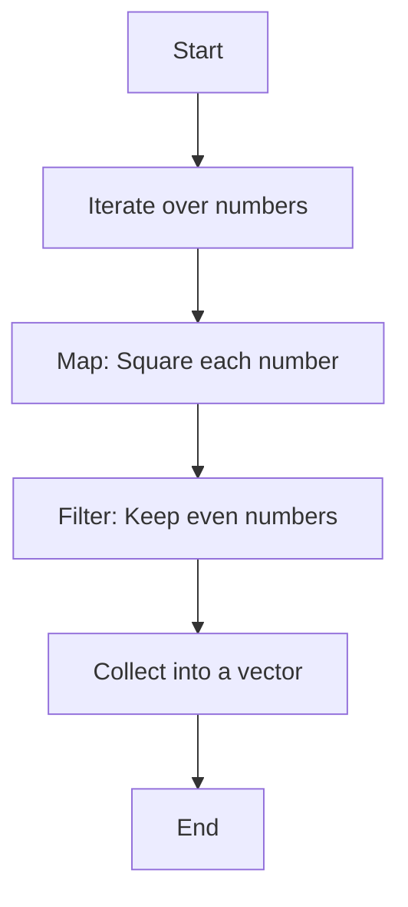

## 25.4. Inefficient Use of Iterators

Iterators are a powerful feature in Rust, offering a way to process sequences of data efficiently and expressively. However, improper use of iterators can lead to performance bottlenecks and inefficiencies. In this section, we'll explore how iterators work in Rust, identify common inefficiencies, and provide best practices for using them effectively.

### Understanding Iterators in Rust

Iterators in Rust provide a way to iterate over a sequence of elements. They are a core part of Rust's standard library and are used extensively in idiomatic Rust code. The `Iterator` trait defines a sequence of elements and provides methods for iterating over them.

#### Benefits of Using Iterators

1. **Lazy Evaluation**: Iterators in Rust are lazy, meaning they don't perform any computation until they are consumed. This allows for efficient chaining of operations without creating intermediate collections.

2. **Composability**: Iterators can be chained together using various combinators, making it easy to express complex data transformations in a concise manner.

3. **Memory Efficiency**: By avoiding the creation of intermediate collections, iterators can help reduce memory usage.

4. **Safety**: Iterators provide a safe way to work with data sequences, reducing the risk of common errors such as out-of-bounds access.

### Common Inefficiencies in Iterator Usage

Despite their benefits, iterators can be used inefficiently, leading to performance issues. Let's explore some common pitfalls and how to avoid them.

#### Creating Unnecessary Intermediate Collections

One of the most common inefficiencies is creating intermediate collections when they are not needed. This often happens when using methods like `collect()` to convert an iterator into a collection prematurely.

```rust
let numbers = vec![1, 2, 3, 4, 5];

// Inefficient: Creates an intermediate vector
let squares: Vec<i32> = numbers.iter().map(|&x| x * x).collect();
```

In this example, the `collect()` method is used to create a vector of squares, which is unnecessary if the goal is simply to iterate over the squared values.

#### Failing to Leverage Lazy Evaluation

Lazy evaluation is a key feature of iterators, but failing to leverage it can lead to inefficiencies. For example, using `for` loops to consume iterators can negate the benefits of laziness.

```rust
let numbers = vec![1, 2, 3, 4, 5];

// Suboptimal: Consumes the iterator eagerly
for square in numbers.iter().map(|&x| x * x) {
    println!("{}", square);
}
```

Instead, consider using iterator methods that maintain laziness, such as `for_each()`.

```rust
numbers.iter().map(|&x| x * x).for_each(|square| println!("{}", square));
```

#### Redundant Cloning

Cloning data unnecessarily can lead to performance degradation, especially when working with large data sets. It's important to use borrowing iterators to avoid cloning when possible.

```rust
let strings = vec!["hello".to_string(), "world".to_string()];

// Inefficient: Clones each string
let uppercased: Vec<String> = strings.iter().map(|s| s.clone().to_uppercase()).collect();
```

Instead, use borrowing iterators to work with references.

```rust
let uppercased: Vec<String> = strings.iter().map(|s| s.to_uppercase()).collect();
```

### Best Practices for Efficient Iterator Usage

To make the most of iterators in Rust, consider the following best practices.

#### Use Borrowing Iterators

Whenever possible, use borrowing iterators to avoid unnecessary cloning. This can be achieved by using methods like `iter()` instead of `into_iter()`.

```rust
let numbers = vec![1, 2, 3, 4, 5];

// Efficient: Uses borrowing iterator
let sum: i32 = numbers.iter().sum();
```

#### Avoid Collecting Intermediate Results

Only collect intermediate results when necessary. If you need to perform multiple transformations, chain them together using iterator combinators.

```rust
let numbers = vec![1, 2, 3, 4, 5];

// Efficient: Chains transformations without collecting
let result: Vec<i32> = numbers.iter().map(|&x| x * 2).filter(|&x| x > 5).collect();
```

#### Leverage Lazy Evaluation

Take advantage of lazy evaluation by using iterator methods that maintain laziness, such as `filter()`, `map()`, and `take_while()`.

```rust
let numbers = vec![1, 2, 3, 4, 5];

// Efficient: Uses lazy evaluation
let first_even_square = numbers.iter().map(|&x| x * x).find(|&x| x % 2 == 0);
```

#### Use Iterator Adapters

Rust provides a rich set of iterator adapters that can be used to perform common operations efficiently. Familiarize yourself with these adapters and use them to simplify your code.

```rust
let numbers = vec![1, 2, 3, 4, 5];

// Efficient: Uses iterator adapters
let doubled: Vec<i32> = numbers.iter().map(|&x| x * 2).collect();
```

### Techniques for Writing Efficient Iterator Chains

Writing efficient iterator chains involves understanding the underlying mechanics of iterators and using them to your advantage.

#### Understand the Cost of Each Operation

Each iterator operation has a cost, and understanding these costs can help you write more efficient code. For example, `map()` and `filter()` are generally cheap, while `collect()` and `fold()` can be more expensive.

#### Minimize State Changes

Minimize state changes within iterator chains to avoid unnecessary computations. For example, avoid using `map()` to perform side effects; use `for_each()` instead.

```rust
let numbers = vec![1, 2, 3, 4, 5];

// Efficient: Uses for_each for side effects
numbers.iter().map(|&x| x * x).for_each(|square| println!("{}", square));
```

#### Use Short-Circuiting Operations

Take advantage of short-circuiting operations like `find()`, `any()`, and `all()` to terminate iteration early when possible.

```rust
let numbers = vec![1, 2, 3, 4, 5];

// Efficient: Uses short-circuiting operation
let has_even = numbers.iter().any(|&x| x % 2 == 0);
```

### Visualizing Iterator Chains

To better understand how iterator chains work, let's visualize a simple iterator chain using a flowchart.



This flowchart represents an iterator chain that squares each number, filters for even numbers, and collects the results into a vector.

### Try It Yourself

Experiment with the following code example to see how different iterator methods affect performance.

```rust
fn main() {
    let numbers = vec![1, 2, 3, 4, 5];

    // Try changing the order of operations
    let result: Vec<i32> = numbers.iter()
        .map(|&x| x * 2)
        .filter(|&x| x > 5)
        .collect();

    println!("{:?}", result);
}
```

Try modifying the code to use different iterator methods or change the order of operations to see how it affects the output.

### Knowledge Check

- What is lazy evaluation, and how does it benefit iterator usage in Rust?
- Why is it important to avoid creating unnecessary intermediate collections?
- How can borrowing iterators help improve performance?
- What are some common iterator adapters, and how do they simplify code?
- How can short-circuiting operations improve the efficiency of iterator chains?

### Summary

Iterators are a powerful tool in Rust, providing a way to process sequences of data efficiently. By understanding common inefficiencies and following best practices, you can write efficient iterator chains that take full advantage of Rust's capabilities. Remember to leverage lazy evaluation, use borrowing iterators, and avoid unnecessary intermediate collections to optimize performance.

## Quiz Time!



### What is a key benefit of using iterators in Rust?

- [x] Lazy evaluation
- [ ] Eager computation
- [ ] Automatic parallelization
- [ ] Built-in error handling

> **Explanation:** Iterators in Rust are lazy, meaning they don't perform any computation until they are consumed, allowing for efficient chaining of operations.

### Which method should be avoided to prevent creating unnecessary intermediate collections?

- [ ] map()
- [ ] filter()
- [x] collect()
- [ ] for_each()

> **Explanation:** The `collect()` method creates a collection from an iterator, which can lead to unnecessary intermediate collections if used prematurely.

### How can borrowing iterators improve performance?

- [x] By avoiding unnecessary cloning
- [ ] By automatically parallelizing operations
- [ ] By increasing memory usage
- [ ] By simplifying code syntax

> **Explanation:** Borrowing iterators work with references, avoiding the need to clone data, which can improve performance.

### Which operation is considered a short-circuiting operation?

- [ ] map()
- [ ] filter()
- [x] any()
- [ ] for_each()

> **Explanation:** The `any()` method is a short-circuiting operation that stops iteration as soon as a condition is met.

### What is the purpose of using the `for_each()` method?

- [x] To perform side effects
- [ ] To collect results into a collection
- [ ] To filter elements
- [ ] To map elements to new values

> **Explanation:** The `for_each()` method is used to perform side effects on each element of an iterator.

### What is a common pitfall when using iterators in Rust?

- [x] Creating unnecessary intermediate collections
- [ ] Using too many iterator adapters
- [ ] Avoiding lazy evaluation
- [ ] Overusing short-circuiting operations

> **Explanation:** Creating unnecessary intermediate collections is a common pitfall that can lead to inefficiencies.

### Which iterator method maintains laziness?

- [x] map()
- [ ] collect()
- [ ] fold()
- [ ] sum()

> **Explanation:** The `map()` method maintains laziness by transforming each element without consuming the iterator.

### What is the effect of using `collect()` in an iterator chain?

- [ ] It maintains laziness
- [x] It consumes the iterator
- [ ] It increases memory efficiency
- [ ] It performs side effects

> **Explanation:** The `collect()` method consumes the iterator and creates a collection, ending the lazy evaluation.

### How can you avoid redundant clones in iterator chains?

- [x] By using borrowing iterators
- [ ] By using `collect()` frequently
- [ ] By avoiding iterator adapters
- [ ] By using eager evaluation

> **Explanation:** Using borrowing iterators allows you to work with references, avoiding the need to clone data.

### True or False: Iterators in Rust are always eager.

- [ ] True
- [x] False

> **Explanation:** Iterators in Rust are lazy, meaning they don't perform any computation until they are consumed.



Remember, this is just the beginning. As you progress, you'll build more complex and efficient iterator chains. Keep experimenting, stay curious, and enjoy the journey!
