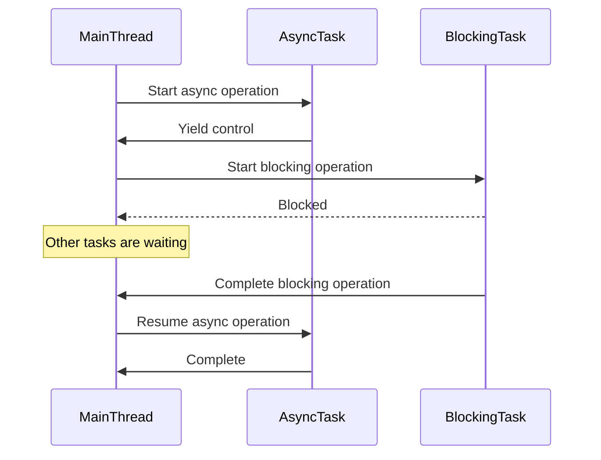

## 25.5. Blocking Operations in Asynchronous Code

In the world of modern software development, asynchronous programming has become a cornerstone for building responsive and efficient applications. Rust, with its strong emphasis on safety and concurrency, provides powerful tools for asynchronous programming. However, one of the common pitfalls developers face is inadvertently introducing blocking operations into asynchronous code. This section will delve into the asynchronous programming model, the impact of blocking operations, and strategies to avoid them.

### Understanding Asynchronous Programming

Asynchronous programming allows a program to perform other tasks while waiting for operations, such as I/O, to complete. This is achieved by not blocking the execution thread, allowing it to continue processing other tasks. In contrast, synchronous programming waits for each operation to complete before moving on to the next, which can lead to inefficiencies, especially in I/O-bound applications.

#### Asynchronous vs. Synchronous Execution

- **Synchronous Execution**: Operations are performed one after the other. If an operation takes a long time, subsequent operations must wait, leading to potential inefficiencies.
- **Asynchronous Execution**: Operations can be initiated and then left to complete while the program continues executing other tasks. This model is particularly beneficial for I/O-bound tasks, where waiting for external resources can be time-consuming.

### The Impact of Blocking Operations in Async Contexts

Blocking operations in asynchronous code can lead to several issues, including:

- **Thread Starvation**: Blocking a thread in an async context can prevent other tasks from executing, leading to a bottleneck.
- **Performance Degradation**: Blocking operations can negate the benefits of asynchronous programming, resulting in slower application performance.
- **Resource Inefficiency**: Blocking can lead to inefficient use of system resources, as threads are held up waiting for operations to complete.

#### Common Sources of Blocking

1. **Synchronous I/O Calls**: Using blocking I/O operations in an async context can halt the execution of other tasks.
2. **Long-Running Computations**: Performing CPU-intensive tasks without yielding can block the async executor.
3. **Blocking Libraries**: Some libraries may not be designed for async use and can introduce blocking operations.

### Strategies for Avoiding Blocking Operations

To maintain the efficiency of asynchronous code, it's crucial to avoid blocking operations. Here are some strategies:

#### Use Non-Blocking APIs

Whenever possible, use non-blocking APIs that are designed to work with asynchronous code. Rust provides several libraries, such as `tokio` and `async-std`, that offer non-blocking I/O operations.

```rust
use tokio::fs::File;
use tokio::io::{self, AsyncReadExt};

#[tokio::main]
async fn main() -> io::Result<()> {
    let mut file = File::open("example.txt").await?;
    let mut contents = vec![];
    file.read_to_end(&mut contents).await?;
    println!("File contents: {:?}", contents);
    Ok(())
}
```

In this example, we use `tokio::fs::File` to perform non-blocking file I/O operations, allowing other tasks to execute while waiting for the file read to complete.

#### Spawn Tasks for Blocking Operations

If you must perform a blocking operation, consider spawning it in a separate thread using `tokio::task::spawn_blocking`. This allows the async runtime to continue executing other tasks.

```rust
use tokio::task;

#[tokio::main]
async fn main() {
    let result = task::spawn_blocking(|| {
        // Perform a blocking operation
        std::thread::sleep(std::time::Duration::from_secs(2));
        "Blocking operation complete"
    })
    .await
    .unwrap();

    println!("{}", result);
}
```

Here, we use `spawn_blocking` to run a blocking operation in a separate thread, preventing it from blocking the async executor.

#### Break Down Long-Running Computations

For CPU-intensive tasks, break them down into smaller chunks and use `tokio::task::yield_now` to yield control back to the async executor, allowing other tasks to run.

```rust
use tokio::task;

async fn long_running_task() {
    for i in 0..10 {
        // Simulate a computation
        std::thread::sleep(std::time::Duration::from_millis(100));
        println!("Processing chunk {}", i);

        // Yield control back to the async executor
        task::yield_now().await;
    }
}

#[tokio::main]
async fn main() {
    long_running_task().await;
}
```

This approach ensures that the async executor remains responsive by periodically yielding control.

### Visualizing Blocking Operations

To better understand the impact of blocking operations, let's visualize the flow of an async program with and without blocking operations.



In this diagram, the blocking operation prevents the async task from executing, leading to inefficiencies.

### Knowledge Check

- **Question**: What is the main advantage of asynchronous programming over synchronous programming?
- **Question**: How can blocking operations affect the performance of an async application?
- **Question**: Name two common sources of blocking in async contexts.

### Try It Yourself

Experiment with the provided code examples by modifying the duration of blocking operations or introducing additional async tasks. Observe how these changes affect the program's responsiveness.

### References and Further Reading

- [Rust Async Programming](https://rust-lang.github.io/async-book/)
- [Tokio: An Asynchronous Runtime for Rust](https://tokio.rs/)
- [Async-std: Async Programming in Rust](https://async.rs/)

### Embrace the Journey

Remember, mastering asynchronous programming in Rust is a journey. As you continue to explore and experiment, you'll gain a deeper understanding of how to build efficient and responsive applications. Keep pushing the boundaries, stay curious, and enjoy the process!

## Quiz Time!



### What is the primary benefit of asynchronous programming?

- [x] It allows other tasks to execute while waiting for operations to complete.
- [ ] It makes code execution faster.
- [ ] It simplifies code structure.
- [ ] It eliminates the need for error handling.

> **Explanation:** Asynchronous programming allows other tasks to execute while waiting for operations to complete, improving efficiency.

### How can blocking operations affect an async application?

- [x] They can lead to thread starvation.
- [x] They can cause performance degradation.
- [ ] They can improve resource utilization.
- [ ] They can simplify error handling.

> **Explanation:** Blocking operations can lead to thread starvation and performance degradation by halting the execution of other tasks.

### Which of the following is a common source of blocking in async contexts?

- [x] Synchronous I/O calls
- [ ] Non-blocking APIs
- [x] Long-running computations
- [ ] Using async/await

> **Explanation:** Synchronous I/O calls and long-running computations are common sources of blocking in async contexts.

### What is a strategy to avoid blocking operations in async code?

- [x] Use non-blocking APIs
- [ ] Use synchronous APIs
- [ ] Increase thread count
- [ ] Ignore blocking operations

> **Explanation:** Using non-blocking APIs is a strategy to avoid blocking operations in async code.

### How can you handle a blocking operation in an async context?

- [x] Spawn it in a separate thread using `tokio::task::spawn_blocking`
- [ ] Use a synchronous loop
- [ ] Increase the timeout
- [ ] Use a blocking API

> **Explanation:** Spawning a blocking operation in a separate thread using `tokio::task::spawn_blocking` prevents it from blocking the async executor.

### What is the purpose of `tokio::task::yield_now`?

- [x] To yield control back to the async executor
- [ ] To block the current task
- [ ] To increase task priority
- [ ] To terminate the current task

> **Explanation:** `tokio::task::yield_now` is used to yield control back to the async executor, allowing other tasks to run.

### Which library provides non-blocking I/O operations in Rust?

- [x] Tokio
- [ ] std::io
- [ ] std::thread
- [ ] std::sync

> **Explanation:** Tokio provides non-blocking I/O operations in Rust.

### What is the impact of using blocking libraries in async code?

- [x] They can introduce blocking operations.
- [ ] They improve performance.
- [ ] They simplify error handling.
- [ ] They reduce resource usage.

> **Explanation:** Blocking libraries can introduce blocking operations, affecting the performance of async code.

### What is the role of `async-std` in Rust?

- [x] It provides asynchronous programming capabilities.
- [ ] It simplifies synchronous programming.
- [ ] It improves error handling.
- [ ] It reduces code complexity.

> **Explanation:** `async-std` provides asynchronous programming capabilities in Rust.

### True or False: Asynchronous programming eliminates the need for error handling.

- [ ] True
- [x] False

> **Explanation:** Asynchronous programming does not eliminate the need for error handling; it requires careful handling of errors in async contexts.


