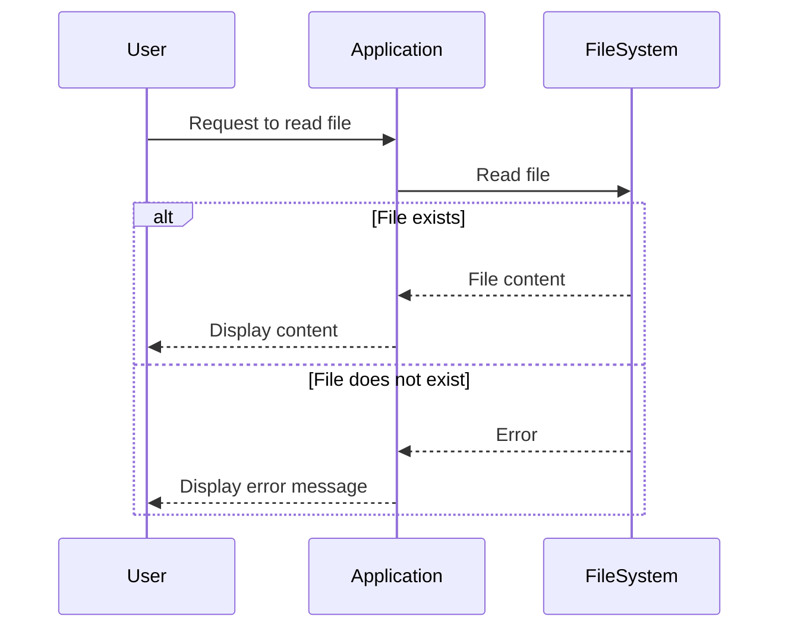

## 25.6. Poor Error Handling Practices

In the world of systems programming, robust error handling is not just a best practice—it's a necessity. Rust, with its unique ownership model and type system, offers powerful tools for managing errors. However, poor error handling practices can lead to crashes, data corruption, and a poor user experience. In this section, we'll explore common pitfalls in error handling and provide guidelines for writing resilient Rust code.

### The Consequences of Poor Error Handling

Poor error handling can have severe consequences in any application, but especially in systems programming where reliability is paramount. Here are some potential outcomes of inadequate error management:

- **Crashes**: Unhandled errors can cause your application to crash, leading to downtime and a negative user experience.
- **Data Corruption**: Failing to handle errors properly can result in corrupted data, which may be difficult or impossible to recover.
- **Security Vulnerabilities**: Ignoring errors can open up security holes, making your application susceptible to attacks.
- **Bad User Experience**: Users expect applications to handle errors gracefully. Poor error handling can lead to frustration and loss of trust.

### Common Mistakes in Error Handling

Let's examine some common mistakes developers make when handling errors in Rust:

#### 1. Ignoring Errors with `.unwrap()`

Using `.unwrap()` on `Result` or `Option` types is a common mistake. While it may seem convenient, it can lead to panics if the value is `Err` or `None`.

```rust
fn read_file(file_path: &str) -> String {
    std::fs::read_to_string(file_path).unwrap() // This will panic if the file doesn't exist
}
```

**Guideline**: Use `.unwrap()` only when you are absolutely certain that the value is `Ok` or `Some`. Otherwise, prefer using pattern matching or combinators like `.map()` and `.and_then()`.

#### 2. Excessive Use of `panic!`

Using `panic!` for error handling is another common pitfall. While panics are useful for unrecoverable errors, they should not be used for routine error handling.

```rust
fn divide(a: i32, b: i32) -> i32 {
    if b == 0 {
        panic!("Division by zero is not allowed!");
    }
    a / b
}
```

**Guideline**: Reserve `panic!` for truly exceptional situations. For recoverable errors, use `Result` or `Option`.

#### 3. Not Providing Context

Errors without context can be difficult to diagnose. It's important to provide meaningful error messages that help identify the source of the problem.

```rust
fn open_file(file_path: &str) -> Result<String, std::io::Error> {
    std::fs::read_to_string(file_path)
}
```

**Guideline**: Use the `?` operator with context to provide more information about errors.

```rust
fn open_file(file_path: &str) -> Result<String, std::io::Error> {
    std::fs::read_to_string(file_path).map_err(|e| {
        eprintln!("Failed to open file {}: {}", file_path, e);
        e
    })
}
```

### Effective Error Handling with `Result` and `Option`

Rust provides two primary types for error handling: `Result` and `Option`. Understanding how to use these effectively is crucial for writing robust Rust code.

#### Using `Result`

The `Result` type is used for operations that can fail. It has two variants: `Ok` and `Err`.

```rust
fn divide(a: i32, b: i32) -> Result<i32, String> {
    if b == 0 {
        Err("Division by zero".to_string())
    } else {
        Ok(a / b)
    }
}
```

**Guideline**: Use pattern matching to handle `Result` values.

```rust
match divide(10, 2) {
    Ok(result) => println!("Result: {}", result),
    Err(e) => println!("Error: {}", e),
}
```

#### Using `Option`

The `Option` type is used for values that may or may not be present. It has two variants: `Some` and `None`.

```rust
fn find_user(id: u32) -> Option<String> {
    if id == 1 {
        Some("Alice".to_string())
    } else {
        None
    }
}
```

**Guideline**: Use combinators like `.map()` and `.unwrap_or()` to work with `Option` values.

```rust
let user = find_user(1).unwrap_or("Unknown user".to_string());
println!("User: {}", user);
```

### Leveraging Error Handling Libraries

Rust's ecosystem provides several libraries to enhance error handling. Two popular ones are `thiserror` and `anyhow`.

#### `thiserror` for Custom Error Types

The `thiserror` crate simplifies the creation of custom error types. It uses procedural macros to reduce boilerplate.

```rust
use thiserror::Error;

#[derive(Error, Debug)]
pub enum MyError {
    #[error("Invalid input: {0}")]
    InvalidInput(String),
    #[error("Network error: {0}")]
    NetworkError(#[from] std::io::Error),
}
```

**Guideline**: Use `thiserror` to create descriptive and easy-to-use error types.

#### `anyhow` for Error Context

The `anyhow` crate provides a simple way to handle errors with context. It is particularly useful in applications where you don't need to define custom error types.

```rust
use anyhow::{Context, Result};

fn read_file(file_path: &str) -> Result<String> {
    std::fs::read_to_string(file_path)
        .with_context(|| format!("Failed to read file: {}", file_path))
}
```

**Guideline**: Use `anyhow` for quick prototyping and when detailed error types are not necessary.

### Handling Errors Gracefully

Handling errors gracefully involves more than just avoiding panics. It means providing meaningful feedback to users and ensuring the application can recover from errors when possible.

#### Providing User-Friendly Error Messages

Ensure that error messages are clear and actionable. Avoid technical jargon that may confuse users.

```rust
fn main() {
    if let Err(e) = run_app() {
        eprintln!("Application error: {}", e);
    }
}

fn run_app() -> Result<(), Box<dyn std::error::Error>> {
    // Application logic
    Ok(())
}
```

#### Implementing Retry Logic

For transient errors, consider implementing retry logic. This can improve the resilience of your application.

```rust
fn fetch_data(url: &str) -> Result<String, reqwest::Error> {
    let mut attempts = 0;
    loop {
        match reqwest::blocking::get(url) {
            Ok(response) => return response.text(),
            Err(e) if attempts < 3 => {
                attempts += 1;
                eprintln!("Attempt {} failed: {}", attempts, e);
            }
            Err(e) => return Err(e),
        }
    }
}
```

### Visualizing Error Handling Flow

To better understand how error handling works in Rust, let's visualize the flow of a typical error handling process using a sequence diagram.



**Diagram Description**: This sequence diagram illustrates the process of handling a file read request. If the file exists, the content is returned to the user. If not, an error message is displayed.

### Knowledge Check

- **What are the consequences of poor error handling?**
- **Why is using `.unwrap()` considered a poor practice?**
- **How can `thiserror` and `anyhow` improve error handling?**

### Embrace the Journey

Remember, mastering error handling in Rust is a journey. As you continue to develop your skills, you'll find that robust error management becomes second nature. Keep experimenting, stay curious, and enjoy the process of building reliable and resilient applications.

### Quiz Time!



### What is a common consequence of poor error handling in Rust applications?

- [x] Crashes
- [ ] Improved performance
- [ ] Enhanced security
- [ ] Increased user satisfaction

> **Explanation:** Poor error handling can lead to crashes, which negatively impact the user experience.

### Why is using `.unwrap()` on `Result` or `Option` types considered a poor practice?

- [x] It can cause panics if the value is `Err` or `None`.
- [ ] It improves code readability.
- [ ] It automatically handles all errors.
- [ ] It is the recommended way to handle errors.

> **Explanation:** Using `.unwrap()` can lead to panics if the value is not `Ok` or `Some`, which is why it is considered a poor practice.

### What is the primary purpose of the `Result` type in Rust?

- [x] To handle operations that can fail
- [ ] To store multiple values
- [ ] To improve performance
- [ ] To manage memory allocation

> **Explanation:** The `Result` type is used to handle operations that can fail, providing a way to represent success (`Ok`) or failure (`Err`).

### How does the `thiserror` crate help in error handling?

- [x] It simplifies the creation of custom error types.
- [ ] It automatically retries failed operations.
- [ ] It provides a graphical user interface for errors.
- [ ] It logs errors to a file.

> **Explanation:** The `thiserror` crate simplifies the creation of custom error types by using procedural macros.

### What is the benefit of using the `anyhow` crate?

- [x] It provides a simple way to handle errors with context.
- [ ] It automatically fixes errors.
- [ ] It improves application performance.
- [ ] It provides a user interface for error management.

> **Explanation:** The `anyhow` crate provides a simple way to handle errors with context, making it easier to understand the source of errors.

### What should you do when an error occurs in a Rust application?

- [x] Provide meaningful feedback to users.
- [ ] Ignore the error and continue execution.
- [ ] Use `panic!` to terminate the application.
- [ ] Log the error and do nothing else.

> **Explanation:** Providing meaningful feedback to users helps them understand what went wrong and how to address it.

### What is a recommended practice for handling transient errors?

- [x] Implement retry logic
- [ ] Use `panic!` to stop execution
- [ ] Ignore the error
- [ ] Use `.unwrap()` to handle the error

> **Explanation:** Implementing retry logic for transient errors can improve the resilience of your application.

### What is the purpose of the `?` operator in Rust?

- [x] To propagate errors
- [ ] To ignore errors
- [ ] To convert errors to strings
- [ ] To log errors

> **Explanation:** The `?` operator is used to propagate errors, allowing them to be handled by the caller.

### Which of the following is a common mistake in Rust error handling?

- [x] Excessive use of `panic!`
- [ ] Using `Result` for error handling
- [ ] Providing context for errors
- [ ] Using pattern matching

> **Explanation:** Excessive use of `panic!` is a common mistake, as it should be reserved for truly exceptional situations.

### True or False: The `Option` type is used for operations that can fail.

- [ ] True
- [x] False

> **Explanation:** The `Option` type is used for values that may or may not be present, not specifically for operations that can fail.



By understanding and avoiding poor error handling practices, you can write more reliable and user-friendly Rust applications. Keep these guidelines in mind as you continue your journey in mastering Rust programming.
