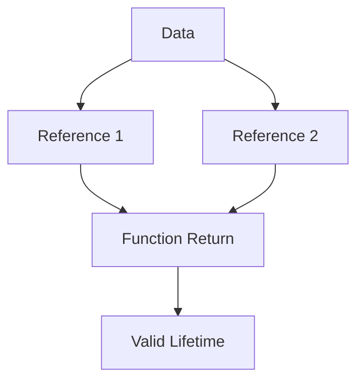

## 25.7. Ignoring Lifetime Annotations

In Rust, lifetimes are a core concept that ensures memory safety without a garbage collector. They are a way of expressing the scope for which a reference is valid. Ignoring or incorrectly specifying lifetime annotations can lead to compiler errors or unintended behaviors. In this section, we will delve into the importance of lifetimes, why relying solely on lifetime elision may not always suffice, and how to effectively manage lifetimes in your Rust code.

### Understanding Lifetimes in Rust

Lifetimes in Rust are a form of static analysis that the compiler uses to ensure that references do not outlive the data they point to. This is crucial for preventing dangling references and ensuring memory safety. Lifetimes are denoted by an apostrophe followed by a name, such as `'a`.

#### Role of Lifetimes in Rust's Safety Guarantees

Rust's ownership model is designed to prevent data races, dangling pointers, and other memory safety issues. Lifetimes are an integral part of this model, as they allow the compiler to check that all references are valid for the duration of their use. By enforcing these checks at compile time, Rust ensures that your code is safe from common memory errors.

### Lifetime Elision and Its Limitations

Rust provides a feature called lifetime elision, which allows the compiler to infer lifetimes in certain situations, reducing the need for explicit annotations. However, relying solely on lifetime elision can lead to issues, especially in more complex scenarios.

#### When Lifetime Elision Falls Short

Lifetime elision rules are simple and cover common cases, but they do not handle every situation. For example, when dealing with multiple references or complex data structures, the compiler may require explicit lifetime annotations to understand the relationships between references.

### Common Issues with Missing or Incorrect Lifetime Annotations

Neglecting to specify lifetimes can lead to compiler errors or unintended behaviors. Let's explore some common scenarios where missing or incorrect lifetime annotations cause issues.

#### Example: Function with Multiple References

Consider a function that takes two references and returns one of them:

```rust
fn longest<'a>(x: &'a str, y: &'a str) -> &'a str {
    if x.len() > y.len() {
        x
    } else {
        y
    }
}
```

In this example, the function `longest` takes two string slices and returns the longest one. The lifetime `'a` is used to indicate that the returned reference will be valid as long as both input references are valid. Without specifying the lifetime, the compiler would not be able to ensure the safety of the returned reference.

#### Example: Struct with References

When defining structs that hold references, lifetimes must be specified to ensure the references remain valid:

```rust
struct Book<'a> {
    title: &'a str,
    author: &'a str,
}

fn main() {
    let title = String::from("Rust Programming");
    let author = String::from("John Doe");
    let book = Book {
        title: &title,
        author: &author,
    };
    println!("{} by {}", book.title, book.author);
}
```

In this example, the struct `Book` holds references to strings. The lifetime `'a` ensures that the references are valid for the duration of the `Book` instance.

### Guidance on Specifying Lifetimes Explicitly

Knowing when and how to specify lifetimes explicitly is crucial for writing safe and efficient Rust code. Here are some guidelines to help you manage lifetimes effectively.

#### When to Specify Lifetimes

- **Multiple References**: When a function takes multiple references and returns one, specify lifetimes to indicate the relationships between them.
- **Structs with References**: Always specify lifetimes for structs that hold references to ensure the references remain valid.
- **Complex Data Structures**: In complex data structures, explicit lifetimes can help the compiler understand the relationships between different parts of the structure.

#### How to Specify Lifetimes

- **Function Signatures**: Use lifetime annotations in function signatures to indicate the relationships between input and output references.
- **Struct Definitions**: Include lifetime parameters in struct definitions to ensure the validity of references held by the struct.

### Tools and Compiler Messages for Understanding Lifetimes

Rust's compiler provides helpful messages and tools to assist in understanding and managing lifetimes. Here are some resources to help you navigate lifetime issues.

#### Compiler Messages

The Rust compiler provides detailed error messages when lifetime issues arise. These messages often include suggestions for resolving the issue, such as adding or adjusting lifetime annotations.

#### Tools for Lifetime Analysis

- **Rust Analyzer**: A powerful tool that provides insights into your code, including lifetime analysis and suggestions.
- **Clippy**: A linter for Rust that can help identify potential lifetime issues and suggest improvements.

### Visualizing Lifetimes

To better understand how lifetimes work, let's visualize the concept using a simple diagram.



**Diagram Description**: This diagram illustrates how data is referenced by multiple references, which are then used in a function. The function return must have a valid lifetime that encompasses the lifetimes of both references.

### Try It Yourself

Experiment with the following code example by modifying the lifetimes and observing the compiler's response:

```rust
fn main() {
    let string1 = String::from("Hello");
    let string2 = String::from("World");
    let result = longest(&string1, &string2);
    println!("The longest string is {}", result);
}

fn longest<'a>(x: &'a str, y: &'a str) -> &'a str {
    if x.len() > y.len() {
        x
    } else {
        y
    }
}
```

**Exercise**: Try removing the lifetime annotations and observe the compiler error. Then, add them back and see how the compiler responds.

### Key Takeaways

- **Lifetimes are crucial** for ensuring memory safety in Rust.
- **Lifetime elision** simplifies code but may not suffice in complex scenarios.
- **Explicit lifetime annotations** are necessary for functions with multiple references and structs with references.
- **Compiler messages and tools** provide valuable insights into lifetime issues.

### Embrace the Journey

Remember, mastering lifetimes is a journey. As you progress, you'll gain a deeper understanding of Rust's memory safety guarantees. Keep experimenting, stay curious, and enjoy the journey!

## Quiz Time!



### What is the primary purpose of lifetimes in Rust?

- [x] To ensure memory safety by preventing dangling references
- [ ] To optimize code execution speed
- [ ] To manage thread synchronization
- [ ] To handle error propagation

> **Explanation:** Lifetimes in Rust are used to ensure memory safety by preventing dangling references, which could lead to undefined behavior.

### When is it necessary to specify lifetimes explicitly in Rust?

- [x] When a function takes multiple references and returns one
- [ ] When using primitive data types
- [ ] When writing single-threaded applications
- [ ] When using only owned data types

> **Explanation:** Lifetimes need to be specified explicitly when a function takes multiple references and returns one to indicate the relationships between them.

### What does lifetime elision in Rust refer to?

- [x] The compiler's ability to infer lifetimes in certain situations
- [ ] The removal of unused variables from code
- [ ] The process of optimizing memory allocation
- [ ] The automatic handling of thread synchronization

> **Explanation:** Lifetime elision refers to the compiler's ability to infer lifetimes in certain situations, reducing the need for explicit annotations.

### Which tool can help identify potential lifetime issues in Rust code?

- [x] Clippy
- [ ] Cargo
- [ ] Rustfmt
- [ ] GDB

> **Explanation:** Clippy is a linter for Rust that can help identify potential lifetime issues and suggest improvements.

### In which scenario is lifetime elision insufficient?

- [x] When dealing with complex data structures
- [ ] When using primitive data types
- [ ] When writing single-threaded applications
- [ ] When using only owned data types

> **Explanation:** Lifetime elision is insufficient when dealing with complex data structures, as the relationships between references may not be clear to the compiler.

### What is the role of lifetime annotations in struct definitions?

- [x] To ensure the validity of references held by the struct
- [ ] To optimize the struct's memory layout
- [ ] To manage thread synchronization within the struct
- [ ] To handle error propagation in the struct

> **Explanation:** Lifetime annotations in struct definitions ensure the validity of references held by the struct, preventing dangling references.

### How does the Rust compiler assist with lifetime issues?

- [x] By providing detailed error messages and suggestions
- [ ] By automatically fixing lifetime issues
- [ ] By optimizing code execution speed
- [ ] By managing thread synchronization

> **Explanation:** The Rust compiler provides detailed error messages and suggestions to assist with lifetime issues, helping developers resolve them.

### What is the benefit of using Rust Analyzer for lifetime analysis?

- [x] It provides insights into code, including lifetime analysis and suggestions
- [ ] It automatically fixes lifetime issues
- [ ] It optimizes code execution speed
- [ ] It manages thread synchronization

> **Explanation:** Rust Analyzer provides insights into code, including lifetime analysis and suggestions, helping developers understand and manage lifetimes effectively.

### True or False: Lifetimes are only necessary for functions that return references.

- [x] False
- [ ] True

> **Explanation:** Lifetimes are necessary for any scenario where references are used, not just for functions that return references. They ensure the validity of references throughout their use.

### What is the primary goal of mastering lifetimes in Rust?

- [x] To ensure memory safety and prevent common memory errors
- [ ] To optimize code execution speed
- [ ] To manage thread synchronization
- [ ] To handle error propagation

> **Explanation:** The primary goal of mastering lifetimes in Rust is to ensure memory safety and prevent common memory errors, such as dangling references.


