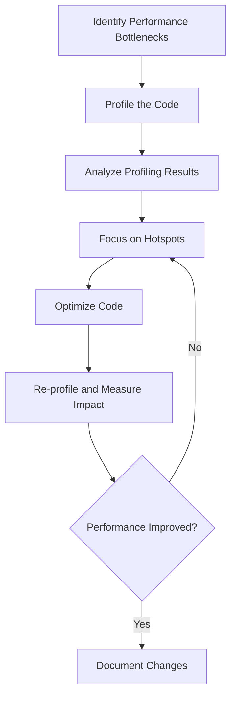

## 25.8. Premature Optimization

Premature optimization is a common pitfall in software development, often leading to increased complexity and maintenance challenges without delivering significant performance benefits. In this section, we will explore the concept of premature optimization, its drawbacks, and why readability and maintainability should take precedence in the early stages of development. We will also provide examples of premature optimization, discuss the importance of profiling and benchmarking, and highlight best practices for optimizing code after ensuring correctness and clarity.

### Understanding Premature Optimization

Premature optimization refers to the practice of trying to improve the performance of a program before it is necessary or before the program's functionality is fully understood. This often results in code that is difficult to read, maintain, and extend. The term was popularized by Donald Knuth, who famously stated, "Premature optimization is the root of all evil."

#### Drawbacks of Premature Optimization

1. **Increased Complexity**: Optimizing code too early can lead to complex algorithms and data structures that are difficult to understand and maintain.

2. **Reduced Readability**: Code that is optimized prematurely often sacrifices readability for performance, making it harder for other developers to understand and work with.

3. **Maintenance Challenges**: As the codebase evolves, maintaining prematurely optimized code can become a significant burden, leading to increased development time and costs.

4. **Negligible Performance Gains**: In many cases, the performance improvements gained from premature optimization are negligible and do not justify the added complexity.

5. **Misplaced Focus**: Developers may spend time optimizing parts of the code that are not performance bottlenecks, neglecting areas that could benefit from optimization.

### Prioritizing Readability and Maintainability

In the early stages of development, it is crucial to prioritize readability and maintainability over optimization. This approach ensures that the code is easy to understand, modify, and extend, facilitating collaboration and reducing the risk of introducing bugs.

#### Key Principles

- **Write Clear and Concise Code**: Focus on writing code that is easy to read and understand. Use descriptive variable names, consistent formatting, and appropriate comments to enhance clarity.

- **Follow Established Conventions**: Adhere to coding standards and conventions to ensure consistency across the codebase. This makes it easier for other developers to understand and contribute to the project.

- **Emphasize Correctness**: Ensure that the code is correct and functions as intended before considering optimization. Correctness should always take precedence over performance.

- **Refactor Regularly**: Regularly refactor the code to improve its structure and readability. This helps to keep the codebase clean and maintainable.

### Examples of Premature Optimization

Let's explore some examples where premature optimization complicates code without providing significant benefits.

#### Example 1: Over-Optimizing a Simple Loop

Consider the following Rust code that calculates the sum of integers in a vector:

```rust
fn sum_vector(vec: &Vec<i32>) -> i32 {
    vec.iter().sum()
}
```

A developer might attempt to optimize this code by manually unrolling the loop:

```rust
fn sum_vector_optimized(vec: &Vec<i32>) -> i32 {
    let mut sum = 0;
    let len = vec.len();
    let mut i = 0;

    while i < len {
        sum += vec[i];
        i += 1;
    }

    sum
}
```

While the manually unrolled loop may seem more efficient, it sacrifices readability and maintainability for negligible performance gains. The original code using `iter().sum()` is clear, concise, and leverages Rust's powerful iterator trait.

#### Example 2: Premature Use of Unsafe Code

Rust provides the `unsafe` keyword to allow developers to perform operations that the compiler cannot guarantee to be safe. However, using `unsafe` prematurely can lead to complex and error-prone code.

```rust
fn copy_slice(src: &[i32], dst: &mut [i32]) {
    assert!(src.len() <= dst.len());

    unsafe {
        std::ptr::copy_nonoverlapping(src.as_ptr(), dst.as_mut_ptr(), src.len());
    }
}
```

In this example, the use of `unsafe` is unnecessary and introduces potential safety issues. Instead, we can achieve the same functionality using safe Rust code:

```rust
fn copy_slice_safe(src: &[i32], dst: &mut [i32]) {
    assert!(src.len() <= dst.len());

    for (i, &item) in src.iter().enumerate() {
        dst[i] = item;
    }
}
```

The safe version is easier to read and maintain, and it avoids the risks associated with `unsafe` code.

### Profiling and Benchmarking

Before optimizing code, it is essential to identify real performance bottlenecks through profiling and benchmarking. This approach ensures that optimization efforts are focused on areas that will provide the most significant performance improvements.

#### Profiling Tools

Rust provides several tools for profiling and benchmarking code:

- **`cargo bench`**: A built-in tool for running benchmarks and measuring the performance of Rust code.

- **`perf`**: A powerful Linux profiling tool that can be used to analyze the performance of Rust programs.

- **Flamegraph**: A visualization tool that generates flame graphs to help identify performance bottlenecks.

#### Best Practices for Profiling

- **Profile Before Optimizing**: Always profile the code to identify performance bottlenecks before attempting optimization.

- **Focus on Hotspots**: Concentrate optimization efforts on the parts of the code that consume the most resources.

- **Use Realistic Workloads**: Profile the code using realistic workloads to ensure that the results are representative of real-world usage.

- **Iterate and Measure**: After making optimizations, re-profile the code to measure the impact of the changes.

### Best Practices for Optimization

Once correctness and clarity are established, and real performance bottlenecks have been identified, it is time to optimize the code. Here are some best practices for optimizing Rust code:

1. **Leverage Rust's Features**: Use Rust's powerful features, such as iterators, pattern matching, and zero-cost abstractions, to write efficient code.

2. **Minimize Allocations**: Reduce memory allocations by reusing existing data structures and using stack-allocated data where possible.

3. **Optimize Data Structures**: Choose the most appropriate data structures for the task at hand. For example, use `Vec` for dynamic arrays and `HashMap` for key-value storage.

4. **Parallelize Workloads**: Use Rust's concurrency features, such as threads and async/await, to parallelize workloads and improve performance.

5. **Avoid Premature Use of `unsafe`**: Use `unsafe` only when necessary and ensure that the code is thoroughly tested and reviewed.

6. **Profile and Benchmark Regularly**: Continuously profile and benchmark the code to ensure that optimizations are effective and do not introduce regressions.

### Try It Yourself

To reinforce your understanding of premature optimization, try modifying the code examples provided in this section. Experiment with different optimization techniques and use profiling tools to measure their impact on performance. Remember to prioritize readability and maintainability, and only optimize when necessary.

### Visualizing the Optimization Process

To better understand the optimization process, let's visualize the steps involved in identifying and addressing performance bottlenecks.



**Figure 1**: The Optimization Process Flowchart

This flowchart illustrates the iterative process of identifying, analyzing, and addressing performance bottlenecks in Rust code. By following this process, developers can ensure that their optimization efforts are focused and effective.

### References and Links

- [Rust Performance Book](https://nnethercote.github.io/perf-book/)
- [Flamegraph](https://github.com/brendangregg/Flamegraph)
- [Profiling Rust Applications](https://doc.rust-lang.org/cargo/reference/profiles.html)

### Knowledge Check

To reinforce your understanding of premature optimization, consider the following questions and challenges:

1. What are the main drawbacks of premature optimization?
2. Why is it important to prioritize readability and maintainability in the early stages of development?
3. Provide an example of a situation where premature optimization might complicate code without significant benefits.
4. How can profiling and benchmarking help identify real performance bottlenecks?
5. What are some best practices for optimizing Rust code after ensuring correctness and clarity?

### Embrace the Journey

Remember, premature optimization can lead to unnecessary complexity and maintenance challenges. By prioritizing readability and maintainability, and using profiling and benchmarking to guide optimization efforts, you can write efficient and maintainable Rust code. Keep experimenting, stay curious, and enjoy the journey!

## Quiz Time!



### What is premature optimization?

- [x] Optimizing code before it is necessary or fully understood
- [ ] Optimizing code after identifying performance bottlenecks
- [ ] Writing code that is easy to read and maintain
- [ ] Using profiling tools to measure performance

> **Explanation:** Premature optimization refers to the practice of optimizing code before it is necessary or before the program's functionality is fully understood.

### Why should readability and maintainability take precedence in early development stages?

- [x] To ensure code is easy to understand and modify
- [ ] To improve performance
- [ ] To reduce memory usage
- [ ] To increase complexity

> **Explanation:** Prioritizing readability and maintainability ensures that the code is easy to understand, modify, and extend, facilitating collaboration and reducing the risk of introducing bugs.

### What is a common drawback of premature optimization?

- [x] Increased complexity
- [ ] Improved performance
- [ ] Reduced memory usage
- [ ] Enhanced readability

> **Explanation:** Premature optimization often leads to increased complexity, making the code difficult to understand and maintain.

### How can profiling help in the optimization process?

- [x] By identifying real performance bottlenecks
- [ ] By increasing code complexity
- [ ] By reducing code readability
- [ ] By eliminating the need for optimization

> **Explanation:** Profiling helps identify real performance bottlenecks, ensuring that optimization efforts are focused on areas that will provide the most significant performance improvements.

### What is a best practice for optimizing Rust code?

- [x] Leverage Rust's features like iterators and pattern matching
- [ ] Use `unsafe` code whenever possible
- [ ] Optimize before ensuring correctness
- [ ] Avoid using profiling tools

> **Explanation:** Leveraging Rust's features, such as iterators and pattern matching, is a best practice for writing efficient code.

### What should be done after optimizing code?

- [x] Re-profile and measure the impact
- [ ] Increase code complexity
- [ ] Remove all comments
- [ ] Ignore performance bottlenecks

> **Explanation:** After optimizing code, it is important to re-profile and measure the impact to ensure that the optimizations are effective and do not introduce regressions.

### Why is it important to use realistic workloads when profiling?

- [x] To ensure results are representative of real-world usage
- [ ] To increase code complexity
- [ ] To reduce memory usage
- [ ] To improve readability

> **Explanation:** Using realistic workloads ensures that the profiling results are representative of real-world usage, providing accurate insights into performance bottlenecks.

### What is a potential risk of using `unsafe` code prematurely?

- [x] Introducing safety issues
- [ ] Improving performance
- [ ] Enhancing readability
- [ ] Reducing complexity

> **Explanation:** Using `unsafe` code prematurely can introduce safety issues and make the code more error-prone.

### What is the first step in the optimization process?

- [x] Identify performance bottlenecks
- [ ] Optimize the code
- [ ] Increase code complexity
- [ ] Remove all comments

> **Explanation:** The first step in the optimization process is to identify performance bottlenecks through profiling.

### True or False: Premature optimization often leads to significant performance improvements.

- [ ] True
- [x] False

> **Explanation:** Premature optimization often leads to negligible performance improvements and increased complexity, making it an undesirable practice.


