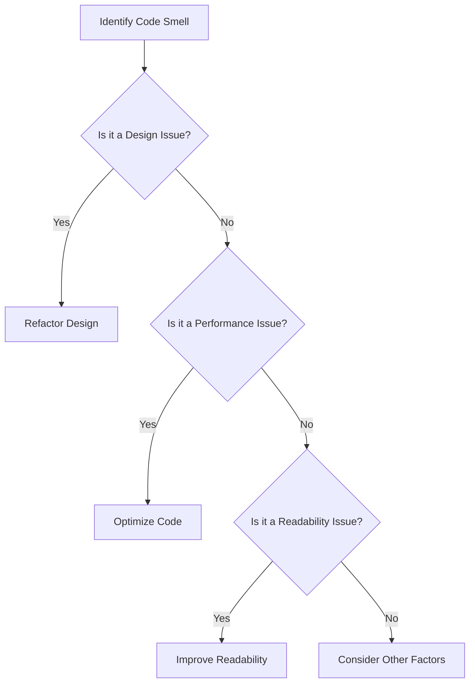

## 25.9. Code Smells in Rust

In the realm of software development, the term "code smell" refers to any symptom in the source code that possibly indicates a deeper problem. Code smells are not bugs; they are not technically incorrect and do not prevent the program from functioning. However, they often indicate weaknesses in design that may slow down development or increase the risk of bugs or failures in the future. In Rust, a language known for its emphasis on safety and performance, identifying and addressing code smells is crucial for maintaining high-quality codebases.

### Understanding Code Smells

Code smells are like the canary in the coal mine for software development. They are early indicators of potential issues that could lead to more significant problems if left unaddressed. Recognizing these smells allows developers to refactor code proactively, improving readability, maintainability, and performance.

#### Why Code Smells Matter

- **Maintainability**: Code that smells is often harder to understand and maintain. This can lead to increased time and effort when making changes or fixing bugs.
- **Readability**: Code smells can obscure the logic of the program, making it difficult for other developers (or even the original author) to understand the code.
- **Performance**: Some code smells can lead to inefficient code that consumes more resources than necessary.
- **Scalability**: As projects grow, code smells can become more pronounced, leading to a brittle codebase that is difficult to extend or modify.

### Common Code Smells in Rust

Let's explore some common code smells specific to Rust and discuss how to identify and address them.

#### 1. Overly Complex Functions

**Description**: Functions that are too long or complex can be difficult to understand and maintain. They often do too much, violating the Single Responsibility Principle.

**Example**:

```rust
fn process_data(data: &str) -> Result<String, String> {
    // Parse the data
    let parsed_data = match serde_json::from_str::<Value>(data) {
        Ok(val) => val,
        Err(_) => return Err("Parsing error".to_string()),
    };

    // Validate the data
    if !parsed_data.is_object() {
        return Err("Invalid data format".to_string());
    }

    // Process the data
    let processed_data = parsed_data.as_object().unwrap().iter().map(|(key, value)| {
        format!("{}: {}", key, value)
    }).collect::<Vec<String>>().join(", ");

    // Return the result
    Ok(processed_data)
}
```

**Underlying Issues**: This function does parsing, validation, and processing, making it hard to test and modify.

**Refactoring Strategy**: Break the function into smaller, focused functions.

```rust
fn parse_data(data: &str) -> Result<Value, String> {
    serde_json::from_str::<Value>(data).map_err(|_| "Parsing error".to_string())
}

fn validate_data(parsed_data: &Value) -> Result<(), String> {
    if parsed_data.is_object() {
        Ok(())
    } else {
        Err("Invalid data format".to_string())
    }
}

fn process_data(parsed_data: &Value) -> String {
    parsed_data.as_object().unwrap().iter().map(|(key, value)| {
        format!("{}: {}", key, value)
    }).collect::<Vec<String>>().join(", ")
}

fn handle_data(data: &str) -> Result<String, String> {
    let parsed_data = parse_data(data)?;
    validate_data(&parsed_data)?;
    Ok(process_data(&parsed_data))
}
```

#### 2. Excessive Use of `unwrap`

**Description**: Using `unwrap` excessively can lead to panics if the value is `None` or `Err`. This is risky in production code.

**Example**:

```rust
fn get_user_name(user_id: u32) -> String {
    let user = database.get_user(user_id).unwrap();
    user.name.unwrap()
}
```

**Underlying Issues**: This code assumes that the database will always return a user and that the user will always have a name, which may not be true.

**Refactoring Strategy**: Use pattern matching or combinators like `map`, `and_then`, or `unwrap_or_else`.

```rust
fn get_user_name(user_id: u32) -> Option<String> {
    database.get_user(user_id).and_then(|user| user.name)
}
```

#### 3. Duplicate Code

**Description**: Duplicate code is a sign of poor design and can lead to maintenance challenges. Changes need to be made in multiple places, increasing the risk of errors.

**Example**:

```rust
fn calculate_area(width: f64, height: f64) -> f64 {
    width * height
}

fn calculate_volume(width: f64, height: f64, depth: f64) -> f64 {
    width * height * depth
}
```

**Underlying Issues**: The area calculation logic is duplicated.

**Refactoring Strategy**: Extract common logic into a separate function.

```rust
fn calculate_area(width: f64, height: f64) -> f64 {
    width * height
}

fn calculate_volume(width: f64, height: f64, depth: f64) -> f64 {
    calculate_area(width, height) * depth
}
```

#### 4. Long Parameter Lists

**Description**: Functions with too many parameters can be difficult to use and understand. They often indicate that a function is doing too much.

**Example**:

```rust
fn create_user(name: &str, age: u32, email: &str, address: &str, phone: &str) -> User {
    User {
        name: name.to_string(),
        age,
        email: email.to_string(),
        address: address.to_string(),
        phone: phone.to_string(),
    }
}
```

**Underlying Issues**: The function signature is cumbersome and prone to errors.

**Refactoring Strategy**: Use a struct to encapsulate related parameters.

```rust
struct UserInfo<'a> {
    name: &'a str,
    age: u32,
    email: &'a str,
    address: &'a str,
    phone: &'a str,
}

fn create_user(info: UserInfo) -> User {
    User {
        name: info.name.to_string(),
        age: info.age,
        email: info.email.to_string(),
        address: info.address.to_string(),
        phone: info.phone.to_string(),
    }
}
```

#### 5. Ignoring Error Handling

**Description**: Failing to handle errors can lead to unexpected behavior and crashes.

**Example**:

```rust
fn read_file(file_path: &str) -> String {
    std::fs::read_to_string(file_path).unwrap()
}
```

**Underlying Issues**: This code will panic if the file cannot be read.

**Refactoring Strategy**: Use `Result` to handle errors gracefully.

```rust
fn read_file(file_path: &str) -> Result<String, std::io::Error> {
    std::fs::read_to_string(file_path)
}
```

### Visualizing Code Smells

To better understand how code smells can affect a Rust codebase, let's visualize the process of identifying and refactoring them using a flowchart.



**Diagram Description**: This flowchart illustrates the decision-making process when encountering a code smell. It helps determine whether the issue is related to design, performance, or readability and suggests appropriate actions.

### Refactoring Strategies

Refactoring is the process of restructuring existing code without changing its external behavior. It aims to improve the internal structure of the code, making it easier to understand and maintain. Here are some general strategies for refactoring code smells in Rust:

1. **Decompose Functions**: Break down large functions into smaller, more focused ones. This improves readability and makes the code easier to test.

2. **Use Descriptive Names**: Ensure that variables, functions, and modules have clear and descriptive names that convey their purpose.

3. **Encapsulate Data**: Use structs and enums to group related data together, reducing the complexity of function signatures.

4. **Leverage Rust's Type System**: Use Rust's powerful type system to enforce invariants and prevent invalid states.

5. **Adopt Idiomatic Rust Patterns**: Familiarize yourself with idiomatic Rust patterns and practices to write more concise and efficient code.

6. **Regular Code Reviews**: Conduct regular code reviews to catch code smells early and encourage best practices among team members.

### Rust Unique Features

Rust's unique features, such as ownership, borrowing, and lifetimes, play a significant role in preventing certain code smells. By enforcing strict rules around memory safety and concurrency, Rust helps developers avoid common pitfalls that can lead to code smells in other languages.

### Differences and Similarities with Other Languages

While many code smells are universal across programming languages, Rust's emphasis on safety and performance introduces some unique considerations. For example, the excessive use of `unwrap` is a common smell in Rust due to its strict error handling model, whereas in languages with exceptions, similar issues might manifest differently.

### Conclusion

Identifying and addressing code smells is an essential part of maintaining a healthy Rust codebase. By recognizing these smells early and applying appropriate refactoring strategies, developers can improve code quality, readability, and maintainability. Remember, the journey to clean code is ongoing, and continuous learning and improvement are key.

## Quiz Time!



### What is a code smell?

- [x] A symptom in the source code that indicates a deeper problem.
- [ ] A bug that causes the program to crash.
- [ ] A feature that improves code readability.
- [ ] A tool used for debugging.

> **Explanation:** A code smell is a symptom in the source code that possibly indicates a deeper problem, not a bug or feature.

### Which of the following is a common code smell in Rust?

- [x] Excessive use of `unwrap`.
- [ ] Using pattern matching.
- [ ] Implementing traits.
- [ ] Using structs.

> **Explanation:** Excessive use of `unwrap` is a common code smell in Rust as it can lead to panics.

### What is the main issue with overly complex functions?

- [x] They are difficult to understand and maintain.
- [ ] They execute faster than simple functions.
- [ ] They use less memory.
- [ ] They are easier to test.

> **Explanation:** Overly complex functions are difficult to understand and maintain, which can lead to increased time and effort when making changes.

### How can you refactor a function with a long parameter list?

- [x] Use a struct to encapsulate related parameters.
- [ ] Add more parameters to the function.
- [ ] Use global variables instead.
- [ ] Remove all parameters.

> **Explanation:** Using a struct to encapsulate related parameters can simplify the function signature and improve readability.

### What is a potential risk of using `unwrap` excessively?

- [x] It can lead to panics if the value is `None` or `Err`.
- [ ] It improves code performance.
- [ ] It makes the code more readable.
- [ ] It reduces the number of lines of code.

> **Explanation:** Using `unwrap` excessively can lead to panics if the value is `None` or `Err`, which is risky in production code.

### What is the benefit of decomposing functions?

- [x] It improves readability and makes the code easier to test.
- [ ] It increases the number of lines of code.
- [ ] It makes the code run faster.
- [ ] It reduces the need for comments.

> **Explanation:** Decomposing functions improves readability and makes the code easier to test by breaking down large functions into smaller, more focused ones.

### Which Rust feature helps prevent certain code smells?

- [x] Ownership and borrowing.
- [ ] Global variables.
- [ ] Dynamic typing.
- [ ] Lack of error handling.

> **Explanation:** Rust's ownership and borrowing system helps prevent certain code smells by enforcing strict rules around memory safety and concurrency.

### What is the purpose of refactoring?

- [x] To improve the internal structure of the code without changing its external behavior.
- [ ] To add new features to the code.
- [ ] To remove all comments from the code.
- [ ] To increase the code's execution speed.

> **Explanation:** Refactoring aims to improve the internal structure of the code without changing its external behavior, making it easier to understand and maintain.

### How can duplicate code be addressed?

- [x] Extract common logic into a separate function.
- [ ] Add more comments to the code.
- [ ] Use global variables to store the duplicate code.
- [ ] Ignore the duplicate code.

> **Explanation:** Extracting common logic into a separate function can address duplicate code, reducing maintenance challenges.

### True or False: Code smells are technically incorrect and prevent the program from functioning.

- [ ] True
- [x] False

> **Explanation:** Code smells are not technically incorrect and do not prevent the program from functioning, but they indicate weaknesses in design.



Remember, this is just the beginning. As you progress, you'll build more complex and interactive Rust applications. Keep experimenting, stay curious, and enjoy the journey!
