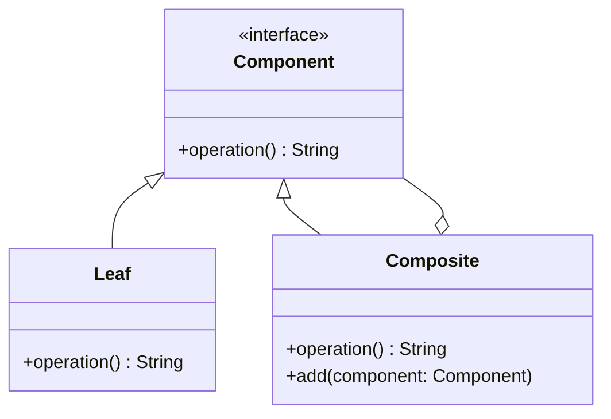

## 26.3. Design Pattern Reference Cheat Sheet

Welcome to the Design Pattern Reference Cheat Sheet for Rust! This section provides a concise overview of key design patterns, their intent, structure, and usage in Rust. Each pattern is accompanied by diagrams and code snippets to illustrate its application. Use this guide for quick consultation during development to enhance your Rust programming skills.

---

### Creational Design Patterns

#### Builder Pattern

- **Intent**: Separate the construction of a complex object from its representation, allowing the same construction process to create different representations.
- **Structure**:
  - **Director**: Constructs the object using the builder interface.
  - **Builder**: Specifies an abstract interface for creating parts of a Product object.
  - **ConcreteBuilder**: Constructs and assembles parts of the product by implementing the Builder interface.
  - **Product**: Represents the complex object under construction.

```rust
struct Computer {
    cpu: String,
    ram: u32,
    storage: u32,
}

struct ComputerBuilder {
    cpu: String,
    ram: u32,
    storage: u32,
}

impl ComputerBuilder {
    fn new() -> Self {
        ComputerBuilder {
            cpu: String::from(""),
            ram: 0,
            storage: 0,
        }
    }

    fn cpu(mut self, cpu: &str) -> Self {
        self.cpu = cpu.to_string();
        self
    }

    fn ram(mut self, ram: u32) -> Self {
        self.ram = ram;
        self
    }

    fn storage(mut self, storage: u32) -> Self {
        self.storage = storage;
        self
    }

    fn build(self) -> Computer {
        Computer {
            cpu: self.cpu,
            ram: self.ram,
            storage: self.storage,
        }
    }
}

fn main() {
    let computer = ComputerBuilder::new()
        .cpu("Intel i7")
        .ram(16)
        .storage(512)
        .build();
}
```

- **Applicability**: Use when the construction process must allow different representations for the object being constructed.
- **Rust Unique Features**: Leverage Rust's ownership and borrowing to ensure safe construction without mutable state.

#### Factory Method Pattern

- **Intent**: Define an interface for creating an object, but let subclasses alter the type of objects that will be created.
- **Structure**:
  - **Creator**: Declares the factory method, which returns an object of type Product.
  - **ConcreteCreator**: Overrides the factory method to return an instance of a ConcreteProduct.
  - **Product**: Defines the interface of objects the factory method creates.
  - **ConcreteProduct**: Implements the Product interface.

```rust
trait Product {
    fn operation(&self) -> String;
}

struct ConcreteProductA;
struct ConcreteProductB;

impl Product for ConcreteProductA {
    fn operation(&self) -> String {
        "Result of ConcreteProductA".to_string()
    }
}

impl Product for ConcreteProductB {
    fn operation(&self) -> String {
        "Result of ConcreteProductB".to_string()
    }
}

trait Creator {
    fn factory_method(&self) -> Box<dyn Product>;
}

struct ConcreteCreatorA;
struct ConcreteCreatorB;

impl Creator for ConcreteCreatorA {
    fn factory_method(&self) -> Box<dyn Product> {
        Box::new(ConcreteProductA)
    }
}

impl Creator for ConcreteCreatorB {
    fn factory_method(&self) -> Box<dyn Product> {
        Box::new(ConcreteProductB)
    }
}

fn main() {
    let creator_a = ConcreteCreatorA;
    let product_a = creator_a.factory_method();
    println!("{}", product_a.operation());

    let creator_b = ConcreteCreatorB;
    let product_b = creator_b.factory_method();
    println!("{}", product_b.operation());
}
```

- **Applicability**: Use when a class cannot anticipate the class of objects it must create.
- **Rust Unique Features**: Utilize Rust's trait objects to implement polymorphic behavior.

---

### Structural Design Patterns

#### Adapter Pattern

- **Intent**: Convert the interface of a class into another interface clients expect. Adapter lets classes work together that couldn't otherwise because of incompatible interfaces.
- **Structure**:
  - **Target**: Defines the domain-specific interface that Client uses.
  - **Adapter**: Adapts the interface of Adaptee to the Target interface.
  - **Adaptee**: Defines an existing interface that needs adapting.
  - **Client**: Collaborates with objects conforming to the Target interface.

```rust
trait Target {
    fn request(&self) -> String;
}

struct Adaptee;

impl Adaptee {
    fn specific_request(&self) -> String {
        "Specific request".to_string()
    }
}

struct Adapter {
    adaptee: Adaptee,
}

impl Target for Adapter {
    fn request(&self) -> String {
        self.adaptee.specific_request()
    }
}

fn main() {
    let adaptee = Adaptee;
    let adapter = Adapter { adaptee };
    println!("{}", adapter.request());
}
```

- **Applicability**: Use when you want to use an existing class, and its interface does not match the one you need.
- **Rust Unique Features**: Use Rust's trait system to define the target interface and implement it for the adapter.

#### Composite Pattern

- **Intent**: Compose objects into tree structures to represent part-whole hierarchies. Composite lets clients treat individual objects and compositions of objects uniformly.
- **Structure**:
  - **Component**: Declares the interface for objects in the composition.
  - **Leaf**: Represents leaf objects in the composition.
  - **Composite**: Defines behavior for components having children.

```rust
trait Component {
    fn operation(&self) -> String;
}

struct Leaf;

impl Component for Leaf {
    fn operation(&self) -> String {
        "Leaf".to_string()
    }
}

struct Composite {
    children: Vec<Box<dyn Component>>,
}

impl Composite {
    fn new() -> Self {
        Composite {
            children: Vec::new(),
        }
    }

    fn add(&mut self, component: Box<dyn Component>) {
        self.children.push(component);
    }
}

impl Component for Composite {
    fn operation(&self) -> String {
        let mut result = String::from("Composite(");
        for child in &self.children {
            result.push_str(&child.operation());
        }
        result.push(')');
        result
    }
}

fn main() {
    let mut composite = Composite::new();
    composite.add(Box::new(Leaf));
    composite.add(Box::new(Leaf));
    println!("{}", composite.operation());
}
```

- **Applicability**: Use when you want to represent part-whole hierarchies of objects.
- **Rust Unique Features**: Use Rust's dynamic dispatch with trait objects to handle components uniformly.

---

### Behavioral Design Patterns

#### Strategy Pattern

- **Intent**: Define a family of algorithms, encapsulate each one, and make them interchangeable. Strategy lets the algorithm vary independently from clients that use it.
- **Structure**:
  - **Strategy**: Declares an interface common to all supported algorithms.
  - **ConcreteStrategy**: Implements the algorithm using the Strategy interface.
  - **Context**: Maintains a reference to a Strategy object.

```rust
trait Strategy {
    fn execute(&self) -> String;
}

struct ConcreteStrategyA;
struct ConcreteStrategyB;

impl Strategy for ConcreteStrategyA {
    fn execute(&self) -> String {
        "Strategy A".to_string()
    }
}

impl Strategy for ConcreteStrategyB {
    fn execute(&self) -> String {
        "Strategy B".to_string()
    }
}

struct Context {
    strategy: Box<dyn Strategy>,
}

impl Context {
    fn new(strategy: Box<dyn Strategy>) -> Self {
        Context { strategy }
    }

    fn execute_strategy(&self) -> String {
        self.strategy.execute()
    }
}

fn main() {
    let context_a = Context::new(Box::new(ConcreteStrategyA));
    println!("{}", context_a.execute_strategy());

    let context_b = Context::new(Box::new(ConcreteStrategyB));
    println!("{}", context_b.execute_strategy());
}
```

- **Applicability**: Use when you need to use different variants of an algorithm.
- **Rust Unique Features**: Use Rust's trait objects to encapsulate algorithms and switch strategies at runtime.

#### Observer Pattern

- **Intent**: Define a one-to-many dependency between objects so that when one object changes state, all its dependents are notified and updated automatically.
- **Structure**:
  - **Subject**: Knows its observers and provides an interface for attaching and detaching Observer objects.
  - **Observer**: Defines an updating interface for objects that should be notified of changes in a Subject.
  - **ConcreteSubject**: Stores state of interest to ConcreteObserver objects.
  - **ConcreteObserver**: Implements the Observer updating interface to keep its state consistent with the Subject's.

```rust
use std::cell::RefCell;
use std::rc::Rc;

trait Observer {
    fn update(&self, state: &str);
}

struct ConcreteObserver {
    name: String,
}

impl Observer for ConcreteObserver {
    fn update(&self, state: &str) {
        println!("{} received update: {}", self.name, state);
    }
}

struct Subject {
    observers: Vec<Rc<RefCell<dyn Observer>>>,
    state: String,
}

impl Subject {
    fn new() -> Self {
        Subject {
            observers: Vec::new(),
            state: String::new(),
        }
    }

    fn attach(&mut self, observer: Rc<RefCell<dyn Observer>>) {
        self.observers.push(observer);
    }

    fn set_state(&mut self, state: String) {
        self.state = state;
        self.notify();
    }

    fn notify(&self) {
        for observer in &self.observers {
            observer.borrow().update(&self.state);
        }
    }
}

fn main() {
    let observer1 = Rc::new(RefCell::new(ConcreteObserver {
        name: "Observer 1".to_string(),
    }));
    let observer2 = Rc::new(RefCell::new(ConcreteObserver {
        name: "Observer 2".to_string(),
    }));

    let mut subject = Subject::new();
    subject.attach(observer1);
    subject.attach(observer2);

    subject.set_state("New State".to_string());
}
```

- **Applicability**: Use when an abstraction has two aspects, one dependent on the other.
- **Rust Unique Features**: Use Rust's `Rc` and `RefCell` for shared ownership and interior mutability.

---

### Concurrency Patterns

#### Actor Model

- **Intent**: Use actors to encapsulate state and behavior, communicating through message passing.
- **Structure**:
  - **Actor**: Encapsulates state and behavior, processes messages asynchronously.
  - **Message**: Represents the data exchanged between actors.
  - **Mailbox**: Queues messages for processing by the actor.

```rust
use std::sync::mpsc;
use std::thread;

enum Message {
    Increment,
    Decrement,
    Print,
}

struct Actor {
    count: i32,
}

impl Actor {
    fn new() -> Self {
        Actor { count: 0 }
    }

    fn handle_message(&mut self, message: Message) {
        match message {
            Message::Increment => self.count += 1,
            Message::Decrement => self.count -= 1,
            Message::Print => println!("Count: {}", self.count),
        }
    }
}

fn main() {
    let (tx, rx) = mpsc::channel();
    let mut actor = Actor::new();

    let handle = thread::spawn(move || {
        for message in rx {
            actor.handle_message(message);
        }
    });

    tx.send(Message::Increment).unwrap();
    tx.send(Message::Increment).unwrap();
    tx.send(Message::Print).unwrap();
    tx.send(Message::Decrement).unwrap();
    tx.send(Message::Print).unwrap();

    handle.join().unwrap();
}
```

- **Applicability**: Use when you need to manage state in a concurrent environment without locks.
- **Rust Unique Features**: Utilize Rust's channels for safe message passing between threads.

---

### Functional Programming Patterns

#### Monad Pattern

- **Intent**: Encapsulate computations in a context, allowing for chaining operations while managing side effects.
- **Structure**:
  - **Monad**: Provides operations to wrap values and chain computations.
  - **Bind**: Chains operations, passing the result of one as the input to the next.

```rust
fn main() {
    let result = Some(2)
        .and_then(|x| Some(x + 3))
        .and_then(|x| Some(x * 2));

    match result {
        Some(value) => println!("Result: {}", value),
        None => println!("No result"),
    }
}
```

- **Applicability**: Use when you need to sequence operations while managing side effects.
- **Rust Unique Features**: Leverage Rust's `Option` and `Result` types to implement monadic behavior.

---

### Visualizing Design Patterns

#### Composite Pattern Diagram



- **Description**: This diagram illustrates the Composite pattern, showing how Leaf and Composite classes implement the Component interface, allowing for tree structures.

---

### Quick Tips for Applying Patterns

- **Builder Pattern**: Use when constructing complex objects with multiple optional parts.
- **Factory Method Pattern**: Use when a class needs to delegate the responsibility of instantiating objects to subclasses.
- **Adapter Pattern**: Use when you need to integrate classes with incompatible interfaces.
- **Composite Pattern**: Use when you need to represent part-whole hierarchies.
- **Strategy Pattern**: Use when you need to switch between different algorithms dynamically.
- **Observer Pattern**: Use when an object needs to notify multiple dependents about state changes.
- **Actor Model**: Use when you need to manage state in a concurrent environment without locks.
- **Monad Pattern**: Use when you need to sequence operations while managing side effects.

---

## Quiz Time!



### What is the primary intent of the Builder Pattern?

- [x] To separate the construction of a complex object from its representation
- [ ] To define a family of algorithms
- [ ] To encapsulate computations in a context
- [ ] To convert the interface of a class into another interface

> **Explanation:** The Builder Pattern is used to separate the construction of a complex object from its representation, allowing the same construction process to create different representations.

### In the Factory Method Pattern, what role does the Creator play?

- [x] Declares the factory method, which returns an object of type Product
- [ ] Implements the algorithm using the Strategy interface
- [ ] Encapsulates state and behavior, processes messages asynchronously
- [ ] Provides operations to wrap values and chain computations

> **Explanation:** In the Factory Method Pattern, the Creator declares the factory method, which returns an object of type Product.

### Which pattern is best suited for representing part-whole hierarchies?

- [ ] Adapter Pattern
- [ ] Strategy Pattern
- [x] Composite Pattern
- [ ] Observer Pattern

> **Explanation:** The Composite Pattern is best suited for representing part-whole hierarchies, allowing clients to treat individual objects and compositions of objects uniformly.

### How does the Adapter Pattern help in software design?

- [x] It converts the interface of a class into another interface clients expect
- [ ] It defines a family of algorithms
- [ ] It encapsulates computations in a context
- [ ] It separates the construction of a complex object from its representation

> **Explanation:** The Adapter Pattern converts the interface of a class into another interface clients expect, allowing classes with incompatible interfaces to work together.

### What is the main advantage of using the Strategy Pattern?

- [x] It allows the algorithm to vary independently from clients that use it
- [ ] It defines a one-to-many dependency between objects
- [ ] It encapsulates state and behavior, communicating through message passing
- [ ] It provides operations to wrap values and chain computations

> **Explanation:** The Strategy Pattern allows the algorithm to vary independently from clients that use it, enabling dynamic switching between different algorithms.

### In Rust, how can you implement polymorphic behavior in the Factory Method Pattern?

- [x] By using Rust's trait objects
- [ ] By using Rust's channels
- [ ] By using Rust's `Option` and `Result` types
- [ ] By using Rust's dynamic dispatch

> **Explanation:** In Rust, polymorphic behavior in the Factory Method Pattern can be implemented using Rust's trait objects.

### What is the primary purpose of the Observer Pattern?

- [x] To define a one-to-many dependency between objects
- [ ] To encapsulate computations in a context
- [ ] To separate the construction of a complex object from its representation
- [ ] To convert the interface of a class into another interface

> **Explanation:** The Observer Pattern defines a one-to-many dependency between objects so that when one object changes state, all its dependents are notified and updated automatically.

### Which Rust feature is commonly used in the Actor Model for message passing?

- [x] Rust's channels
- [ ] Rust's trait objects
- [ ] Rust's `Option` and `Result` types
- [ ] Rust's dynamic dispatch

> **Explanation:** In the Actor Model, Rust's channels are commonly used for safe message passing between threads.

### What is the main benefit of using the Monad Pattern?

- [x] It allows for chaining operations while managing side effects
- [ ] It defines a family of algorithms
- [ ] It encapsulates state and behavior, communicating through message passing
- [ ] It separates the construction of a complex object from its representation

> **Explanation:** The Monad Pattern allows for chaining operations while managing side effects, encapsulating computations in a context.

### True or False: The Composite Pattern allows clients to treat individual objects and compositions of objects uniformly.

- [x] True
- [ ] False

> **Explanation:** True. The Composite Pattern allows clients to treat individual objects and compositions of objects uniformly, enabling part-whole hierarchies.



---

Remember, this cheat sheet is just the beginning. As you progress, you'll build more complex and interactive applications using these patterns. Keep experimenting, stay curious, and enjoy the journey!
