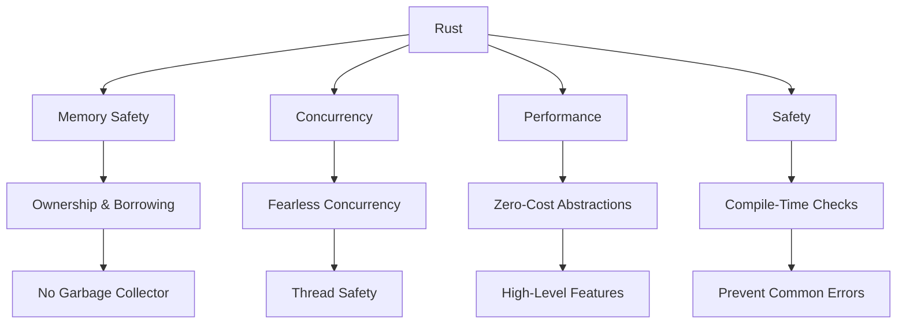

## 26.7. Comparing Rust with Other Systems Programming Languages

In the realm of systems programming, choosing the right language is crucial for achieving the desired balance between performance, safety, and ease of use. Rust has emerged as a strong contender in this space, offering unique features that address many of the challenges faced by traditional systems programming languages. In this section, we will compare Rust with C, C++, Go, and Zig, focusing on key aspects such as memory management, concurrency, performance, and safety. This comparison will help you understand Rust's place in the ecosystem and when it might be the preferred choice for your projects.

### Memory Management

Memory management is a critical aspect of systems programming, affecting both performance and safety. Let's explore how Rust compares to other languages in this area.

#### Rust

Rust's memory management is one of its standout features. It uses a system of ownership with rules that the compiler checks at compile time. This ensures memory safety without the need for a garbage collector, preventing common issues like null pointer dereferencing and data races.

```rust
fn main() {
    let x = String::from("Hello, Rust!");
    let y = &x; // Borrowing
    println!("{}", y);
    // x is still valid here
}
```

**Key Features:**
- **Ownership and Borrowing:** Ensures memory safety and prevents data races.
- **No Garbage Collector:** Provides predictable performance.
- **Lifetimes:** Help manage references and ensure they are valid.

#### C

C provides manual memory management, which gives developers fine-grained control but also introduces the risk of memory leaks and undefined behavior.

```c
#include <stdio.h>
#include <stdlib.h>

int main() {
    char *str = (char *)malloc(15);
    strcpy(str, "Hello, C!");
    printf("%s\n", str);
    free(str); // Manual memory management
    return 0;
}
```

**Key Features:**
- **Manual Memory Management:** Requires explicit allocation and deallocation.
- **No Safety Guarantees:** Prone to memory leaks and buffer overflows.

#### C++

C++ builds on C's manual memory management with features like RAII (Resource Acquisition Is Initialization) and smart pointers to help manage resources more safely.

```cpp
#include <iostream>
#include <memory>

int main() {
    std::unique_ptr<std::string> str = std::make_unique<std::string>("Hello, C++!");
    std::cout << *str << std::endl;
    // Automatic cleanup with RAII
    return 0;
}
```

**Key Features:**
- **RAII:** Manages resources automatically.
- **Smart Pointers:** `std::unique_ptr`, `std::shared_ptr` provide safer memory management.

#### Go

Go uses garbage collection to manage memory, which simplifies development but can introduce latency due to garbage collection pauses.

```go
package main

import "fmt"

func main() {
    str := "Hello, Go!"
    fmt.Println(str)
    // Garbage collector handles memory
}
```

**Key Features:**
- **Garbage Collection:** Simplifies memory management.
- **Automatic Memory Management:** Reduces developer burden but can affect performance.

#### Zig

Zig offers manual memory management with a focus on safety and performance, similar to C but with additional safety features.

```zig
const std = @import("std");

pub fn main() void {
    const allocator = std.heap.page_allocator;
    const str = try allocator.alloc(u8, 10);
    defer allocator.free(str);
    std.debug.print("Hello, Zig!\n", .{});
}
```

**Key Features:**
- **Manual Memory Management:** Similar to C but with better safety checks.
- **No Garbage Collector:** Provides predictable performance.

### Concurrency

Concurrency is essential for modern applications, and each language approaches it differently.

#### Rust

Rust's concurrency model is built on the principles of ownership and borrowing, ensuring thread safety without a garbage collector.

```rust
use std::thread;

fn main() {
    let handle = thread::spawn(|| {
        println!("Hello from a thread!");
    });

    handle.join().unwrap();
}
```

**Key Features:**
- **Fearless Concurrency:** Ensures thread safety through ownership.
- **No Data Races:** Compile-time checks prevent data races.

#### C

C provides low-level concurrency primitives like threads and mutexes, but it's up to the developer to ensure thread safety.

```c
#include <pthread.h>
#include <stdio.h>

void *print_message(void *ptr) {
    printf("%s\n", (char *)ptr);
    return NULL;
}

int main() {
    pthread_t thread;
    const char *message = "Hello from a thread!";
    pthread_create(&thread, NULL, print_message, (void *)message);
    pthread_join(thread, NULL);
    return 0;
}
```

**Key Features:**
- **Low-Level Control:** Provides threads and synchronization primitives.
- **Manual Safety Management:** Developers must ensure thread safety.

#### C++

C++ offers higher-level concurrency features like futures and promises, in addition to low-level primitives.

```cpp
#include <iostream>
#include <thread>

void print_message() {
    std::cout << "Hello from a thread!" << std::endl;
}

int main() {
    std::thread t(print_message);
    t.join();
    return 0;
}
```

**Key Features:**
- **High-Level Concurrency:** Futures, promises, and async tasks.
- **Standard Library Support:** Provides a rich set of concurrency tools.

#### Go

Go's concurrency model is based on goroutines and channels, providing a simple and efficient way to handle concurrent tasks.

```go
package main

import (
    "fmt"
    "time"
)

func main() {
    go func() {
        fmt.Println("Hello from a goroutine!")
    }()
    time.Sleep(time.Second)
}
```

**Key Features:**
- **Goroutines:** Lightweight threads managed by the Go runtime.
- **Channels:** Facilitate communication between goroutines.

#### Zig

Zig provides low-level concurrency primitives, similar to C, but with a focus on safety and performance.

```zig
const std = @import("std");

pub fn main() void {
    const t = std.Thread.spawn(print_message, .{});
    t.join();
}

fn print_message() void {
    std.debug.print("Hello from a thread!\n", .{});
}
```

**Key Features:**
- **Low-Level Control:** Similar to C with additional safety features.
- **Manual Safety Management:** Developers must ensure thread safety.

### Performance

Performance is a key consideration in systems programming, and each language offers different trade-offs.

#### Rust

Rust is designed for high performance, with zero-cost abstractions and no garbage collector, making it suitable for performance-critical applications.

**Key Features:**
- **Zero-Cost Abstractions:** High-level features without performance overhead.
- **Predictable Performance:** No garbage collection pauses.

#### C

C is known for its performance, offering low-level access to memory and hardware, but requires careful management to avoid undefined behavior.

**Key Features:**
- **Low-Level Access:** Direct access to memory and hardware.
- **Manual Optimization:** Requires careful tuning for performance.

#### C++

C++ offers high performance with features like templates and inline functions, but can introduce complexity.

**Key Features:**
- **Templates and Inline Functions:** Enable high-performance code.
- **Complexity:** Can lead to complex codebases.

#### Go

Go provides good performance with a focus on simplicity, but garbage collection can introduce latency.

**Key Features:**
- **Simplicity:** Easy to write and maintain code.
- **Garbage Collection:** Can affect performance in latency-sensitive applications.

#### Zig

Zig aims for performance similar to C, with a focus on safety and simplicity.

**Key Features:**
- **Low-Level Access:** Similar to C with additional safety features.
- **Predictable Performance:** No garbage collection pauses.

### Safety

Safety is a critical concern in systems programming, and Rust excels in this area.

#### Rust

Rust's safety features are one of its main advantages, with compile-time checks that prevent many common programming errors.

**Key Features:**
- **Memory Safety:** Ownership and borrowing prevent data races and null pointer dereferencing.
- **Type Safety:** Strong type system prevents many errors.

#### C

C offers no built-in safety features, relying on the developer to manage memory and ensure safety.

**Key Features:**
- **No Built-In Safety:** Prone to memory leaks and undefined behavior.
- **Manual Safety Management:** Developers must ensure safety.

#### C++

C++ offers some safety features like RAII and smart pointers, but still requires careful management.

**Key Features:**
- **RAII and Smart Pointers:** Help manage resources safely.
- **Manual Safety Management:** Developers must ensure safety.

#### Go

Go provides safety through garbage collection and a strong type system, but lacks some of the compile-time checks found in Rust.

**Key Features:**
- **Garbage Collection:** Simplifies memory management.
- **Strong Type System:** Prevents many errors.

#### Zig

Zig focuses on safety with features like compile-time checks and error handling, similar to Rust but with manual memory management.

**Key Features:**
- **Compile-Time Checks:** Prevent many common errors.
- **Manual Memory Management:** Requires careful management.

### Unique Features of Rust

Rust offers several unique features that set it apart from other systems programming languages:

- **Ownership and Borrowing:** Ensures memory safety without a garbage collector.
- **Fearless Concurrency:** Provides thread safety through ownership.
- **Zero-Cost Abstractions:** High-level features without performance overhead.
- **Pattern Matching:** Powerful feature for handling complex data structures.
- **Cargo:** Integrated package manager and build system.

### When to Choose Rust

Rust is an excellent choice for projects that require high performance, safety, and concurrency. It is particularly well-suited for:

- **Systems Programming:** Operating systems, embedded systems, and other low-level applications.
- **Web Assembly (WASM):** Rust's performance and safety make it ideal for WASM applications.
- **Concurrency-Intensive Applications:** Rust's fearless concurrency model ensures thread safety.
- **Security-Critical Applications:** Rust's safety features prevent many common vulnerabilities.

### Conclusion

Rust offers a compelling alternative to traditional systems programming languages, combining high performance with safety and ease of use. Its unique features, such as ownership and borrowing, make it a powerful tool for building reliable and efficient software. By understanding the strengths and weaknesses of Rust compared to other languages like C, C++, Go, and Zig, you can make informed decisions about when to use Rust for your projects.

### Visualizing Rust's Place in the Ecosystem



**Figure 1:** Visualizing Rust's unique features and strengths in the systems programming ecosystem.

### Further Reading

- [Rust Programming Language](https://www.rust-lang.org/)
- [The Rust Book](https://doc.rust-lang.org/book/)
- [C++ Reference](https://en.cppreference.com/)
- [Go Programming Language](https://golang.org/)
- [Zig Programming Language](https://ziglang.org/)

## Quiz Time!



### Which feature of Rust ensures memory safety without a garbage collector?

- [x] Ownership and Borrowing
- [ ] Garbage Collection
- [ ] Smart Pointers
- [ ] RAII

> **Explanation:** Rust uses ownership and borrowing to ensure memory safety without the need for a garbage collector.

### What is a key advantage of Rust's concurrency model?

- [x] Thread safety through ownership
- [ ] Automatic memory management
- [ ] Low-level control
- [ ] Garbage collection

> **Explanation:** Rust's concurrency model ensures thread safety through ownership, preventing data races.

### Which language uses goroutines for concurrency?

- [ ] Rust
- [ ] C
- [ ] C++
- [x] Go

> **Explanation:** Go uses goroutines for lightweight concurrency.

### What is a unique feature of Zig compared to C?

- [ ] Garbage Collection
- [x] Compile-Time Checks
- [ ] Smart Pointers
- [ ] RAII

> **Explanation:** Zig offers compile-time checks, which provide additional safety compared to C.

### Which language is known for zero-cost abstractions?

- [x] Rust
- [ ] C
- [ ] Go
- [ ] Zig

> **Explanation:** Rust is known for its zero-cost abstractions, providing high-level features without performance overhead.

### What is a common issue with C's memory management?

- [ ] Compile-time checks
- [x] Memory leaks
- [ ] Garbage collection pauses
- [ ] Smart pointers

> **Explanation:** C's manual memory management can lead to memory leaks if not handled carefully.

### Which language provides RAII for resource management?

- [ ] Rust
- [ ] Go
- [x] C++
- [ ] Zig

> **Explanation:** C++ provides RAII (Resource Acquisition Is Initialization) for automatic resource management.

### What is a key feature of Rust's type system?

- [x] Strong type safety
- [ ] Automatic memory management
- [ ] Low-level access
- [ ] Garbage collection

> **Explanation:** Rust's strong type system prevents many common programming errors.

### Which language is designed for simplicity and ease of use?

- [ ] Rust
- [ ] C
- [ ] C++
- [x] Go

> **Explanation:** Go is designed for simplicity and ease of use, making it easy to write and maintain code.

### Rust's pattern matching is particularly useful for handling what?

- [x] Complex data structures
- [ ] Memory management
- [ ] Concurrency
- [ ] Performance optimization

> **Explanation:** Rust's pattern matching is a powerful feature for handling complex data structures.



Remember, this is just the beginning. As you continue exploring Rust and its ecosystem, you'll discover even more powerful features and techniques that make it a standout choice for systems programming. Keep experimenting, stay curious, and enjoy the journey!
