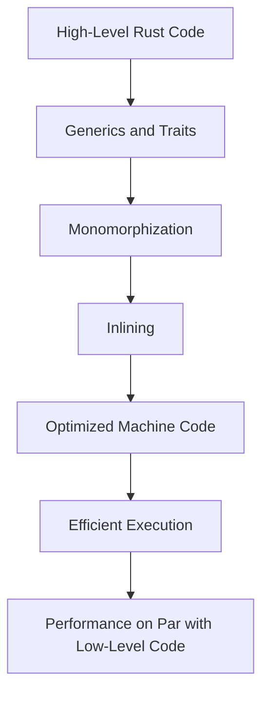

## 3.1. Zero-Cost Abstractions

In the realm of systems programming, performance is paramount. Developers often face a trade-off between writing high-level, expressive code and achieving the low-level efficiency required for systems tasks. Rust, however, offers a unique proposition: zero-cost abstractions. This means that developers can write clean, high-level code without incurring the runtime overhead typically associated with such abstractions. In this section, we will explore what zero-cost abstractions are, how Rust implements them, and why they are crucial for systems programming.

### What Are Zero-Cost Abstractions?

Zero-cost abstractions refer to the ability to use high-level programming constructs without sacrificing performance. In other words, the abstractions provided by the language do not add any additional runtime cost compared to writing equivalent low-level code manually. This concept is especially important in systems programming, where performance and resource efficiency are critical.

#### Importance in Systems Programming

In systems programming, developers often need to manage resources directly, such as memory and CPU cycles. High-level abstractions can simplify code and make it more maintainable, but they can also introduce inefficiencies if not implemented carefully. Zero-cost abstractions allow developers to use these high-level constructs without worrying about performance penalties, making it possible to write both efficient and expressive code.

### How Rust Achieves Zero-Cost Abstractions

Rust's design philosophy centers around providing powerful abstractions without compromising on performance. Several features of Rust contribute to its ability to offer zero-cost abstractions, including its ownership model, generics, and traits.

#### Ownership Model

Rust's ownership model is a cornerstone of its memory safety guarantees. By enforcing strict rules around ownership, borrowing, and lifetimes, Rust ensures that memory is managed efficiently without the need for a garbage collector. This model allows developers to write high-level code that is both safe and performant.

#### Generics

Generics in Rust allow for the creation of flexible and reusable code components. They enable developers to write functions and data structures that can operate on different types without sacrificing performance. Rust's generics are monomorphized at compile time, meaning that the compiler generates specific code for each type used with a generic function or data structure. This results in code that is as efficient as if it were written specifically for each type.

```rust
fn add<T: std::ops::Add<Output = T>>(a: T, b: T) -> T {
    a + b
}

fn main() {
    let int_sum = add(5, 10); // Works with integers
    let float_sum = add(5.0, 10.0); // Works with floats
    println!("Integer sum: {}", int_sum);
    println!("Float sum: {}", float_sum);
}
```

In the example above, the `add` function is generic over any type `T` that implements the `Add` trait. The Rust compiler generates optimized code for each specific type used, ensuring zero-cost abstraction.

#### Traits

Traits in Rust are similar to interfaces in other languages, allowing for polymorphism and code reuse. They enable developers to define shared behavior across different types. Rust's trait system is designed to be efficient, with trait methods often being inlined by the compiler to eliminate any runtime overhead.

```rust
trait Drawable {
    fn draw(&self);
}

struct Circle;
struct Square;

impl Drawable for Circle {
    fn draw(&self) {
        println!("Drawing a circle");
    }
}

impl Drawable for Square {
    fn draw(&self) {
        println!("Drawing a square");
    }
}

fn draw_shape(shape: &impl Drawable) {
    shape.draw();
}

fn main() {
    let circle = Circle;
    let square = Square;
    draw_shape(&circle);
    draw_shape(&square);
}
```

In this example, the `Drawable` trait is implemented for both `Circle` and `Square`. The `draw_shape` function can accept any type that implements the `Drawable` trait, and the compiler optimizes the trait method calls to be as efficient as direct function calls.

### High-Level Code Compiling to Efficient Machine Code

Rust's compiler, `rustc`, is highly sophisticated and capable of optimizing high-level Rust code into efficient machine code. This is achieved through several mechanisms, including:

- **Inlining**: The compiler can inline small functions, eliminating the overhead of function calls.
- **Monomorphization**: As mentioned earlier, Rust's generics are monomorphized, meaning that the compiler generates specific code for each type, resulting in optimized machine code.
- **Loop Unrolling**: The compiler can unroll loops to reduce the overhead of loop control structures.
- **Constant Folding**: Compile-time evaluation of constant expressions to reduce runtime computation.

These optimizations ensure that Rust code runs as efficiently as possible, often matching or exceeding the performance of equivalent C or C++ code.

### Comparing Rust's Approach to Abstractions with C++

C++ also offers zero-cost abstractions through templates and inline functions. However, Rust's approach differs in several key ways:

- **Memory Safety**: Rust's ownership model provides memory safety guarantees that C++ does not, reducing the risk of memory-related bugs.
- **Concurrency**: Rust's type system enforces safe concurrency, preventing data races at compile time, whereas C++ relies on developer discipline and external tools.
- **Error Handling**: Rust's `Result` and `Option` types provide a robust way to handle errors without exceptions, which can introduce overhead in C++.

While both languages aim to provide efficient abstractions, Rust's focus on safety and concurrency sets it apart from C++.

### Performance Benefits for Systems-Level Tasks

Zero-cost abstractions in Rust provide significant performance benefits for systems-level tasks, such as:

- **Embedded Systems**: Rust's low-level control and high-level safety make it ideal for embedded systems, where resource constraints are critical.
- **Operating Systems**: Rust's memory safety and concurrency features are beneficial for operating system development, where stability and performance are paramount.
- **High-Performance Computing**: Rust's ability to generate efficient machine code makes it suitable for high-performance computing tasks, where every CPU cycle counts.

### Code Example: High-Level Abstractions in Action

Let's explore a more complex example that demonstrates Rust's zero-cost abstractions in a real-world scenario. We'll implement a simple vector math library that uses generics and traits to provide efficient operations on vectors of different types.

```rust
use std::ops::{Add, Mul};

#[derive(Debug)]
struct Vector<T> {
    x: T,
    y: T,
}

impl<T: Add<Output = T>> Add for Vector<T> {
    type Output = Vector<T>;

    fn add(self, other: Vector<T>) -> Vector<T> {
        Vector {
            x: self.x + other.x,
            y: self.y + other.y,
        }
    }
}

impl<T: Mul<Output = T> + Copy> Mul<T> for Vector<T> {
    type Output = Vector<T>;

    fn mul(self, scalar: T) -> Vector<T> {
        Vector {
            x: self.x * scalar,
            y: self.y * scalar,
        }
    }
}

fn main() {
    let vec1 = Vector { x: 1.0, y: 2.0 };
    let vec2 = Vector { x: 3.0, y: 4.0 };
    let vec3 = vec1 + vec2;
    let vec4 = vec3 * 2.0;

    println!("Vector addition: {:?}", vec3);
    println!("Vector scaling: {:?}", vec4);
}
```

In this example, we define a `Vector` struct that can hold any type `T`. We implement the `Add` and `Mul` traits for `Vector<T>`, allowing us to perform vector addition and scalar multiplication. The use of generics and traits ensures that the code is both flexible and efficient, with the Rust compiler generating optimized machine code for each specific type used.

### Visualizing Zero-Cost Abstractions

To better understand how Rust achieves zero-cost abstractions, let's visualize the process of monomorphization and inlining using a diagram.



**Diagram Description**: This flowchart illustrates the process by which Rust's high-level code, utilizing generics and traits, is transformed through monomorphization and inlining into optimized machine code, resulting in efficient execution comparable to low-level code.

### Try It Yourself

To truly grasp the power of zero-cost abstractions, try modifying the vector math library example. Experiment with different types, such as integers or complex numbers, and observe how Rust's compiler optimizes the code for each specific type. Consider adding more operations, like dot products or cross products, and see how Rust's abstractions handle these extensions efficiently.

### Knowledge Check

- What are zero-cost abstractions, and why are they important in systems programming?
- How do Rust's generics and traits contribute to zero-cost abstractions?
- Compare Rust's approach to zero-cost abstractions with that of C++.
- What are some performance benefits of zero-cost abstractions for systems-level tasks?

### Summary

Zero-cost abstractions are a key feature of Rust, allowing developers to write high-level, expressive code without sacrificing performance. By leveraging features like generics, traits, and a sophisticated compiler, Rust achieves efficiency on par with low-level languages like C and C++. This makes Rust an ideal choice for systems programming, where both safety and performance are critical.

### Embrace the Journey

Remember, mastering zero-cost abstractions is just the beginning. As you continue to explore Rust, you'll discover even more powerful features and techniques that enable you to write efficient, safe, and expressive code. Keep experimenting, stay curious, and enjoy the journey!

## Quiz Time!



### What are zero-cost abstractions?

- [x] High-level programming constructs with no runtime overhead
- [ ] Abstractions that cost zero dollars to implement
- [ ] Low-level code that is difficult to understand
- [ ] A feature unique to interpreted languages

> **Explanation:** Zero-cost abstractions allow developers to use high-level constructs without incurring additional runtime costs, making them efficient for systems programming.

### How does Rust achieve zero-cost abstractions?

- [x] Through features like generics and traits
- [ ] By using a garbage collector
- [ ] By interpreting code at runtime
- [ ] By avoiding the use of abstractions altogether

> **Explanation:** Rust uses features like generics and traits, along with a sophisticated compiler, to provide zero-cost abstractions.

### What is monomorphization in Rust?

- [x] The process of generating specific code for each type used with a generic function or data structure
- [ ] The process of converting high-level code into bytecode
- [ ] A technique for optimizing memory usage
- [ ] A method for handling runtime errors

> **Explanation:** Monomorphization involves generating specific code for each type used with generics, ensuring efficient execution.

### How do traits contribute to zero-cost abstractions in Rust?

- [x] They allow for polymorphism and code reuse without runtime overhead
- [ ] They introduce additional runtime checks
- [ ] They are only used for error handling
- [ ] They require a garbage collector to function

> **Explanation:** Traits enable polymorphism and code reuse, with the compiler optimizing trait method calls to be as efficient as direct function calls.

### What is the primary benefit of zero-cost abstractions in systems programming?

- [x] They allow for high-level code without sacrificing performance
- [ ] They simplify the syntax of the language
- [ ] They eliminate the need for a compiler
- [ ] They make the code harder to read

> **Explanation:** Zero-cost abstractions enable developers to write high-level, expressive code while maintaining performance efficiency.

### Which Rust feature ensures memory safety without a garbage collector?

- [x] Ownership model
- [ ] Traits
- [ ] Macros
- [ ] Inline functions

> **Explanation:** Rust's ownership model enforces strict rules around memory management, ensuring safety without a garbage collector.

### How does Rust's approach to zero-cost abstractions differ from C++?

- [x] Rust provides memory safety and concurrency guarantees
- [ ] Rust uses a garbage collector
- [ ] Rust does not support generics
- [ ] Rust relies on runtime interpretation

> **Explanation:** Rust's ownership model and type system provide memory safety and concurrency guarantees, setting it apart from C++.

### What is the role of inlining in Rust's zero-cost abstractions?

- [x] It eliminates the overhead of function calls
- [ ] It introduces runtime checks
- [ ] It simplifies error handling
- [ ] It requires additional memory allocation

> **Explanation:** Inlining allows the compiler to eliminate the overhead of function calls, contributing to efficient execution.

### What is a key advantage of using Rust for embedded systems?

- [x] Rust's low-level control and high-level safety
- [ ] Rust's reliance on a garbage collector
- [ ] Rust's interpreted nature
- [ ] Rust's lack of type safety

> **Explanation:** Rust's combination of low-level control and high-level safety makes it ideal for resource-constrained embedded systems.

### True or False: Zero-cost abstractions in Rust result in code that is less efficient than manually optimized low-level code.

- [ ] True
- [x] False

> **Explanation:** Zero-cost abstractions in Rust allow high-level code to be as efficient as manually optimized low-level code, thanks to the compiler's optimizations.


