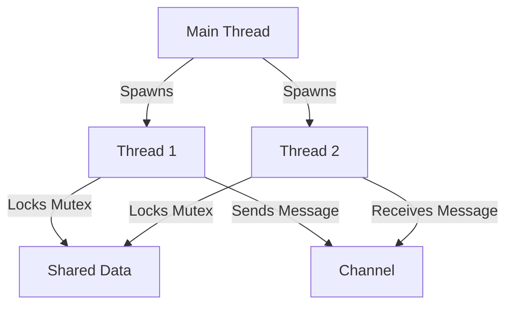

## 3.2. Safe Concurrency and Parallelism

Concurrency and parallelism are crucial concepts in modern programming, enabling applications to perform multiple tasks simultaneously and efficiently. Rust, with its unique ownership model, provides a robust framework for writing concurrent and parallel code safely, avoiding common pitfalls such as data races and deadlocks. In this section, we will explore how Rust achieves this and provide practical examples and best practices for safe concurrency.

### Understanding Concurrency vs. Parallelism

Before diving into Rust's concurrency model, it's essential to understand the difference between concurrency and parallelism:

- **Concurrency** refers to the ability of a program to manage multiple tasks at once. These tasks may not necessarily run simultaneously but are managed in such a way that they appear to be running at the same time. Concurrency is about dealing with many things at once.

- **Parallelism** involves executing multiple tasks simultaneously, typically on multiple processors or cores. Parallelism is about doing many things at once.

Rust's design allows developers to leverage both concurrency and parallelism effectively, ensuring that programs are both safe and efficient.

### Rust's Ownership Model and Thread Safety

Rust's ownership model is central to its approach to concurrency. The model enforces strict rules about how memory is accessed and modified, which helps prevent data races—a common issue in concurrent programming where two or more threads access shared data simultaneously, and at least one of them modifies it.

#### Key Concepts of Rust's Ownership Model

- **Ownership**: Each value in Rust has a single owner, and the value is dropped (deallocated) when the owner goes out of scope.

- **Borrowing**: Rust allows references to data through borrowing, which can be either mutable or immutable. Immutable references allow multiple readers, while mutable references require exclusive access.

- **Lifetimes**: Lifetimes are a way of describing the scope for which a reference is valid, ensuring that references do not outlive the data they point to.

These concepts ensure that data races are impossible at compile time, as Rust's compiler checks for violations of these rules.

### Concurrency Primitives in Rust

Rust provides several concurrency primitives in its standard library to facilitate safe concurrent programming:

#### Mutex

A `Mutex` (short for mutual exclusion) is a synchronization primitive that allows only one thread to access the data at a time. It is used to protect shared data from being accessed by multiple threads simultaneously.

```rust
use std::sync::{Arc, Mutex};
use std::thread;

fn main() {
    let counter = Arc::new(Mutex::new(0));
    let mut handles = vec![];

    for _ in 0..10 {
        let counter = Arc::clone(&counter);
        let handle = thread::spawn(move || {
            let mut num = counter.lock().unwrap();
            *num += 1;
        });
        handles.push(handle);
    }

    for handle in handles {
        handle.join().unwrap();
    }

    println!("Result: {}", *counter.lock().unwrap());
}
```

In this example, we use `Arc` (Atomic Reference Counting) to share ownership of the `Mutex` across multiple threads. Each thread locks the `Mutex` before modifying the counter, ensuring that only one thread can modify it at a time.

#### RwLock

An `RwLock` (Read-Write Lock) allows multiple readers or one writer at a time. This is useful when read operations are more frequent than write operations.

```rust
use std::sync::{Arc, RwLock};
use std::thread;

fn main() {
    let data = Arc::new(RwLock::new(vec![1, 2, 3]));
    let mut handles = vec![];

    for _ in 0..3 {
        let data = Arc::clone(&data);
        let handle = thread::spawn(move || {
            let read_data = data.read().unwrap();
            println!("Read: {:?}", *read_data);
        });
        handles.push(handle);
    }

    for handle in handles {
        handle.join().unwrap();
    }

    {
        let mut write_data = data.write().unwrap();
        write_data.push(4);
    }

    println!("Data: {:?}", *data.read().unwrap());
}
```

Here, multiple threads can read the data concurrently, but only one thread can write to it at a time.

#### Channels

Channels provide a way for threads to communicate with each other by sending messages. Rust's channels are type-safe and ensure that data is transferred safely between threads.

```rust
use std::sync::mpsc;
use std::thread;
use std::time::Duration;

fn main() {
    let (tx, rx) = mpsc::channel();

    thread::spawn(move || {
        let val = String::from("hello");
        tx.send(val).unwrap();
    });

    let received = rx.recv().unwrap();
    println!("Received: {}", received);
}
```

In this example, a thread sends a message through a channel, and the main thread receives it. Channels are a powerful tool for designing concurrent systems where threads need to communicate.

### Writing Concurrent Code with Rust's Standard Library

Rust's standard library provides several tools and abstractions for writing concurrent code. Let's explore some examples and best practices.

#### Using Threads

Rust's `std::thread` module provides the ability to spawn new threads. Each thread runs a closure, and you can use the `join` method to wait for a thread to finish.

```rust
use std::thread;

fn main() {
    let handle = thread::spawn(|| {
        for i in 1..10 {
            println!("hi number {} from the spawned thread!", i);
            thread::sleep(Duration::from_millis(1));
        }
    });

    for i in 1..5 {
        println!("hi number {} from the main thread!", i);
        thread::sleep(Duration::from_millis(1));
    }

    handle.join().unwrap();
}
```

This code demonstrates how to create a new thread and wait for it to complete using `join`.

#### Best Practices for Safe Concurrency in Rust

1. **Minimize Shared State**: The less shared state you have, the fewer opportunities for data races. Use message passing (channels) instead of shared memory when possible.

2. **Use `Arc` for Shared Ownership**: When you need to share data across threads, use `Arc` to manage shared ownership safely.

3. **Prefer `RwLock` for Read-Heavy Workloads**: If your workload involves more reads than writes, consider using `RwLock` to allow multiple readers.

4. **Leverage Rust's Type System**: Use Rust's type system to enforce invariants and ensure that your code is safe and correct.

5. **Avoid Blocking Operations**: In asynchronous code, avoid blocking operations that can lead to deadlocks or performance bottlenecks.

6. **Test Concurrent Code Thoroughly**: Concurrent code can be tricky to test. Use tools like `loom` to test your concurrent code for race conditions and deadlocks.

### Visualizing Concurrency in Rust

To better understand how Rust's concurrency model works, let's visualize the interaction between threads, `Mutex`, and channels using Mermaid.js diagrams.



This diagram illustrates how the main thread spawns two threads, both of which lock a `Mutex` to access shared data. Thread 1 sends a message through a channel, which Thread 2 receives.

### Conclusion

Rust's approach to concurrency and parallelism is both innovative and effective, providing developers with the tools they need to write safe and efficient concurrent code. By leveraging Rust's ownership model, concurrency primitives, and best practices, you can build robust applications that take full advantage of modern multi-core processors.

Remember, this is just the beginning. As you progress, you'll build more complex and interactive systems. Keep experimenting, stay curious, and enjoy the journey!

## Quiz Time!



### What is the primary difference between concurrency and parallelism?

- [x] Concurrency is about managing multiple tasks at once, while parallelism is about executing multiple tasks simultaneously.
- [ ] Concurrency is about executing tasks simultaneously, while parallelism is about managing tasks.
- [ ] Concurrency and parallelism are the same concepts.
- [ ] Concurrency is only applicable to single-threaded applications.

> **Explanation:** Concurrency involves managing multiple tasks at once, whereas parallelism involves executing multiple tasks simultaneously.

### How does Rust's ownership model help prevent data races?

- [x] By enforcing strict rules about how memory is accessed and modified.
- [ ] By allowing multiple mutable references to the same data.
- [ ] By using garbage collection to manage memory.
- [ ] By allowing threads to access data without restrictions.

> **Explanation:** Rust's ownership model enforces strict rules about memory access, preventing data races at compile time.

### Which Rust primitive allows multiple readers or one writer at a time?

- [ ] Mutex
- [x] RwLock
- [ ] Channel
- [ ] Arc

> **Explanation:** `RwLock` allows multiple readers or one writer at a time, making it suitable for read-heavy workloads.

### What is the purpose of Rust's `Arc` type?

- [x] To provide shared ownership of data across multiple threads.
- [ ] To lock data for exclusive access by a single thread.
- [ ] To send messages between threads.
- [ ] To manage memory automatically.

> **Explanation:** `Arc` (Atomic Reference Counting) provides shared ownership of data across multiple threads.

### Which of the following is a best practice for safe concurrency in Rust?

- [x] Minimize shared state and use message passing.
- [ ] Use blocking operations in asynchronous code.
- [ ] Avoid using Rust's type system for enforcing invariants.
- [ ] Share mutable state freely between threads.

> **Explanation:** Minimizing shared state and using message passing are best practices for safe concurrency in Rust.

### What is a common use case for Rust's channels?

- [x] Sending messages between threads.
- [ ] Locking data for exclusive access.
- [ ] Managing shared ownership of data.
- [ ] Automatically managing memory.

> **Explanation:** Channels are used for sending messages between threads, facilitating communication in concurrent systems.

### How can you test concurrent code for race conditions and deadlocks in Rust?

- [x] Use tools like `loom` to test concurrent code.
- [ ] Rely solely on manual testing.
- [ ] Use blocking operations to detect issues.
- [ ] Avoid testing concurrent code.

> **Explanation:** Tools like `loom` can help test concurrent code for race conditions and deadlocks.

### What does the `Mutex` primitive do in Rust?

- [x] It allows only one thread to access the data at a time.
- [ ] It allows multiple threads to access data simultaneously.
- [ ] It sends messages between threads.
- [ ] It provides shared ownership of data.

> **Explanation:** `Mutex` allows only one thread to access the data at a time, ensuring exclusive access.

### Which concurrency primitive is best suited for read-heavy workloads?

- [ ] Mutex
- [x] RwLock
- [ ] Channel
- [ ] Arc

> **Explanation:** `RwLock` is best suited for read-heavy workloads as it allows multiple readers.

### True or False: Rust's ownership model eliminates the need for garbage collection.

- [x] True
- [ ] False

> **Explanation:** Rust's ownership model eliminates the need for garbage collection by enforcing strict rules about memory access and deallocation.


