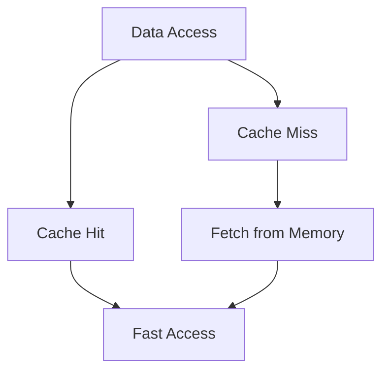

## 3.3. High-Performance Computing

High-performance computing (HPC) is a critical domain where computational efficiency and speed are paramount. Rust, with its unique blend of safety and performance, is well-suited for HPC applications. In this section, we'll explore how to leverage Rust's capabilities to write efficient, optimized code for computationally intensive tasks. We'll delve into optimization techniques, profiling tools, and strategies to identify and mitigate bottlenecks. Additionally, we'll discuss considerations such as memory layout, cache utilization, and SIMD (Single Instruction, Multiple Data) to enhance performance.

### Rust's Suitability for High-Performance Computing

Rust's design philosophy emphasizes safety and performance, making it an excellent choice for HPC. Here are some reasons why Rust is suitable for high-performance computing:

- **Memory Safety**: Rust's ownership model ensures memory safety without a garbage collector, reducing runtime overhead.
- **Zero-Cost Abstractions**: Rust provides abstractions that compile down to efficient machine code, ensuring no performance penalty.
- **Concurrency**: Rust's concurrency model, with its emphasis on safe parallelism, allows for efficient multi-threaded applications.
- **Control Over System Resources**: Rust gives developers fine-grained control over system resources, enabling optimizations at the hardware level.

### Optimizing Rust Code for Speed and Efficiency

To achieve high performance in Rust, it's essential to write code that is both efficient and optimized. Here are some strategies to consider:

#### 1. **Efficient Memory Management**

Memory management is crucial for performance. Rust's ownership model helps manage memory efficiently, but there are additional considerations:

- **Avoid Unnecessary Cloning**: Cloning data can be expensive. Use references or borrowing to avoid unnecessary data duplication.
- **Use `Box`, `Rc`, and `Arc` Wisely**: These smart pointers can help manage heap-allocated data, but they come with overhead. Use them judiciously.
- **Optimize Data Structures**: Choose the right data structures for your use case. For example, use `Vec` for dynamic arrays and `HashMap` for key-value pairs.

#### 2. **Cache Utilization**

Efficient cache utilization can significantly impact performance:

- **Data Locality**: Arrange data in memory to maximize cache hits. Use contiguous memory layouts like arrays or `Vec` for better cache performance.
- **Prefetching**: Anticipate data access patterns and prefetch data to reduce cache misses.

#### 3. **SIMD (Single Instruction, Multiple Data)**

SIMD allows for parallel processing of data, which can greatly enhance performance:

- **Use SIMD Intrinsics**: Rust provides SIMD intrinsics for low-level parallel processing. Use these to perform operations on multiple data points simultaneously.
- **Leverage Libraries**: Libraries like `packed_simd` offer higher-level abstractions for SIMD operations.

#### 4. **Concurrency and Parallelism**

Rust's concurrency model enables safe parallel execution:

- **Use Threads**: Rust's standard library provides threading support. Use threads to parallelize tasks and improve performance.
- **Employ Rayon**: The Rayon library offers a simple API for parallel iterators, making it easy to parallelize data processing tasks.

#### 5. **Algorithmic Optimizations**

Choosing the right algorithm can have a significant impact on performance:

- **Complexity Analysis**: Analyze the time and space complexity of algorithms. Opt for algorithms with lower complexity for better performance.
- **Tailor Algorithms to Data**: Customize algorithms based on the characteristics of your data. For example, use quicksort for small datasets and mergesort for larger ones.

### Profiling Tools and Identifying Bottlenecks

Profiling is essential for identifying performance bottlenecks. Rust offers several tools for profiling and performance analysis:

#### 1. **Cargo Bench**

Cargo Bench is a built-in tool for benchmarking Rust code. It provides insights into the performance of specific code sections.

```rust
#[bench]
fn bench_example(b: &mut Bencher) {
    b.iter(|| {
        // Code to benchmark
    });
}
```

#### 2. **Perf**

Perf is a powerful Linux profiling tool that can be used with Rust. It provides detailed performance metrics, including CPU usage and cache misses.

#### 3. **Flamegraph**

Flamegraph is a visualization tool that helps identify performance bottlenecks by displaying a hierarchical view of function calls.

```shell
cargo install flamegraph
cargo flamegraph
```

#### 4. **Valgrind**

Valgrind is a tool for memory profiling and leak detection. It can help identify memory-related performance issues.

### Performance-Critical Code and Optimization Strategies

Let's explore some examples of performance-critical code and optimization strategies in Rust:

#### Example 1: Matrix Multiplication

Matrix multiplication is a common HPC task. Here's a basic implementation in Rust:

```rust
fn matrix_multiply(a: &Vec<Vec<f64>>, b: &Vec<Vec<f64>>) -> Vec<Vec<f64>> {
    let n = a.len();
    let mut result = vec![vec![0.0; n]; n];
    for i in 0..n {
        for j in 0..n {
            for k in 0..n {
                result[i][j] += a[i][k] * b[k][j];
            }
        }
    }
    result
}
```

**Optimization Strategies**:

- **Block Matrix Multiplication**: Break matrices into smaller blocks to improve cache utilization.
- **SIMD**: Use SIMD instructions to perform parallel operations on matrix elements.

#### Example 2: Parallel Data Processing

Parallel data processing can significantly improve performance. Here's an example using Rayon:

```rust
use rayon::prelude::*;

fn parallel_sum(data: &[i32]) -> i32 {
    data.par_iter().sum()
}
```

**Optimization Strategies**:

- **Chunking**: Divide data into chunks and process them in parallel.
- **Load Balancing**: Ensure even distribution of work across threads to avoid bottlenecks.

### Considerations for High-Performance Computing

When optimizing Rust code for HPC, consider the following:

- **Memory Layout**: Organize data in memory to maximize cache efficiency.
- **Data Alignment**: Align data structures to cache line boundaries to reduce cache misses.
- **Branch Prediction**: Minimize branching in code to improve CPU pipeline efficiency.

### Visualizing Performance Optimization

Let's visualize the impact of cache utilization on performance using a simple flowchart:



**Description**: This flowchart illustrates the impact of cache utilization on data access speed. A cache hit results in fast access, while a cache miss requires fetching data from memory, which is slower.

### References and Links

For further reading on high-performance computing in Rust, consider the following resources:

- [Rust Performance Book](https://nnethercote.github.io/perf-book/)
- [Rayon Documentation](https://docs.rs/rayon/latest/rayon/)
- [Packed SIMD](https://docs.rs/packed_simd/latest/packed_simd/)

### Knowledge Check

To reinforce your understanding of high-performance computing in Rust, consider the following questions:

- What are the benefits of using Rust for high-performance computing?
- How can you optimize memory usage in Rust applications?
- What tools can you use to profile Rust code and identify bottlenecks?

### Embrace the Journey

Remember, optimizing for high performance is an iterative process. As you gain experience, you'll develop a deeper understanding of how to write efficient Rust code. Keep experimenting, stay curious, and enjoy the journey!

## Quiz Time!



### What is a key advantage of Rust for high-performance computing?

- [x] Memory safety without garbage collection
- [ ] Built-in garbage collector
- [ ] Dynamic typing
- [ ] Lack of concurrency support

> **Explanation:** Rust provides memory safety without a garbage collector, which reduces runtime overhead and is advantageous for high-performance computing.

### Which Rust feature helps manage memory efficiently?

- [x] Ownership model
- [ ] Garbage collection
- [ ] Dynamic typing
- [ ] Reflection

> **Explanation:** Rust's ownership model helps manage memory efficiently by ensuring memory safety and preventing data races.

### What is SIMD used for in high-performance computing?

- [x] Parallel processing of data
- [ ] Serial processing of data
- [ ] Memory management
- [ ] Error handling

> **Explanation:** SIMD (Single Instruction, Multiple Data) is used for parallel processing of data, allowing operations on multiple data points simultaneously.

### Which tool can be used to visualize performance bottlenecks in Rust?

- [x] Flamegraph
- [ ] Cargo Bench
- [ ] Valgrind
- [ ] Perf

> **Explanation:** Flamegraph is a visualization tool that helps identify performance bottlenecks by displaying a hierarchical view of function calls.

### What is a strategy for optimizing matrix multiplication in Rust?

- [x] Block matrix multiplication
- [ ] Using dynamic typing
- [ ] Increasing recursion depth
- [ ] Disabling concurrency

> **Explanation:** Block matrix multiplication improves cache utilization by breaking matrices into smaller blocks, enhancing performance.

### How can you parallelize data processing in Rust?

- [x] Using Rayon
- [ ] Using dynamic typing
- [ ] Disabling concurrency
- [ ] Increasing recursion depth

> **Explanation:** Rayon provides a simple API for parallel iterators, making it easy to parallelize data processing tasks in Rust.

### What is a consideration for high-performance computing in Rust?

- [x] Memory layout
- [ ] Dynamic typing
- [ ] Lack of concurrency support
- [ ] Disabling error handling

> **Explanation:** Memory layout is crucial for high-performance computing, as organizing data efficiently can maximize cache efficiency.

### Which tool is used for memory profiling in Rust?

- [x] Valgrind
- [ ] Cargo Bench
- [ ] Flamegraph
- [ ] Perf

> **Explanation:** Valgrind is a tool for memory profiling and leak detection, helping identify memory-related performance issues.

### What is a benefit of using SIMD in Rust?

- [x] Parallel processing of data
- [ ] Serial processing of data
- [ ] Memory management
- [ ] Error handling

> **Explanation:** SIMD allows for parallel processing of data, enhancing performance by performing operations on multiple data points simultaneously.

### True or False: Rust's concurrency model allows for safe parallel execution.

- [x] True
- [ ] False

> **Explanation:** Rust's concurrency model emphasizes safe parallelism, allowing for efficient multi-threaded applications.


