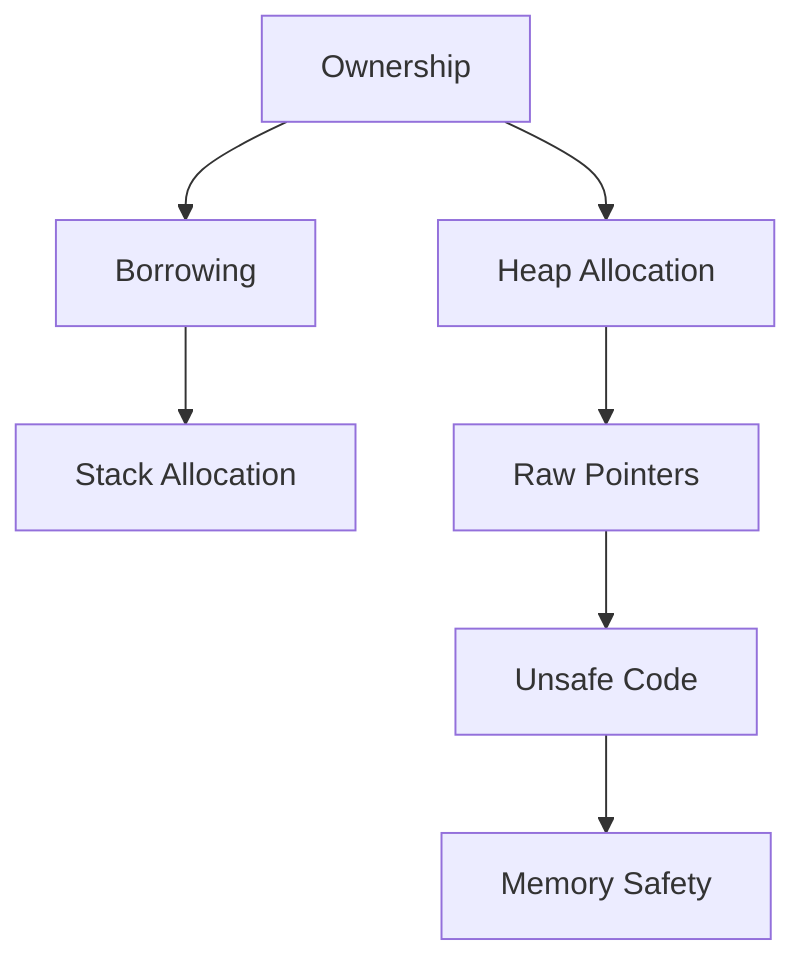

## 3.4. Low-Level Memory Management

In the realm of systems programming, low-level memory management is a critical aspect that demands precision and safety. Rust, as a systems programming language, provides developers with the tools to manage memory efficiently while ensuring safety through its unique ownership model. This section delves into Rust's approach to low-level memory management, highlighting its capabilities and the safeguards it offers to prevent undefined behavior.

### Memory Allocation and Deallocation in Rust

Rust's memory management is built on the principles of ownership, borrowing, and lifetimes, which are designed to ensure memory safety without the need for a garbage collector. Let's explore how Rust handles memory allocation and deallocation.

#### Ownership and Borrowing

Ownership is a core concept in Rust that dictates how memory is managed. Each value in Rust has a single owner, and when the owner goes out of scope, the value is automatically deallocated. This eliminates the need for manual memory management and prevents memory leaks.

```rust
fn main() {
    let s = String::from("Hello, Rust!"); // `s` owns the memory
    println!("{}", s); // `s` is used here
} // `s` goes out of scope and memory is deallocated
```

#### The Role of the Heap and Stack

Rust uses both the stack and the heap for memory allocation. The stack is used for storing values with a known, fixed size at compile time, while the heap is used for dynamic memory allocation.

- **Stack**: Fast, but limited in size. Used for storing function parameters, local variables, and control flow data.
- **Heap**: Larger and more flexible, but slower to access. Used for data that needs to be allocated at runtime.

#### Dynamic Memory Allocation

Rust provides several ways to allocate memory on the heap, such as using the `Box`, `Rc`, and `Arc` smart pointers. These abstractions manage heap-allocated memory and ensure that it is properly deallocated when no longer needed.

```rust
fn main() {
    let b = Box::new(5); // Allocates an integer on the heap
    println!("b = {}", b);
} // `b` is automatically deallocated when it goes out of scope
```

### Raw Pointers and Their Necessity

While Rust's ownership model provides safety, there are scenarios where raw pointers are necessary, such as interfacing with C libraries or performing low-level memory manipulation.

#### Understanding Raw Pointers

Raw pointers in Rust are similar to pointers in C and C++. They can point to any memory location and do not have any ownership or borrowing rules enforced by the compiler.

- **`*const T`**: A raw pointer to a constant value.
- **`*mut T`**: A raw pointer to a mutable value.

#### When to Use Raw Pointers

Raw pointers are typically used in the following scenarios:

- Interfacing with C libraries through Foreign Function Interface (FFI).
- Implementing data structures that require manual memory management.
- Optimizing performance-critical sections of code where the overhead of Rust's safety checks is unacceptable.

#### Example of Raw Pointers

```rust
fn main() {
    let x = 42;
    let r1 = &x as *const i32; // Raw pointer to a constant
    let r2 = &x as *mut i32;   // Raw pointer to a mutable

    unsafe {
        println!("r1 points to: {}", *r1);
        println!("r2 points to: {}", *r2);
    }
}
```

### The `unsafe` Code Block

Rust's `unsafe` keyword allows developers to perform operations that the compiler cannot guarantee to be safe. This includes dereferencing raw pointers, calling unsafe functions, and accessing mutable static variables.

#### Purpose of `unsafe` Code

The `unsafe` keyword is a promise by the developer that they have manually ensured the safety of the code. It is a powerful tool that should be used sparingly and with caution.

#### Guidelines for Writing `unsafe` Code

1. **Minimize Usage**: Use `unsafe` only when absolutely necessary.
2. **Isolate `unsafe` Code**: Encapsulate `unsafe` operations in small, well-documented functions.
3. **Review Thoroughly**: Conduct code reviews and testing to ensure safety.
4. **Use Safe Abstractions**: Whenever possible, wrap `unsafe` code in safe abstractions.

#### Example of `unsafe` Code

```rust
fn main() {
    let mut num = 5;
    let r1 = &num as *const i32;
    let r2 = &mut num as *mut i32;

    unsafe {
        println!("r1 points to: {}", *r1);
        *r2 = 10;
        println!("r2 points to: {}", *r2);
    }
}
```

### Scenarios Requiring Low-Level Memory Manipulation

Low-level memory manipulation is sometimes necessary in systems programming, particularly in the following scenarios:

- **Interfacing with Hardware**: Directly manipulating memory-mapped I/O.
- **Custom Allocators**: Implementing custom memory allocators for specific performance requirements.
- **Embedded Systems**: Managing memory in environments with limited resources.
- **Performance Optimization**: Fine-tuning memory usage for high-performance applications.

### Visualizing Memory Management

To better understand Rust's memory management, let's visualize the relationship between ownership, borrowing, and raw pointers.



**Figure 1**: Visualizing Rust's Memory Management Concepts

### Key Takeaways

- Rust's ownership model provides automatic memory management, eliminating the need for manual deallocation.
- Raw pointers offer flexibility for low-level programming but require careful handling to avoid undefined behavior.
- The `unsafe` keyword allows for operations that bypass Rust's safety checks, but should be used judiciously.
- Low-level memory manipulation is essential in certain scenarios, such as interfacing with hardware or optimizing performance.

### Try It Yourself

Experiment with the code examples provided in this section. Try modifying the values, changing the types of pointers, or introducing `unsafe` blocks to see how Rust handles memory management. Remember, practice is key to mastering low-level programming in Rust.

### Further Reading

For more information on Rust's memory management, consider exploring the following resources:

- [The Rust Programming Language Book](https://doc.rust-lang.org/book/)
- [Rust's Official Documentation on Unsafe Code](https://doc.rust-lang.org/nomicon/)

## Quiz Time!



### What is the primary purpose of Rust's ownership model?

- [x] To ensure memory safety without a garbage collector
- [ ] To allow manual memory management
- [ ] To provide faster execution times
- [ ] To simplify syntax

> **Explanation:** Rust's ownership model ensures memory safety by automatically managing memory without the need for a garbage collector.

### When should raw pointers be used in Rust?

- [x] When interfacing with C libraries
- [ ] For all memory allocations
- [ ] To improve code readability
- [ ] To avoid using the stack

> **Explanation:** Raw pointers are used when interfacing with C libraries or performing low-level memory manipulation.

### What does the `unsafe` keyword in Rust signify?

- [x] It allows operations that the compiler cannot guarantee to be safe
- [ ] It makes code run faster
- [ ] It disables all safety checks
- [ ] It is used for debugging

> **Explanation:** The `unsafe` keyword allows operations that bypass Rust's safety checks, requiring the developer to ensure safety manually.

### Which of the following is a guideline for writing `unsafe` code?

- [x] Minimize usage and isolate `unsafe` code
- [ ] Use `unsafe` for all pointer operations
- [ ] Avoid code reviews for `unsafe` code
- [ ] Use `unsafe` to simplify code

> **Explanation:** `unsafe` code should be minimized, isolated, and thoroughly reviewed to ensure safety.

### What is a common scenario for using low-level memory manipulation in Rust?

- [x] Interfacing with hardware
- [ ] Writing web applications
- [ ] Creating user interfaces
- [ ] Handling high-level data structures

> **Explanation:** Low-level memory manipulation is often used when interfacing with hardware or optimizing performance.

### What is the role of the stack in Rust's memory management?

- [x] To store values with a known, fixed size at compile time
- [ ] To allocate dynamic memory
- [ ] To manage heap allocations
- [ ] To handle garbage collection

> **Explanation:** The stack is used for storing values with a known, fixed size at compile time.

### How does Rust ensure memory safety without a garbage collector?

- [x] Through ownership, borrowing, and lifetimes
- [ ] By using raw pointers
- [ ] By relying on the operating system
- [ ] By using `unsafe` code

> **Explanation:** Rust uses ownership, borrowing, and lifetimes to ensure memory safety without a garbage collector.

### What is the difference between `*const T` and `*mut T`?

- [x] `*const T` is a raw pointer to a constant value, while `*mut T` is a raw pointer to a mutable value
- [ ] `*const T` is faster than `*mut T`
- [ ] `*mut T` is safer than `*const T`
- [ ] There is no difference

> **Explanation:** `*const T` points to a constant value, while `*mut T` points to a mutable value.

### True or False: Rust's `unsafe` keyword disables all safety checks.

- [ ] True
- [x] False

> **Explanation:** The `unsafe` keyword allows certain operations that bypass safety checks, but it does not disable all safety checks.

### What is a benefit of using smart pointers like `Box` in Rust?

- [x] They manage heap-allocated memory and ensure proper deallocation
- [ ] They make code run faster
- [ ] They simplify syntax
- [ ] They are used for stack allocations

> **Explanation:** Smart pointers like `Box` manage heap-allocated memory and ensure it is properly deallocated when no longer needed.



Remember, mastering low-level memory management in Rust is a journey. Keep experimenting, stay curious, and enjoy the process of learning and growing as a Rust developer!
