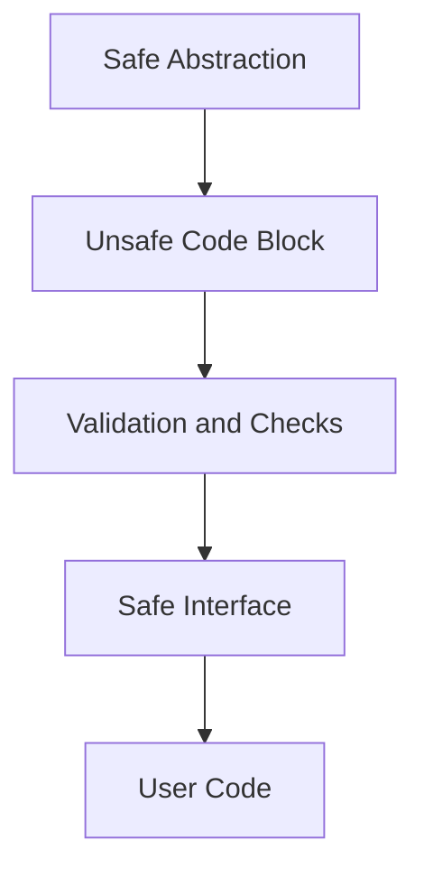

## 3.6. Handling Unsafe Code Safely

Rust is renowned for its memory safety guarantees, which are enforced by its strict compiler checks. However, there are scenarios where these checks can be bypassed using `unsafe` code. This section delves into what `unsafe` code is, when it is necessary, and how to handle it safely to maintain the integrity and reliability of your Rust programs.

### What is `unsafe` Code?

In Rust, `unsafe` code refers to a block of code that allows you to perform operations that the Rust compiler cannot guarantee to be safe. These operations include:

- Dereferencing raw pointers.
- Calling functions or methods that are `unsafe`.
- Accessing or modifying mutable static variables.
- Implementing unsafe traits.
- Accessing union fields.

The `unsafe` keyword is a signal to the programmer that they must ensure the safety of these operations manually, as the compiler will not enforce the usual safety checks.

### The Risks of `unsafe` Code

Using `unsafe` code introduces several risks, primarily because it bypasses Rust's safety guarantees. These risks include:

- **Memory Safety Violations**: Dereferencing raw pointers can lead to null pointer dereferences, buffer overflows, or data races.
- **Undefined Behavior**: Incorrect use of `unsafe` code can result in undefined behavior, which can cause unpredictable program behavior.
- **Concurrency Issues**: Without the compiler's checks, `unsafe` code can lead to data races and other concurrency problems.

### Mitigating Risks

To mitigate the risks associated with `unsafe` code, follow these guidelines:

1. **Minimize Use**: Use `unsafe` code only when absolutely necessary. Most Rust programs can be written without it.
2. **Encapsulation**: Encapsulate `unsafe` code within safe abstractions. This limits the scope of potential errors and makes it easier to audit.
3. **Documentation**: Clearly document why `unsafe` code is necessary and how it maintains safety.
4. **Testing**: Thoroughly test `unsafe` code paths, including edge cases and potential failure modes.
5. **Code Review**: Have `unsafe` code reviewed by peers to catch potential issues and ensure adherence to best practices.

### Best Practices for Using `unsafe` Code

#### 1. Encapsulate `unsafe` Code

Encapsulation is key to safely using `unsafe` code. By wrapping `unsafe` operations in safe abstractions, you can limit the potential for errors. Here's an example:

```rust
struct SafeWrapper {
    data: *const i32,
}

impl SafeWrapper {
    fn new(data: &i32) -> Self {
        SafeWrapper {
            data: data as *const i32,
        }
    }

    fn get_value(&self) -> i32 {
        unsafe {
            // Safe because we ensure `data` is valid
            *self.data
        }
    }
}
```

In this example, the `SafeWrapper` struct encapsulates a raw pointer, providing a safe interface for accessing the data.

#### 2. Use `unsafe` Blocks Sparingly

Limit the use of `unsafe` blocks to the smallest possible scope. This reduces the potential for errors and makes it easier to audit the code.

```rust
fn safe_function() {
    let x: i32 = 42;
    let y: *const i32 = &x;

    unsafe {
        // Only the dereference is unsafe
        println!("Value: {}", *y);
    }
}
```

#### 3. Validate Inputs

Ensure that any inputs to `unsafe` code are validated before use. This can prevent many common errors, such as null pointer dereferences.

```rust
fn safe_dereference(ptr: *const i32) -> Option<i32> {
    if ptr.is_null() {
        None
    } else {
        unsafe {
            Some(*ptr)
        }
    }
}
```

#### 4. Leverage Rust's Type System

Use Rust's powerful type system to enforce invariants and prevent misuse of `unsafe` code. For example, use newtypes to distinguish between different kinds of pointers or data.

```rust
struct NonNullPointer(*const i32);

impl NonNullPointer {
    fn new(ptr: *const i32) -> Option<Self> {
        if ptr.is_null() {
            None
        } else {
            Some(NonNullPointer(ptr))
        }
    }

    fn get_value(&self) -> i32 {
        unsafe {
            *self.0
        }
    }
}
```

### When is `unsafe` Necessary?

Despite the risks, there are scenarios where `unsafe` code is necessary or beneficial:

- **Interfacing with C Libraries**: When calling C functions, you must use `unsafe` code to handle raw pointers and other unsafe operations.
- **Performance Optimization**: In some cases, `unsafe` code can be used to optimize performance-critical sections of code.
- **Low-Level System Programming**: Writing device drivers or operating system components often requires `unsafe` code to interact with hardware directly.

### Community Standards for Auditing and Documenting `unsafe` Code

The Rust community places a strong emphasis on safety and reliability. To align with community standards:

- **Audit Regularly**: Regularly audit `unsafe` code to ensure it remains safe as the codebase evolves.
- **Use Lints and Tools**: Utilize tools like `clippy` to catch potential issues in `unsafe` code.
- **Engage with the Community**: Participate in community discussions and seek feedback on `unsafe` code practices.

### Code Example: Safe Abstraction with `unsafe`

Let's look at a more comprehensive example that demonstrates how to safely encapsulate `unsafe` code:

```rust
struct SafeBuffer {
    buffer: Vec<u8>,
}

impl SafeBuffer {
    fn new(size: usize) -> Self {
        SafeBuffer {
            buffer: vec![0; size],
        }
    }

    fn write(&mut self, index: usize, value: u8) {
        if index < self.buffer.len() {
            self.buffer[index] = value;
        }
    }

    fn read(&self, index: usize) -> Option<u8> {
        if index < self.buffer.len() {
            Some(self.buffer[index])
        } else {
            None
        }
    }

    fn as_ptr(&self) -> *const u8 {
        self.buffer.as_ptr()
    }
}

fn main() {
    let mut buffer = SafeBuffer::new(10);
    buffer.write(0, 42);

    unsafe {
        // Safe because we ensure the index is within bounds
        let value = *buffer.as_ptr();
        println!("Value at index 0: {}", value);
    }
}
```

In this example, the `SafeBuffer` struct provides a safe interface for interacting with a buffer, while the `unsafe` code is limited to a small, well-defined scope.

### Visualizing Unsafe Code Safety

To better understand how `unsafe` code interacts with safe abstractions, let's visualize the process:



**Diagram Description**: This diagram illustrates the flow of using `unsafe` code within a safe abstraction. The unsafe code block is encapsulated by validation and checks, providing a safe interface for user code.

### Knowledge Check

Before we conclude, let's reinforce what we've learned:

- Why is it important to encapsulate `unsafe` code?
- What are some common scenarios where `unsafe` code is necessary?
- How can we mitigate the risks associated with `unsafe` code?

### Embrace the Journey

Remember, using `unsafe` code in Rust is a powerful tool, but with great power comes great responsibility. By following best practices and community standards, you can harness the full potential of Rust while maintaining safety and reliability. Keep experimenting, stay curious, and enjoy the journey!

## Quiz Time!



### What is the primary purpose of `unsafe` code in Rust?

- [x] To perform operations that the Rust compiler cannot guarantee to be safe.
- [ ] To improve the readability of the code.
- [ ] To automatically handle memory management.
- [ ] To simplify error handling.

> **Explanation:** `unsafe` code allows you to perform operations that bypass Rust's safety checks, such as dereferencing raw pointers.

### Which of the following is a risk associated with `unsafe` code?

- [x] Memory safety violations
- [ ] Improved performance
- [ ] Enhanced readability
- [ ] Automatic error handling

> **Explanation:** `unsafe` code can lead to memory safety violations if not handled carefully.

### How can you mitigate the risks of using `unsafe` code?

- [x] Encapsulate `unsafe` code within safe abstractions.
- [x] Thoroughly test `unsafe` code paths.
- [ ] Use `unsafe` code as frequently as possible.
- [ ] Avoid documenting `unsafe` code.

> **Explanation:** Encapsulation and thorough testing help ensure that `unsafe` code is used safely.

### When is `unsafe` code necessary?

- [x] When interfacing with C libraries
- [x] For performance optimization
- [ ] For all Rust programs
- [ ] To simplify error handling

> **Explanation:** `unsafe` code is necessary when interfacing with C libraries and for certain performance optimizations.

### What should you do before using `unsafe` code?

- [x] Validate inputs to `unsafe` code.
- [x] Limit the scope of `unsafe` blocks.
- [ ] Avoid testing the code.
- [ ] Use `unsafe` code without any checks.

> **Explanation:** Validating inputs and limiting the scope of `unsafe` blocks help maintain safety.

### What is the role of the Rust community in handling `unsafe` code?

- [x] To provide standards for auditing and documenting `unsafe` code.
- [ ] To encourage the use of `unsafe` code in all projects.
- [ ] To eliminate the need for `unsafe` code entirely.
- [ ] To discourage any use of `unsafe` code.

> **Explanation:** The Rust community provides standards and best practices for safely using `unsafe` code.

### Which of the following is a best practice for `unsafe` code?

- [x] Encapsulate `unsafe` code within safe abstractions.
- [ ] Use `unsafe` code for all memory operations.
- [ ] Avoid documenting `unsafe` code.
- [ ] Use `unsafe` code without any validation.

> **Explanation:** Encapsulation within safe abstractions is a best practice for using `unsafe` code.

### What is the purpose of the `unsafe` keyword in Rust?

- [x] To indicate that the programmer must ensure the safety of certain operations.
- [ ] To automatically handle memory management.
- [ ] To simplify error handling.
- [ ] To improve code readability.

> **Explanation:** The `unsafe` keyword indicates that the programmer is responsible for ensuring the safety of certain operations.

### True or False: `unsafe` code can lead to undefined behavior if not handled carefully.

- [x] True
- [ ] False

> **Explanation:** `unsafe` code can lead to undefined behavior if not handled carefully, as it bypasses Rust's safety checks.

### Which of the following is NOT a recommended practice for `unsafe` code?

- [ ] Encapsulate `unsafe` code within safe abstractions.
- [ ] Thoroughly test `unsafe` code paths.
- [ ] Document the use of `unsafe` code.
- [x] Use `unsafe` code without any checks or validation.

> **Explanation:** Using `unsafe` code without any checks or validation is not a recommended practice.


