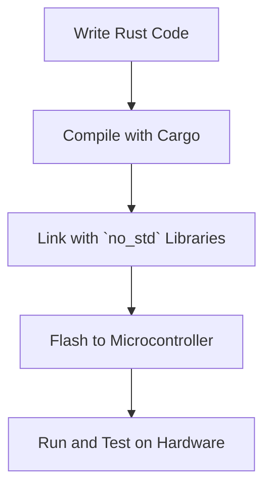

## 3.7. Embedded Systems Development

Embedded systems are specialized computing systems that perform dedicated functions within larger mechanical or electrical systems. They are ubiquitous in modern technology, found in everything from household appliances to automotive control systems and industrial machines. Programming these systems presents unique challenges, particularly in terms of resource constraints, real-time requirements, and reliability. Rust, with its emphasis on safety, concurrency, and performance, is an excellent choice for embedded systems development.

### Challenges in Embedded Systems Programming

Embedded systems programming is distinct from general-purpose programming due to several unique challenges:

1. **Resource Constraints**: Embedded systems often have limited memory and processing power. Efficient use of resources is critical.
2. **Real-Time Requirements**: Many embedded applications require precise timing and quick response to external events.
3. **Reliability and Safety**: Embedded systems often operate in critical environments where failures can have serious consequences.
4. **Low-Level Hardware Interaction**: Direct interaction with hardware is common, requiring precise control over memory and peripherals.
5. **Portability and Scalability**: Code needs to be portable across different hardware platforms and scalable to accommodate various system sizes.

### Rust's `no_std` Environment

Rust's `no_std` environment is designed for systems programming without the standard library, which is essential for embedded systems where the full standard library is not available. The `no_std` environment provides the following benefits:

- **Reduced Binary Size**: By excluding the standard library, binaries are smaller, which is crucial for systems with limited storage.
- **Direct Hardware Access**: Developers can write code that interacts directly with hardware, bypassing abstractions that may introduce overhead.
- **Custom Memory Management**: Without the standard library's memory management, developers have full control over how memory is allocated and used.

To use `no_std`, include the following in your `Cargo.toml`:

```toml
[dependencies]
core = "0.0.0"
```

And in your Rust code:

```rust
#![no_std]

use core::panic::PanicInfo;

#[panic_handler]
fn panic(_info: &PanicInfo) -> ! {
    loop {}
}
```

### Key Crates and Tools in the Embedded Rust Ecosystem

The Rust embedded ecosystem is rich with tools and libraries that facilitate embedded systems development. Some of the key components include:

- **`embedded-hal`**: A set of traits for Hardware Abstraction Layer (HAL) implementations. It provides a standard interface for interacting with embedded hardware, making code portable across different platforms.
- **`cortex-m`**: A crate providing support for ARM Cortex-M microcontrollers, including low-level access to processor features.
- **`cortex-m-rt`**: A runtime for Cortex-M devices, providing startup code and a minimal runtime environment.
- **`rtic`**: Real-Time Interrupt-driven Concurrency, a framework for building concurrent applications on embedded systems.
- **`heapless`**: Provides data structures that do not require dynamic memory allocation, suitable for `no_std` environments.

### Example: Blinking an LED on a Microcontroller

Let's walk through a simple example of blinking an LED on an ARM Cortex-M microcontroller using Rust. This example demonstrates the use of `embedded-hal` and `cortex-m` crates.

First, set up your `Cargo.toml`:

```toml
[dependencies]
cortex-m = "0.7"
cortex-m-rt = "0.6"
embedded-hal = "0.2"
panic-halt = "0.2"
```

Now, write the Rust code:

```rust
#![no_std]
#![no_main]

use cortex_m_rt::entry;
use cortex_m::peripheral::Peripherals;
use embedded_hal::digital::v2::OutputPin;
use panic_halt as _;

#[entry]
fn main() -> ! {
    let peripherals = Peripherals::take().unwrap();
    let gpioa = peripherals.GPIOA.split();

    let mut led = gpioa.pa5.into_push_pull_output();

    loop {
        led.set_high().unwrap();
        cortex_m::asm::delay(8_000_000);
        led.set_low().unwrap();
        cortex_m::asm::delay(8_000_000);
    }
}
```

In this example, we configure a GPIO pin as an output and toggle it to blink an LED. The `cortex_m::asm::delay` function is used to create a simple delay loop.

### Benefits of Using Rust for Embedded Systems

Rust offers several advantages over traditional languages like C for embedded systems development:

- **Memory Safety**: Rust's ownership model ensures memory safety without a garbage collector, preventing common bugs like buffer overflows and null pointer dereferences.
- **Concurrency**: Rust's concurrency model allows safe and efficient concurrent programming, which is crucial for real-time systems.
- **Performance**: Rust's zero-cost abstractions enable high-performance code that is as fast as C, with the added benefit of safety.
- **Portability**: The `embedded-hal` crate provides a standard interface for hardware interaction, making code portable across different platforms.
- **Community and Ecosystem**: The Rust embedded community is active and growing, providing a wealth of resources and support.

### Visualizing Embedded Systems Development with Rust

Below is a diagram illustrating the workflow of developing an embedded system with Rust, from writing code to deploying it on hardware.



**Diagram Description**: This flowchart shows the typical steps in developing an embedded system with Rust, highlighting the use of `no_std` libraries and the process of flashing the compiled code to a microcontroller.

### Further Reading and Resources

To deepen your understanding of embedded systems development with Rust, consider exploring the following resources:

- [The Embedded Rust Book](https://docs.rust-embedded.org/book/): A comprehensive guide to using Rust for embedded systems.
- [embedded-hal](https://github.com/rust-embedded/embedded-hal): The official repository for the `embedded-hal` crate, providing a standard interface for hardware abstraction.
- [Rust Embedded Projects](https://github.com/rust-embedded): A collection of projects and resources for embedded Rust development.

### Knowledge Check

Before we wrap up, let's reinforce what we've learned with a few questions:

1. What are the primary challenges in embedded systems programming?
2. How does Rust's `no_std` environment benefit embedded systems development?
3. Name three key crates in the Rust embedded ecosystem.
4. Why is Rust considered a safer alternative to C for embedded systems?

### Embrace the Journey

Remember, embedded systems development with Rust is an exciting journey that combines low-level programming with the safety and modern features of Rust. As you progress, you'll gain the skills to build robust and efficient systems that leverage the full potential of Rust. Keep experimenting, stay curious, and enjoy the journey!

## Quiz Time!



### What is a primary challenge in embedded systems programming?

- [x] Resource constraints
- [ ] High-level abstractions
- [ ] Lack of concurrency
- [ ] Excessive memory

> **Explanation:** Embedded systems often have limited memory and processing power, making efficient use of resources critical.

### How does Rust's `no_std` environment benefit embedded systems?

- [x] Reduces binary size
- [ ] Increases memory usage
- [ ] Adds garbage collection
- [ ] Requires more dependencies

> **Explanation:** By excluding the standard library, `no_std` reduces binary size, which is crucial for systems with limited storage.

### Which crate provides a standard interface for hardware abstraction in Rust?

- [x] `embedded-hal`
- [ ] `cortex-m`
- [ ] `panic-halt`
- [ ] `heapless`

> **Explanation:** `embedded-hal` provides a set of traits for Hardware Abstraction Layer (HAL) implementations, making code portable across different platforms.

### What is a benefit of using Rust over C for embedded systems?

- [x] Memory safety
- [ ] Higher-level syntax
- [ ] Larger community
- [ ] Built-in garbage collection

> **Explanation:** Rust's ownership model ensures memory safety without a garbage collector, preventing common bugs like buffer overflows.

### Which tool is used to create a delay in the example code?

- [x] `cortex_m::asm::delay`
- [ ] `std::thread::sleep`
- [ ] `std::time::Duration`
- [ ] `std::sync::Mutex`

> **Explanation:** The `cortex_m::asm::delay` function is used to create a simple delay loop in the example code.

### What is the role of the `cortex-m-rt` crate?

- [x] Provides a runtime for Cortex-M devices
- [ ] Implements hardware abstraction
- [ ] Manages dynamic memory
- [ ] Handles network communication

> **Explanation:** `cortex-m-rt` provides startup code and a minimal runtime environment for Cortex-M devices.

### Which of the following is a key feature of Rust for embedded systems?

- [x] Zero-cost abstractions
- [ ] Built-in garbage collection
- [ ] Dynamic typing
- [ ] High-level syntax

> **Explanation:** Rust's zero-cost abstractions enable high-performance code that is as fast as C, with the added benefit of safety.

### What is the purpose of the `panic_halt` crate in the example?

- [x] Halts execution on panic
- [ ] Provides logging capabilities
- [ ] Manages concurrency
- [ ] Handles network errors

> **Explanation:** The `panic_halt` crate halts execution when a panic occurs, which is suitable for embedded systems.

### Which of the following is NOT a benefit of using Rust for embedded systems?

- [ ] Memory safety
- [ ] Concurrency
- [ ] Performance
- [x] Built-in garbage collection

> **Explanation:** Rust does not have built-in garbage collection, which is a benefit for embedded systems as it avoids runtime overhead.

### True or False: Rust's `no_std` environment includes the standard library.

- [ ] True
- [x] False

> **Explanation:** The `no_std` environment excludes the standard library, allowing for development in resource-constrained environments.


