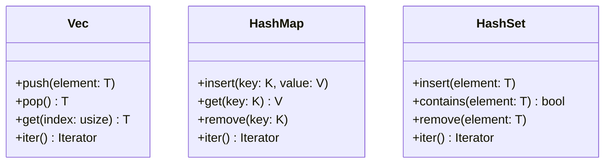

## 4.1.2. Collections: Vectors, HashMaps, and More

In Rust, collections are a fundamental part of the language's standard library, providing powerful tools for managing groups of data. This section will delve into some of the most commonly used collections: `Vec`, `HashMap`, and `HashSet`. We will explore their features, how to use them effectively, and the considerations around ownership and borrowing when working with these collections.

### Introduction to Rust Collections

Rust's collections are designed to be efficient and safe, leveraging the language's ownership model to prevent common programming errors such as null pointer dereferences and data races. Let's start by exploring the `Vec` type, which is the most commonly used collection in Rust.

### The `Vec` Type: Dynamic Arrays

The `Vec` type in Rust is a growable array, allowing you to store a variable number of elements of the same type. It is analogous to arrays in other languages but with the added flexibility of dynamic resizing.

#### Creating and Using Vectors

To create a vector, you can use the `vec!` macro, which initializes a vector with the given elements:

```rust
fn main() {
    let mut numbers = vec![1, 2, 3, 4, 5];
    println!("{:?}", numbers);
}
```

This code snippet creates a vector of integers and prints it. The `vec!` macro is a convenient way to create vectors with initial values.

#### Common Vector Operations

Vectors support a variety of operations, including adding, removing, and accessing elements. Here are some common operations:

- **Adding Elements**: Use the `push` method to add elements to the end of a vector.

    ```rust
    numbers.push(6);
    ```

- **Removing Elements**: Use the `pop` method to remove the last element.

    ```rust
    numbers.pop();
    ```

- **Accessing Elements**: Use indexing to access elements, but be cautious of out-of-bounds access.

    ```rust
    let first = numbers[0];
    ```

- **Iterating Over Elements**: Use a `for` loop to iterate over elements.

    ```rust
    for number in &numbers {
        println!("{}", number);
    }
    ```

#### Ownership and Borrowing with Vectors

When working with vectors, it's crucial to understand Rust's ownership and borrowing rules. For instance, when you borrow a vector immutably, you cannot modify it:

```rust
fn print_vector(v: &Vec<i32>) {
    for i in v {
        println!("{}", i);
    }
}

fn main() {
    let numbers = vec![1, 2, 3];
    print_vector(&numbers);
    // numbers.push(4); // This would cause a compile-time error
}
```

In this example, `print_vector` borrows the vector immutably, preventing any modifications to `numbers` while it is borrowed.

#### Performance Considerations

Vectors are generally efficient for most use cases, but there are some performance considerations:

- **Resizing**: Vectors automatically resize when they exceed their capacity, which can be costly. Pre-allocating space with `Vec::with_capacity` can mitigate this.

    ```rust
    let mut numbers = Vec::with_capacity(10);
    ```

- **Indexing**: Accessing elements by index is fast, but be aware of potential out-of-bounds errors.

### HashMaps: Key-Value Storage

`HashMap` is a collection that stores key-value pairs, allowing for efficient data retrieval based on keys. It is similar to dictionaries in other languages.

#### Creating and Using HashMaps

To create a `HashMap`, you can use the `HashMap::new` method:

```rust
use std::collections::HashMap;

fn main() {
    let mut scores = HashMap::new();
    scores.insert("Alice", 10);
    scores.insert("Bob", 20);
    println!("{:?}", scores);
}
```

This snippet creates a `HashMap` and inserts key-value pairs representing scores.

#### Common HashMap Operations

- **Inserting Elements**: Use the `insert` method to add key-value pairs.

    ```rust
    scores.insert("Charlie", 30);
    ```

- **Accessing Values**: Use the `get` method to retrieve values by key.

    ```rust
    if let Some(score) = scores.get("Alice") {
        println!("Alice's score: {}", score);
    }
    ```

- **Removing Elements**: Use the `remove` method to delete a key-value pair.

    ```rust
    scores.remove("Bob");
    ```

- **Iterating Over Entries**: Use a `for` loop to iterate over key-value pairs.

    ```rust
    for (key, value) in &scores {
        println!("{}: {}", key, value);
    }
    ```

#### Ownership and Borrowing with HashMaps

When working with `HashMap`, consider the ownership of keys and values. Keys must implement the `Eq` and `Hash` traits, while values can be any type.

```rust
fn print_scores(scores: &HashMap<&str, i32>) {
    for (name, score) in scores {
        println!("{}: {}", name, score);
    }
}

fn main() {
    let mut scores = HashMap::new();
    scores.insert("Alice", 10);
    print_scores(&scores);
    // scores.insert("Bob", 20); // This would cause a compile-time error
}
```

In this example, `print_scores` borrows the `HashMap` immutably, preventing modifications during the borrow.

#### Performance Considerations

- **Hashing**: The performance of `HashMap` depends on the quality of the hash function. Rust uses a secure hash function by default, but you can customize it if needed.
- **Collisions**: Handle hash collisions gracefully to maintain performance.

### HashSets: Ensuring Uniqueness

`HashSet` is a collection that stores unique elements, similar to sets in mathematics. It is useful when you need to ensure that no duplicates exist.

#### Creating and Using HashSets

To create a `HashSet`, use the `HashSet::new` method:

```rust
use std::collections::HashSet;

fn main() {
    let mut unique_numbers = HashSet::new();
    unique_numbers.insert(1);
    unique_numbers.insert(2);
    unique_numbers.insert(2); // Duplicate, will not be added
    println!("{:?}", unique_numbers);
}
```

This code creates a `HashSet` and inserts numbers, demonstrating that duplicates are not added.

#### Common HashSet Operations

- **Inserting Elements**: Use the `insert` method to add elements.

    ```rust
    unique_numbers.insert(3);
    ```

- **Checking for Existence**: Use the `contains` method to check if an element exists.

    ```rust
    if unique_numbers.contains(&2) {
        println!("2 is in the set");
    }
    ```

- **Removing Elements**: Use the `remove` method to delete an element.

    ```rust
    unique_numbers.remove(&1);
    ```

- **Iterating Over Elements**: Use a `for` loop to iterate over elements.

    ```rust
    for number in &unique_numbers {
        println!("{}", number);
    }
    ```

#### Ownership and Borrowing with HashSets

Like `HashMap`, `HashSet` requires elements to implement the `Eq` and `Hash` traits. Consider ownership when inserting and removing elements.

```rust
fn print_set(set: &HashSet<i32>) {
    for number in set {
        println!("{}", number);
    }
}

fn main() {
    let mut numbers = HashSet::new();
    numbers.insert(1);
    print_set(&numbers);
    // numbers.insert(2); // This would cause a compile-time error
}
```

In this example, `print_set` borrows the `HashSet` immutably, preventing modifications during the borrow.

#### Performance Considerations

- **Hashing**: Similar to `HashMap`, the performance of `HashSet` depends on the hash function.
- **Memory Usage**: `HashSet` can be memory-intensive for large datasets.

### Choosing the Right Collection

When deciding which collection to use, consider the following factors:

- **Data Structure**: Choose `Vec` for ordered data, `HashMap` for key-value pairs, and `HashSet` for unique elements.
- **Performance**: Consider the time complexity of operations. `Vec` is efficient for indexed access, while `HashMap` and `HashSet` offer average O(1) time complexity for insertions and lookups.
- **Memory Usage**: Be mindful of the memory overhead associated with each collection type.

### Try It Yourself

Experiment with the code examples provided. Try modifying them to add new elements, remove existing ones, or iterate in different ways. This hands-on approach will deepen your understanding of Rust's collections.

### Visualizing Rust Collections

To better understand how these collections work, let's visualize their relationships and operations using Mermaid.js diagrams.



This diagram illustrates the methods available for `Vec`, `HashMap`, and `HashSet`, highlighting their similarities and differences.

### Key Takeaways

- **Vectors** are dynamic arrays that allow for flexible data storage and manipulation.
- **HashMaps** provide efficient key-value storage, ideal for scenarios requiring fast lookups.
- **HashSets** ensure uniqueness, making them suitable for collections where duplicates are not allowed.
- **Ownership and Borrowing** are crucial considerations when working with collections in Rust.
- **Performance** varies across collections, so choose the right one based on your needs.

### References and Further Reading

- [Rust Documentation on Collections](https://doc.rust-lang.org/std/collections/index.html)
- [Rust Book: Collections](https://doc.rust-lang.org/book/ch08-00-common-collections.html)

## Quiz Time!



### What is the primary use of the `Vec` type in Rust?

- [x] Dynamic arrays
- [ ] Key-value storage
- [ ] Ensuring uniqueness
- [ ] Fixed-size arrays

> **Explanation:** `Vec` is used for dynamic arrays, allowing elements to be added or removed.

### Which method is used to add an element to a `Vec`?

- [x] push
- [ ] insert
- [ ] add
- [ ] append

> **Explanation:** The `push` method adds an element to the end of a `Vec`.

### How do you check if a `HashSet` contains a specific element?

- [x] contains
- [ ] get
- [ ] find
- [ ] search

> **Explanation:** The `contains` method checks if a `HashSet` contains a specific element.

### What traits must keys in a `HashMap` implement?

- [x] Eq and Hash
- [ ] Ord and PartialOrd
- [ ] Clone and Copy
- [ ] Debug and Display

> **Explanation:** Keys in a `HashMap` must implement the `Eq` and `Hash` traits.

### Which collection type is best for ensuring unique elements?

- [ ] Vec
- [ ] HashMap
- [x] HashSet
- [ ] LinkedList

> **Explanation:** `HashSet` is designed to store unique elements.

### What is the time complexity of inserting an element into a `HashMap`?

- [x] O(1) on average
- [ ] O(n)
- [ ] O(log n)
- [ ] O(n^2)

> **Explanation:** Inserting into a `HashMap` has an average time complexity of O(1).

### What happens if you try to access an out-of-bounds index in a `Vec`?

- [x] Panic at runtime
- [ ] Return None
- [ ] Return a default value
- [ ] Compile-time error

> **Explanation:** Accessing an out-of-bounds index in a `Vec` causes a panic at runtime.

### Which method removes the last element from a `Vec`?

- [x] pop
- [ ] remove
- [ ] delete
- [ ] discard

> **Explanation:** The `pop` method removes the last element from a `Vec`.

### How can you pre-allocate space for a `Vec`?

- [x] Vec::with_capacity
- [ ] Vec::reserve
- [ ] Vec::allocate
- [ ] Vec::initialize

> **Explanation:** `Vec::with_capacity` pre-allocates space for a `Vec`.

### True or False: `HashSet` can store duplicate elements.

- [ ] True
- [x] False

> **Explanation:** `HashSet` is designed to store only unique elements.



Remember, this is just the beginning. As you progress, you'll build more complex and interactive applications using Rust's powerful collections. Keep experimenting, stay curious, and enjoy the journey!
