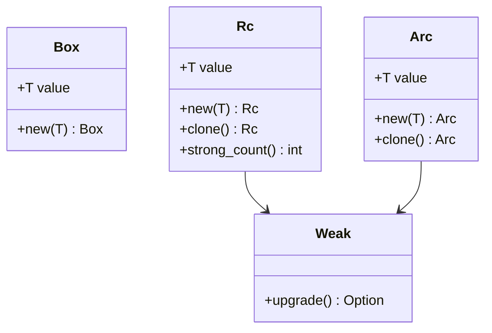

## 4.1.3. Smart Pointers: `Box`, `Rc`, `Arc`, and `Weak`

In Rust, smart pointers are a powerful feature that allows developers to manage memory efficiently and safely. They provide capabilities beyond those of regular references, such as heap allocation, reference counting, and shared ownership. In this section, we will explore the different types of smart pointers available in Rust: `Box`, `Rc`, `Arc`, and `Weak`. We will delve into their uses, benefits, and how they can be applied in various scenarios.

### What Are Smart Pointers?

Smart pointers in Rust are data structures that not only act like pointers but also have additional metadata and capabilities. They are used to manage resources, such as memory, more effectively. Unlike traditional pointers, smart pointers in Rust come with built-in safety and concurrency features, making them an essential tool for Rust developers.

### Why Are Smart Pointers Necessary in Rust?

Rust's ownership model is one of its defining features, ensuring memory safety without a garbage collector. However, this model can sometimes be restrictive, especially when dealing with complex data structures like trees or graphs, or when multiple ownership is required. Smart pointers provide the flexibility needed to handle these scenarios while maintaining Rust's safety guarantees.

### `Box<T>`: Heap Allocation and Recursive Types

The `Box<T>` smart pointer is the simplest form of smart pointer in Rust. It provides heap allocation for data, which is essential for certain data structures and scenarios.

#### Key Features of `Box<T>`

- **Heap Allocation**: `Box<T>` allocates memory on the heap, allowing for dynamic memory management.
- **Ownership**: A `Box<T>` has ownership of the data it points to, and the data is deallocated when the `Box` goes out of scope.
- **Recursive Types**: `Box<T>` is often used to define recursive data structures, such as linked lists or trees, where the size of the data structure cannot be determined at compile time.

#### Example: Using `Box<T>`

```rust
// Define a recursive data structure using Box
enum List {
    Cons(i32, Box<List>),
    Nil,
}

fn main() {
    // Create a linked list: 1 -> 2 -> 3 -> Nil
    let list = List::Cons(1, Box::new(List::Cons(2, Box::new(List::Cons(3, Box::new(List::Nil))))));
}
```

In this example, `Box` is used to allocate the `List` nodes on the heap, allowing the recursive structure to be defined.

### `Rc<T>`: Single-Threaded Reference Counting

`Rc<T>` stands for Reference Counted, and it is used when multiple parts of a program need to own a value. It is suitable for single-threaded scenarios.

#### Key Features of `Rc<T>`

- **Shared Ownership**: Multiple `Rc` pointers can point to the same data, and the data is only deallocated when the last `Rc` is dropped.
- **Immutable Access**: `Rc` provides shared ownership with immutable access to the data.

#### Example: Using `Rc<T>`

```rust
use std::rc::Rc;

fn main() {
    let a = Rc::new(5);
    let b = Rc::clone(&a);
    let c = Rc::clone(&a);

    println!("a: {}, b: {}, c: {}", a, b, c);
    println!("Reference count: {}", Rc::strong_count(&a));
}
```

In this example, `Rc` allows multiple variables (`a`, `b`, and `c`) to own the same value, with the reference count indicating how many owners exist.

### `Arc<T>`: Multi-Threaded Reference Counting

`Arc<T>`, or Atomic Reference Counted, is similar to `Rc<T>`, but it is safe to use in multi-threaded contexts.

#### Key Features of `Arc<T>`

- **Thread Safety**: `Arc` is designed for concurrent use, with atomic operations ensuring safe reference counting across threads.
- **Shared Ownership**: Like `Rc`, `Arc` allows multiple owners of the same data.

#### Example: Using `Arc<T>`

```rust
use std::sync::Arc;
use std::thread;

fn main() {
    let a = Arc::new(5);

    let handles: Vec<_> = (0..10).map(|_| {
        let a = Arc::clone(&a);
        thread::spawn(move || {
            println!("Value: {}", a);
        })
    }).collect();

    for handle in handles {
        handle.join().unwrap();
    }
}
```

In this example, `Arc` is used to share ownership of a value across multiple threads safely.

### `Weak<T>`: Preventing Reference Cycles

`Weak<T>` is a companion to `Rc` and `Arc` that allows for non-owning references, which can help prevent reference cycles and memory leaks.

#### Key Features of `Weak<T>`

- **Non-Owning Reference**: `Weak` does not contribute to the reference count, allowing for references that do not prevent the data from being deallocated.
- **Cycle Prevention**: By using `Weak`, you can break cycles in data structures that use `Rc` or `Arc`.

#### Example: Using `Weak<T>`

```rust
use std::rc::{Rc, Weak};
use std::cell::RefCell;

struct Node {
    value: i32,
    parent: RefCell<Weak<Node>>,
    children: RefCell<Vec<Rc<Node>>>,
}

fn main() {
    let leaf = Rc::new(Node {
        value: 3,
        parent: RefCell::new(Weak::new()),
        children: RefCell::new(vec![]),
    });

    let branch = Rc::new(Node {
        value: 5,
        parent: RefCell::new(Weak::new()),
        children: RefCell::new(vec![Rc::clone(&leaf)]),
    });

    *leaf.parent.borrow_mut() = Rc::downgrade(&branch);

    println!("Leaf parent: {:?}", leaf.parent.borrow().upgrade());
}
```

In this example, `Weak` is used to create a parent reference that does not prevent the parent node from being deallocated, thus preventing a reference cycle.

### Visualizing Smart Pointers

To better understand the relationships between these smart pointers, let's visualize them using a class diagram.



This diagram illustrates how `Box`, `Rc`, `Arc`, and `Weak` relate to each other, highlighting their key methods and relationships.

### Best Practices for Using Smart Pointers

- **Use `Box` for Simple Heap Allocation**: When you need to allocate memory on the heap and have a single owner, `Box` is the simplest and most efficient choice.
- **Use `Rc` for Shared Ownership in Single-Threaded Contexts**: When multiple parts of your program need to share ownership of data, and you are working in a single-threaded environment, `Rc` is appropriate.
- **Use `Arc` for Shared Ownership in Multi-Threaded Contexts**: In multi-threaded scenarios, `Arc` provides the same shared ownership as `Rc`, but with thread safety.
- **Use `Weak` to Prevent Reference Cycles**: When building data structures with potential cycles, use `Weak` to break cycles and prevent memory leaks.

### Try It Yourself

Experiment with the provided examples by modifying the data structures or adding additional functionality. For instance, try creating a more complex recursive structure using `Box`, or implement a multi-threaded application using `Arc` and `Weak`.

### Knowledge Check

- What is the primary use case for `Box<T>` in Rust?
- How does `Rc<T>` differ from `Arc<T>`?
- Why would you use `Weak<T>` in a data structure?
- What are the benefits of using smart pointers in Rust?

### Summary

Smart pointers in Rust provide powerful tools for managing memory and ownership. By understanding and using `Box`, `Rc`, `Arc`, and `Weak`, you can build complex and efficient data structures while maintaining Rust's safety guarantees. Remember, this is just the beginning. As you progress, you'll build more complex and interactive applications. Keep experimenting, stay curious, and enjoy the journey!

## Quiz Time!



### What is the primary purpose of `Box<T>` in Rust?

- [x] To allocate data on the heap
- [ ] To manage reference counting
- [ ] To provide thread-safe access
- [ ] To prevent reference cycles

> **Explanation:** `Box<T>` is primarily used for heap allocation and managing ownership of data.

### How does `Rc<T>` differ from `Arc<T>`?

- [x] `Rc<T>` is for single-threaded scenarios, while `Arc<T>` is for multi-threaded scenarios.
- [ ] `Rc<T>` provides mutable access, while `Arc<T>` provides immutable access.
- [ ] `Rc<T>` is used for heap allocation, while `Arc<T>` is used for stack allocation.
- [ ] `Rc<T>` is faster than `Arc<T>` in all cases.

> **Explanation:** `Rc<T>` is designed for single-threaded environments, whereas `Arc<T>` is thread-safe and suitable for multi-threaded contexts.

### Why would you use `Weak<T>` in a data structure?

- [x] To prevent reference cycles and memory leaks
- [ ] To provide mutable access to data
- [ ] To increase the reference count
- [ ] To allocate data on the stack

> **Explanation:** `Weak<T>` is used to create non-owning references that do not contribute to the reference count, helping to prevent cycles.

### What is the benefit of using `Arc<T>` over `Rc<T>`?

- [x] `Arc<T>` is thread-safe and can be used in multi-threaded contexts.
- [ ] `Arc<T>` is faster than `Rc<T>` in single-threaded contexts.
- [ ] `Arc<T>` provides mutable access to data.
- [ ] `Arc<T>` automatically prevents reference cycles.

> **Explanation:** `Arc<T>` is thread-safe, making it suitable for concurrent programming, unlike `Rc<T>`.

### Which smart pointer would you use for a recursive data structure?

- [x] `Box<T>`
- [ ] `Rc<T>`
- [ ] `Arc<T>`
- [ ] `Weak<T>`

> **Explanation:** `Box<T>` is commonly used for recursive data structures due to its heap allocation capabilities.

### What does `Rc::strong_count(&a)` return?

- [x] The number of `Rc` pointers pointing to the same data
- [ ] The number of `Weak` pointers pointing to the same data
- [ ] The total memory usage of the data
- [ ] The size of the data in bytes

> **Explanation:** `Rc::strong_count(&a)` returns the number of `Rc` pointers that own the data.

### Can `Weak<T>` be used to access the data it points to?

- [x] Yes, but only if it is upgraded to an `Rc<T>`
- [ ] No, `Weak<T>` cannot access data
- [ ] Yes, `Weak<T>` provides direct access
- [ ] No, `Weak<T>` is only for counting references

> **Explanation:** `Weak<T>` can be upgraded to an `Rc<T>` to access the data, if the data is still available.

### What happens when the last `Rc<T>` is dropped?

- [x] The data is deallocated
- [ ] The data is moved to the stack
- [ ] The data is converted to a `Weak<T>`
- [ ] The data remains allocated

> **Explanation:** When the last `Rc<T>` is dropped, the data is deallocated as there are no more owners.

### Is `Arc<T>` suitable for single-threaded applications?

- [x] True
- [ ] False

> **Explanation:** While `Arc<T>` can be used in single-threaded applications, it is designed for multi-threaded scenarios and may have unnecessary overhead compared to `Rc<T>`.

### Can `Box<T>` be used to share ownership?

- [ ] True
- [x] False

> **Explanation:** `Box<T>` provides single ownership and cannot be used to share ownership like `Rc<T>` or `Arc<T>`.




