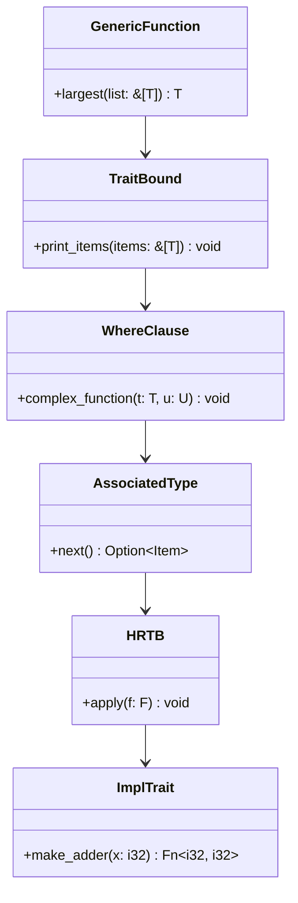

## 4.10. The Type System and Generics

Rust's type system is one of its most powerful features, providing safety and performance without sacrificing flexibility. In this section, we delve into advanced uses of generics, lifetimes, and type constraints to write flexible and reusable code. We'll explore trait bounds, where clauses, associated types, higher-ranked trait bounds (HRTBs), and `impl Trait`, all of which contribute to Rust's zero-cost abstractions.

### Understanding Rust's Type System

Rust's type system is designed to ensure memory safety and prevent data races. It achieves this through strict compile-time checks, which can initially seem restrictive but ultimately lead to more robust and error-free code. Let's explore some key components of Rust's type system:

- **Static Typing**: Rust is statically typed, meaning that type checking is performed at compile time. This helps catch errors early in the development process.
- **Type Inference**: Rust can infer types in many situations, reducing the need for explicit type annotations while maintaining type safety.
- **Ownership and Borrowing**: These concepts are central to Rust's memory safety guarantees, ensuring that data is accessed safely and efficiently.

### Generics in Rust

Generics allow you to write flexible and reusable code by enabling functions, structs, enums, and traits to operate on different data types without sacrificing type safety. Let's explore how generics work in Rust:

#### Basic Generics

Generics in Rust are defined using angle brackets (`<>`). Here's a simple example of a generic function:

```rust
fn largest<T: PartialOrd>(list: &[T]) -> &T {
    let mut largest = &list[0];
    for item in list {
        if item > largest {
            largest = item;
        }
    }
    largest
}
```

In this example, `T` is a generic type parameter constrained by the `PartialOrd` trait, allowing the function to work with any type that can be compared.

#### Trait Bounds

Trait bounds specify that a generic type must implement certain traits. This is crucial for ensuring that the operations you perform on generic types are valid. Here's how you can use trait bounds:

```rust
fn print_items<T: std::fmt::Display>(items: &[T]) {
    for item in items {
        println!("{}", item);
    }
}
```

In this example, `T` must implement the `Display` trait, ensuring that each item can be printed.

#### Where Clauses

Where clauses provide a more readable way to specify complex trait bounds. They are especially useful when dealing with multiple generic parameters:

```rust
fn complex_function<T, U>(t: T, u: U)
where
    T: std::fmt::Display + Clone,
    U: std::fmt::Debug,
{
    println!("T: {}, U: {:?}", t, u);
}
```

#### Associated Types

Associated types are a way to define a placeholder type within a trait. They simplify the syntax and improve readability when working with complex trait bounds:

```rust
trait Iterator {
    type Item;
    fn next(&mut self) -> Option<Self::Item>;
}
```

In this example, `Item` is an associated type that represents the type of elements returned by the iterator.

#### Higher-Ranked Trait Bounds (HRTBs)

HRTBs allow you to express constraints on functions that take generic parameters. They are often used in conjunction with closures and function pointers:

```rust
fn apply<F>(f: F)
where
    F: for<'a> Fn(&'a str) -> &'a str,
{
    let result = f("Hello");
    println!("{}", result);
}
```

#### `impl Trait`

The `impl Trait` syntax provides a convenient way to specify that a function returns a type that implements a particular trait. This is useful for simplifying function signatures:

```rust
fn make_adder(x: i32) -> impl Fn(i32) -> i32 {
    move |y| x + y
}
```

In this example, `make_adder` returns a closure that implements the `Fn` trait.

### Zero-Cost Abstractions

Rust's generics and type system enable zero-cost abstractions, meaning that the abstractions you use in your code do not incur runtime overhead. This is achieved through monomorphization, where the compiler generates specialized versions of generic functions and types for each concrete type used.

### Code Examples

Let's explore some code examples that demonstrate these concepts in action:

#### Example 1: Generic Structs

```rust
struct Point<T> {
    x: T,
    y: T,
}

impl<T> Point<T> {
    fn new(x: T, y: T) -> Self {
        Point { x, y }
    }
}

fn main() {
    let integer_point = Point::new(5, 10);
    let float_point = Point::new(1.0, 4.0);
}
```

#### Example 2: Using Associated Types

```rust
trait Container {
    type Item;
    fn contains(&self, item: &Self::Item) -> bool;
}

struct MyContainer(Vec<i32>);

impl Container for MyContainer {
    type Item = i32;
    fn contains(&self, item: &i32) -> bool {
        self.0.contains(item)
    }
}

fn main() {
    let container = MyContainer(vec![1, 2, 3]);
    println!("{}", container.contains(&2)); // true
}
```

#### Example 3: HRTBs with Closures

```rust
fn call_with_one<F>(f: F) -> i32
where
    F: for<'a> Fn(&'a i32) -> i32,
{
    f(&1)
}

fn main() {
    let double = |x: &i32| x * 2;
    println!("{}", call_with_one(double)); // 2
}
```

### Visualizing Rust's Type System

To better understand Rust's type system, let's visualize how generics, trait bounds, and associated types interact:



This diagram illustrates the relationships between different components of Rust's type system, highlighting how they build upon each other to create flexible and reusable code.

### Try It Yourself

To deepen your understanding, try modifying the code examples above. Experiment with different types, trait bounds, and associated types. See how changes affect the behavior and performance of your code.

### References and Further Reading

- [Rust Book - Generics](https://doc.rust-lang.org/book/ch10-00-generics.html)
- [Rust Reference - Type System](https://doc.rust-lang.org/reference/types.html)
- [Rust by Example - Generics](https://doc.rust-lang.org/rust-by-example/generics.html)

### Knowledge Check

- What are the benefits of using generics in Rust?
- How do trait bounds enhance the flexibility of generic functions?
- What is the purpose of associated types in traits?
- How do higher-ranked trait bounds differ from regular trait bounds?
- What is the `impl Trait` syntax used for?

### Embrace the Journey

Remember, mastering Rust's type system and generics is a journey. As you progress, you'll discover new ways to leverage these powerful features to write more efficient and expressive code. Keep experimenting, stay curious, and enjoy the journey!

## Quiz Time!



### What is the primary benefit of using generics in Rust?

- [x] To write flexible and reusable code
- [ ] To increase runtime performance
- [ ] To simplify syntax
- [ ] To avoid using traits

> **Explanation:** Generics allow you to write flexible and reusable code by enabling functions and types to operate on different data types without sacrificing type safety.

### How do trait bounds enhance the flexibility of generic functions?

- [x] By specifying that a generic type must implement certain traits
- [ ] By reducing the need for explicit type annotations
- [ ] By allowing runtime type checking
- [ ] By enabling dynamic dispatch

> **Explanation:** Trait bounds specify that a generic type must implement certain traits, ensuring that the operations you perform on generic types are valid.

### What is the purpose of associated types in traits?

- [x] To define a placeholder type within a trait
- [ ] To simplify function signatures
- [ ] To enable dynamic dispatch
- [ ] To enforce type safety at runtime

> **Explanation:** Associated types are a way to define a placeholder type within a trait, simplifying the syntax and improving readability when working with complex trait bounds.

### How do higher-ranked trait bounds (HRTBs) differ from regular trait bounds?

- [x] HRTBs express constraints on functions that take generic parameters
- [ ] HRTBs are used for specifying associated types
- [ ] HRTBs enable dynamic dispatch
- [ ] HRTBs are only used with closures

> **Explanation:** HRTBs allow you to express constraints on functions that take generic parameters, often used in conjunction with closures and function pointers.

### What is the `impl Trait` syntax used for?

- [x] To specify that a function returns a type that implements a particular trait
- [ ] To define a placeholder type within a trait
- [ ] To enable dynamic dispatch
- [ ] To simplify function signatures

> **Explanation:** The `impl Trait` syntax provides a convenient way to specify that a function returns a type that implements a particular trait, simplifying function signatures.

### What is monomorphization in Rust?

- [x] The process of generating specialized versions of generic functions and types for each concrete type used
- [ ] The process of inferring types at compile time
- [ ] The process of converting dynamic dispatch to static dispatch
- [ ] The process of optimizing runtime performance

> **Explanation:** Monomorphization is the process of generating specialized versions of generic functions and types for each concrete type used, contributing to zero-cost abstractions.

### How do zero-cost abstractions benefit Rust programs?

- [x] They provide abstractions without incurring runtime overhead
- [ ] They simplify syntax
- [ ] They enable dynamic dispatch
- [ ] They enforce type safety at runtime

> **Explanation:** Zero-cost abstractions provide abstractions without incurring runtime overhead, achieved through compile-time optimizations like monomorphization.

### What is the role of the `PartialOrd` trait in the `largest` function example?

- [x] It allows the function to work with any type that can be compared
- [ ] It simplifies the function signature
- [ ] It enables dynamic dispatch
- [ ] It enforces type safety at runtime

> **Explanation:** The `PartialOrd` trait allows the `largest` function to work with any type that can be compared, ensuring that the comparison operation is valid.

### Why are where clauses useful in Rust?

- [x] They provide a more readable way to specify complex trait bounds
- [ ] They enable dynamic dispatch
- [ ] They simplify function signatures
- [ ] They enforce type safety at runtime

> **Explanation:** Where clauses provide a more readable way to specify complex trait bounds, especially when dealing with multiple generic parameters.

### True or False: Rust's type system is designed to ensure memory safety and prevent data races.

- [x] True
- [ ] False

> **Explanation:** Rust's type system is designed to ensure memory safety and prevent data races through strict compile-time checks, ownership, and borrowing rules.


