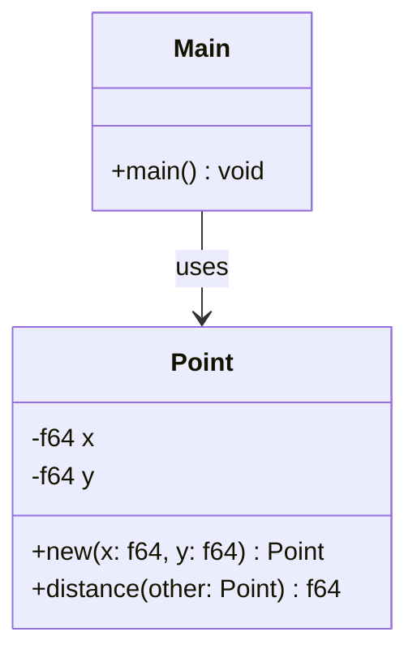

## 4.11. Coding Style and Conventions

In the world of software development, coding style and conventions play a crucial role in ensuring that code is not only functional but also readable, maintainable, and consistent. Rust, with its focus on safety and performance, is no exception. Adhering to a consistent coding style helps developers understand each other's code more easily and reduces the likelihood of errors. In this section, we will explore the common coding conventions in Rust, discuss the importance of code formatting and linting, introduce community resources like the Rust Style Guide, and provide examples of code following best practices. We will also encourage the use of tools like `rustfmt` and `Clippy` for maintaining code quality.

### Importance of Coding Style and Conventions

Coding style and conventions are essential for several reasons:

1. **Readability**: Consistent style makes code easier to read and understand, which is crucial for collaboration and code reviews.
2. **Maintainability**: Well-structured code is easier to maintain and modify, reducing the risk of introducing bugs.
3. **Consistency**: A uniform style across a codebase helps developers quickly familiarize themselves with new code.
4. **Community Standards**: Adhering to community standards ensures that your code aligns with the expectations of other Rust developers.

### Common Coding Conventions in Rust

#### Naming Conventions

- **Variables and Functions**: Use snake_case for variable and function names. This is a common convention in Rust and helps distinguish them from types and constants.
  ```rust
  let user_name = "Alice";
  fn calculate_area(radius: f64) -> f64 {
      std::f64::consts::PI * radius * radius
  }
  ```

- **Types and Traits**: Use CamelCase for types and trait names. This helps differentiate them from variables and functions.
  ```rust
  struct UserProfile {
      name: String,
      age: u32,
  }

  trait Drawable {
      fn draw(&self);
  }
  ```

- **Constants**: Use SCREAMING_SNAKE_CASE for constants. This convention highlights their immutability and global scope.
  ```rust
  const MAX_USERS: u32 = 100;
  ```

#### Indentation and Spacing

- **Indentation**: Use four spaces per indentation level. This is the standard in Rust and helps maintain consistency across different editors and IDEs.
- **Line Length**: Aim for a maximum line length of 100 characters. This ensures that code is easily readable on most screens without horizontal scrolling.
- **Spacing**: Use spaces around operators and after commas to improve readability.
  ```rust
  let sum = a + b;
  let coordinates = (x, y);
  ```

#### Commenting

- **Inline Comments**: Use inline comments sparingly to explain complex logic or assumptions. Ensure comments are concise and relevant.
  ```rust
  let result = calculate_area(5.0); // Calculate the area of a circle with radius 5.0
  ```

- **Documentation Comments**: Use triple slashes (`///`) for documentation comments. These comments are used by `rustdoc` to generate API documentation.
  ```rust
  /// Calculates the area of a circle given its radius.
  ///
  /// # Arguments
  ///
  /// * `radius` - The radius of the circle.
  ///
  /// # Returns
  ///
  /// The area of the circle.
  fn calculate_area(radius: f64) -> f64 {
      std::f64::consts::PI * radius * radius
  }
  ```

### Code Formatting and Linting

#### The Role of `rustfmt`

`rustfmt` is a tool for automatically formatting Rust code according to the official style guidelines. It helps ensure consistency across a codebase and saves time during code reviews by eliminating discussions about formatting.

- **Installation**: `rustfmt` is included with the Rust toolchain. You can install it using `rustup`:
  ```bash
  rustup component add rustfmt
  ```

- **Usage**: To format a Rust file, simply run:
  ```bash
  rustfmt main.rs
  ```

- **Configuration**: You can customize `rustfmt` behavior by creating a `rustfmt.toml` file in your project directory. For example, to set the maximum line width to 80 characters, add:
  ```toml
  max_width = 80
  ```

#### Linting with Clippy

Clippy is a collection of lints to catch common mistakes and improve your Rust code. It provides suggestions for idiomatic Rust and helps enforce best practices.

- **Installation**: Clippy is also included with the Rust toolchain. Install it using `rustup`:
  ```bash
  rustup component add clippy
  ```

- **Usage**: To run Clippy on your project, use:
  ```bash
  cargo clippy
  ```

- **Example Lints**: Clippy can catch a variety of issues, such as:
  - **Unnecessary Clones**: Clippy will suggest removing unnecessary calls to `clone()`.
  - **Complex Expressions**: Clippy can identify overly complex expressions and suggest simplifications.
  - **Inefficient Loops**: Clippy can recommend more efficient loop constructs.

### Community Resources

The Rust community provides several resources to help developers adhere to coding conventions:

- **Rust Style Guide**: The [Rust Style Guide](https://doc.rust-lang.org/1.0.0/style/style/) provides comprehensive guidelines for writing idiomatic Rust code. It covers topics such as naming conventions, formatting, and documentation.

- **Rust API Guidelines**: The [Rust API Guidelines](https://rust-lang.github.io/api-guidelines/) offer best practices for designing public APIs in Rust. These guidelines help ensure that your APIs are consistent and easy to use.

### Examples of Code Following Best Practices

Let's look at an example of a simple Rust program that adheres to the coding conventions discussed:

```rust
/// Represents a point in 2D space.
struct Point {
    x: f64,
    y: f64,
}

impl Point {
    /// Creates a new `Point`.
    ///
    /// # Arguments
    ///
    /// * `x` - The x-coordinate of the point.
    /// * `y` - The y-coordinate of the point.
    fn new(x: f64, y: f64) -> Self {
        Point { x, y }
    }

    /// Calculates the distance from this point to another point.
    ///
    /// # Arguments
    ///
    /// * `other` - The other point.
    ///
    /// # Returns
    ///
    /// The distance between the two points.
    fn distance(&self, other: &Point) -> f64 {
        let dx = self.x - other.x;
        let dy = self.y - other.y;
        (dx * dx + dy * dy).sqrt()
    }
}

fn main() {
    let p1 = Point::new(0.0, 0.0);
    let p2 = Point::new(3.0, 4.0);
    println!("Distance: {}", p1.distance(&p2));
}
```

### Try It Yourself

To get hands-on experience with Rust coding conventions, try modifying the example code above:

- Change the `Point` struct to include a `z` coordinate for 3D space.
- Add a method to calculate the midpoint between two points.
- Use `rustfmt` to format your modified code and ensure it adheres to the style guidelines.

### Visualizing Rust Coding Conventions

To better understand the flow of a well-structured Rust program, let's visualize the relationships between the components using a class diagram:



This diagram illustrates how the `Point` struct is used within the `main` function, highlighting the encapsulation of functionality within the `Point` struct.

### References and Links

For further reading and to deepen your understanding of Rust coding style and conventions, consider the following resources:

- [Rust Style Guide](https://doc.rust-lang.org/1.0.0/style/style/)
- [Rust API Guidelines](https://rust-lang.github.io/api-guidelines/)
- [rustfmt Documentation](https://github.com/rust-lang/rustfmt)
- [Clippy Documentation](https://github.com/rust-lang/rust-clippy)

### Knowledge Check

To reinforce your understanding of Rust coding style and conventions, consider the following questions:

- What are the naming conventions for variables, functions, types, and constants in Rust?
- How does `rustfmt` help maintain code quality?
- What types of issues can Clippy identify in your Rust code?
- Why is it important to adhere to community standards in coding style?

### Embrace the Journey

Remember, adopting a consistent coding style is just the beginning of writing clean and maintainable Rust code. As you continue your journey, you'll discover more advanced techniques and best practices that will further enhance your skills. Keep experimenting, stay curious, and enjoy the process of becoming a proficient Rust developer!

## Quiz Time!



### What is the recommended naming convention for variables and functions in Rust?

- [x] snake_case
- [ ] CamelCase
- [ ] SCREAMING_SNAKE_CASE
- [ ] kebab-case

> **Explanation:** In Rust, variables and functions should be named using snake_case to distinguish them from types and constants.

### Which tool is used to automatically format Rust code according to the official style guidelines?

- [ ] Clippy
- [x] rustfmt
- [ ] cargo
- [ ] rustc

> **Explanation:** `rustfmt` is the tool used to automatically format Rust code according to the official style guidelines.

### What is the purpose of Clippy in Rust development?

- [x] To catch common mistakes and improve code quality
- [ ] To compile Rust code
- [ ] To manage dependencies
- [ ] To run tests

> **Explanation:** Clippy is a collection of lints that helps catch common mistakes and improve the quality of Rust code.

### How should constants be named in Rust?

- [ ] snake_case
- [ ] CamelCase
- [x] SCREAMING_SNAKE_CASE
- [ ] kebab-case

> **Explanation:** Constants in Rust should be named using SCREAMING_SNAKE_CASE to highlight their immutability and global scope.

### What is the maximum recommended line length for Rust code?

- [ ] 80 characters
- [x] 100 characters
- [ ] 120 characters
- [ ] 60 characters

> **Explanation:** The maximum recommended line length for Rust code is 100 characters to ensure readability.

### Which of the following is a benefit of adhering to coding conventions?

- [x] Improved readability
- [x] Easier maintenance
- [x] Consistency across codebases
- [ ] Slower development

> **Explanation:** Adhering to coding conventions improves readability, makes maintenance easier, and ensures consistency across codebases.

### What type of comments are used for generating API documentation in Rust?

- [ ] Inline comments
- [x] Documentation comments
- [ ] Block comments
- [ ] Multiline comments

> **Explanation:** Documentation comments, denoted by triple slashes (`///`), are used for generating API documentation in Rust.

### Which tool can be used to customize the behavior of `rustfmt`?

- [ ] cargo.toml
- [x] rustfmt.toml
- [ ] clippy.toml
- [ ] config.toml

> **Explanation:** The `rustfmt.toml` file can be used to customize the behavior of `rustfmt`.

### What is the purpose of the Rust Style Guide?

- [x] To provide guidelines for writing idiomatic Rust code
- [ ] To manage Rust project dependencies
- [ ] To compile Rust code
- [ ] To run Rust tests

> **Explanation:** The Rust Style Guide provides comprehensive guidelines for writing idiomatic Rust code.

### True or False: Clippy can identify unnecessary clones in Rust code.

- [x] True
- [ ] False

> **Explanation:** Clippy can identify unnecessary clones and suggest removing them to improve code efficiency.


