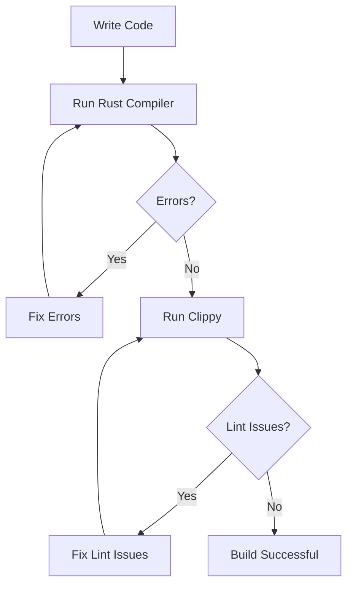

## 4.12. Effective Use of the Rust Compiler and Clippy

In this section, we will delve into the effective use of the Rust compiler and Clippy, an advanced linter, to enhance your Rust programming experience. By understanding compiler messages, integrating Clippy into your workflow, and utilizing compiler flags, you can significantly improve code quality and performance.

### Understanding Compiler Messages

The Rust compiler is known for its informative and detailed error messages. These messages are designed to guide you in resolving issues quickly and effectively. Let's explore how to read and understand these messages.

#### Example of a Compiler Error Message

Consider the following code snippet:

```rust
fn main() {
    let x: i32 = "Hello, world!";
}
```

When you compile this code, you will receive an error message similar to this:

```
error[E0308]: mismatched types
 --> src/main.rs:2:17
  |
2 |     let x: i32 = "Hello, world!";
  |                 ^^^^^^^^^^^^^^^^ expected `i32`, found `&str`
  |
  = note: expected type `i32`
             found reference `&'static str`
```

#### Breaking Down the Error Message

- **Error Code**: `E0308` is the error code, which you can look up for more information.
- **Description**: "mismatched types" indicates the nature of the error.
- **Location**: The error occurred at `src/main.rs:2:17`.
- **Explanation**: The message explains that an `i32` was expected, but a `&str` was found.

By carefully reading these messages, you can quickly identify and fix issues in your code.

### Introducing Clippy

Clippy is a powerful linter for Rust that helps catch common mistakes and improve code quality. It provides a wide range of lints that cover various aspects of Rust programming.

#### Installing Clippy

To install Clippy, use the following command:

```bash
rustup component add clippy
```

#### Running Clippy

Once installed, you can run Clippy on your project with:

```bash
cargo clippy
```

### Integrating Clippy into the Build Process

Integrating Clippy into your build process ensures that code quality checks are performed regularly. You can add Clippy to your CI/CD pipeline to automate this process.

#### Example CI/CD Integration

Here's an example of how you might integrate Clippy into a GitHub Actions workflow:

```yaml
name: Rust CI

on: [push, pull_request]

jobs:
  build:

    runs-on: ubuntu-latest

    steps:
    - uses: actions/checkout@v2
    - name: Install Rust
      uses: actions-rs/toolchain@v1
      with:
        toolchain: stable
    - name: Run Clippy
      run: cargo clippy -- -D warnings
```

### Examples of Clippy Lints

Clippy provides a variety of lints, each designed to catch specific issues. Let's look at some common lints and how to address them.

#### Example Lint: `clippy::needless_return`

Consider the following code:

```rust
fn example() -> i32 {
    return 42;
}
```

Clippy will suggest removing the `return` keyword:

```rust
fn example() -> i32 {
    42
}
```

#### Example Lint: `clippy::single_match`

For a `match` statement with a single arm, Clippy suggests using an `if let`:

```rust
let value = Some(42);

match value {
    Some(x) => println!("Value: {}", x),
    _ => (),
}
```

Clippy's suggestion:

```rust
if let Some(x) = value {
    println!("Value: {}", x);
}
```

### Compiler Flags and Configurations

Rust provides various compiler flags that can be used to optimize and debug your code. Let's explore some of these flags.

#### Optimization Flags

- **`--release`**: Compiles the code with optimizations. Use this flag for production builds.
  
  ```bash
  cargo build --release
  ```

- **`-C opt-level`**: Sets the optimization level. Levels range from 0 (no optimization) to 3 (maximum optimization).

#### Debugging Flags

- **`--debug`**: Compiles the code with debugging information. This is the default for development builds.
  
  ```bash
  cargo build
  ```

- **`-C debuginfo`**: Controls the amount of debugging information. Use `1` for minimal and `2` for full debugging information.

### Encouraging Regular Use of Tools

Regular use of the Rust compiler and Clippy is crucial for maintaining high code standards. By integrating these tools into your workflow, you can catch issues early and ensure that your code is both efficient and maintainable.

### Visualizing the Workflow

To better understand the integration of the Rust compiler and Clippy, let's visualize the workflow using a flowchart.



**Figure 1**: Workflow for using the Rust compiler and Clippy.

### References and Links

For more information on Clippy and the Rust compiler, consider the following resources:

- [Clippy GitHub Repository](https://github.com/rust-lang/rust-clippy)
- [Rust Compiler Documentation](https://doc.rust-lang.org/rustc/index.html)

### Knowledge Check

To reinforce your understanding, consider the following questions:

- What is the purpose of Clippy in Rust development?
- How can you integrate Clippy into a CI/CD pipeline?
- What are some common Clippy lints and how do you address them?
- How do compiler flags affect the build process?

### Embrace the Journey

Remember, mastering the Rust compiler and Clippy is a journey. As you continue to use these tools, you'll become more proficient in writing high-quality, efficient Rust code. Keep experimenting, stay curious, and enjoy the process!

## Quiz Time!



### What is the primary purpose of Clippy in Rust development?

- [x] To catch common mistakes and improve code quality
- [ ] To compile Rust code
- [ ] To manage dependencies
- [ ] To run tests

> **Explanation:** Clippy is a linter that helps catch common mistakes and improve code quality.

### How can you install Clippy?

- [x] `rustup component add clippy`
- [ ] `cargo install clippy`
- [ ] `rustc install clippy`
- [ ] `cargo add clippy`

> **Explanation:** Clippy is installed using the `rustup component add clippy` command.

### Which command runs Clippy on a Rust project?

- [x] `cargo clippy`
- [ ] `rustc clippy`
- [ ] `cargo run clippy`
- [ ] `rustup clippy`

> **Explanation:** The `cargo clippy` command runs Clippy on a Rust project.

### What does the `--release` flag do?

- [x] Compiles the code with optimizations
- [ ] Compiles the code with debugging information
- [ ] Runs tests
- [ ] Installs dependencies

> **Explanation:** The `--release` flag compiles the code with optimizations for production builds.

### Which Clippy lint suggests removing the `return` keyword?

- [x] `clippy::needless_return`
- [ ] `clippy::single_match`
- [ ] `clippy::unnecessary_cast`
- [ ] `clippy::redundant_clone`

> **Explanation:** The `clippy::needless_return` lint suggests removing the `return` keyword when it's not needed.

### What is the default optimization level for development builds in Rust?

- [x] 0
- [ ] 1
- [ ] 2
- [ ] 3

> **Explanation:** The default optimization level for development builds is 0, which means no optimization.

### How can you add Clippy to a GitHub Actions workflow?

- [x] By using the `cargo clippy` command in the workflow
- [ ] By installing Clippy as a separate GitHub Action
- [ ] By adding Clippy to the `Cargo.toml` file
- [ ] By using the `rustc clippy` command in the workflow

> **Explanation:** You can add Clippy to a GitHub Actions workflow by using the `cargo clippy` command.

### What does the `-C debuginfo` flag control?

- [x] The amount of debugging information
- [ ] The optimization level
- [ ] The number of threads used for compilation
- [ ] The version of Rust used

> **Explanation:** The `-C debuginfo` flag controls the amount of debugging information included in the build.

### Which Clippy lint suggests using `if let` instead of a single-arm `match`?

- [x] `clippy::single_match`
- [ ] `clippy::needless_return`
- [ ] `clippy::unnecessary_cast`
- [ ] `clippy::redundant_clone`

> **Explanation:** The `clippy::single_match` lint suggests using `if let` instead of a single-arm `match`.

### True or False: Regular use of the Rust compiler and Clippy is crucial for maintaining high code standards.

- [x] True
- [ ] False

> **Explanation:** Regular use of the Rust compiler and Clippy helps catch issues early and ensures code quality.


