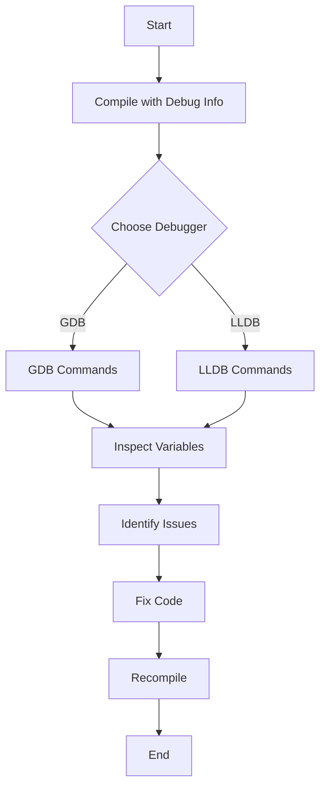

## 4.13. Debugging Techniques

Debugging is an essential skill for any developer, and Rust, with its unique features and paradigms, offers a variety of tools and techniques to aid in this process. In this section, we will explore strategies and tools for debugging Rust applications effectively, including the use of debuggers, logging frameworks, and diagnostic tools. We will also provide tips for writing code that is easier to debug and introduce Rust-specific debugging tools like `rr`.

### Using Debuggers with Rust

Debuggers are powerful tools that allow you to inspect the state of a program at runtime. In Rust, you can use popular debuggers like GDB (GNU Debugger) and LLDB (LLVM Debugger) to step through your code, set breakpoints, and examine variables.

#### GDB with Rust

GDB is a widely used debugger that supports Rust. To use GDB with Rust, you need to compile your program with debugging information. This can be done by adding the `-g` flag to your compilation command or by using the `cargo build` command with the `--debug` flag.

```bash
cargo build --debug
gdb target/debug/your_program
```

Once inside GDB, you can use commands like `break`, `run`, `next`, and `print` to control the execution and inspect the state of your program.

#### LLDB with Rust

LLDB is another powerful debugger that integrates well with Rust, especially if you are using macOS or other LLVM-based systems. Similar to GDB, you need to compile your program with debugging information.

```bash
cargo build --debug
lldb target/debug/your_program
```

In LLDB, you can use commands like `b` (breakpoint), `r` (run), `n` (next), and `p` (print) to debug your Rust application.

### Logging Frameworks

Logging is a crucial aspect of debugging and monitoring applications. Rust provides several logging frameworks that can help you track the flow of your application and diagnose issues.

#### The `log` Crate

The `log` crate is a lightweight logging facade that provides macros for logging at various levels (error, warn, info, debug, trace). It allows you to log messages without worrying about the underlying implementation.

```rust
use log::{info, warn};

fn main() {
    env_logger::init();
    info!("This is an info message.");
    warn!("This is a warning message.");
}
```

#### The `env_logger` Crate

The `env_logger` crate is a simple logger that writes to standard output. It can be configured via environment variables, making it easy to adjust the logging level without changing the code.

```rust
use log::info;

fn main() {
    env_logger::init();
    info!("Application started");
}
```

To set the logging level, you can use the `RUST_LOG` environment variable:

```bash
RUST_LOG=info cargo run
```

### Writing Debuggable Code

Writing code that is easy to debug can save you a lot of time and effort. Here are some tips for writing debuggable Rust code:

- **Use Descriptive Variable Names**: Clear and descriptive variable names make it easier to understand the code and track down issues.
- **Keep Functions Small**: Small, focused functions are easier to test and debug.
- **Use Rust's Type System**: Leverage Rust's strong type system to catch errors at compile time.
- **Avoid Global State**: Global state can lead to hard-to-debug issues. Use Rust's ownership and borrowing system to manage state effectively.
- **Document Your Code**: Well-documented code is easier to understand and debug.

### Rust-Specific Debugging Tools

Rust has some unique tools that can aid in debugging, such as `rr`.

#### `rr` (Record and Replay)

`rr` is a debugging tool that records program execution and allows you to replay it deterministically. This is particularly useful for debugging intermittent bugs that are hard to reproduce.

To use `rr`, you need to install it and then record your program's execution:

```bash
rr record ./your_program
```

After recording, you can replay the execution and use GDB to inspect the program state:

```bash
rr replay
```

### Diagnosing and Fixing Common Runtime Issues

Rust's strict compile-time checks catch many errors before they occur, but runtime issues can still arise. Here are some common runtime issues and how to diagnose them:

- **Panic**: Rust programs can panic due to out-of-bounds access, unwrap on `None`, etc. Use backtraces to identify the source of the panic.
- **Deadlocks**: In concurrent programs, deadlocks can occur. Use Rust's concurrency primitives and tools like `cargo deadlock` to detect and resolve deadlocks.
- **Memory Leaks**: Although Rust manages memory automatically, leaks can still occur with reference cycles. Use tools like `valgrind` to detect memory leaks.

### Try It Yourself

Experiment with the following code example by adding logging and using a debugger to step through the execution:

```rust
fn divide(a: i32, b: i32) -> Option<i32> {
    if b == 0 {
        None
    } else {
        Some(a / b)
    }
}

fn main() {
    let result = divide(10, 0);
    match result {
        Some(value) => println!("Result: {}", value),
        None => println!("Cannot divide by zero"),
    }
}
```

Try adding logging to track the flow of the program and use a debugger to inspect the variables.

### Visualizing Debugging Workflow

To better understand the debugging workflow, let's visualize the process using a flowchart.



This flowchart represents the typical steps involved in debugging a Rust application, from compiling with debug information to using a debugger to inspect variables and fix issues.

### References and Links

- [GDB Documentation](https://www.gnu.org/software/gdb/documentation/)
- [LLDB Documentation](https://lldb.llvm.org/)
- [Rust `log` Crate](https://crates.io/crates/log)
- [Rust `env_logger` Crate](https://crates.io/crates/env_logger)
- [rr Debugger](https://rr-project.org/)

### Knowledge Check

- What are the benefits of using a debugger like GDB or LLDB with Rust?
- How can logging help in diagnosing issues in a Rust application?
- What are some tips for writing debuggable Rust code?
- How does the `rr` tool aid in debugging Rust applications?
- What are common runtime issues in Rust, and how can they be diagnosed?

### Embrace the Journey

Debugging is an integral part of the development process, and mastering it can significantly enhance your productivity and code quality. Remember, this is just the beginning. As you progress, you'll encounter more complex debugging scenarios. Keep experimenting, stay curious, and enjoy the journey!

## Quiz Time!



### What is the primary purpose of using a debugger like GDB or LLDB with Rust?

- [x] To inspect the state of a program at runtime
- [ ] To compile Rust code
- [ ] To manage Rust dependencies
- [ ] To format Rust code

> **Explanation:** Debuggers like GDB and LLDB allow you to inspect the state of a program at runtime, which is crucial for diagnosing and fixing issues.

### Which crate provides a lightweight logging facade in Rust?

- [x] `log`
- [ ] `serde`
- [ ] `tokio`
- [ ] `rand`

> **Explanation:** The `log` crate provides a lightweight logging facade with macros for logging at various levels.

### How can you set the logging level for the `env_logger` crate?

- [x] By using the `RUST_LOG` environment variable
- [ ] By modifying the source code
- [ ] By using a configuration file
- [ ] By recompiling the program

> **Explanation:** The `env_logger` crate can be configured via the `RUST_LOG` environment variable, allowing you to set the logging level without changing the code.

### What is a common cause of panic in Rust programs?

- [x] Out-of-bounds access
- [ ] Successful compilation
- [ ] Correct type usage
- [ ] Proper memory management

> **Explanation:** Panic in Rust programs can occur due to out-of-bounds access, among other reasons.

### Which tool allows you to record and replay program execution in Rust?

- [x] `rr`
- [ ] `cargo`
- [ ] `rustfmt`
- [ ] `clippy`

> **Explanation:** `rr` is a tool that allows you to record program execution and replay it deterministically, aiding in debugging.

### What is a benefit of writing small, focused functions in Rust?

- [x] Easier to test and debug
- [ ] Increases code complexity
- [ ] Requires more memory
- [ ] Slows down compilation

> **Explanation:** Small, focused functions are easier to test and debug, which improves code maintainability.

### How can you diagnose deadlocks in Rust concurrent programs?

- [x] Using tools like `cargo deadlock`
- [ ] By increasing the number of threads
- [ ] By ignoring the issue
- [ ] By recompiling the program

> **Explanation:** Tools like `cargo deadlock` can help detect and resolve deadlocks in Rust concurrent programs.

### What is the role of the `env_logger` crate in Rust?

- [x] It writes logs to standard output
- [ ] It manages dependencies
- [ ] It formats code
- [ ] It compiles Rust programs

> **Explanation:** The `env_logger` crate is a simple logger that writes to standard output and can be configured via environment variables.

### True or False: Rust's type system can help catch errors at compile time.

- [x] True
- [ ] False

> **Explanation:** Rust's strong type system helps catch many errors at compile time, reducing runtime issues.

### What is the purpose of using descriptive variable names in Rust code?

- [x] To make the code easier to understand and debug
- [ ] To increase code length
- [ ] To confuse other developers
- [ ] To slow down execution

> **Explanation:** Descriptive variable names make the code easier to understand and debug, improving overall code quality.


