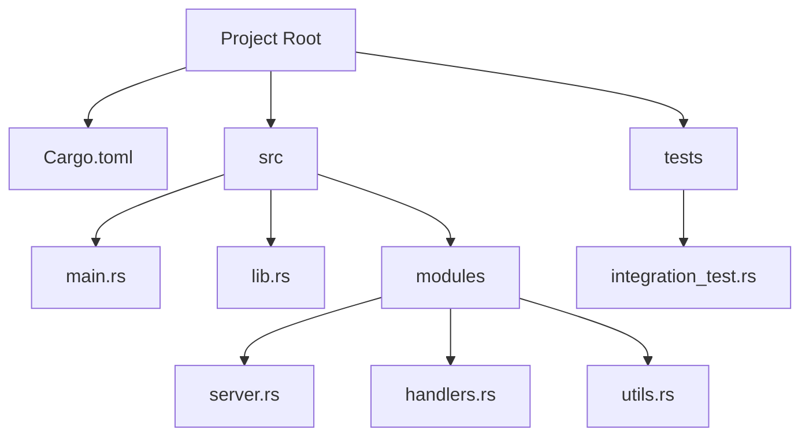

## 4.15. Best Practices in Code Organization

In the world of software development, organizing code effectively is crucial for maintaining a clean, scalable, and efficient codebase. Rust, with its unique features and paradigms, offers powerful tools and patterns for code organization. In this section, we'll delve into best practices for organizing Rust code, focusing on principles such as separation of concerns, modularity, and effective use of Cargo workspaces.

### Separation of Concerns and Modularity

**Separation of Concerns** is a design principle for separating a computer program into distinct sections, such that each section addresses a separate concern. In Rust, this principle can be effectively implemented using modules and crates.

#### Key Concepts

- **Modules**: Rust modules are a way to organize code within a crate. They allow you to group related functions, structs, traits, and implementations together.
- **Crates**: A crate is a package of Rust code. It can be a binary or a library, and it serves as the primary unit of code distribution in Rust.

#### Strategies for Modularity

1. **Define Clear Boundaries**: Clearly define the responsibilities of each module. For example, separate data models, business logic, and utility functions into different modules.

2. **Use Modules for Encapsulation**: Encapsulate related functionality within modules to hide implementation details and expose only the necessary interfaces.

3. **Leverage Crates for Reusability**: Use crates to package reusable components. This not only promotes code reuse but also makes it easier to manage dependencies.

4. **Organize Code by Feature**: Group related functionality by feature rather than by type. This makes it easier to locate and modify code related to a specific feature.

#### Example: Organizing a Simple Web Server

```rust
// src/main.rs
mod server;
mod handlers;
mod utils;

fn main() {
    server::run();
}

// src/server.rs
pub fn run() {
    // Server logic
}

// src/handlers.rs
pub fn handle_request() {
    // Request handling logic
}

// src/utils.rs
pub fn parse_config() {
    // Configuration parsing logic
}
```

### Designing APIs for Internal and External Use

When designing APIs, it's important to consider both internal and external use cases. Internal APIs are used within your project, while external APIs are exposed to other projects or users.

#### Principles of API Design

1. **Simplicity**: Keep APIs simple and intuitive. Avoid exposing unnecessary complexity to the user.

2. **Consistency**: Ensure consistency in naming conventions, parameter ordering, and error handling across your APIs.

3. **Documentation**: Provide clear and comprehensive documentation for your APIs. Use `rustdoc` to generate documentation from comments.

4. **Versioning**: Use semantic versioning to manage changes to your APIs. This helps users understand the impact of updates.

#### Example: Designing a Simple API

```rust
// src/lib.rs

/// Adds two numbers together.
///
/// # Examples
///
/// ```
/// let result = my_crate::add(2, 3);
/// assert_eq!(result, 5);
/// ```
pub fn add(a: i32, b: i32) -> i32 {
    a + b
}
```

### Using Cargo Workspaces for Multi-Crate Projects

Cargo workspaces allow you to manage multiple crates within a single project. This is particularly useful for large projects that consist of several interdependent components.

#### Benefits of Cargo Workspaces

- **Centralized Management**: Manage dependencies and build configurations for multiple crates from a single `Cargo.toml` file.
- **Shared Dependencies**: Share dependencies across crates to reduce duplication and improve build times.
- **Simplified Builds**: Build all crates in the workspace with a single command.

#### Setting Up a Cargo Workspace

1. **Create a Workspace**: Create a new directory and add a `Cargo.toml` file with a `[workspace]` section.

2. **Add Member Crates**: Add existing crates as members of the workspace by specifying their paths in the `Cargo.toml` file.

3. **Build the Workspace**: Use `cargo build` to build all crates in the workspace.

#### Example: Setting Up a Cargo Workspace

```toml
# Cargo.toml

[workspace]
members = [
    "crate1",
    "crate2",
]
```

```bash
# Directory structure
my_workspace/
├── Cargo.toml
├── crate1/
│   └── Cargo.toml
└── crate2/
    └── Cargo.toml
```

### Effective Project Organization

Organizing a Rust project effectively involves more than just structuring code. It also includes managing dependencies, testing, and documentation.

#### Dependency Management

- **Use `Cargo.toml`**: Define dependencies in the `Cargo.toml` file. Specify versions using semantic versioning.
- **Lock Dependencies**: Use `Cargo.lock` to lock dependencies to specific versions, ensuring consistent builds.

#### Testing and Documentation

- **Write Tests**: Use `cargo test` to write and run tests. Organize tests in a `tests` directory for integration tests.
- **Generate Documentation**: Use `rustdoc` to generate documentation from comments. Ensure all public APIs are documented.

#### Example: Organizing Tests

```rust
// tests/integration_test.rs

#[test]
fn test_add() {
    let result = my_crate::add(2, 3);
    assert_eq!(result, 5);
}
```

### Visualizing Code Organization

To better understand how to organize code in Rust, let's visualize a typical project structure using a Mermaid.js diagram.



**Caption**: This diagram illustrates a typical Rust project structure, highlighting the separation of concerns and modularity.

### Knowledge Check

Before we wrap up, let's reinforce what we've learned with a few questions:

- What is the primary purpose of using modules in Rust?
- How can Cargo workspaces benefit large projects?
- Why is it important to document APIs?

### Embrace the Journey

Remember, organizing code is an ongoing process. As your project evolves, so too should your approach to organization. Keep experimenting with different structures, stay curious, and enjoy the journey of building robust and maintainable Rust applications!

## Quiz Time!



### What is the primary purpose of using modules in Rust?

- [x] To group related code and encapsulate functionality
- [ ] To increase code execution speed
- [ ] To reduce memory usage
- [ ] To simplify syntax

> **Explanation:** Modules in Rust are used to group related code and encapsulate functionality, promoting separation of concerns and modularity.

### How can Cargo workspaces benefit large projects?

- [x] By managing multiple crates from a single configuration
- [ ] By reducing the need for unit tests
- [ ] By eliminating the need for a `Cargo.toml` file
- [ ] By automatically generating documentation

> **Explanation:** Cargo workspaces allow you to manage multiple crates from a single configuration, simplifying dependency management and build processes.

### Why is it important to document APIs?

- [x] To provide clear usage instructions and facilitate maintenance
- [ ] To increase code execution speed
- [ ] To reduce memory usage
- [ ] To simplify syntax

> **Explanation:** Documenting APIs provides clear usage instructions and facilitates maintenance, making it easier for others to understand and use your code.

### What is a key benefit of using crates in Rust?

- [x] Reusability of code across projects
- [ ] Increased execution speed
- [ ] Reduced memory usage
- [ ] Simplified syntax

> **Explanation:** Crates in Rust promote reusability of code across projects, allowing developers to share and manage dependencies efficiently.

### What is the role of `Cargo.lock` in a Rust project?

- [x] To lock dependencies to specific versions
- [ ] To increase code execution speed
- [ ] To reduce memory usage
- [ ] To simplify syntax

> **Explanation:** `Cargo.lock` locks dependencies to specific versions, ensuring consistent builds across different environments.

### What is the advantage of organizing code by feature?

- [x] Easier to locate and modify code related to a specific feature
- [ ] Increased execution speed
- [ ] Reduced memory usage
- [ ] Simplified syntax

> **Explanation:** Organizing code by feature makes it easier to locate and modify code related to a specific feature, enhancing maintainability.

### How does `rustdoc` benefit a Rust project?

- [x] By generating documentation from comments
- [ ] By increasing code execution speed
- [ ] By reducing memory usage
- [ ] By simplifying syntax

> **Explanation:** `rustdoc` generates documentation from comments, providing a convenient way to document and share information about your code.

### What is the purpose of integration tests in Rust?

- [x] To test the interaction between different parts of a project
- [ ] To increase code execution speed
- [ ] To reduce memory usage
- [ ] To simplify syntax

> **Explanation:** Integration tests in Rust are used to test the interaction between different parts of a project, ensuring they work together as expected.

### What is a key consideration when designing APIs?

- [x] Simplicity and intuitiveness
- [ ] Increased execution speed
- [ ] Reduced memory usage
- [ ] Simplified syntax

> **Explanation:** When designing APIs, it's important to keep them simple and intuitive, making them easy to use and understand.

### True or False: Cargo workspaces can only be used for binary crates.

- [ ] True
- [x] False

> **Explanation:** False. Cargo workspaces can be used for both binary and library crates, allowing for flexible project organization.


