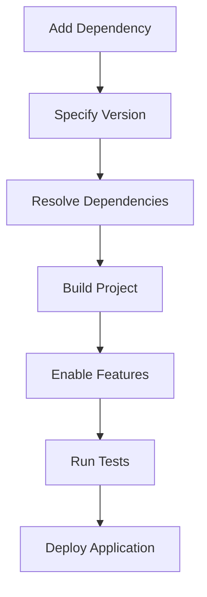

## 4.16. Dependency Management with Cargo

In the world of Rust programming, Cargo is the go-to tool for managing dependencies, building projects, and more. Understanding how to effectively manage dependencies with Cargo is crucial for any Rust developer. In this section, we'll explore how to add dependencies, specify versions, use feature flags, and follow best practices for maintaining and updating dependencies.

### Adding Dependencies in `Cargo.toml`

The `Cargo.toml` file is the heart of a Rust project, containing metadata about the project, including its dependencies. To add a dependency, you simply specify the crate name and version in the `[dependencies]` section.

```toml
[dependencies]
serde = "1.0"
rand = "0.8"
```

- **serde**: A popular serialization library.
- **rand**: A library for generating random numbers.

#### Specifying Versions

Cargo uses [Semantic Versioning](https://semver.org/) (SemVer) to manage versions. This allows you to specify versions in a flexible way:

- **Exact Version**: `serde = "=1.0.104"` - Use this if you need a specific version.
- **Caret Requirement**: `serde = "1.0"` - Allows updates that do not change the left-most non-zero digit.
- **Tilde Requirement**: `serde = "~1.0.104"` - Allows updates to the right-most specified digit.
- **Wildcard**: `serde = "1.*"` - Allows any version that matches the pattern.

### Dependency Resolution

Cargo resolves dependencies by selecting the most recent version that satisfies all version requirements. It ensures that the dependency graph is acyclic and that all dependencies are compatible with each other.

#### Example of Dependency Resolution

Consider a project with the following `Cargo.toml`:

```toml
[dependencies]
serde = "1.0"
serde_json = "1.0"
```

Both `serde` and `serde_json` depend on the same version of `serde`, so Cargo will resolve to the latest compatible version of `serde` that satisfies both dependencies.

### Using Feature Flags

Feature flags in Cargo allow you to enable or disable optional functionality in your dependencies. This can help reduce the size of your binary and improve compile times.

#### Defining Features

You can define features in your `Cargo.toml`:

```toml
[features]
default = ["serde"]
extra = ["serde_json"]
```

- **default**: The default features enabled when no specific features are requested.
- **extra**: An additional feature that can be enabled.

#### Enabling Features

To enable features, you can specify them in the `[dependencies]` section:

```toml
[dependencies]
serde = { version = "1.0", features = ["derive"] }
```

### Best Practices for Dependency Management

1. **Regularly Update Dependencies**: Use `cargo update` to update dependencies to the latest compatible versions. This helps incorporate bug fixes and improvements.

2. **Audit Third-Party Code**: Regularly review the code of your dependencies to ensure they are secure and maintained. Tools like [cargo-audit](https://github.com/RustSec/cargo-audit) can help identify vulnerabilities.

3. **Use Feature Flags Wisely**: Only enable the features you need to minimize your binary size and compile times.

4. **Lock File (`Cargo.lock`)**: For applications, commit the `Cargo.lock` file to ensure consistent builds. For libraries, do not commit it, as it can restrict the flexibility of the library users.

5. **Semantic Versioning**: Follow SemVer guidelines to ensure compatibility and avoid breaking changes.

6. **Review Dependency Graph**: Use tools like `cargo tree` to visualize and review your dependency graph.

### Handling Compatibility

When updating dependencies, it's important to handle compatibility issues:

- **Breaking Changes**: Check the changelog of dependencies for breaking changes before updating.
- **Testing**: Run your test suite after updating dependencies to ensure nothing breaks.
- **Pinning Versions**: If a dependency introduces breaking changes, consider pinning to a specific version until you can address the changes.

### Visualizing Dependency Management

To better understand how dependencies are managed in Cargo, let's visualize the process using a Mermaid.js diagram:



**Diagram Description**: This flowchart illustrates the process of managing dependencies with Cargo, from adding a dependency to deploying the application.

### Try It Yourself

Experiment with adding and updating dependencies in a sample Rust project:

1. Create a new Rust project using `cargo new my_project`.
2. Add a dependency in `Cargo.toml` and specify a version.
3. Enable a feature flag for the dependency.
4. Use `cargo build` to compile the project.
5. Try updating the dependency using `cargo update`.
6. Visualize the dependency graph using `cargo tree`.

### References and Links

- [Cargo Book](https://doc.rust-lang.org/cargo/) - Official Cargo documentation.
- [Semantic Versioning](https://semver.org/) - Guidelines for versioning dependencies.
- [cargo-audit](https://github.com/RustSec/cargo-audit) - A tool to audit Cargo.lock files for vulnerabilities.

### Knowledge Check

- What is the purpose of the `Cargo.toml` file?
- How does Cargo resolve dependencies?
- What are feature flags, and how can they be used?
- Why is it important to audit third-party code?
- What is the difference between `Cargo.lock` for applications and libraries?

### Embrace the Journey

Remember, mastering dependency management with Cargo is a journey. As you progress, you'll gain more confidence in managing complex projects with multiple dependencies. Keep experimenting, stay curious, and enjoy the journey!

## Quiz Time!



### What is the purpose of the `Cargo.toml` file?

- [x] To specify project metadata and dependencies
- [ ] To compile Rust code
- [ ] To manage Git repositories
- [ ] To execute shell commands

> **Explanation:** The `Cargo.toml` file contains metadata about the project, including dependencies, version, and other configurations.

### How does Cargo resolve dependencies?

- [x] By selecting the most recent version that satisfies all version requirements
- [ ] By selecting the oldest version available
- [ ] By selecting a random version
- [ ] By selecting the version with the most features

> **Explanation:** Cargo resolves dependencies by choosing the most recent version that satisfies all specified version requirements, ensuring compatibility.

### What are feature flags in Cargo?

- [x] Optional functionality that can be enabled or disabled in dependencies
- [ ] A way to specify the Rust version
- [ ] A method to manage Git branches
- [ ] A tool for debugging code

> **Explanation:** Feature flags allow developers to enable or disable optional functionality in dependencies, helping to reduce binary size and compile times.

### Why is it important to audit third-party code?

- [x] To ensure security and maintainability
- [ ] To increase compile times
- [ ] To reduce code size
- [ ] To improve syntax highlighting

> **Explanation:** Auditing third-party code helps ensure that dependencies are secure, maintained, and free from vulnerabilities.

### What is the difference between `Cargo.lock` for applications and libraries?

- [x] Applications should commit `Cargo.lock`, while libraries should not
- [ ] Libraries should commit `Cargo.lock`, while applications should not
- [ ] Both should always commit `Cargo.lock`
- [ ] Neither should commit `Cargo.lock`

> **Explanation:** Applications should commit `Cargo.lock` to ensure consistent builds, while libraries should not, to allow flexibility for library users.

### How can you visualize the dependency graph in a Rust project?

- [x] By using the `cargo tree` command
- [ ] By using the `cargo build` command
- [ ] By using the `cargo run` command
- [ ] By using the `cargo test` command

> **Explanation:** The `cargo tree` command allows developers to visualize and review the dependency graph of a Rust project.

### What is Semantic Versioning?

- [x] A versioning scheme that uses major, minor, and patch numbers
- [ ] A tool for compiling Rust code
- [ ] A method for managing Git branches
- [ ] A way to execute shell commands

> **Explanation:** Semantic Versioning is a versioning scheme that uses major, minor, and patch numbers to indicate compatibility and changes.

### How can you update dependencies in a Rust project?

- [x] By using the `cargo update` command
- [ ] By using the `cargo build` command
- [ ] By using the `cargo run` command
- [ ] By using the `cargo test` command

> **Explanation:** The `cargo update` command updates dependencies to the latest compatible versions.

### What is the purpose of the `Cargo.lock` file?

- [x] To ensure consistent builds by locking dependency versions
- [ ] To compile Rust code
- [ ] To manage Git repositories
- [ ] To execute shell commands

> **Explanation:** The `Cargo.lock` file ensures consistent builds by locking the versions of dependencies used in a project.

### True or False: Feature flags can help reduce binary size and improve compile times.

- [x] True
- [ ] False

> **Explanation:** Feature flags allow developers to enable only the necessary functionality, reducing binary size and improving compile times.


