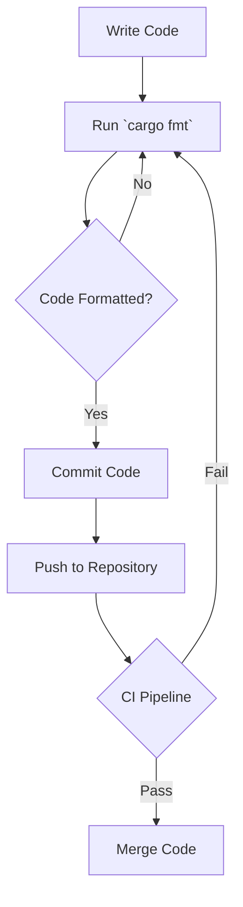

## 4.17. Automated Code Formatting with `rustfmt`

In the world of software development, maintaining a consistent code style is crucial for readability, maintainability, and collaboration. Rust, a language known for its safety and performance, provides a powerful tool called `rustfmt` to automate code formatting. This tool ensures that your Rust code adheres to a standard style, making it easier for teams to work together and for new developers to understand the codebase quickly.

### Introduction to `rustfmt`

`rustfmt` is a tool for formatting Rust code according to style guidelines. It is part of the official Rust toolchain and can be easily integrated into your development workflow. By using `rustfmt`, you can automatically format your code to match the Rust community's style guidelines, or customize it to fit your team's preferences.

#### Integration with Cargo

Cargo, Rust's package manager and build system, seamlessly integrates with `rustfmt`. This integration allows you to format your code with a simple command, ensuring consistency across your entire project. To use `rustfmt` with Cargo, you can run:

```bash
cargo fmt
```

This command will format all the Rust files in your project according to the default or specified configuration.

### Setting Up `rustfmt` Configurations

While `rustfmt` provides sensible defaults, you can customize its behavior through a configuration file. This file, named `rustfmt.toml`, should be placed in the root of your project. Here are some common configuration options:

- **`max_width`**: Sets the maximum width of each line.
- **`hard_tabs`**: Determines whether to use hard tabs or spaces.
- **`tab_spaces`**: Specifies the number of spaces per tab.
- **`use_small_heuristics`**: Adjusts formatting based on the size of the code.

#### Example Configuration

Here's an example of a `rustfmt.toml` configuration file:

```toml
max_width = 100
hard_tabs = false
tab_spaces = 4
use_small_heuristics = "Default"
```

This configuration sets a maximum line width of 100 characters, uses spaces instead of tabs, and specifies 4 spaces per tab.

### Formatting Code Manually and Automatically

#### Manual Formatting

While `rustfmt` automates most formatting tasks, there might be times when you need to format code manually. For instance, when writing complex expressions or aligning comments, manual adjustments can be necessary. However, it's essential to keep these manual changes consistent with the overall style.

#### Automatic Formatting

Automatic formatting with `rustfmt` is straightforward. Simply run the following command in your terminal:

```bash
cargo fmt
```

This command will format all the Rust files in your project. You can also format individual files by specifying their paths:

```bash
rustfmt src/main.rs
```

### Integrating `rustfmt` into the Development Workflow

To maximize the benefits of `rustfmt`, integrate it into your development workflow. Here are some strategies:

#### Pre-commit Hooks

Use pre-commit hooks to ensure that all code is formatted before it's committed to the repository. This practice prevents unformatted code from entering the codebase, maintaining consistency across all contributions.

Here's an example of a pre-commit hook script:

```bash
#!/bin/sh
cargo fmt -- --check
if [ $? -ne 0 ]; then
  echo "Code is not formatted. Please run 'cargo fmt' before committing."
  exit 1
fi
```

Place this script in the `.git/hooks/pre-commit` file in your repository.

#### Continuous Integration (CI)

Incorporate `rustfmt` checks into your CI pipeline to enforce code style across all branches. This setup ensures that any unformatted code is flagged during the build process, prompting developers to address formatting issues before merging.

### Benefits of Automated Formatting for Team Collaboration

Automated code formatting offers several advantages, particularly in team environments:

- **Consistency**: Ensures that all code adheres to a uniform style, reducing cognitive load when reading and reviewing code.
- **Efficiency**: Saves time by automating the tedious task of manual formatting, allowing developers to focus on writing code.
- **Reduced Conflicts**: Minimizes merge conflicts related to code style, as all code follows the same formatting rules.
- **Onboarding**: Eases the onboarding process for new developers by providing a clear and consistent code style to follow.

### Visualizing the Workflow

To better understand how `rustfmt` fits into the development workflow, consider the following diagram:



**Diagram Description**: This flowchart illustrates the typical workflow of using `rustfmt`. Developers write code, run `cargo fmt` to format it, and commit the changes. The CI pipeline checks the formatting, ensuring that only well-formatted code is merged.

### Try It Yourself

To get hands-on experience with `rustfmt`, try the following exercises:

1. **Create a Rust Project**: Use Cargo to create a new Rust project and write some unformatted code.
2. **Configure `rustfmt`**: Add a `rustfmt.toml` file to your project and customize the formatting options.
3. **Format Your Code**: Run `cargo fmt` to format your code automatically.
4. **Experiment with Configurations**: Modify the `rustfmt.toml` file and observe how different settings affect the formatting.
5. **Set Up a Pre-commit Hook**: Implement a pre-commit hook to enforce formatting before committing code.

### References and Further Reading

- [Rustfmt GitHub Repository](https://github.com/rust-lang/rustfmt)
- [Rustfmt Configuration Options](https://rust-lang.github.io/rustfmt/)
- [Cargo Book](https://doc.rust-lang.org/cargo/)

### Knowledge Check

Before we wrap up, let's reinforce what we've learned with a few questions:

- What is the primary purpose of `rustfmt`?
- How can you customize `rustfmt`'s behavior?
- Why is automated code formatting beneficial in a team setting?
- How can you integrate `rustfmt` into your CI pipeline?

### Embrace the Journey

Remember, mastering `rustfmt` is just one step in your Rust journey. As you continue to explore Rust's features and best practices, you'll find that tools like `rustfmt` not only enhance your productivity but also improve the quality of your code. Keep experimenting, stay curious, and enjoy the process of becoming a proficient Rust developer!

## Quiz Time!



### What is the primary purpose of `rustfmt`?

- [x] To automatically format Rust code according to style guidelines
- [ ] To compile Rust code into executable binaries
- [ ] To manage Rust project dependencies
- [ ] To execute Rust code in a virtual environment

> **Explanation:** `rustfmt` is a tool designed to format Rust code automatically, ensuring consistency with style guidelines.

### How do you integrate `rustfmt` with Cargo?

- [x] By running `cargo fmt`
- [ ] By adding `rustfmt` as a dependency in `Cargo.toml`
- [ ] By using `cargo run`
- [ ] By configuring `rustfmt` in `Cargo.lock`

> **Explanation:** You can integrate `rustfmt` with Cargo by running the command `cargo fmt`, which formats all Rust files in the project.

### What file is used to customize `rustfmt` settings?

- [x] `rustfmt.toml`
- [ ] `Cargo.toml`
- [ ] `rustfmt.json`
- [ ] `settings.toml`

> **Explanation:** The `rustfmt.toml` file is used to customize the behavior of `rustfmt` with various configuration options.

### Which of the following is a benefit of using automated code formatting?

- [x] Consistent code style across the codebase
- [ ] Increased compilation speed
- [ ] Reduced binary size
- [ ] Enhanced runtime performance

> **Explanation:** Automated code formatting ensures a consistent code style, which improves readability and maintainability.

### How can you enforce code formatting before committing changes?

- [x] By using a pre-commit hook
- [ ] By running `cargo build`
- [ ] By setting environment variables
- [ ] By modifying `Cargo.lock`

> **Explanation:** Pre-commit hooks can be used to enforce code formatting by running `rustfmt` before code is committed.

### What command formats a specific Rust file using `rustfmt`?

- [x] `rustfmt src/main.rs`
- [ ] `cargo build src/main.rs`
- [ ] `cargo run src/main.rs`
- [ ] `rustc src/main.rs`

> **Explanation:** The command `rustfmt src/main.rs` formats the specified Rust file using `rustfmt`.

### Which configuration option sets the maximum line width in `rustfmt`?

- [x] `max_width`
- [ ] `line_length`
- [ ] `width_limit`
- [ ] `max_length`

> **Explanation:** The `max_width` option in `rustfmt.toml` sets the maximum width for lines of code.

### What is the default behavior of `rustfmt` if no configuration file is present?

- [x] It uses the default style guidelines
- [ ] It throws an error
- [ ] It formats code with no changes
- [ ] It prompts the user for input

> **Explanation:** If no configuration file is present, `rustfmt` uses its default style guidelines to format the code.

### True or False: `rustfmt` can be used to check code formatting without making changes.

- [x] True
- [ ] False

> **Explanation:** `rustfmt` can be run with the `--check` flag to verify code formatting without altering the files.

### Which of the following is NOT a benefit of using `rustfmt`?

- [ ] Consistent code style
- [ ] Reduced merge conflicts
- [ ] Improved code readability
- [x] Faster code execution

> **Explanation:** While `rustfmt` improves code style and readability, it does not affect the execution speed of the code.


