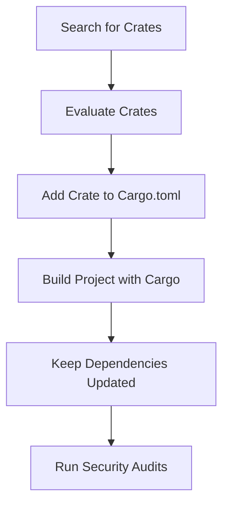

## 4.18. Managing External Dependencies from crates.io

In the world of Rust programming, leveraging external libraries, or "crates," can significantly enhance productivity and code quality. Crates.io, the Rust community's central package registry, hosts a vast array of libraries that can be integrated into your projects. This section will guide you through the process of finding, evaluating, and incorporating these external crates into your Rust projects safely and effectively.

### Understanding Crates.io

Crates.io is the official Rust package registry where developers can publish and share their Rust libraries. It serves as a central hub for discovering and integrating third-party libraries into your Rust projects. The platform provides a wealth of information about each crate, including its version history, dependencies, and maintainers.

### Searching for Crates

To find a crate that suits your needs, you can use the search functionality on [crates.io](https://crates.io/). When searching, consider the following:

- **Keywords**: Use relevant keywords to narrow down your search results.
- **Categories**: Browse through categories to find crates related to specific domains or functionalities.
- **Tags**: Tags can help you find crates that are related to particular technologies or use cases.

### Evaluating Crates

Once you've identified potential crates, it's crucial to evaluate them for quality and suitability. Here are some factors to consider:

#### 1. Popularity and Usage

- **Downloads**: A high number of downloads can indicate that a crate is widely used and trusted by the community.
- **Stars and Forks**: On the crate's GitHub repository, stars and forks can provide insight into its popularity and community engagement.

#### 2. Maintenance and Activity

- **Recent Updates**: Check the crate's update history to ensure it is actively maintained.
- **Issue Tracker**: Review open and closed issues to gauge how responsive the maintainers are to bug reports and feature requests.

#### 3. Safety and Security

- **Dependencies**: Examine the crate's dependencies for any potential security risks.
- **Vulnerabilities**: Use tools like [`cargo-audit`](https://crates.io/crates/cargo-audit) to check for known vulnerabilities in the crate and its dependencies.

#### 4. License Compatibility

- **License Type**: Ensure the crate's license is compatible with your project's license. Common licenses include MIT, Apache 2.0, and GPL.

#### 5. Community Trust

- **Reviews and Ratings**: Look for community reviews or ratings that can provide additional insights into the crate's reliability.
- **Documentation**: Well-documented crates are often easier to integrate and use effectively.

### Adding an External Crate to Your Project

Once you've selected a crate, you can add it to your project by modifying your `Cargo.toml` file. Here's how:

1. **Open `Cargo.toml`**: This file is located in the root directory of your Rust project.

2. **Add the Dependency**: Under the `[dependencies]` section, add the crate name and version. For example:
   ```toml
   [dependencies]
   serde = "1.0"
   ```

3. **Run `cargo build`**: This command will download the crate and its dependencies, and compile them with your project.

### Keeping Dependencies Up-to-Date

It's important to keep your dependencies up-to-date to benefit from the latest features, bug fixes, and security patches. Use the following strategies:

- **`cargo update`**: This command updates the dependencies in your `Cargo.lock` file to the latest compatible versions.
- **`cargo outdated`**: This tool can help you identify outdated dependencies and their latest versions.

### Using `cargo-audit` for Security

[`cargo-audit`](https://crates.io/crates/cargo-audit) is a tool that checks your project for known vulnerabilities in its dependencies. To use it:

1. **Install `cargo-audit`**: Run the following command:
   ```bash
   cargo install cargo-audit
   ```

2. **Run `cargo audit`**: This command will scan your dependencies and report any vulnerabilities.

### Visualizing Dependency Management

To better understand how dependencies are managed in Rust, let's visualize the process using a flowchart:



**Figure 1**: A flowchart illustrating the process of managing external dependencies in Rust projects.

### Knowledge Check

- **Question**: What are some key factors to consider when evaluating a crate from crates.io?
- **Exercise**: Try adding a new crate to your Rust project and run `cargo audit` to check for vulnerabilities.

### Embrace the Journey

Remember, managing dependencies is an ongoing process. As you progress in your Rust journey, you'll become more adept at evaluating and integrating crates into your projects. Keep experimenting, stay curious, and enjoy the journey!

## Quiz Time!



### What is crates.io?

- [x] The official Rust package registry
- [ ] A Rust compiler
- [ ] A Rust IDE
- [ ] A Rust testing framework

> **Explanation:** Crates.io is the official Rust package registry where developers can publish and share their Rust libraries.

### Which tool can you use to check for vulnerabilities in Rust dependencies?

- [x] cargo-audit
- [ ] cargo-check
- [ ] cargo-run
- [ ] cargo-test

> **Explanation:** `cargo-audit` is used to check for known vulnerabilities in Rust dependencies.

### What should you check to ensure a crate is actively maintained?

- [x] Recent updates and issue tracker activity
- [ ] The number of stars on GitHub
- [ ] The number of forks on GitHub
- [ ] The number of contributors

> **Explanation:** Recent updates and issue tracker activity are indicators of active maintenance.

### How do you add a crate to your Rust project?

- [x] Add it to the `[dependencies]` section in `Cargo.toml`
- [ ] Add it to the `src` directory
- [ ] Add it to the `Cargo.lock` file
- [ ] Add it to the `main.rs` file

> **Explanation:** Crates are added to the `[dependencies]` section in `Cargo.toml`.

### What command updates the dependencies in your `Cargo.lock` file?

- [x] cargo update
- [ ] cargo build
- [ ] cargo run
- [ ] cargo test

> **Explanation:** `cargo update` updates the dependencies in the `Cargo.lock` file to the latest compatible versions.

### What is a sign of a crate's popularity?

- [x] High number of downloads
- [ ] Low number of issues
- [ ] High number of forks
- [ ] Low number of stars

> **Explanation:** A high number of downloads can indicate that a crate is widely used and trusted.

### Why is it important to keep dependencies up-to-date?

- [x] To benefit from the latest features, bug fixes, and security patches
- [ ] To reduce the size of the project
- [ ] To increase the number of dependencies
- [ ] To make the project run faster

> **Explanation:** Keeping dependencies up-to-date ensures you benefit from the latest features, bug fixes, and security patches.

### What should you consider regarding a crate's license?

- [x] License compatibility with your project
- [ ] The number of contributors
- [ ] The number of forks
- [ ] The number of stars

> **Explanation:** Ensure the crate's license is compatible with your project's license.

### What does `cargo outdated` do?

- [x] Identifies outdated dependencies and their latest versions
- [ ] Builds the project
- [ ] Runs the project
- [ ] Tests the project

> **Explanation:** `cargo outdated` helps identify outdated dependencies and their latest versions.

### True or False: You should always use the latest version of a crate regardless of compatibility.

- [ ] True
- [x] False

> **Explanation:** You should ensure that the latest version of a crate is compatible with your project before updating.



By following these guidelines, you can effectively manage external dependencies in your Rust projects, ensuring they are safe, up-to-date, and well-integrated.
