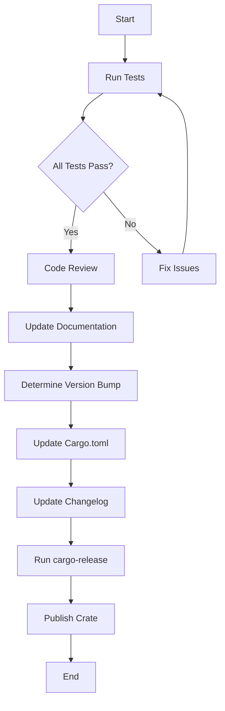

## 4.19. Versioning and Release Management

In the world of software development, managing versions and releases effectively is crucial for maintaining a stable and reliable codebase. This section will delve into the best practices for versioning Rust projects and managing releases, focusing on semantic versioning, version management in `Cargo.toml`, release preparation, changelog maintenance, and tools like `cargo-release`.

### Understanding Semantic Versioning

Semantic Versioning (SemVer) is a versioning scheme that conveys meaning about the underlying changes in a release. It follows the format `MAJOR.MINOR.PATCH`, where:

- **MAJOR** version increments indicate incompatible API changes.
- **MINOR** version increments add functionality in a backward-compatible manner.
- **PATCH** version increments are for backward-compatible bug fixes.

#### Why Semantic Versioning Matters

Semantic Versioning provides a clear and predictable way to communicate changes to users. It helps developers understand the impact of upgrading dependencies and ensures that software evolves in a controlled manner. By adhering to SemVer, you can:

- **Ensure Compatibility**: Users can confidently upgrade to new versions, knowing that backward compatibility is maintained unless a major version change occurs.
- **Facilitate Dependency Management**: Tools like Cargo can automatically resolve dependencies based on version constraints, reducing the risk of version conflicts.
- **Improve Communication**: Clear versioning signals the nature of changes, making it easier for users to decide when to upgrade.

### Managing Versions in `Cargo.toml`

In Rust, versioning is managed through the `Cargo.toml` file, which is the manifest file for Rust projects. Here's how you can manage versions effectively:

#### Specifying Version Numbers

In your `Cargo.toml`, specify the version of your crate using the `version` field:

```toml
[package]
name = "my_crate"
version = "1.2.3"
```

#### Dependency Versioning

When specifying dependencies, you can use version constraints to ensure compatibility:

```toml
[dependencies]
serde = "1.0" # Compatible with any 1.x.x version
rand = "0.8.3" # Exact version
```

- **Caret Requirements (`^`)**: The default, allowing updates that do not change the leftmost non-zero digit. For example, `^1.2.3` allows updates to `1.x.x` but not `2.0.0`.
- **Tilde Requirements (`~`)**: Allows updates that do not change the most significant specified version. For example, `~1.2.3` allows updates to `1.2.x` but not `1.3.0`.
- **Wildcard Requirements (`*`)**: Allows updates to any version. For example, `1.*` allows updates to any `1.x.x` version.

#### Publishing Crate Versions

To publish a new version of your crate, update the `version` field in `Cargo.toml` and run:

```bash
cargo publish
```

Ensure that your code is ready for release by running tests and checking for any unresolved issues.

### Preparing Releases

Preparing a release involves several steps to ensure that the new version is stable and ready for users. Here's a guideline to follow:

#### Pre-Release Testing

- **Run Automated Tests**: Ensure all tests pass by running `cargo test`.
- **Perform Manual Testing**: Test critical paths manually to catch any issues that automated tests might miss.
- **Check for Breaking Changes**: Review changes to ensure no unintended breaking changes are introduced.

#### Code Review and Documentation

- **Conduct Code Reviews**: Have peers review the code to catch potential issues and improve code quality.
- **Update Documentation**: Ensure that all documentation is up-to-date, including API docs and user guides.

#### Version Bumping

- **Determine Version Bump**: Decide whether the release is a major, minor, or patch update based on the changes.
- **Update `Cargo.toml`**: Increment the version number in `Cargo.toml` accordingly.

### Maintaining a Changelog

A changelog is a file that contains a curated, chronologically ordered list of notable changes for each version of a project. It helps users understand what has changed between releases.

#### Best Practices for Changelog Maintenance

- **Follow a Consistent Format**: Use a format like [Keep a Changelog](https://keepachangelog.com/) to maintain consistency.
- **Categorize Changes**: Group changes into categories such as Added, Changed, Deprecated, Removed, Fixed, and Security.
- **Update Regularly**: Update the changelog with each release to keep it current.

Example of a changelog entry:

```
## [1.2.3] - 2024-11-25
### Added
- New feature for handling user input.

### Fixed
- Bug fix for data serialization issue.
```

### Tools for Release Management

Several tools can assist with versioning and release management in Rust projects:

#### `cargo-release`

The [`cargo-release`](https://crates.io/crates/cargo-release) crate automates many aspects of the release process, including version bumping, changelog updates, and tagging releases in version control.

To use `cargo-release`, add it to your development dependencies and configure it in `Cargo.toml`:

```toml
[dev-dependencies]
cargo-release = "0.17.0"
```

Run `cargo release` to automate the release process, which includes:

- **Version Bumping**: Automatically increments the version number.
- **Changelog Updates**: Updates the changelog with the new version.
- **Git Tagging**: Tags the release in your version control system.

### Visualizing the Release Process

To better understand the release process, let's visualize it using a flowchart:



This diagram illustrates the steps involved in preparing and releasing a new version of a Rust project.

### Knowledge Check

To reinforce your understanding of versioning and release management, consider the following questions:

- What is Semantic Versioning, and why is it important?
- How do you specify dependency versions in `Cargo.toml`?
- What steps should you take to prepare a release?
- How can a changelog benefit users of your project?
- What features does the `cargo-release` tool provide?

### Embrace the Journey

Remember, mastering versioning and release management is a journey. As you gain experience, you'll develop a deeper understanding of how to manage your projects effectively. Keep experimenting, stay curious, and enjoy the process of refining your release workflows.

### Quiz Time!



### What is the primary purpose of Semantic Versioning?

- [x] To convey meaning about the underlying changes in a release.
- [ ] To ensure all dependencies are up-to-date.
- [ ] To automate the release process.
- [ ] To maintain backward compatibility at all times.

> **Explanation:** Semantic Versioning provides a clear and predictable way to communicate changes to users, indicating the nature of changes in a release.

### In `Cargo.toml`, what does the caret (`^`) symbol indicate in version constraints?

- [x] Allows updates that do not change the leftmost non-zero digit.
- [ ] Allows updates to any version.
- [ ] Allows updates that do not change the most significant specified version.
- [ ] Allows updates to only the exact version specified.

> **Explanation:** The caret (`^`) symbol allows updates that do not change the leftmost non-zero digit, ensuring compatibility with future minor and patch versions.

### Which tool can automate version bumping and changelog updates in Rust projects?

- [x] `cargo-release`
- [ ] `cargo-publish`
- [ ] `cargo-test`
- [ ] `cargo-build`

> **Explanation:** The `cargo-release` tool automates many aspects of the release process, including version bumping and changelog updates.

### What should be included in a changelog?

- [x] A curated list of notable changes for each version.
- [ ] A list of all files changed in the release.
- [ ] The complete source code of the project.
- [ ] A list of all contributors to the project.

> **Explanation:** A changelog contains a curated, chronologically ordered list of notable changes for each version, helping users understand what has changed.

### What is the first step in preparing a release?

- [x] Run Automated Tests
- [ ] Update Documentation
- [ ] Determine Version Bump
- [ ] Publish Crate

> **Explanation:** Running automated tests is the first step to ensure that the code is stable and ready for release.

### How can you specify a dependency version that allows updates to any version?

- [x] Using a wildcard (`*`) in the version constraint.
- [ ] Using a caret (`^`) in the version constraint.
- [ ] Using a tilde (`~`) in the version constraint.
- [ ] Using an exact version number.

> **Explanation:** A wildcard (`*`) in the version constraint allows updates to any version.

### What is the purpose of tagging releases in version control?

- [x] To mark specific points in the project's history as important.
- [ ] To automatically update dependencies.
- [ ] To run tests on the codebase.
- [ ] To publish the crate to crates.io.

> **Explanation:** Tagging releases in version control marks specific points in the project's history as important, making it easier to track and manage releases.

### What is the role of code reviews in the release process?

- [x] To catch potential issues and improve code quality.
- [ ] To automate the release process.
- [ ] To update the changelog.
- [ ] To publish the crate.

> **Explanation:** Code reviews help catch potential issues and improve code quality, ensuring that the code is ready for release.

### Why is it important to update documentation before a release?

- [x] To ensure that all documentation is up-to-date and accurate.
- [ ] To automate the release process.
- [ ] To run tests on the codebase.
- [ ] To publish the crate.

> **Explanation:** Updating documentation ensures that all information is current and accurate, providing users with the necessary guidance for using the new version.

### True or False: Semantic Versioning guarantees backward compatibility for all releases.

- [ ] True
- [x] False

> **Explanation:** Semantic Versioning indicates backward compatibility for minor and patch releases, but major releases may introduce incompatible changes.



By following these best practices and utilizing the tools available, you can effectively manage versioning and releases in your Rust projects, ensuring a smooth and reliable development process.
