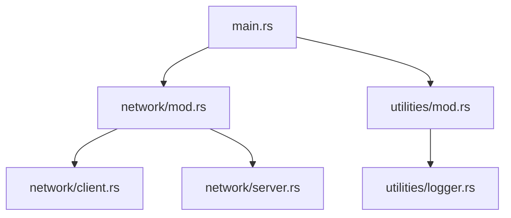

## 4.2. Modules and Crate Organization

In the world of Rust programming, organizing your code effectively is crucial for creating maintainable, scalable, and reusable software. Rust provides a robust module system and crate ecosystem that allows developers to structure their projects in a clear and logical manner. In this section, we will delve into the best practices for organizing Rust code using modules and crates, ensuring that your codebase remains clean and efficient.

### Understanding Modules in Rust

Modules in Rust are a way to organize code into separate namespaces, allowing you to group related functions, structs, enums, and other items together. This helps in managing complexity, especially in larger projects.

#### Declaring Modules

To declare a module in Rust, you use the `mod` keyword. Modules can be defined in the same file or in separate files. Here's a simple example of declaring a module:

```rust
// main.rs
mod utilities;

fn main() {
    utilities::greet();
}

// utilities.rs
pub fn greet() {
    println!("Hello from the utilities module!");
}
```

In this example, we have a `utilities` module defined in a separate file `utilities.rs`. The `mod utilities;` line in `main.rs` tells the Rust compiler to include the contents of `utilities.rs`.

#### Nested Modules

Modules can be nested within each other to create a hierarchy. This is useful for organizing code into sub-modules. Here's how you can create nested modules:

```rust
// main.rs
mod network {
    pub mod server {
        pub fn start() {
            println!("Server started!");
        }
    }
}

fn main() {
    network::server::start();
}
```

In this example, the `server` module is nested within the `network` module. This hierarchical structure helps in logically grouping related functionalities.

### Controlling Visibility with `pub` and Private Modifiers

By default, everything in a Rust module is private. To make items accessible from outside the module, you need to use the `pub` keyword. This is crucial for controlling the visibility of your code and ensuring encapsulation.

#### Public and Private Items

- **Private Items**: These are only accessible within the module where they are defined.
- **Public Items**: These can be accessed from outside the module if they are marked with the `pub` keyword.

Here's an example demonstrating visibility:

```rust
mod library {
    pub fn public_function() {
        println!("This is a public function.");
    }

    fn private_function() {
        println!("This is a private function.");
    }
}

fn main() {
    library::public_function();
    // library::private_function(); // This line would cause a compile error
}
```

In this example, `public_function` is accessible from outside the `library` module, while `private_function` is not.

### Structuring Larger Projects with Modules and Sub-Modules

As projects grow, it's important to maintain a clear structure. Rust's module system allows you to create a directory structure that mirrors your module hierarchy.

#### Organizing Code in Directories

For larger projects, it's common to organize modules into directories. Each directory can contain a `mod.rs` file that serves as the entry point for the module. Here's an example structure:

```
src/
├── main.rs
├── network/
│   ├── mod.rs
│   ├── client.rs
│   └── server.rs
└── utilities/
    ├── mod.rs
    └── logger.rs
```

In this structure, `network/mod.rs` might look like this:

```rust
pub mod client;
pub mod server;
```

This setup allows you to keep related code together, making it easier to navigate and maintain.

### Using Crates to Package and Distribute Rust Code

Crates are the fundamental unit of code distribution in Rust. A crate can be a library or an executable, and it serves as a package that can be shared and reused.

#### Creating a Crate

To create a new crate, you use the `cargo new` command:

```bash
cargo new my_crate
```

This command creates a new directory with a `Cargo.toml` file and a `src` directory containing `main.rs` or `lib.rs`, depending on whether it's a binary or library crate.

#### The `Cargo.toml` File

The `Cargo.toml` file is the manifest for your crate. It contains metadata such as the crate's name, version, dependencies, and more. Here's a simple example:

```toml
[package]
name = "my_crate"
version = "0.1.0"
edition = "2021"

[dependencies]
serde = "1.0"
```

This file specifies that `my_crate` depends on the `serde` library.

#### Publishing Crates

Once your crate is ready, you can publish it to [crates.io](https://crates.io/), Rust's package registry, using the `cargo publish` command. This makes your crate available for others to use.

### Importance of a Well-Organized Codebase

A well-organized codebase is essential for collaboration and scalability. It makes it easier for new developers to understand the project, reduces the likelihood of bugs, and facilitates code reuse.

#### Best Practices for Code Organization

- **Use Descriptive Names**: Choose meaningful names for modules and crates to convey their purpose.
- **Keep Modules Focused**: Each module should have a clear responsibility.
- **Document Your Code**: Use comments and documentation to explain complex logic and module purposes.
- **Leverage Rust's Features**: Use traits, generics, and other Rust features to create flexible and reusable code.

### Visualizing Module and Crate Organization

To better understand how modules and crates fit together, let's visualize a typical Rust project structure using a Mermaid.js diagram:



This diagram illustrates the hierarchical relationship between modules in a Rust project.

### Try It Yourself

To solidify your understanding, try creating a small Rust project with multiple modules and a crate. Experiment with different module structures and visibility settings. Consider adding a dependency in your `Cargo.toml` and using it in your code.

### Knowledge Check

- What is the purpose of the `mod` keyword in Rust?
- How do you control the visibility of items in a module?
- What is the role of the `Cargo.toml` file in a Rust project?
- How can you organize a large Rust project with multiple modules?
- Why is a well-organized codebase important for collaboration?

### Embrace the Journey

Remember, mastering module and crate organization is just the beginning. As you continue to develop in Rust, you'll find that a well-structured codebase is key to building robust and scalable applications. Keep experimenting, stay curious, and enjoy the journey!

## Quiz Time!



### What is the primary purpose of modules in Rust?

- [x] To organize code into separate namespaces
- [ ] To compile code faster
- [ ] To handle errors
- [ ] To manage memory

> **Explanation:** Modules in Rust are used to organize code into separate namespaces, allowing for better code management and organization.

### How do you declare a module in Rust?

- [x] Using the `mod` keyword
- [ ] Using the `use` keyword
- [ ] Using the `crate` keyword
- [ ] Using the `fn` keyword

> **Explanation:** The `mod` keyword is used to declare a module in Rust.

### What keyword is used to make a module item accessible from outside the module?

- [x] `pub`
- [ ] `priv`
- [ ] `extern`
- [ ] `crate`

> **Explanation:** The `pub` keyword is used to make a module item accessible from outside the module.

### What file serves as the entry point for a module in a directory?

- [x] `mod.rs`
- [ ] `main.rs`
- [ ] `lib.rs`
- [ ] `Cargo.toml`

> **Explanation:** `mod.rs` serves as the entry point for a module in a directory.

### What is the role of the `Cargo.toml` file?

- [x] It contains metadata and dependencies for a Rust project
- [ ] It compiles the Rust code
- [ ] It runs the Rust code
- [ ] It manages memory allocation

> **Explanation:** The `Cargo.toml` file contains metadata and dependencies for a Rust project.

### Which command is used to create a new Rust crate?

- [x] `cargo new`
- [ ] `cargo build`
- [ ] `cargo run`
- [ ] `cargo test`

> **Explanation:** The `cargo new` command is used to create a new Rust crate.

### How can you publish a crate to crates.io?

- [x] Using the `cargo publish` command
- [ ] Using the `cargo build` command
- [ ] Using the `cargo run` command
- [ ] Using the `cargo test` command

> **Explanation:** The `cargo publish` command is used to publish a crate to crates.io.

### What is the default visibility of items in a Rust module?

- [x] Private
- [ ] Public
- [ ] Protected
- [ ] Internal

> **Explanation:** By default, items in a Rust module are private.

### Why is a well-organized codebase important?

- [x] It facilitates collaboration and scalability
- [ ] It increases code execution speed
- [ ] It reduces memory usage
- [ ] It simplifies error handling

> **Explanation:** A well-organized codebase facilitates collaboration and scalability, making it easier for developers to work together and maintain the project.

### True or False: Crates can only be used for library code in Rust.

- [ ] True
- [x] False

> **Explanation:** Crates in Rust can be used for both library and executable code.


