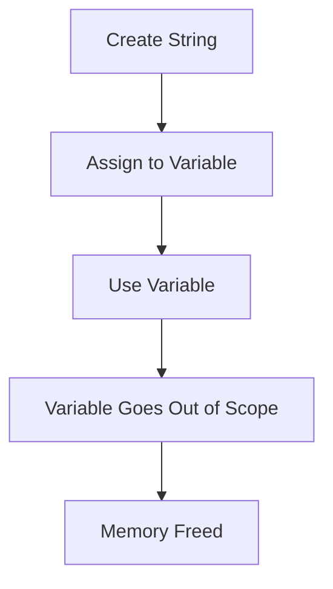
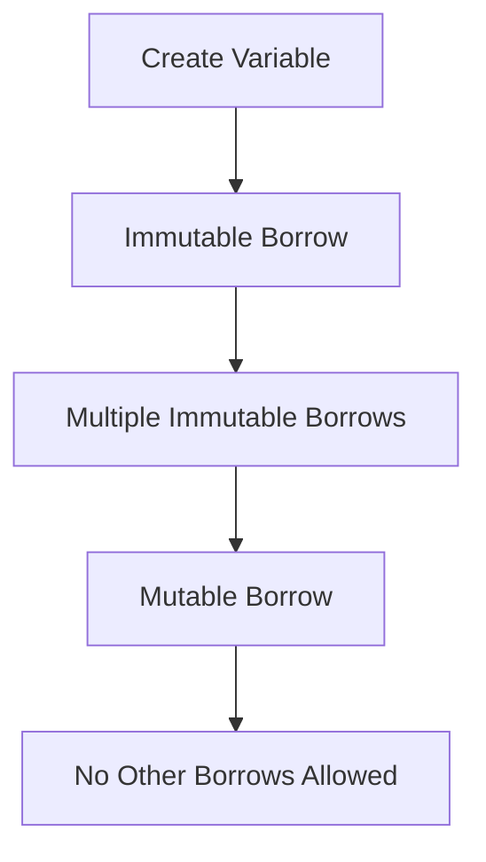

## 4.3. Ownership, Borrowing, and Lifetimes in Depth

Rust's ownership, borrowing, and lifetime system is one of its most distinctive and powerful features, enabling memory safety without a garbage collector. In this section, we'll delve into these concepts, exploring advanced scenarios and best practices for managing lifetimes in Rust.

### Reiterating the Basics of Ownership and Borrowing

Before we dive into advanced topics, let's briefly revisit the fundamental concepts of ownership and borrowing in Rust.

#### Ownership

Ownership is the foundation of Rust's memory management system. Each value in Rust has a single owner, and when the owner goes out of scope, the value is dropped, freeing the memory. This ensures that memory is automatically managed and prevents issues like double-free errors.

```rust
fn main() {
    let s = String::from("hello"); // s owns the String
    println!("{}", s); // s is used here
} // s goes out of scope and the String is dropped
```

#### Borrowing

Borrowing allows you to reference data without taking ownership. This is done through references, which can be either immutable (`&T`) or mutable (`&mut T`). Rust enforces strict rules to ensure safety: you can have multiple immutable references or one mutable reference, but not both simultaneously.

```rust
fn main() {
    let mut s = String::from("hello");

    // Immutable borrow
    let r1 = &s;
    let r2 = &s;
    println!("{} and {}", r1, r2);

    // Mutable borrow
    let r3 = &mut s;
    r3.push_str(", world");
    println!("{}", r3);
}
```

### Diving into Advanced Concepts

Now that we've covered the basics, let's explore more advanced concepts such as lifetime elision, trait object lifetimes, and complex borrowing scenarios.

#### Lifetime Elision

Lifetimes are a way of expressing the scope for which a reference is valid. While Rust often requires explicit lifetime annotations, it can infer lifetimes in many cases through a process called lifetime elision. This makes code more concise and readable.

Consider the following function:

```rust
fn first_word(s: &str) -> &str {
    let bytes = s.as_bytes();

    for (i, &item) in bytes.iter().enumerate() {
        if item == b' ' {
            return &s[0..i];
        }
    }

    &s[..]
}
```

Here, Rust infers that the input and output lifetimes are the same, so we don't need to specify them explicitly.

#### Trait Object Lifetimes

When working with trait objects, lifetimes can become more complex. Trait objects allow for dynamic dispatch, enabling polymorphism in Rust. However, they require careful lifetime management to ensure safety.

```rust
trait Draw {
    fn draw(&self);
}

struct Screen<'a> {
    components: Vec<Box<dyn Draw + 'a>>,
}

impl<'a> Screen<'a> {
    fn run(&self) {
        for component in self.components.iter() {
            component.draw();
        }
    }
}
```

In this example, the lifetime `'a` ensures that all components in the `Screen` live at least as long as the `Screen` itself.

### Common Lifetime Annotations

Understanding how to use lifetime annotations effectively is crucial for writing robust Rust code. Let's explore some common scenarios where lifetime annotations are necessary.

#### Functions

When defining functions that take references as parameters or return references, you may need to specify lifetimes to indicate how the lifetimes of the parameters relate to the return value.

```rust
fn longest<'a>(x: &'a str, y: &'a str) -> &'a str {
    if x.len() > y.len() {
        x
    } else {
        y
    }
}
```

Here, the lifetime `'a` indicates that the returned reference will be valid as long as both input references are valid.

#### Structs

Structs that hold references require lifetime annotations to ensure the references remain valid for the duration of the struct's existence.

```rust
struct ImportantExcerpt<'a> {
    part: &'a str,
}

fn main() {
    let novel = String::from("Call me Ishmael. Some years ago...");
    let first_sentence = novel.split('.').next().expect("Could not find a '.'");
    let i = ImportantExcerpt {
        part: first_sentence,
    };
}
```

In this example, the `ImportantExcerpt` struct holds a reference to a part of the novel, and the lifetime `'a` ensures that the reference is valid.

#### Methods

Methods can also require lifetime annotations, especially when they involve references to the struct's fields.

```rust
impl<'a> ImportantExcerpt<'a> {
    fn level(&self) -> i32 {
        3
    }

    fn announce_and_return_part(&self, announcement: &str) -> &str {
        println!("Attention please: {}", announcement);
        self.part
    }
}
```

Here, the method `announce_and_return_part` returns a reference to the `part` field, and the lifetime `'a` ensures that the reference is valid.

### Complex Borrowing Scenarios

Rust's borrowing rules can become complex when dealing with multiple references, nested structures, or mutable and immutable borrows. Let's explore some of these scenarios.

#### Multiple References

Rust allows multiple immutable references or one mutable reference at a time. This rule prevents data races and ensures memory safety.

```rust
fn main() {
    let mut s = String::from("hello");

    let r1 = &s; // no problem
    let r2 = &s; // no problem
    println!("{} and {}", r1, r2);

    // let r3 = &mut s; // error: cannot borrow `s` as mutable because it is also borrowed as immutable
}
```

#### Nested Structures

When dealing with nested structures, lifetimes can become more intricate. It's essential to ensure that all references within the structure are valid.

```rust
struct Outer<'a> {
    inner: Inner<'a>,
}

struct Inner<'a> {
    value: &'a str,
}

fn main() {
    let value = String::from("hello");
    let inner = Inner { value: &value };
    let outer = Outer { inner };

    println!("{}", outer.inner.value);
}
```

In this example, the lifetimes ensure that the `Inner` struct's reference is valid as long as the `Outer` struct exists.

### Strategies for Resolving Lifetime-Related Compiler Errors

Rust's compiler is strict about lifetimes, and it's common to encounter errors related to them. Here are some strategies for resolving these errors:

1. **Understand the Error Message**: Rust's error messages are often detailed and provide hints on how to resolve the issue. Pay close attention to them.

2. **Use Lifetime Annotations**: When the compiler cannot infer lifetimes, add explicit annotations to clarify the relationships between references.

3. **Refactor Code**: Sometimes, restructuring your code can resolve lifetime issues. Consider breaking down complex functions or using helper functions.

4. **Leverage Rust's Borrow Checker**: Trust the borrow checker to guide you. If it flags an issue, it's likely there to prevent a potential bug.

5. **Experiment with Code**: Try different approaches to see how they affect lifetimes. This can help you understand how Rust's system works.

### Visualizing Ownership, Borrowing, and Lifetimes

To better understand these concepts, let's visualize them using Mermaid.js diagrams.

#### Ownership Flow



*This diagram illustrates the flow of ownership, from creation to memory deallocation.*

#### Borrowing Rules



*This diagram shows the rules of borrowing, highlighting the exclusivity of mutable borrows.*

### Try It Yourself

To reinforce your understanding, try modifying the following code examples:

1. **Experiment with Lifetimes**: Modify the `longest` function to return a reference with a different lifetime and observe the compiler's response.

2. **Nested Structures**: Create a nested structure with multiple references and ensure all lifetimes are correctly annotated.

3. **Complex Borrowing**: Try creating a scenario with both mutable and immutable borrows and resolve any resulting errors.

### References and Links

For further reading on Rust's ownership, borrowing, and lifetimes, consider the following resources:

- [The Rust Programming Language Book](https://doc.rust-lang.org/book/)
- [Rust's Official Documentation on Lifetimes](https://doc.rust-lang.org/nomicon/lifetimes.html)
- [Rust by Example: Ownership](https://doc.rust-lang.org/rust-by-example/scope/ownership.html)

### Knowledge Check

Let's test your understanding of ownership, borrowing, and lifetimes with some questions and exercises.

1. **What is the primary purpose of Rust's ownership system?**
2. **How does borrowing differ from ownership?**
3. **Explain the concept of lifetime elision.**
4. **What are the rules for mutable and immutable borrowing?**
5. **How can you resolve a lifetime-related compiler error?**

### Embrace the Journey

Remember, mastering Rust's ownership, borrowing, and lifetime system is a journey. As you progress, you'll gain a deeper understanding of how these concepts contribute to Rust's safety and performance. Keep experimenting, stay curious, and enjoy the journey!

## Quiz Time!



### What is the primary purpose of Rust's ownership system?

- [x] To ensure memory safety without a garbage collector
- [ ] To allow multiple mutable references
- [ ] To enable dynamic typing
- [ ] To provide automatic type inference

> **Explanation:** Rust's ownership system ensures memory safety without the need for a garbage collector by enforcing strict rules about how memory is accessed and freed.

### How does borrowing differ from ownership in Rust?

- [x] Borrowing allows access to data without taking ownership
- [ ] Borrowing transfers ownership of data
- [ ] Borrowing is only for mutable data
- [ ] Borrowing is the same as cloning data

> **Explanation:** Borrowing allows you to access data without taking ownership, enabling multiple parts of your code to read or modify data safely.

### What is lifetime elision in Rust?

- [x] A process where the compiler infers lifetimes
- [ ] A way to extend the lifetime of a variable
- [ ] A method to remove lifetime annotations
- [ ] A technique for dynamic dispatch

> **Explanation:** Lifetime elision is a process where the Rust compiler infers lifetimes, reducing the need for explicit annotations in certain cases.

### What are the rules for mutable and immutable borrowing in Rust?

- [x] Multiple immutable borrows or one mutable borrow at a time
- [ ] Only one immutable borrow at a time
- [ ] Multiple mutable borrows allowed
- [ ] No borrows allowed if the variable is owned

> **Explanation:** Rust allows multiple immutable borrows or one mutable borrow at a time to prevent data races and ensure memory safety.

### How can you resolve a lifetime-related compiler error in Rust?

- [x] Add explicit lifetime annotations
- [ ] Ignore the error
- [ ] Use global variables
- [ ] Disable the borrow checker

> **Explanation:** Adding explicit lifetime annotations can help resolve lifetime-related compiler errors by clarifying the relationships between references.

### What does the borrow checker in Rust do?

- [x] Ensures references are valid and safe
- [ ] Compiles code into machine language
- [ ] Manages memory allocation
- [ ] Handles network requests

> **Explanation:** The borrow checker ensures that references are valid and safe, preventing data races and memory safety issues.

### What is a trait object in Rust?

- [x] A way to enable polymorphism with dynamic dispatch
- [ ] A type of smart pointer
- [ ] A method for memory allocation
- [ ] A concurrency primitive

> **Explanation:** Trait objects enable polymorphism with dynamic dispatch, allowing different types to be treated as the same type through a common interface.

### What is the purpose of lifetime annotations in Rust?

- [x] To specify how long references are valid
- [ ] To allocate memory
- [ ] To enforce type safety
- [ ] To manage concurrency

> **Explanation:** Lifetime annotations specify how long references are valid, ensuring that data is not accessed after it has been freed.

### What is the result of violating Rust's borrowing rules?

- [x] A compile-time error
- [ ] A runtime exception
- [ ] Memory leak
- [ ] Undefined behavior

> **Explanation:** Violating Rust's borrowing rules results in a compile-time error, preventing unsafe code from running.

### True or False: Rust allows multiple mutable references to the same data at the same time.

- [ ] True
- [x] False

> **Explanation:** Rust does not allow multiple mutable references to the same data at the same time to prevent data races and ensure memory safety.


