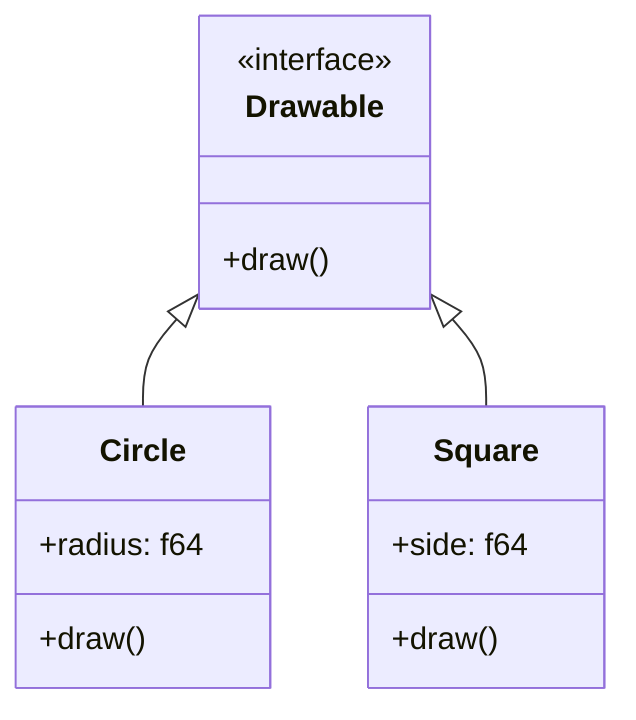

## 4.4. Traits and Trait Objects

In Rust, traits are a powerful feature that enables polymorphism and code reuse. They allow you to define shared behavior across different types, providing a way to write generic and flexible code. In this section, we will delve into the intricacies of defining and implementing traits, using trait objects for dynamic dispatch, and leveraging traits for polymorphism. We will also explore how traits play a crucial role in implementing design patterns like Strategy and Observer.

### Understanding Traits in Rust

Traits in Rust are similar to interfaces in other programming languages. They define a set of methods that a type must implement. By using traits, you can write code that is generic over different types, as long as those types implement the required traits.

#### Defining Traits

To define a trait in Rust, you use the `trait` keyword followed by the trait name and a block containing method signatures. Here's a simple example:

```rust
trait Drawable {
    fn draw(&self);
}
```

In this example, we define a trait `Drawable` with a single method `draw`. Any type that implements this trait must provide a concrete implementation of the `draw` method.

#### Implementing Traits for Custom Types

Once a trait is defined, you can implement it for any type. Let's implement the `Drawable` trait for a `Circle` struct:

```rust
struct Circle {
    radius: f64,
}

impl Drawable for Circle {
    fn draw(&self) {
        println!("Drawing a circle with radius {}", self.radius);
    }
}
```

Here, we define a `Circle` struct and implement the `Drawable` trait for it. The `draw` method is implemented to print a message indicating the circle's radius.

#### Associated Types in Traits

Traits can also have associated types, which are a way to define a placeholder type that is used within the trait. This allows for more flexibility and type safety. Here's an example:

```rust
trait Iterator {
    type Item;

    fn next(&mut self) -> Option<Self::Item>;
}
```

In this example, the `Iterator` trait has an associated type `Item`. Any type that implements this trait must specify what `Item` is.

### Using Trait Bounds and Generic Constraints

Trait bounds allow you to specify that a generic type parameter must implement a particular trait. This is useful for writing functions that can operate on any type that implements a specific trait.

#### Example of Trait Bounds

Here's a function that takes any type that implements the `Drawable` trait:

```rust
fn draw_shape<T: Drawable>(shape: &T) {
    shape.draw();
}
```

In this example, the `draw_shape` function is generic over any type `T` that implements the `Drawable` trait. This allows the function to accept any drawable shape.

### Trait Objects and Dynamic Dispatch

Trait objects enable dynamic dispatch in Rust, allowing you to work with types that implement a trait without knowing the exact type at compile time. This is achieved using the `dyn` keyword.

#### Creating Trait Objects

To create a trait object, you use a reference or a smart pointer to a type that implements a trait, prefixed with `dyn`. Here's an example:

```rust
fn draw_anything(shape: &dyn Drawable) {
    shape.draw();
}
```

In this example, `draw_anything` takes a reference to a `dyn Drawable`, allowing it to accept any type that implements the `Drawable` trait.

#### Using Trait Objects for Polymorphism

Trait objects are particularly useful for implementing design patterns that require polymorphism, such as the Strategy pattern. Here's an example:

```rust
trait Strategy {
    fn execute(&self);
}

struct ConcreteStrategyA;
struct ConcreteStrategyB;

impl Strategy for ConcreteStrategyA {
    fn execute(&self) {
        println!("Executing strategy A");
    }
}

impl Strategy for ConcreteStrategyB {
    fn execute(&self) {
        println!("Executing strategy B");
    }
}

struct Context {
    strategy: Box<dyn Strategy>,
}

impl Context {
    fn new(strategy: Box<dyn Strategy>) -> Self {
        Context { strategy }
    }

    fn execute_strategy(&self) {
        self.strategy.execute();
    }
}

fn main() {
    let strategy_a = Box::new(ConcreteStrategyA);
    let context = Context::new(strategy_a);
    context.execute_strategy();
}
```

In this example, we define a `Strategy` trait and two concrete strategies, `ConcreteStrategyA` and `ConcreteStrategyB`. The `Context` struct holds a `Box<dyn Strategy>`, allowing it to use any strategy at runtime.

### Leveraging Traits for Design Patterns

Traits are a fundamental building block for many design patterns in Rust. Let's explore how traits can be used to implement the Observer pattern.

#### Implementing the Observer Pattern

The Observer pattern involves a subject that maintains a list of observers and notifies them of any state changes. Here's how you can implement it using traits:

```rust
trait Observer {
    fn update(&self, message: &str);
}

struct Subject {
    observers: Vec<Box<dyn Observer>>,
}

impl Subject {
    fn new() -> Self {
        Subject { observers: Vec::new() }
    }

    fn add_observer(&mut self, observer: Box<dyn Observer>) {
        self.observers.push(observer);
    }

    fn notify_observers(&self, message: &str) {
        for observer in &self.observers {
            observer.update(message);
        }
    }
}

struct ConcreteObserver;

impl Observer for ConcreteObserver {
    fn update(&self, message: &str) {
        println!("Observer received message: {}", message);
    }
}

fn main() {
    let mut subject = Subject::new();
    let observer = Box::new(ConcreteObserver);
    subject.add_observer(observer);
    subject.notify_observers("Hello, observers!");
}
```

In this example, we define an `Observer` trait and a `Subject` struct that manages a list of observers. The `Subject` can add observers and notify them of messages.

### Best Practices for Using Traits and Trait Objects

- **Use Traits for Shared Behavior**: Define traits for behavior that is shared across multiple types.
- **Prefer Static Dispatch When Possible**: Use trait bounds for static dispatch when performance is critical.
- **Use Trait Objects for Flexibility**: Opt for trait objects when you need runtime polymorphism and flexibility.
- **Leverage Associated Types**: Use associated types to improve type safety and expressiveness in your traits.
- **Implement Design Patterns**: Utilize traits to implement design patterns like Strategy and Observer for clean and maintainable code.

### Try It Yourself

Experiment with the code examples provided in this section. Try defining your own traits and implementing them for different types. Use trait objects to achieve polymorphism and explore how traits can be used to implement design patterns.

### Visualizing Traits and Trait Objects

To better understand how traits and trait objects work in Rust, let's visualize the relationship between types, traits, and trait objects.



**Diagram Description**: This class diagram illustrates the relationship between the `Drawable` trait and the `Circle` and `Square` structs. Both structs implement the `Drawable` trait, allowing them to be used polymorphically.

### References and Further Reading

- [Rust Book: Traits](https://doc.rust-lang.org/book/ch10-02-traits.html)
- [Rust Reference: Traits](https://doc.rust-lang.org/reference/items/traits.html)
- [Rust By Example: Traits](https://doc.rust-lang.org/rust-by-example/trait.html)

### Knowledge Check

- What is a trait in Rust, and how does it differ from interfaces in other languages?
- How can you use trait bounds to write generic functions?
- What is the purpose of trait objects, and when should you use them?
- How do associated types enhance the flexibility of traits?
- Can you implement multiple traits for a single type? Why or why not?

### Embrace the Journey

Remember, mastering traits and trait objects is a journey. As you continue to explore Rust, you'll find that traits are a powerful tool for writing flexible and reusable code. Keep experimenting, stay curious, and enjoy the journey!

## Quiz Time!



### What is a trait in Rust?

- [x] A way to define shared behavior across different types.
- [ ] A type of variable.
- [ ] A function that returns a boolean.
- [ ] A method for memory management.

> **Explanation:** A trait in Rust is used to define shared behavior across different types, similar to interfaces in other languages.

### How do you define a trait in Rust?

- [x] Using the `trait` keyword followed by method signatures.
- [ ] Using the `struct` keyword.
- [ ] Using the `enum` keyword.
- [ ] Using the `fn` keyword.

> **Explanation:** Traits are defined using the `trait` keyword, followed by method signatures that types implementing the trait must define.

### What is a trait object?

- [x] A way to achieve dynamic dispatch in Rust.
- [ ] A type of struct.
- [ ] A function that returns a trait.
- [ ] A method for static dispatch.

> **Explanation:** Trait objects allow for dynamic dispatch in Rust, enabling polymorphism at runtime.

### What is the purpose of associated types in traits?

- [x] To define placeholder types used within a trait.
- [ ] To specify the size of a trait.
- [ ] To implement a trait for a struct.
- [ ] To define a trait object.

> **Explanation:** Associated types in traits allow for defining placeholder types that are used within the trait, enhancing flexibility and type safety.

### How can you implement a trait for a custom type?

- [x] By using the `impl` keyword followed by the trait and type.
- [ ] By using the `fn` keyword.
- [ ] By using the `enum` keyword.
- [ ] By using the `struct` keyword.

> **Explanation:** Traits are implemented for custom types using the `impl` keyword, followed by the trait and the type.

### What is the benefit of using trait bounds?

- [x] They allow for writing generic functions that operate on any type implementing a specific trait.
- [ ] They increase the size of a struct.
- [ ] They decrease the size of a struct.
- [ ] They are used for memory management.

> **Explanation:** Trait bounds enable writing generic functions that can operate on any type implementing a specific trait, enhancing code reusability.

### When should you use trait objects?

- [x] When you need runtime polymorphism and flexibility.
- [ ] When you need compile-time polymorphism.
- [ ] When you need to define a new struct.
- [ ] When you need to define a new enum.

> **Explanation:** Trait objects are used when runtime polymorphism and flexibility are required, allowing for dynamic dispatch.

### Can a single type implement multiple traits?

- [x] Yes, a single type can implement multiple traits.
- [ ] No, a single type can only implement one trait.
- [ ] Yes, but only if they are related traits.
- [ ] No, traits cannot be implemented for types.

> **Explanation:** In Rust, a single type can implement multiple traits, allowing for flexible and reusable code.

### What is dynamic dispatch?

- [x] A way to determine which method to call at runtime.
- [ ] A way to determine which method to call at compile time.
- [ ] A method for memory management.
- [ ] A type of trait.

> **Explanation:** Dynamic dispatch is a mechanism to determine which method to call at runtime, often used with trait objects.

### True or False: Traits can have associated types.

- [x] True
- [ ] False

> **Explanation:** Traits in Rust can have associated types, which are placeholder types used within the trait to enhance flexibility and type safety.




