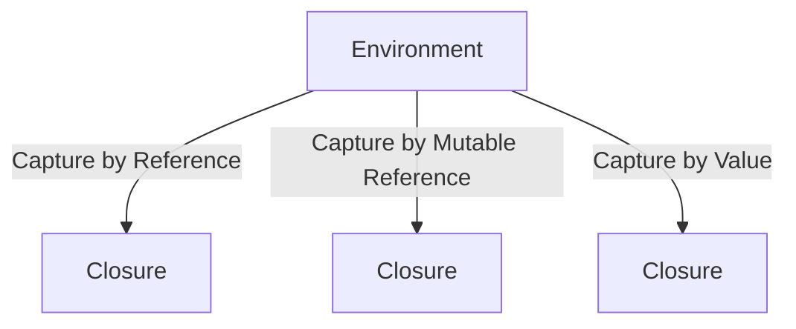

## 4.5. Closures and Functional Programming in Rust

Functional programming is a paradigm that treats computation as the evaluation of mathematical functions and avoids changing state or mutable data. Rust, while primarily a systems programming language, provides robust support for functional programming concepts, particularly through the use of closures. In this section, we will delve into closures, their syntax, and how they enable functional programming in Rust.

### Understanding Closures in Rust

#### What Are Closures?

Closures are anonymous functions that can capture variables from their surrounding environment. They are similar to lambda expressions in other programming languages and are a powerful feature in Rust, allowing for concise and expressive code.

#### Syntax of Closures

In Rust, closures are defined using a pair of vertical bars `|` to enclose the parameters, followed by the function body. Here's a basic example:

```rust
fn main() {
    let add = |a: i32, b: i32| -> i32 { a + b };
    println!("Sum: {}", add(2, 3));
}
```

In this example, `add` is a closure that takes two `i32` parameters and returns their sum. Notice how the closure syntax is compact and similar to regular function syntax.

#### Capturing the Environment

Closures in Rust can capture variables from their environment in three ways:

1. **By Reference**: Borrowing variables from the environment.
2. **By Mutable Reference**: Mutably borrowing variables.
3. **By Value**: Taking ownership of variables.

The Rust compiler automatically infers how a closure captures variables based on how they are used within the closure.

```rust
fn main() {
    let x = 10;
    let print_x = || println!("x: {}", x); // Captures x by reference
    print_x();
}
```

In the above example, the closure `print_x` captures `x` by reference because it only needs to read `x`.

### Closures and the Standard Library

Rust's standard library provides several functions that leverage closures, enabling powerful functional programming techniques.

#### Using `map`, `filter`, and `fold`

- **`map`**: Transforms each element of an iterator using a closure.

```rust
fn main() {
    let numbers = vec![1, 2, 3, 4, 5];
    let doubled: Vec<i32> = numbers.iter().map(|x| x * 2).collect();
    println!("{:?}", doubled);
}
```

- **`filter`**: Filters elements of an iterator based on a predicate closure.

```rust
fn main() {
    let numbers = vec![1, 2, 3, 4, 5];
    let even_numbers: Vec<i32> = numbers.iter().filter(|&&x| x % 2 == 0).collect();
    println!("{:?}", even_numbers);
}
```

- **`fold`**: Accumulates values across an iterator using a closure.

```rust
fn main() {
    let numbers = vec![1, 2, 3, 4, 5];
    let sum: i32 = numbers.iter().fold(0, |acc, &x| acc + x);
    println!("Sum: {}", sum);
}
```

### Writing Concise and Expressive Code

Closures allow developers to write concise and expressive code by reducing boilerplate and focusing on the logic. Consider the following example that uses closures to sort a vector of tuples by the second element:

```rust
fn main() {
    let mut pairs = vec![(1, 2), (3, 1), (5, 4)];
    pairs.sort_by(|a, b| a.1.cmp(&b.1));
    println!("{:?}", pairs);
}
```

Here, the closure passed to `sort_by` compares the second elements of the tuples, demonstrating how closures can simplify code.

### Immutability and Purity in Rust

In functional programming, immutability and purity are key concepts. Rust enforces immutability by default, meaning variables cannot be changed unless explicitly marked as mutable. This aligns well with functional programming principles, promoting safer and more predictable code.

#### Immutability

```rust
fn main() {
    let x = 5;
    // x = 6; // This would cause a compile-time error
    println!("x: {}", x);
}
```

#### Purity

A pure function is one that, given the same inputs, will always produce the same outputs and has no side effects. While Rust does not enforce purity, closures can be used to write pure functions.

```rust
fn main() {
    let square = |x: i32| -> i32 { x * x };
    println!("Square of 3: {}", square(3));
}
```

### Visualizing Closure Capture

To better understand how closures capture their environment, let's visualize the process using a diagram.



This diagram illustrates the different ways closures can capture variables from their environment, providing a clear visual representation of the concept.

### Try It Yourself

Experiment with closures by modifying the examples provided. Try changing how variables are captured or use closures with different standard library functions. This hands-on approach will deepen your understanding of closures in Rust.

### References and Further Reading

- [Rust Book: Closures](https://doc.rust-lang.org/book/ch13-01-closures.html)
- [Rust by Example: Closures](https://doc.rust-lang.org/rust-by-example/fn/closures.html)
- [MDN Web Docs: Functional Programming](https://developer.mozilla.org/en-US/docs/Web/JavaScript/Guide/Functions#functional_programming)

### Knowledge Check

- What are closures in Rust, and how do they differ from regular functions?
- How do closures capture variables from their environment?
- What are some common standard library functions that use closures?
- How does Rust's approach to immutability support functional programming?

### Embrace the Journey

Remember, mastering closures and functional programming in Rust is a journey. As you continue to explore these concepts, you'll find new ways to write efficient and expressive code. Keep experimenting, stay curious, and enjoy the process!

## Quiz Time!



### What is a closure in Rust?

- [x] An anonymous function that can capture variables from its environment
- [ ] A function that cannot capture variables from its environment
- [ ] A named function that captures variables by default
- [ ] A function that only captures variables by value

> **Explanation:** A closure is an anonymous function that can capture variables from its environment, allowing it to access and modify these variables.

### How does Rust determine how a closure captures variables?

- [x] The Rust compiler infers how a closure captures variables based on their usage
- [ ] The programmer must explicitly specify how each variable is captured
- [ ] All variables are captured by value by default
- [ ] All variables are captured by reference by default

> **Explanation:** The Rust compiler automatically infers how a closure captures variables based on how they are used within the closure.

### Which standard library function is used to transform each element of an iterator using a closure?

- [x] `map`
- [ ] `filter`
- [ ] `fold`
- [ ] `collect`

> **Explanation:** The `map` function is used to transform each element of an iterator using a closure.

### What is the purpose of the `filter` function in Rust?

- [x] To filter elements of an iterator based on a predicate closure
- [ ] To transform each element of an iterator
- [ ] To accumulate values across an iterator
- [ ] To sort elements of an iterator

> **Explanation:** The `filter` function is used to filter elements of an iterator based on a predicate closure.

### What is a pure function?

- [x] A function that always produces the same output for the same input and has no side effects
- [ ] A function that can modify global state
- [ ] A function that produces different outputs for the same input
- [ ] A function that captures variables by value

> **Explanation:** A pure function always produces the same output for the same input and has no side effects, aligning with functional programming principles.

### How does Rust enforce immutability?

- [x] Variables are immutable by default unless explicitly marked as mutable
- [ ] All variables are mutable by default
- [ ] Immutability is enforced only for closures
- [ ] Immutability is not enforced in Rust

> **Explanation:** In Rust, variables are immutable by default unless explicitly marked as mutable, promoting safer and more predictable code.

### What is the `fold` function used for in Rust?

- [x] To accumulate values across an iterator using a closure
- [ ] To filter elements of an iterator
- [ ] To transform each element of an iterator
- [ ] To sort elements of an iterator

> **Explanation:** The `fold` function is used to accumulate values across an iterator using a closure.

### Which of the following is a characteristic of functional programming?

- [x] Immutability
- [ ] Mutable state
- [ ] Side effects
- [ ] Global variables

> **Explanation:** Immutability is a key characteristic of functional programming, promoting safer and more predictable code.

### What is the result of the following closure: `|x: i32| -> i32 { x * x }` when called with `3`?

- [x] 9
- [ ] 6
- [ ] 3
- [ ] 0

> **Explanation:** The closure squares the input, so when called with `3`, it returns `9`.

### True or False: Closures in Rust can only capture variables by value.

- [ ] True
- [x] False

> **Explanation:** Closures in Rust can capture variables by reference, mutable reference, or by value, depending on how they are used within the closure.


