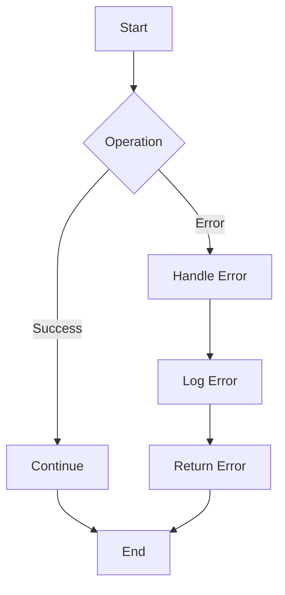

## 4.6. Error Handling with `Result` and `Option`

In Rust, error handling is a critical aspect of writing robust and reliable software. Rust provides two primary types for handling errors and optional values: `Result` and `Option`. These types are integral to Rust's approach to error handling, which emphasizes safety and explicitness. In this section, we'll explore how to effectively use `Result` and `Option`, introduce the `?` operator for error propagation, and discuss advanced techniques using the `anyhow` and `thiserror` crates for custom error handling.

### Understanding `Result` and `Option`

#### The `Result` Type

The `Result` type is used for functions that can return an error. It is defined as:

```rust
enum Result<T, E> {
    Ok(T),
    Err(E),
}
```

- **`Ok(T)`**: Represents a successful outcome, containing a value of type `T`.
- **`Err(E)`**: Represents an error, containing an error value of type `E`.

#### The `Option` Type

The `Option` type is used for values that may or may not be present. It is defined as:

```rust
enum Option<T> {
    Some(T),
    None,
}
```

- **`Some(T)`**: Represents a value of type `T`.
- **`None`**: Represents the absence of a value.

### Using `Result` and `Option`

#### Basic Usage of `Result`

When using `Result`, you typically match on the result to handle both success and error cases:

```rust
fn divide(dividend: f64, divisor: f64) -> Result<f64, String> {
    if divisor == 0.0 {
        Err(String::from("Cannot divide by zero"))
    } else {
        Ok(dividend / divisor)
    }
}

fn main() {
    match divide(10.0, 2.0) {
        Ok(result) => println!("Result: {}", result),
        Err(e) => println!("Error: {}", e),
    }
}
```

#### Basic Usage of `Option`

Similarly, `Option` is used to handle optional values:

```rust
fn find_word(words: Vec<&str>, target: &str) -> Option<usize> {
    words.iter().position(|&word| word == target)
}

fn main() {
    let words = vec!["apple", "banana", "cherry"];
    match find_word(words, "banana") {
        Some(index) => println!("Found at index: {}", index),
        None => println!("Not found"),
    }
}
```

### Error Propagation with the `?` Operator

The `?` operator is a syntactic sugar that simplifies error propagation. It can be used in functions that return a `Result` or `Option`, allowing you to propagate errors or `None` values without explicit matching.

#### Using `?` with `Result`

Here's how you can use the `?` operator to simplify error handling:

```rust
fn read_file(file_path: &str) -> Result<String, std::io::Error> {
    let mut file = std::fs::File::open(file_path)?;
    let mut contents = String::new();
    file.read_to_string(&mut contents)?;
    Ok(contents)
}
```

In this example, if any operation returns an `Err`, the function will return immediately with that error.

#### Using `?` with `Option`

The `?` operator can also be used with `Option`:

```rust
fn get_first_char(s: &str) -> Option<char> {
    s.chars().next()?
}
```

If `next()` returns `None`, the function will return `None` immediately.

### Advanced Error Handling with `anyhow` and `thiserror`

For more complex error handling scenarios, Rust provides crates like `anyhow` and `thiserror`.

#### The `anyhow` Crate

The `anyhow` crate is used for error handling where you don't need to define custom error types. It provides a simple way to handle errors with minimal boilerplate.

```rust
use anyhow::{Result, Context};

fn read_file(file_path: &str) -> Result<String> {
    let mut file = std::fs::File::open(file_path)
        .with_context(|| format!("Failed to open file: {}", file_path))?;
    let mut contents = String::new();
    file.read_to_string(&mut contents)?;
    Ok(contents)
}

fn main() -> Result<()> {
    let contents = read_file("example.txt")?;
    println!("File contents: {}", contents);
    Ok(())
}
```

#### The `thiserror` Crate

The `thiserror` crate is used for defining custom error types with less boilerplate. It provides a convenient way to derive error types.

```rust
use thiserror::Error;

#[derive(Error, Debug)]
pub enum MyError {
    #[error("File not found: {0}")]
    NotFound(String),
    #[error("Permission denied")]
    PermissionDenied,
}

fn open_file(file_path: &str) -> Result<(), MyError> {
    if file_path == "not_found.txt" {
        Err(MyError::NotFound(file_path.to_string()))
    } else {
        Ok(())
    }
}

fn main() {
    match open_file("not_found.txt") {
        Ok(_) => println!("File opened successfully"),
        Err(e) => println!("Error: {}", e),
    }
}
```

### Defining and Using Custom Error Types

Defining custom error types allows for more precise error handling and better error messages. You can define custom error types using enums or structs.

#### Enum-Based Custom Error Types

```rust
#[derive(Debug)]
enum MathError {
    DivisionByZero,
    NegativeLogarithm,
}

fn divide(a: f64, b: f64) -> Result<f64, MathError> {
    if b == 0.0 {
        Err(MathError::DivisionByZero)
    } else {
        Ok(a / b)
    }
}
```

#### Struct-Based Custom Error Types

```rust
#[derive(Debug)]
struct ParseError {
    line: usize,
    column: usize,
    message: String,
}

fn parse_line(line: &str) -> Result<(), ParseError> {
    if line.is_empty() {
        Err(ParseError {
            line: 1,
            column: 0,
            message: String::from("Empty line"),
        })
    } else {
        Ok(())
    }
}
```

### Creating Robust and User-Friendly Error Messages

To create robust and user-friendly error messages, consider the following strategies:

- **Provide Context**: Use the `with_context` method from the `anyhow` crate to add context to errors.
- **Use Descriptive Messages**: Ensure error messages are clear and descriptive.
- **Log Errors**: Use logging to capture errors for debugging purposes.
- **Handle Errors Gracefully**: Ensure your application can recover from errors where possible.

### Visualizing Error Handling Flow

To better understand how error handling works in Rust, let's visualize the flow using a Mermaid.js diagram:



This diagram illustrates the typical flow of error handling in Rust, where operations can either succeed and continue or fail and handle the error.

### Try It Yourself

To deepen your understanding, try modifying the code examples provided:

- **Experiment with the `?` operator**: Try using it in different functions and see how it simplifies error handling.
- **Create a custom error type**: Define your own error type and use it in a function.
- **Use the `anyhow` crate**: Integrate `anyhow` into a small project and observe how it simplifies error handling.

### External Resources

For further reading on error handling in Rust, consider the following resources:

- [Rust Error Handling](https://doc.rust-lang.org/book/ch09-02-recoverable-errors-with-result.html)
- [anyhow crate documentation](https://crates.io/crates/anyhow)
- [thiserror crate documentation](https://crates.io/crates/thiserror)

### Knowledge Check

- **What is the primary purpose of the `Result` type in Rust?**
- **How does the `?` operator simplify error handling?**
- **What are the benefits of using the `anyhow` crate?**
- **How can you define a custom error type in Rust?**

### Summary

In this section, we've explored how to handle errors and optional values in Rust using the `Result` and `Option` types. We've discussed the `?` operator for simplifying error propagation and introduced the `anyhow` and `thiserror` crates for advanced error handling. By following these best practices, you can create robust and user-friendly Rust applications.

Remember, mastering error handling is a journey. Keep experimenting, stay curious, and enjoy the process of building reliable software with Rust!

## Quiz Time!



### What is the primary purpose of the `Result` type in Rust?

- [x] To handle operations that can succeed or fail
- [ ] To represent optional values
- [ ] To manage memory allocation
- [ ] To define custom data structures

> **Explanation:** The `Result` type is used to handle operations that can either succeed or fail, encapsulating the outcome in `Ok` or `Err`.

### How does the `?` operator simplify error handling?

- [x] It propagates errors automatically
- [ ] It converts errors into strings
- [ ] It logs errors to the console
- [ ] It ignores errors

> **Explanation:** The `?` operator automatically propagates errors, allowing functions to return early with an error if one occurs.

### What are the benefits of using the `anyhow` crate?

- [x] Simplifies error handling with minimal boilerplate
- [x] Provides context to errors
- [ ] Automatically fixes errors
- [ ] Converts errors to warnings

> **Explanation:** The `anyhow` crate simplifies error handling by reducing boilerplate and allowing you to add context to errors.

### How can you define a custom error type in Rust?

- [x] Using enums or structs
- [ ] Using macros
- [ ] Using functions
- [ ] Using arrays

> **Explanation:** Custom error types in Rust can be defined using enums or structs to encapsulate error information.

### What is the `Option` type used for in Rust?

- [x] To represent optional values
- [ ] To handle errors
- [ ] To manage concurrency
- [ ] To define constants

> **Explanation:** The `Option` type is used to represent values that may or may not be present, encapsulating them in `Some` or `None`.

### Which crate is used for defining custom error types with less boilerplate?

- [x] `thiserror`
- [ ] `anyhow`
- [ ] `serde`
- [ ] `tokio`

> **Explanation:** The `thiserror` crate is used to define custom error types with less boilerplate by deriving error types.

### What is the purpose of the `with_context` method in the `anyhow` crate?

- [x] To add context to errors
- [ ] To remove errors
- [ ] To convert errors to warnings
- [ ] To log errors

> **Explanation:** The `with_context` method in the `anyhow` crate is used to add additional context to errors, making them more informative.

### What does the `Err` variant in the `Result` type represent?

- [x] An error outcome
- [ ] A successful outcome
- [ ] An optional value
- [ ] A null value

> **Explanation:** The `Err` variant in the `Result` type represents an error outcome, encapsulating the error information.

### How can you handle an error returned by a function that returns a `Result`?

- [x] By matching on the `Result`
- [ ] By ignoring the error
- [ ] By converting it to an `Option`
- [ ] By logging it

> **Explanation:** You can handle an error returned by a function that returns a `Result` by matching on the `Result` to handle both `Ok` and `Err` cases.

### True or False: The `?` operator can be used with both `Result` and `Option`.

- [x] True
- [ ] False

> **Explanation:** The `?` operator can be used with both `Result` and `Option` to propagate errors or `None` values.




