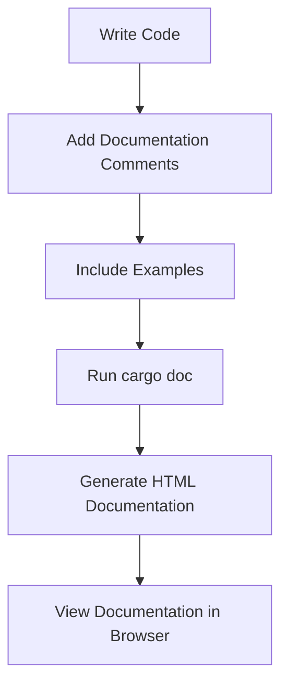

## 4.7. Documentation with `rustdoc`

In the world of software development, documentation is as crucial as the code itself. It serves as a guide for developers to understand, use, and maintain the codebase. Rust, with its strong emphasis on safety and performance, also provides robust tools for documentation. `rustdoc` is the tool that Rust developers use to generate documentation directly from the source code. In this section, we will explore how to effectively document Rust code using `rustdoc`, including writing documentation comments, best practices, and generating documentation websites.

### Understanding `rustdoc`

`rustdoc` is a tool included with the Rust toolchain that generates HTML documentation from Rust source code. It extracts comments written in a specific format and compiles them into a user-friendly format. This approach ensures that documentation is always in sync with the code, reducing the risk of outdated or incorrect information.

### Writing Documentation Comments

Rust supports two types of documentation comments: line comments and block comments. These comments are used to describe the functionality of code elements such as functions, structs, and modules.

#### Line Documentation Comments

Line documentation comments are written using three slashes (`///`). They are placed directly above the item they document.

```rust
/// Adds two numbers together.
///
/// # Examples
///
/// ```
/// let sum = add(2, 3);
/// assert_eq!(sum, 5);
/// ```
fn add(a: i32, b: i32) -> i32 {
    a + b
}
```

In this example, the `add` function is documented with a brief description and an example. The example is enclosed in triple backticks and can be tested using `rustdoc`.

#### Block Documentation Comments

Block documentation comments are written using `//!` and are typically used to document modules or crates.

```rust
//! This module provides utilities for mathematical operations.

/// Subtracts one number from another.
///
/// # Examples
///
/// ```
/// let difference = subtract(5, 3);
/// assert_eq!(difference, 2);
/// ```
fn subtract(a: i32, b: i32) -> i32 {
    a - b
}
```

Here, the block comment describes the purpose of the module, while the line comment documents the `subtract` function.

### Best Practices for Writing Documentation

Writing clear and informative documentation is essential for maintaining a codebase. Here are some best practices to follow:

1. **Be Concise and Clear**: Use simple language to describe what the code does. Avoid jargon unless necessary.
2. **Use Examples**: Provide examples to demonstrate how the code can be used. This helps users understand the context and application.
3. **Organize Content**: Use headings and bullet points to organize information. This makes it easier to read and navigate.
4. **Keep It Up-to-Date**: Regularly update documentation to reflect changes in the code. Outdated documentation can lead to confusion and errors.
5. **Use Consistent Style**: Maintain a consistent style throughout the documentation. This includes formatting, tone, and terminology.

### Including Examples and Code Snippets

Examples are a powerful way to illustrate how a piece of code works. In Rust, examples included in documentation comments can be tested to ensure they remain valid.

#### Testing Examples

Rust allows you to test examples in documentation comments using `rustdoc`. This ensures that the examples are always accurate and functional.

```rust
/// Multiplies two numbers.
///
/// # Examples
///
/// ```
/// let product = multiply(4, 5);
/// assert_eq!(product, 20);
/// ```
fn multiply(a: i32, b: i32) -> i32 {
    a * b
}
```

To test the examples, run the following command:

```bash
cargo test --doc
```

This command will execute the code snippets in your documentation comments as tests.

### Generating Documentation with `cargo doc`

Generating documentation with `rustdoc` is straightforward using Cargo, Rust's package manager and build system. The `cargo doc` command generates HTML documentation for your project.

#### Steps to Generate Documentation

1. **Navigate to Your Project Directory**: Open a terminal and navigate to the root directory of your Rust project.
2. **Run `cargo doc`**: Execute the following command to generate documentation:

   ```bash
   cargo doc
   ```

3. **Open the Documentation**: Once generated, you can view the documentation by opening the `target/doc/index.html` file in a web browser.

#### Customizing Documentation

You can customize the generated documentation by adding a `#![doc = ""]` attribute at the crate level or by using `#[doc = ""]` attributes on individual items.

```rust
#![doc = "This crate provides utilities for mathematical operations."]
```

### Importance of Keeping Documentation Up-to-Date

Documentation is only useful if it accurately reflects the code. As the code evolves, it's crucial to update the documentation to match. This practice helps maintain the reliability and usability of the documentation.

### Visualizing Documentation Workflow

To better understand the workflow of documenting Rust code with `rustdoc`, let's visualize the process using a Mermaid.js flowchart.



**Caption**: This flowchart illustrates the process of documenting Rust code using `rustdoc`, from writing code to viewing the generated documentation.

### References and Further Reading

For more information on `rustdoc` and Rust documentation practices, consider the following resources:

- [The Rust Programming Language Book](https://doc.rust-lang.org/book/)
- [Rust Documentation Guidelines](https://doc.rust-lang.org/rustdoc/how-to-write-documentation.html)
- [Rust By Example](https://doc.rust-lang.org/rust-by-example/)

### Knowledge Check

To reinforce your understanding of documenting Rust code with `rustdoc`, consider the following questions and exercises:

1. **What is the difference between `///` and `//!` comments?**
2. **Why is it important to include examples in documentation?**
3. **How can you test examples in documentation comments?**
4. **What command is used to generate HTML documentation in Rust?**
5. **Why is it important to keep documentation up-to-date?**

### Embrace the Journey

Remember, mastering documentation is an ongoing journey. As you continue to develop in Rust, keep experimenting with different documentation styles and techniques. Stay curious, and enjoy the process of making your code more accessible and understandable to others!

## Quiz Time!



### What is the primary purpose of `rustdoc`?

- [x] To generate HTML documentation from Rust source code
- [ ] To compile Rust code into binaries
- [ ] To manage Rust project dependencies
- [ ] To test Rust code

> **Explanation:** `rustdoc` is a tool used to generate HTML documentation from Rust source code by extracting comments written in a specific format.

### Which comment style is used for documenting modules or crates in Rust?

- [ ] `///`
- [x] `//!`
- [ ] `/* */`
- [ ] `//`

> **Explanation:** The `//!` style is used for block documentation comments, typically to document modules or crates.

### How can you test examples included in Rust documentation comments?

- [x] By running `cargo test --doc`
- [ ] By running `cargo build`
- [ ] By running `cargo run`
- [ ] By running `cargo check`

> **Explanation:** The `cargo test --doc` command executes the code snippets in documentation comments as tests.

### What command is used to generate HTML documentation for a Rust project?

- [x] `cargo doc`
- [ ] `cargo build`
- [ ] `cargo run`
- [ ] `cargo test`

> **Explanation:** The `cargo doc` command generates HTML documentation for a Rust project.

### Why is it important to keep documentation up-to-date?

- [x] To ensure it accurately reflects the code
- [ ] To reduce the size of the codebase
- [ ] To improve code execution speed
- [ ] To decrease compilation time

> **Explanation:** Keeping documentation up-to-date ensures that it accurately reflects the code, which is crucial for maintaining reliability and usability.

### What is a best practice when writing documentation?

- [x] Use clear and concise language
- [ ] Use complex technical jargon
- [ ] Avoid using examples
- [ ] Write documentation after the project is complete

> **Explanation:** Using clear and concise language is a best practice for writing documentation, making it easier for others to understand.

### Which tool is used to manage Rust project dependencies?

- [ ] rustdoc
- [x] Cargo
- [ ] Clippy
- [ ] rustfmt

> **Explanation:** Cargo is the tool used to manage Rust project dependencies, build projects, and more.

### What is the benefit of including examples in documentation?

- [x] To demonstrate how the code can be used
- [ ] To increase the complexity of the documentation
- [ ] To reduce the need for comments in the code
- [ ] To make the documentation longer

> **Explanation:** Including examples in documentation helps demonstrate how the code can be used, providing context and application.

### Which of the following is NOT a type of documentation comment in Rust?

- [ ] `///`
- [ ] `//!`
- [x] `/* */`
- [ ] `#[doc = ""]`

> **Explanation:** `/* */` is a general comment style, not specifically for documentation in Rust.

### True or False: `rustdoc` can generate documentation for private items by default.

- [ ] True
- [x] False

> **Explanation:** By default, `rustdoc` generates documentation only for public items. Private items are not included unless specified otherwise.




