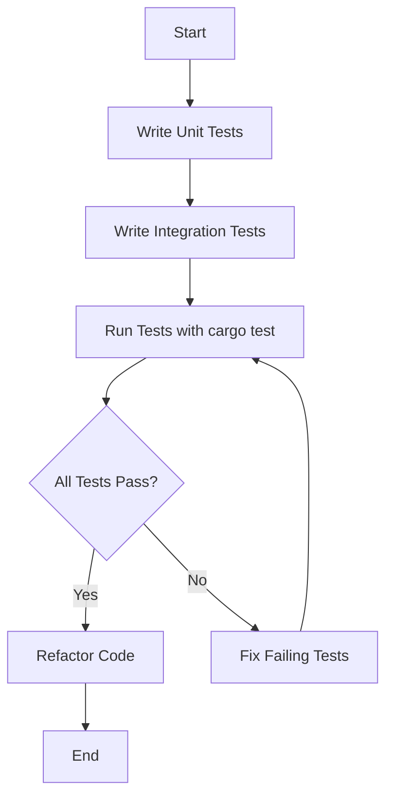

## 4.8. Testing with `cargo test`

Testing is a crucial aspect of software development, ensuring that code behaves as expected and is free from defects. In Rust, the `cargo test` command provides a powerful and flexible testing framework that allows developers to write and execute tests efficiently. In this section, we'll explore how to write unit tests and integration tests in Rust, organize them effectively, and leverage test-driven development (TDD) to enhance code quality.

### Writing Unit Tests in Rust

Unit tests focus on testing individual components or functions in isolation. In Rust, unit tests are typically written within the same file as the code they test, using the `#[cfg(test)]` attribute to conditionally compile the test code.

#### Creating Unit Tests

To create a unit test, you define a module with the `#[cfg(test)]` attribute and write test functions within it. Each test function is annotated with `#[test]`.

```rust
// src/lib.rs

pub fn add(a: i32, b: i32) -> i32 {
    a + b
}

#[cfg(test)]
mod tests {
    use super::*;

    #[test]
    fn test_add() {
        assert_eq!(add(2, 3), 5);
    }

    #[test]
    fn test_add_negative() {
        assert_eq!(add(-2, -3), -5);
    }
}
```

In this example, we define a simple `add` function and two unit tests to verify its behavior. The `assert_eq!` macro is used to assert that the function's output matches the expected result.

#### Running Unit Tests

To run the unit tests, use the `cargo test` command in the terminal:

```bash
$ cargo test
```

This command compiles the tests and executes them, providing a summary of the results.

### Organizing Integration Tests

Integration tests verify the behavior of multiple components working together. In Rust, integration tests are placed in the `tests/` directory at the root of the project. Each file in this directory is compiled as a separate crate, allowing for more comprehensive testing.

#### Creating Integration Tests

Create a new file in the `tests/` directory and write test functions using the `#[test]` attribute.

```rust
// tests/integration_test.rs

use my_crate::add;

#[test]
fn test_add_integration() {
    assert_eq!(add(10, 20), 30);
}
```

In this example, we test the `add` function from the `my_crate` library, ensuring it works correctly in an integration context.

#### Running Integration Tests

Integration tests are also executed using the `cargo test` command. By default, `cargo test` runs both unit and integration tests.

### Setup and Teardown

In some cases, tests require setup and teardown code to prepare the environment or clean up resources. Rust provides the `#[test]` attribute with `#[should_panic]` for tests expected to fail, and you can use the `std::sync::Once` type for setup code that runs once per test suite.

```rust
// src/lib.rs

use std::sync::{Once, ONCE_INIT};

static INIT: Once = ONCE_INIT;

fn setup() {
    // Code to set up the test environment
}

#[cfg(test)]
mod tests {
    use super::*;

    #[test]
    fn test_with_setup() {
        INIT.call_once(|| {
            setup();
        });
        assert_eq!(add(1, 1), 2);
    }
}
```

### Assertions and Mock Objects

Assertions are used to verify that the code behaves as expected. Rust provides several macros for assertions, including `assert!`, `assert_eq!`, and `assert_ne!`.

For more complex testing scenarios, such as testing interactions with external systems, you can use mock objects. While Rust does not have built-in support for mocking, libraries like `mockall` and `double` provide powerful mocking capabilities.

```rust
// Example using mockall

use mockall::{automock, predicate::*};

#[automock]
trait Database {
    fn get_user(&self, user_id: u32) -> String;
}

#[cfg(test)]
mod tests {
    use super::*;
    use mockall::predicate::*;

    #[test]
    fn test_get_user() {
        let mut mock_db = MockDatabase::new();
        mock_db.expect_get_user()
            .with(eq(1))
            .returning(|_| "Alice".to_string());

        assert_eq!(mock_db.get_user(1), "Alice");
    }
}
```

### Test-Driven Development (TDD) in Rust

Test-driven development (TDD) is a software development approach where tests are written before the code they test. This approach encourages writing only the necessary code to pass the tests, leading to cleaner and more maintainable code.

#### Benefits of TDD

- **Improved Code Quality**: Writing tests first ensures that the code meets the specified requirements.
- **Refactoring Confidence**: With a comprehensive test suite, you can refactor code with confidence, knowing that tests will catch regressions.
- **Documentation**: Tests serve as documentation, illustrating how the code is expected to behave.

### Visualizing the Testing Process

To better understand the testing process in Rust, let's visualize the flow of unit and integration testing using a Mermaid.js diagram.



This diagram illustrates the iterative process of writing tests, running them, and refactoring code based on the test results.

### Try It Yourself

To deepen your understanding of Rust testing, try modifying the provided code examples:

- Add more test cases to the `add` function, including edge cases.
- Create a new integration test that verifies the behavior of multiple functions working together.
- Experiment with mock objects to test interactions with external systems.

### References and Further Reading

- [Rust Book: Testing](https://doc.rust-lang.org/book/ch11-00-testing.html)
- [Rust by Example: Testing](https://doc.rust-lang.org/rust-by-example/testing.html)
- [Mockall Documentation](https://docs.rs/mockall/latest/mockall/)

### Knowledge Check

- What is the purpose of the `#[cfg(test)]` attribute in Rust?
- How do you organize integration tests in a Rust project?
- What are the benefits of using TDD in Rust development?

### Embrace the Journey

Remember, testing is an ongoing process that evolves with your codebase. As you continue to develop in Rust, you'll refine your testing strategies and discover new ways to ensure code quality. Keep experimenting, stay curious, and enjoy the journey!

## Quiz Time!



### What is the primary purpose of unit tests in Rust?

- [x] To test individual components or functions in isolation
- [ ] To test the entire application as a whole
- [ ] To test the interaction between multiple components
- [ ] To test the performance of the application

> **Explanation:** Unit tests focus on testing individual components or functions in isolation to ensure they work as expected.

### Where are integration tests typically placed in a Rust project?

- [ ] In the `src/` directory
- [x] In the `tests/` directory
- [ ] In the `lib/` directory
- [ ] In the `bin/` directory

> **Explanation:** Integration tests are placed in the `tests/` directory at the root of the project.

### Which macro is used to assert that two values are equal in a Rust test?

- [ ] assert!
- [x] assert_eq!
- [ ] assert_ne!
- [ ] assert_approx_eq!

> **Explanation:** The `assert_eq!` macro is used to assert that two values are equal.

### What is the benefit of using mock objects in tests?

- [x] To simulate interactions with external systems
- [ ] To increase the performance of tests
- [ ] To reduce the number of test cases
- [ ] To simplify the test setup

> **Explanation:** Mock objects simulate interactions with external systems, allowing you to test code in isolation.

### What is a key benefit of test-driven development (TDD)?

- [x] Improved code quality
- [ ] Faster code execution
- [ ] Reduced code size
- [ ] Increased code complexity

> **Explanation:** TDD improves code quality by ensuring that code meets specified requirements through tests.

### Which attribute is used to conditionally compile test code in Rust?

- [ ] #[test]
- [x] #[cfg(test)]
- [ ] #[should_panic]
- [ ] #[derive(Test)]

> **Explanation:** The `#[cfg(test)]` attribute is used to conditionally compile test code.

### What is the purpose of the `#[should_panic]` attribute in Rust tests?

- [x] To indicate that a test is expected to panic
- [ ] To skip the test during execution
- [ ] To run the test multiple times
- [ ] To compile the test in release mode

> **Explanation:** The `#[should_panic]` attribute indicates that a test is expected to panic.

### How can you run only a specific test in a Rust project?

- [x] Use `cargo test <test_name>`
- [ ] Use `cargo run <test_name>`
- [ ] Use `cargo build <test_name>`
- [ ] Use `cargo check <test_name>`

> **Explanation:** You can run a specific test by using `cargo test <test_name>`.

### What is the role of the `std::sync::Once` type in test setup?

- [x] To ensure setup code runs once per test suite
- [ ] To run setup code before each test
- [ ] To run setup code after each test
- [ ] To skip setup code during testing

> **Explanation:** The `std::sync::Once` type ensures that setup code runs once per test suite.

### True or False: Integration tests in Rust are compiled as separate crates.

- [x] True
- [ ] False

> **Explanation:** Integration tests in Rust are compiled as separate crates, allowing for comprehensive testing.


