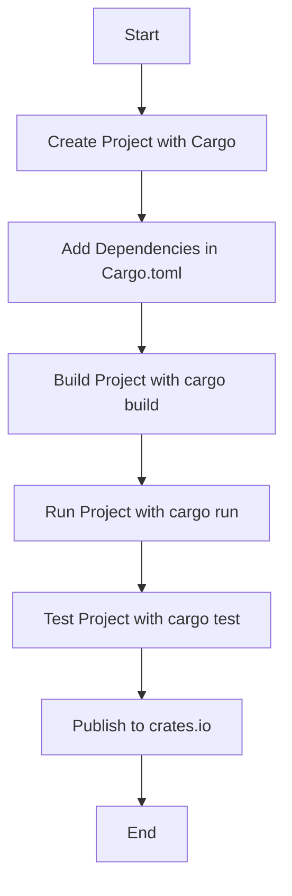

## 4.9. The Build System: Cargo

Cargo is the heart of Rust's ecosystem, serving as both a package manager and a build system. It simplifies the process of managing dependencies, building projects, and deploying Rust applications. In this section, we'll delve into the various features of Cargo, from creating new projects to leveraging advanced functionalities like workspaces and custom build scripts.

### Creating New Projects with Cargo

Cargo provides two primary commands for initializing new Rust projects: `cargo new` and `cargo init`. These commands streamline the setup process, allowing you to focus on writing code.

#### Using `cargo new`

The `cargo new` command creates a new directory with a basic Rust project structure. This includes a `Cargo.toml` file for managing dependencies and a `src` directory containing a `main.rs` file.

```bash
cargo new my_project
```

This command generates the following structure:

```
my_project/
├── Cargo.toml
└── src
    └── main.rs
```

- **`Cargo.toml`**: This file is the manifest for your project, where you specify dependencies and metadata.
- **`src/main.rs`**: The entry point of your application, containing the `main` function.

#### Using `cargo init`

If you already have a directory and want to initialize it as a Cargo project, use `cargo init`. This command sets up the necessary files without creating a new directory.

```bash
cd existing_directory
cargo init
```

### Managing Dependencies in `Cargo.toml`

The `Cargo.toml` file is where you declare your project's dependencies. It uses a simple TOML (Tom's Obvious, Minimal Language) format, making it easy to read and write.

#### Adding Dependencies

To add a dependency, specify its name and version in the `[dependencies]` section of `Cargo.toml`.

```toml
[dependencies]
serde = "1.0"
```

Cargo automatically fetches the specified version from [crates.io](https://crates.io), Rust's package registry.

#### Specifying Version Ranges

You can specify version ranges to ensure compatibility with future releases. For example, `serde = "1.0"` allows any version `>=1.0.0` and `<2.0.0`.

#### Using Features

Some crates offer optional features that you can enable in `Cargo.toml`.

```toml
[dependencies]
serde = { version = "1.0", features = ["derive"] }
```

### Building, Running, and Testing Projects

Cargo simplifies the build process with a set of intuitive commands.

#### Building Projects

Use `cargo build` to compile your project. This command creates an executable in the `target/debug` directory.

```bash
cargo build
```

For optimized builds, use `cargo build --release`, which places the executable in `target/release`.

#### Running Projects

To build and run your project in one step, use `cargo run`.

```bash
cargo run
```

This command is convenient for development, as it compiles and executes your code in a single step.

#### Testing Projects

Cargo includes built-in support for testing. Use `cargo test` to run all tests in your project.

```bash
cargo test
```

This command compiles your tests and executes them, providing detailed output on test results.

### Advanced Features of Cargo

Cargo offers several advanced features that enhance productivity and project organization.

#### Workspaces

Workspaces allow you to manage multiple related packages within a single repository. This is useful for monorepos or projects with shared dependencies.

Create a workspace by adding a `Cargo.toml` file in the root directory with a `[workspace]` section.

```toml
[workspace]
members = ["package1", "package2"]
```

Each member is a path to a package directory.

#### Custom Build Scripts

For complex build processes, you can use custom build scripts. These are Rust programs that run before your package is compiled.

Create a `build.rs` file in your package's root directory. Cargo automatically executes this script during the build process.

```rust
fn main() {
    println!("cargo:rerun-if-changed=build.rs");
}
```

Use build scripts to generate code, link external libraries, or perform other pre-build tasks.

#### Publishing to crates.io

To share your package with the Rust community, publish it to crates.io. First, ensure your `Cargo.toml` includes metadata like `name`, `version`, and `authors`.

```toml
[package]
name = "my_crate"
version = "0.1.0"
authors = ["Your Name <you@example.com>"]
```

Then, use `cargo publish` to upload your package.

```bash
cargo publish
```

Ensure you have an account on crates.io and have logged in using `cargo login`.

### Optimizing Build Times and Caching

Efficient builds are crucial for productivity, especially in large projects. Here are some tips for optimizing build times:

- **Use Incremental Compilation**: Cargo enables incremental compilation by default, reducing build times by only recompiling changed code.
- **Leverage Caching**: Cargo caches compiled dependencies, so they don't need to be rebuilt unless their version changes.
- **Parallel Builds**: Use the `-j` flag to specify the number of parallel jobs during compilation.

```bash
cargo build -j 4
```

- **Profile Builds**: Use `cargo build --profile` to customize build profiles for different scenarios, such as development or release.

### Visualizing Cargo's Workflow

To better understand Cargo's workflow, let's visualize the process of building and running a Rust project.



This diagram illustrates the typical lifecycle of a Rust project using Cargo, from creation to publication.

### Knowledge Check

Before we wrap up, let's reinforce what we've learned with a few questions:

- What command initializes a new Rust project in an existing directory?
- How do you specify optional features for a dependency in `Cargo.toml`?
- What is the purpose of a custom build script in Cargo?

### Embrace the Journey

Remember, mastering Cargo is a journey. As you become more familiar with its features, you'll find yourself building more complex and efficient Rust applications. Keep experimenting, stay curious, and enjoy the process!

### References and Further Reading

- [Cargo Book](https://doc.rust-lang.org/cargo/index.html)
- [crates.io](https://crates.io)
- [Rust Programming Language](https://www.rust-lang.org)

## Quiz Time!



### What command is used to create a new Rust project with Cargo?

- [x] `cargo new`
- [ ] `cargo create`
- [ ] `cargo init`
- [ ] `cargo start`

> **Explanation:** `cargo new` is the command used to create a new Rust project with Cargo, setting up a new directory with the necessary files.

### How do you add a dependency in Cargo?

- [x] By specifying it in `Cargo.toml`
- [ ] By using `cargo add`
- [ ] By placing it in `src/main.rs`
- [ ] By using `cargo install`

> **Explanation:** Dependencies are added by specifying them in the `Cargo.toml` file under the `[dependencies]` section.

### What is the purpose of `cargo run`?

- [x] To build and run the project
- [ ] To only build the project
- [ ] To only run the project
- [ ] To test the project

> **Explanation:** `cargo run` builds the project and then runs the resulting executable.

### Which file contains the metadata and dependencies for a Rust project?

- [x] `Cargo.toml`
- [ ] `main.rs`
- [ ] `Cargo.lock`
- [ ] `build.rs`

> **Explanation:** `Cargo.toml` is the file that contains metadata and dependencies for a Rust project.

### What is a workspace in Cargo?

- [x] A set of related packages managed together
- [ ] A single package with multiple binaries
- [ ] A directory for storing build artifacts
- [ ] A tool for testing Rust projects

> **Explanation:** A workspace in Cargo is a set of related packages that are managed together, allowing for shared dependencies and coordinated builds.

### How can you enable optional features for a dependency in Cargo?

- [x] By specifying them in `Cargo.toml` under the dependency
- [ ] By using `cargo feature`
- [ ] By modifying `main.rs`
- [ ] By using `cargo config`

> **Explanation:** Optional features for a dependency are enabled by specifying them in `Cargo.toml` under the dependency's entry.

### What command is used to publish a package to crates.io?

- [x] `cargo publish`
- [ ] `cargo upload`
- [ ] `cargo deploy`
- [ ] `cargo release`

> **Explanation:** `cargo publish` is the command used to publish a package to crates.io.

### What is the purpose of a custom build script in Cargo?

- [x] To perform tasks before the package is compiled
- [ ] To define the main entry point of the application
- [ ] To manage dependencies
- [ ] To run tests

> **Explanation:** A custom build script in Cargo is used to perform tasks before the package is compiled, such as generating code or linking external libraries.

### How can you optimize build times in Cargo?

- [x] By using incremental compilation and caching
- [ ] By disabling all features
- [ ] By using a single-threaded build
- [ ] By removing dependencies

> **Explanation:** Optimizing build times in Cargo can be achieved by using incremental compilation and caching, which reduce the need to recompile unchanged code.

### True or False: Cargo automatically runs tests when you build a project.

- [ ] True
- [x] False

> **Explanation:** Cargo does not automatically run tests when you build a project; you need to explicitly run `cargo test` to execute tests.


