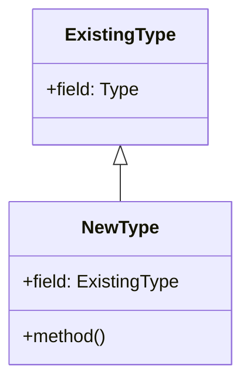

## 5.1. The Newtype Pattern

### Introduction

In Rust, the Newtype pattern is a design pattern that involves creating a new type that wraps an existing type. This pattern is particularly useful for providing additional type safety, abstraction, or implementing traits for types that are external or primitive. By leveraging the Newtype pattern, developers can enforce strong typing, encapsulate implementation details, and overcome certain limitations in Rust's trait system, such as the orphan rule.

### Intent of the Newtype Pattern

The primary intent of the Newtype pattern is to introduce a new layer of abstraction over existing types. This abstraction can serve several purposes:

- **Type Safety**: By creating a distinct type, you can prevent mixing up different types that may have similar underlying representations.
- **Encapsulation**: Hide the implementation details of a type, exposing only the necessary interface.
- **Trait Implementation**: Implement traits for types that you do not own, circumventing Rust's orphan rule.
- **Code Clarity**: Improve the readability and maintainability of code by providing meaningful names and abstractions.

### Scenarios for Using the Newtype Pattern

#### Enforcing Strong Typing

One of the most common uses of the Newtype pattern is to enforce strong typing. Consider a scenario where you have two different types of identifiers, such as `UserId` and `ProductId`, both represented as integers. Using the Newtype pattern, you can create distinct types for each identifier, preventing accidental misuse.

```rust
struct UserId(u32);
struct ProductId(u32);

fn get_user(user_id: UserId) {
    // Implementation to get user by UserId
}

fn get_product(product_id: ProductId) {
    // Implementation to get product by ProductId
}

fn main() {
    let user_id = UserId(1);
    let product_id = ProductId(2);

    get_user(user_id);
    // get_user(product_id); // This line would cause a compile-time error
}
```

In this example, `UserId` and `ProductId` are distinct types, even though they both wrap a `u32`. This prevents passing a `ProductId` where a `UserId` is expected, enhancing type safety.

#### Encapsulating Implementation Details

The Newtype pattern can also be used to encapsulate implementation details, exposing only the necessary interface. This is particularly useful when you want to hide the complexity of a type or provide a more user-friendly API.

```rust
struct Celsius(f64);

impl Celsius {
    fn new(value: f64) -> Self {
        Celsius(value)
    }

    fn to_fahrenheit(&self) -> f64 {
        self.0 * 1.8 + 32.0
    }
}

fn main() {
    let temp = Celsius::new(25.0);
    println!("Temperature in Fahrenheit: {}", temp.to_fahrenheit());
}
```

Here, the `Celsius` type encapsulates a `f64` value, providing a method to convert it to Fahrenheit. The internal representation is hidden, and users interact with the `Celsius` type through its public API.

#### Overcoming the Orphan Rule

Rust's orphan rule prevents you from implementing a trait for a type if both the trait and the type are defined outside of your crate. The Newtype pattern can help you work around this limitation by wrapping the external type in a new type that you define.

```rust
use std::fmt;

struct Wrapper(Vec<i32>);

impl fmt::Display for Wrapper {
    fn fmt(&self, f: &mut fmt::Formatter) -> fmt::Result {
        write!(f, "[{}]", self.0.iter().map(|x| x.to_string()).collect::<Vec<_>>().join(", "))
    }
}

fn main() {
    let numbers = Wrapper(vec![1, 2, 3]);
    println!("Numbers: {}", numbers);
}
```

In this example, we wrap a `Vec<i32>` in a `Wrapper` type, allowing us to implement the `Display` trait for it, which would not be possible directly due to the orphan rule.

### Benefits of the Newtype Pattern

The Newtype pattern offers several benefits:

- **Improved Code Safety**: By creating distinct types, you reduce the risk of type-related errors.
- **Clarity and Readability**: Meaningful type names improve code readability and convey intent.
- **Flexibility**: You can extend the functionality of existing types without modifying them.
- **Trait Implementation**: Implement traits for types you do not own, enhancing interoperability.

### Implementing the Newtype Pattern

Let's explore how to implement the Newtype pattern in Rust through various examples.

#### Wrapping Primitive Types

Wrapping primitive types is a common use case for the Newtype pattern. This allows you to create domain-specific types with additional methods or constraints.

```rust
struct Kilometers(u32);

impl Kilometers {
    fn new(value: u32) -> Self {
        Kilometers(value)
    }

    fn to_miles(&self) -> f64 {
        self.0 as f64 * 0.621371
    }
}

fn main() {
    let distance = Kilometers::new(100);
    println!("Distance in miles: {}", distance.to_miles());
}
```

In this example, `Kilometers` wraps a `u32`, providing a method to convert the distance to miles.

#### Wrapping External Types

The Newtype pattern is also useful for wrapping external types, allowing you to implement additional traits or methods.

```rust
use std::collections::HashMap;

struct MyMap(HashMap<String, i32>);

impl MyMap {
    fn new() -> Self {
        MyMap(HashMap::new())
    }

    fn insert(&mut self, key: String, value: i32) {
        self.0.insert(key, value);
    }

    fn get(&self, key: &str) -> Option<&i32> {
        self.0.get(key)
    }
}

fn main() {
    let mut map = MyMap::new();
    map.insert("key1".to_string(), 10);
    if let Some(value) = map.get("key1") {
        println!("Value: {}", value);
    }
}
```

Here, `MyMap` wraps a `HashMap<String, i32>`, providing a simplified API for insertion and retrieval.

### Design Considerations

When using the Newtype pattern, consider the following:

- **Performance Overhead**: The Newtype pattern introduces minimal performance overhead, as it is typically optimized away by the compiler.
- **Trait Implementations**: Ensure that your new type implements necessary traits, such as `Clone`, `Copy`, or `Debug`, if required.
- **API Design**: Design the API of your new type carefully to expose only the necessary functionality.

### Rust Unique Features

Rust's strong type system and trait-based polymorphism make the Newtype pattern particularly powerful. The ability to implement traits for new types allows you to extend functionality and integrate with Rust's ecosystem seamlessly.

### Differences and Similarities

The Newtype pattern is similar to other patterns, such as the Adapter pattern, in that it involves wrapping an existing type. However, the Newtype pattern focuses on creating a distinct type for type safety and abstraction, while the Adapter pattern focuses on converting interfaces.

### Try It Yourself

Experiment with the Newtype pattern by creating your own types. Try wrapping different primitive or external types and implementing custom methods or traits. Consider how the Newtype pattern can improve the safety and clarity of your code.

### Visualizing the Newtype Pattern

Below is a simple diagram illustrating the Newtype pattern, where a new type wraps an existing type to provide additional functionality or abstraction.



This diagram shows how `NewType` wraps `ExistingType`, adding new methods or traits.

### Knowledge Check

- **Question**: What is the primary purpose of the Newtype pattern in Rust?
- **Exercise**: Implement a Newtype pattern for a `String` type that provides a method to reverse the string.

### Summary

The Newtype pattern is a powerful tool in Rust for enhancing type safety, abstraction, and trait implementation. By wrapping existing types, you can create distinct, meaningful types that improve code clarity and flexibility. As you continue your Rust journey, consider how the Newtype pattern can be applied to your projects to enhance their robustness and maintainability.

## Quiz Time!



### What is the main purpose of the Newtype pattern in Rust?

- [x] To provide additional type safety and abstraction
- [ ] To improve performance
- [ ] To simplify code syntax
- [ ] To reduce memory usage

> **Explanation:** The Newtype pattern is primarily used to provide additional type safety and abstraction by creating a new type that wraps an existing type.

### How does the Newtype pattern help with Rust's orphan rule?

- [x] By allowing trait implementation for wrapped types
- [ ] By reducing compile-time errors
- [ ] By improving runtime performance
- [ ] By simplifying code syntax

> **Explanation:** The Newtype pattern allows you to implement traits for wrapped types, which helps overcome Rust's orphan rule.

### Which of the following is a benefit of using the Newtype pattern?

- [x] Improved code safety
- [x] Enhanced code clarity
- [ ] Reduced code size
- [ ] Faster execution speed

> **Explanation:** The Newtype pattern improves code safety and clarity by creating distinct types and providing meaningful abstractions.

### What is a common use case for the Newtype pattern?

- [x] Enforcing strong typing
- [ ] Reducing memory usage
- [ ] Simplifying code syntax
- [ ] Improving runtime performance

> **Explanation:** A common use case for the Newtype pattern is enforcing strong typing by creating distinct types for different concepts.

### Can the Newtype pattern be used to wrap primitive types?

- [x] Yes
- [ ] No

> **Explanation:** The Newtype pattern can be used to wrap primitive types, allowing you to create domain-specific types with additional methods or constraints.

### What should be considered when designing a Newtype's API?

- [x] Exposing only necessary functionality
- [ ] Maximizing performance
- [ ] Minimizing code size
- [ ] Simplifying syntax

> **Explanation:** When designing a Newtype's API, it's important to expose only the necessary functionality to maintain encapsulation and abstraction.

### Which of the following is NOT a benefit of the Newtype pattern?

- [ ] Improved code safety
- [ ] Enhanced code clarity
- [x] Increased execution speed
- [ ] Flexibility in trait implementation

> **Explanation:** While the Newtype pattern offers improved code safety, clarity, and flexibility, it does not inherently increase execution speed.

### How does the Newtype pattern improve code readability?

- [x] By providing meaningful type names
- [ ] By reducing code size
- [ ] By simplifying syntax
- [ ] By increasing execution speed

> **Explanation:** The Newtype pattern improves code readability by providing meaningful type names that convey intent.

### Is there a performance overhead associated with the Newtype pattern?

- [ ] Yes
- [x] No

> **Explanation:** The Newtype pattern introduces minimal performance overhead, as it is typically optimized away by the compiler.

### True or False: The Newtype pattern is similar to the Adapter pattern in that both involve wrapping an existing type.

- [x] True
- [ ] False

> **Explanation:** Both the Newtype and Adapter patterns involve wrapping an existing type, but they serve different purposes. The Newtype pattern focuses on type safety and abstraction, while the Adapter pattern focuses on converting interfaces.



Remember, this is just the beginning. As you progress, you'll discover more ways to leverage the Newtype pattern and other design patterns in Rust to build robust and maintainable applications. Keep experimenting, stay curious, and enjoy the journey!
