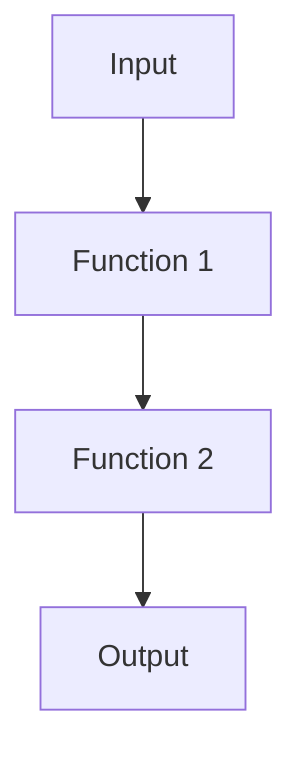
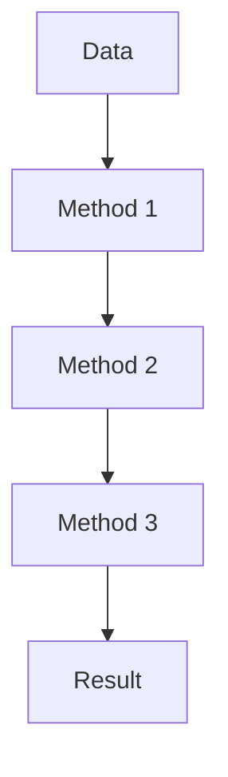

## 5.10. Composing Functions and Method Chaining

In the world of Rust programming, composing functions and method chaining are powerful techniques that allow developers to write clean, readable, and maintainable code. These techniques are especially prevalent in functional programming paradigms, where the focus is on building complex operations by combining simpler functions. In this section, we will delve into the intricacies of function composition and method chaining in Rust, providing you with the knowledge to leverage these techniques effectively in your projects.

### Understanding Function Composition in Rust

Function composition is the process of combining two or more functions to produce a new function. In Rust, this is often achieved using closures and higher-order functions. The goal is to create a pipeline of operations where the output of one function becomes the input of the next.

#### Basic Function Composition

Let's start with a simple example of function composition in Rust:

```rust
fn add_one(x: i32) -> i32 {
    x + 1
}

fn square(x: i32) -> i32 {
    x * x
}

fn main() {
    let add_then_square = |x| square(add_one(x));
    let result = add_then_square(2);
    println!("Result: {}", result); // Output: Result: 9
}
```

In this example, we define two functions, `add_one` and `square`. We then create a closure `add_then_square` that composes these functions, first adding one to the input and then squaring the result.

#### Using Closures for Composition

Closures in Rust are particularly useful for function composition because they can capture variables from their environment. This allows for more flexible and dynamic function composition.

```rust
fn main() {
    let multiplier = 3;
    let multiply = |x| x * multiplier;

    let add_then_multiply = |x| multiply(add_one(x));
    let result = add_then_multiply(2);
    println!("Result: {}", result); // Output: Result: 9
}
```

Here, the closure `multiply` captures the `multiplier` variable from its environment, allowing us to create a composed function `add_then_multiply` that first adds one and then multiplies by three.

### Method Chaining for Fluent Code

Method chaining is a technique where multiple method calls are linked together in a single expression. This approach enhances code readability by presenting a clear sequence of operations.

#### Chaining Methods with Iterators

Rust's iterator trait provides a rich set of methods that can be chained together to perform complex data transformations. Let's explore an example:

```rust
fn main() {
    let numbers = vec![1, 2, 3, 4, 5];

    let result: Vec<i32> = numbers.iter()
        .map(|&x| x + 1)
        .filter(|&x| x % 2 == 0)
        .collect();

    println!("Result: {:?}", result); // Output: Result: [2, 4, 6]
}
```

In this example, we use method chaining to iterate over a vector of numbers, increment each number by one, filter out odd numbers, and collect the results into a new vector. The chain of method calls is clear and expressive, making the code easy to understand.

#### Enhancing Readability with Method Chaining

Method chaining not only improves readability but also reduces the need for intermediate variables, leading to more concise code. However, it's important to strike a balance between chaining methods and maintaining readability.

```rust
fn main() {
    let text = "hello world";

    let result = text.chars()
        .filter(|&c| c.is_alphabetic())
        .collect::<String>();

    println!("Filtered text: {}", result); // Output: Filtered text: helloworld
}
```

In this example, we chain methods to filter out non-alphabetic characters from a string, resulting in a clean and readable solution.

### Best Practices for Function Composition and Method Chaining

While function composition and method chaining are powerful techniques, it's important to use them judiciously to maintain code readability and performance.

#### Use Intermediate Variables When Necessary

While chaining methods can lead to concise code, there are times when introducing intermediate variables can enhance readability, especially when dealing with complex logic.

```rust
fn main() {
    let numbers = vec![1, 2, 3, 4, 5];

    let incremented: Vec<i32> = numbers.iter().map(|&x| x + 1).collect();
    let even_numbers: Vec<i32> = incremented.into_iter().filter(|&x| x % 2 == 0).collect();

    println!("Even numbers: {:?}", even_numbers); // Output: Even numbers: [2, 4, 6]
}
```

In this example, we use intermediate variables `incremented` and `even_numbers` to break down the logic into smaller, more understandable steps.

#### Avoid Overly Long Chains

Long chains of method calls can become difficult to read and debug. Consider breaking them into smaller, more manageable pieces.

```rust
fn main() {
    let numbers = vec![1, 2, 3, 4, 5];

    let result: Vec<i32> = numbers.iter()
        .map(|&x| x + 1)
        .filter(|&x| x % 2 == 0)
        .take(2)
        .collect();

    println!("Result: {:?}", result); // Output: Result: [2, 4]
}
```

Here, we limit the chain to a few method calls, making it easier to follow the logic.

#### Leverage Rust's Type System

Rust's strong type system can help catch errors early in the development process. Use type annotations and the compiler's feedback to ensure your composed functions and method chains are correct.

### Try It Yourself

Now that we've covered the basics of function composition and method chaining, it's time to experiment with these concepts. Try modifying the examples above to see how changes affect the output. For instance, you could:

- Add more functions to the composition pipeline.
- Experiment with different iterator methods.
- Introduce intermediate variables to improve readability.

### Visualizing Function Composition and Method Chaining

To better understand how function composition and method chaining work, let's visualize these concepts using Mermaid.js diagrams.

#### Function Composition Flow



This diagram represents the flow of data through a composed function pipeline, where the output of one function becomes the input of the next.

#### Method Chaining Flow



This diagram illustrates the sequence of method calls in a method chain, showing how data is transformed step by step.

### Conclusion

Composing functions and chaining methods are essential techniques in Rust that enable developers to write clean, expressive, and efficient code. By understanding and applying these techniques, you can create complex operations with ease and improve the readability of your code. Remember to balance the use of chaining with readability, and leverage Rust's powerful type system to catch errors early.

### Key Takeaways

- Function composition combines multiple functions into a single operation.
- Method chaining links multiple method calls in a single expression for clarity.
- Use closures and iterators to enhance function composition and method chaining.
- Balance chaining with readability by using intermediate variables when necessary.
- Leverage Rust's type system to ensure correctness.

### Further Reading

For more information on function composition and method chaining in Rust, consider exploring the following resources:

- [Rust Book - Closures](https://doc.rust-lang.org/book/ch13-01-closures.html)
- [Rust By Example - Iterators](https://doc.rust-lang.org/rust-by-example/trait/iter.html)
- [Rust Documentation - Iterator Trait](https://doc.rust-lang.org/std/iter/trait.Iterator.html)

## Quiz Time!



### What is function composition in Rust?

- [x] Combining two or more functions to produce a new function.
- [ ] Creating a single function from multiple closures.
- [ ] Linking multiple method calls in a single expression.
- [ ] Using iterators to transform data.

> **Explanation:** Function composition involves combining two or more functions to create a new function, where the output of one function becomes the input of the next.

### How does method chaining enhance code readability?

- [x] By presenting a clear sequence of operations in a single expression.
- [ ] By reducing the number of functions in the code.
- [ ] By eliminating the need for closures.
- [ ] By using intermediate variables for clarity.

> **Explanation:** Method chaining enhances readability by linking multiple method calls in a single expression, presenting a clear sequence of operations.

### What is the benefit of using closures in function composition?

- [x] Closures can capture variables from their environment, allowing for more flexible composition.
- [ ] Closures eliminate the need for function pointers.
- [ ] Closures automatically optimize the composed functions.
- [ ] Closures are faster than regular functions.

> **Explanation:** Closures can capture variables from their environment, making them more flexible for function composition.

### When should you use intermediate variables in method chaining?

- [x] When the chain of methods becomes too long and complex.
- [ ] When you want to reduce the number of lines of code.
- [ ] When you need to optimize performance.
- [ ] When using closures.

> **Explanation:** Intermediate variables should be used when the chain of methods becomes too long and complex, to enhance readability.

### What is the role of Rust's type system in function composition?

- [x] It helps catch errors early in the development process.
- [ ] It automatically optimizes composed functions.
- [ ] It eliminates the need for closures.
- [ ] It simplifies method chaining.

> **Explanation:** Rust's strong type system helps catch errors early, ensuring the correctness of composed functions and method chains.

### What is the output of the following code snippet?

```rust
fn main() {
    let numbers = vec![1, 2, 3, 4, 5];
    let result: Vec<i32> = numbers.iter()
        .map(|&x| x + 1)
        .filter(|&x| x % 2 == 0)
        .collect();
    println!("{:?}", result);
}
```

- [x] [2, 4, 6]
- [ ] [1, 3, 5]
- [ ] [2, 3, 4, 5, 6]
- [ ] [1, 2, 3, 4, 5]

> **Explanation:** The code increments each number by one and filters out odd numbers, resulting in [2, 4, 6].

### What is a potential drawback of overly long method chains?

- [x] They can become difficult to read and debug.
- [ ] They improve performance.
- [ ] They eliminate the need for closures.
- [ ] They reduce the number of functions.

> **Explanation:** Overly long method chains can become difficult to read and debug, making it harder to understand the code.

### How can you improve readability in complex method chains?

- [x] By introducing intermediate variables to break down the logic.
- [ ] By using more closures.
- [ ] By reducing the number of methods in the chain.
- [ ] By using function pointers.

> **Explanation:** Introducing intermediate variables can break down complex logic into smaller, more understandable steps, improving readability.

### What is the purpose of the `collect` method in iterator chains?

- [x] To gather the results of the iterator into a collection.
- [ ] To filter elements from the iterator.
- [ ] To map elements to new values.
- [ ] To reduce the iterator to a single value.

> **Explanation:** The `collect` method gathers the results of the iterator into a collection, such as a vector.

### True or False: Function composition and method chaining are only useful in functional programming.

- [ ] True
- [x] False

> **Explanation:** While function composition and method chaining are prevalent in functional programming, they are useful techniques in any programming paradigm for creating clear and fluent code.



Remember, this is just the beginning. As you progress, you'll build more complex and interactive Rust applications. Keep experimenting, stay curious, and enjoy the journey!
