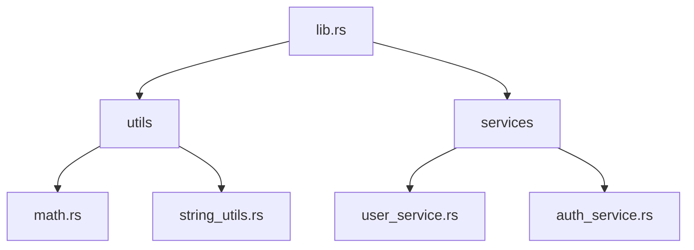

## 5.11. Module and Crate Organization Best Practices

In Rust, organizing code effectively is crucial for maintainability, clarity, and scalability. As projects grow, a well-structured codebase becomes essential. This section explores best practices for organizing Rust code within modules and crates, focusing on strategies for structuring modules, exposing public APIs, and maintaining consistent organization in larger projects.

### Understanding Modules and Crates

Before diving into best practices, let's clarify what modules and crates are in Rust:

- **Modules**: Modules are a way to organize code within a Rust crate. They allow you to group related functions, structs, traits, and other items together. Modules can be nested, creating a hierarchy that mirrors the directory structure of your project.

- **Crates**: A crate is a package of Rust code. It can be a binary crate, which is an executable, or a library crate, which is a collection of code that can be shared with other projects. Crates are the fundamental unit of code distribution in Rust.

### Structuring Modules and Submodules

#### Creating a Module

To create a module in Rust, you use the `mod` keyword. Here's a simple example:

```rust
// src/lib.rs

mod utils;

fn main() {
    println!("Hello, world!");
}
```

In this example, `utils` is a module that can contain its own functions, structs, and other items. The `mod` keyword declares the module, and Rust expects a corresponding `utils.rs` file or a `utils` directory with a `mod.rs` file.

#### Organizing Submodules

Submodules allow you to further organize your code. For example, if `utils` has multiple related components, you can create submodules:

```rust
// src/utils/mod.rs

pub mod math;
pub mod string_utils;
```

This structure expects `math.rs` and `string_utils.rs` files within the `utils` directory. Each submodule can have its own nested modules, creating a tree-like structure.

#### Using `mod.rs` and `lib.rs`

The `mod.rs` file is a convention used to define the contents of a module when the module is represented as a directory. This approach is useful for organizing larger modules with multiple submodules. The `lib.rs` file is the entry point for a library crate, similar to `main.rs` for a binary crate.

Here's an example directory layout:

```
src/
├── lib.rs
└── utils/
    ├── mod.rs
    ├── math.rs
    └── string_utils.rs
```

In `lib.rs`, you would declare the `utils` module:

```rust
// src/lib.rs

pub mod utils;
```

### Exposing Public APIs

When organizing modules, it's important to control what parts of your code are exposed to users of your crate. Rust provides the `pub` keyword to make items public.

#### Keeping Implementation Details Private

By default, items in a module are private. Use the `pub` keyword to expose only the necessary parts of your module:

```rust
// src/utils/math.rs

pub fn add(a: i32, b: i32) -> i32 {
    a + b
}

fn subtract(a: i32, b: i32) -> i32 {
    a - b
}
```

In this example, `add` is public and can be used by other modules or crates, while `subtract` is private and only accessible within the `math` module.

#### Re-exporting Items

Sometimes, you want to expose items from a submodule at a higher level. You can use `pub use` to re-export items:

```rust
// src/utils/mod.rs

pub mod math;
pub use math::add;
```

This allows users of the `utils` module to access `add` directly, without needing to know about the `math` submodule.

### Naming Conventions and Directory Layouts

Consistent naming conventions and directory layouts are crucial for readability and maintainability.

#### Naming Conventions

- **Modules**: Use snake_case for module names. This is consistent with Rust's conventions and makes it clear that the item is a module.
- **Files**: Match file names to module names. For example, the `math` module should be in `math.rs` or `math/mod.rs`.
- **Functions and Variables**: Use snake_case for function and variable names.
- **Structs and Enums**: Use CamelCase for struct and enum names.

#### Directory Layouts

A well-organized directory layout mirrors the module hierarchy. Here's an example for a larger project:

```
src/
├── lib.rs
├── utils/
│   ├── mod.rs
│   ├── math.rs
│   └── string_utils.rs
└── services/
    ├── mod.rs
    ├── user_service.rs
    └── auth_service.rs
```

In this layout, `utils` and `services` are top-level modules, each with their own submodules.

### Consistent Organization in Larger Projects

As projects grow, maintaining a consistent organization becomes increasingly important. Here are some strategies:

#### Use Modules to Encapsulate Functionality

Group related functionality into modules. For example, if your project involves user authentication, you might have a `services` module with submodules for `user_service` and `auth_service`.

#### Separate Concerns with Crates

For very large projects, consider splitting functionality into separate crates. This approach allows for better separation of concerns and can improve compile times by reducing the amount of code that needs to be recompiled when changes are made.

#### Document Your Code

Use Rust's documentation features to document your modules and functions. This practice helps other developers understand the purpose and usage of your code.

```rust
/// Adds two numbers together.
///
/// # Examples
///
/// ```
/// let sum = add(2, 3);
/// assert_eq!(sum, 5);
/// ```
pub fn add(a: i32, b: i32) -> i32 {
    a + b
}
```

### Rust Unique Features

Rust's module system is designed to be simple yet powerful. It enforces privacy by default, encouraging developers to think carefully about what parts of their code should be exposed. This feature, combined with Rust's strong type system and ownership model, helps create robust and maintainable codebases.

### Differences and Similarities with Other Languages

Rust's module system is similar to namespaces in C++ or packages in Java, but with a focus on privacy and explicitness. Unlike some languages, Rust does not have a global namespace, which helps prevent naming conflicts and encourages modular design.

### Design Considerations

When organizing your Rust code, consider the following:

- **Simplicity**: Keep your module hierarchy simple and intuitive. Avoid deeply nested modules unless necessary.
- **Clarity**: Use descriptive names for modules and functions to make your code self-documenting.
- **Flexibility**: Design your modules to be flexible and reusable. Avoid tight coupling between modules.

### Code Example: Organizing a Rust Project

Let's look at a complete example of organizing a Rust project with modules and crates.

```rust
// src/lib.rs

pub mod utils;
pub mod services;

// src/utils/mod.rs

pub mod math;
pub mod string_utils;

// src/utils/math.rs

pub fn add(a: i32, b: i32) -> i32 {
    a + b
}

// src/utils/string_utils.rs

pub fn to_uppercase(s: &str) -> String {
    s.to_uppercase()
}

// src/services/mod.rs

pub mod user_service;
pub mod auth_service;

// src/services/user_service.rs

pub fn create_user(name: &str) {
    println!("Creating user: {}", name);
}

// src/services/auth_service.rs

pub fn authenticate_user(name: &str, password: &str) -> bool {
    // Authentication logic here
    true
}
```

### Try It Yourself

Experiment with the code example by adding new modules or functions. Try re-exporting functions from submodules to see how it affects the public API. Consider how you might organize a larger project with more complex functionality.

### Visualizing Module and Crate Organization

To better understand how modules and crates are organized, let's visualize the structure using a Mermaid.js diagram:



This diagram represents the hierarchy of modules and files in our example project. Each node corresponds to a file or module, showing how they are connected.

### References and Links

- [Rust Book: Modules](https://doc.rust-lang.org/book/ch07-02-defining-modules-to-control-scope-and-privacy.html)
- [Rust API Guidelines: Module Organization](https://rust-lang.github.io/api-guidelines/naming.html)
- [Rust Documentation](https://doc.rust-lang.org/std/index.html)

### Knowledge Check

- What is the purpose of a `mod.rs` file in Rust?
- How can you expose a function from a submodule at a higher level?
- Why is it important to keep implementation details private?
- What are some naming conventions for modules and functions in Rust?
- How can you organize a large Rust project with multiple crates?

### Embrace the Journey

Remember, organizing your code is just the beginning. As you progress, you'll find new ways to structure your projects to suit your needs. Keep experimenting, stay curious, and enjoy the journey!

## Quiz Time!



### What is the purpose of a `mod.rs` file in Rust?

- [x] To define the contents of a module when the module is represented as a directory.
- [ ] To serve as the main entry point for a binary crate.
- [ ] To automatically generate documentation for a module.
- [ ] To compile all submodules into a single file.

> **Explanation:** A `mod.rs` file is used to define the contents of a module when the module is represented as a directory. It acts as the entry point for the module's code.

### How can you expose a function from a submodule at a higher level?

- [x] By using `pub use` to re-export the function.
- [ ] By declaring the function as `pub(crate)`.
- [ ] By placing the function in a `mod.rs` file.
- [ ] By using the `extern crate` keyword.

> **Explanation:** You can use `pub use` to re-export a function from a submodule, making it accessible at a higher level in the module hierarchy.

### Why is it important to keep implementation details private?

- [x] To prevent external code from relying on internal implementation details.
- [ ] To reduce the size of the compiled binary.
- [ ] To improve the performance of the code.
- [ ] To ensure compatibility with other programming languages.

> **Explanation:** Keeping implementation details private prevents external code from relying on them, allowing you to change the implementation without breaking external code.

### What are some naming conventions for modules and functions in Rust?

- [x] Use snake_case for module and function names.
- [ ] Use CamelCase for module names.
- [ ] Use PascalCase for function names.
- [ ] Use kebab-case for module and function names.

> **Explanation:** In Rust, snake_case is used for module and function names, following Rust's naming conventions.

### How can you organize a large Rust project with multiple crates?

- [x] By separating functionality into different crates.
- [ ] By using a single large crate with many modules.
- [ ] By placing all code in a single `lib.rs` file.
- [ ] By using a `mod.rs` file for each crate.

> **Explanation:** For large projects, separating functionality into different crates can improve organization and compile times.

### What is the default visibility of items in a Rust module?

- [x] Private
- [ ] Public
- [ ] Protected
- [ ] Internal

> **Explanation:** By default, items in a Rust module are private and must be explicitly made public using the `pub` keyword.

### Which keyword is used to make an item public in Rust?

- [x] pub
- [ ] public
- [ ] export
- [ ] open

> **Explanation:** The `pub` keyword is used to make an item public in Rust, allowing it to be accessed from outside the module.

### What is the role of the `lib.rs` file in a Rust library crate?

- [x] It serves as the entry point for the library crate.
- [ ] It defines the main function for the crate.
- [ ] It contains the documentation for the crate.
- [ ] It compiles all modules into a single binary.

> **Explanation:** The `lib.rs` file serves as the entry point for a library crate, similar to `main.rs` for a binary crate.

### How can you document a function in Rust?

- [x] By using triple-slash comments (`///`) above the function.
- [ ] By placing the documentation in a separate file.
- [ ] By using the `doc` keyword.
- [ ] By adding comments within the function body.

> **Explanation:** In Rust, you can document a function by using triple-slash comments (`///`) above the function, which are used by `rustdoc` to generate documentation.

### True or False: Rust's module system is similar to namespaces in C++.

- [x] True
- [ ] False

> **Explanation:** Rust's module system is similar to namespaces in C++, as both are used to organize code and prevent naming conflicts.




