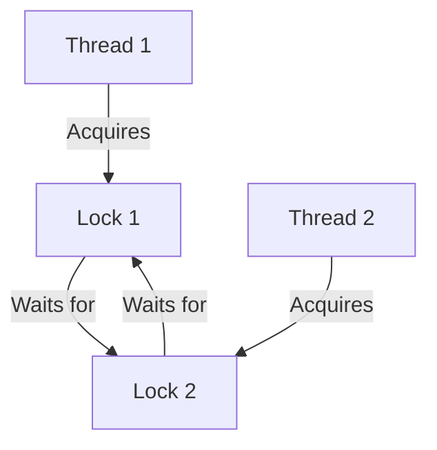

## 5.12. Avoiding Common Pitfalls in Concurrency

Concurrency in Rust is a powerful feature that enables developers to write efficient and performant programs. However, it also introduces complexity and potential pitfalls, such as deadlocks, data races, and misuse of synchronization primitives. In this section, we will explore these common pitfalls and provide strategies to avoid them, ensuring your concurrent Rust applications are both safe and efficient.

### Understanding Rust's Concurrency Model

Rust's concurrency model is built upon the principles of ownership, borrowing, and lifetimes, which are enforced by the compiler to ensure memory safety. This model allows Rust to provide "fearless concurrency," where data races are prevented at compile time. However, logical errors such as deadlocks and misuse of synchronization primitives can still occur.

#### Key Concepts in Rust's Concurrency Model

- **Ownership and Borrowing**: Rust's ownership system ensures that data is accessed safely across threads. Ownership rules prevent data races by ensuring that only one thread can modify data at a time.
- **Threads**: Rust provides native support for threads through the `std::thread` module, allowing for parallel execution of code.
- **Synchronization Primitives**: Rust offers several synchronization primitives, such as `Mutex`, `RwLock`, and channels, to coordinate access to shared data.

### Common Concurrency Pitfalls

#### 1. Deadlocks

Deadlocks occur when two or more threads are waiting indefinitely for resources held by each other, creating a cycle of dependencies that cannot be resolved. This can happen when multiple locks are acquired in an inconsistent order.

**Example of a Deadlock:**

```rust
use std::sync::{Arc, Mutex};
use std::thread;

fn main() {
    let lock1 = Arc::new(Mutex::new(0));
    let lock2 = Arc::new(Mutex::new(0));

    let l1 = Arc::clone(&lock1);
    let l2 = Arc::clone(&lock2);

    let handle1 = thread::spawn(move || {
        let _a = l1.lock().unwrap();
        thread::sleep(std::time::Duration::from_millis(50));
        let _b = l2.lock().unwrap();
    });

    let l1 = Arc::clone(&lock1);
    let l2 = Arc::clone(&lock2);

    let handle2 = thread::spawn(move || {
        let _b = l2.lock().unwrap();
        thread::sleep(std::time::Duration::from_millis(50));
        let _a = l1.lock().unwrap();
    });

    handle1.join().unwrap();
    handle2.join().unwrap();
}
```

**Preventing Deadlocks:**

- **Consistent Lock Ordering**: Always acquire locks in a consistent order across all threads.
- **Timeouts**: Use timeouts when acquiring locks to detect and handle deadlocks.
- **Lock Hierarchies**: Design lock hierarchies to prevent circular dependencies.

#### 2. Data Races

Data races occur when two or more threads access shared data simultaneously, and at least one of the accesses is a write. Rust's ownership model prevents data races at compile time, but logical errors can still lead to race conditions.

**Example of a Data Race:**

Rust's ownership model prevents this at compile time, so a direct example is not possible. However, logical race conditions can occur when using `UnsafeCell` or `std::sync::UnsafeCell`.

**Preventing Data Races:**

- **Use Safe Rust**: Stick to safe Rust constructs and avoid `unsafe` blocks unless absolutely necessary.
- **Synchronization Primitives**: Use `Mutex` or `RwLock` to protect shared data.

#### 3. Misuse of Synchronization Primitives

Improper use of synchronization primitives can lead to performance bottlenecks and logical errors.

**Example of Misusing `Mutex`:**

```rust
use std::sync::{Arc, Mutex};
use std::thread;

fn main() {
    let data = Arc::new(Mutex::new(vec![1, 2, 3]));

    let handles: Vec<_> = (0..3).map(|_| {
        let data = Arc::clone(&data);
        thread::spawn(move || {
            let mut data = data.lock().unwrap();
            data.push(1);
        })
    }).collect();

    for handle in handles {
        handle.join().unwrap();
    }
}
```

In this example, the `Mutex` is used to protect a vector, but excessive locking can lead to performance issues.

**Best Practices for Using `Mutex`:**

- **Minimize Lock Scope**: Keep the scope of locks as small as possible to reduce contention.
- **Avoid Blocking Operations**: Do not perform blocking operations while holding a lock.

### Designing Safe and Efficient Concurrent Applications

#### 1. Use Channels for Communication

Channels provide a safe way to communicate between threads without sharing memory. Rust's `std::sync::mpsc` module offers multi-producer, single-consumer channels.

**Example of Using Channels:**

```rust
use std::sync::mpsc;
use std::thread;

fn main() {
    let (tx, rx) = mpsc::channel();

    let handle = thread::spawn(move || {
        tx.send(42).unwrap();
    });

    println!("Received: {}", rx.recv().unwrap());

    handle.join().unwrap();
}
```

#### 2. Leverage Rust's Ownership Model

Rust's ownership model can be leveraged to design concurrent applications that are both safe and efficient. By transferring ownership of data between threads, we can avoid the need for synchronization primitives.

**Example of Ownership Transfer:**

```rust
use std::thread;

fn main() {
    let data = vec![1, 2, 3];

    let handle = thread::spawn(move || {
        println!("{:?}", data);
    });

    handle.join().unwrap();
}
```

#### 3. Use `RwLock` for Read-Heavy Workloads

`RwLock` allows multiple readers or one writer at a time, making it suitable for read-heavy workloads.

**Example of Using `RwLock`:**

```rust
use std::sync::{Arc, RwLock};
use std::thread;

fn main() {
    let data = Arc::new(RwLock::new(5));

    let data1 = Arc::clone(&data);
    let handle1 = thread::spawn(move || {
        let r = data1.read().unwrap();
        println!("Read: {}", *r);
    });

    let data2 = Arc::clone(&data);
    let handle2 = thread::spawn(move || {
        let mut w = data2.write().unwrap();
        *w += 1;
        println!("Write: {}", *w);
    });

    handle1.join().unwrap();
    handle2.join().unwrap();
}
```

### Tools and Techniques for Detecting Concurrency Issues

#### 1. Clippy

Clippy is a Rust linter that can help detect common concurrency issues and suggest improvements.

#### 2. Rust Analyzer

Rust Analyzer provides real-time feedback and can help identify potential concurrency issues during development.

#### 3. Testing and Debugging

- **Unit Tests**: Write unit tests to verify the correctness of concurrent code.
- **Logging**: Use logging to trace the execution flow and identify issues.
- **Debugging Tools**: Use debugging tools like `gdb` or `lldb` to inspect the state of concurrent programs.

### Visualizing Concurrency Pitfalls

To better understand concurrency pitfalls, let's visualize a deadlock scenario using a flowchart.



**Caption**: This flowchart illustrates a deadlock scenario where Thread 1 and Thread 2 are waiting on each other's locks, creating a cycle of dependencies.

### Knowledge Check

- **What is a deadlock, and how can it be prevented?**
- **Explain how Rust's ownership model prevents data races.**
- **What are the best practices for using `Mutex` in Rust?**

### Embrace the Journey

Remember, concurrency in Rust is a journey. As you progress, you'll build more complex and efficient concurrent applications. Keep experimenting, stay curious, and enjoy the journey!

### Summary

In this section, we've explored common concurrency pitfalls in Rust and provided strategies to avoid them. By understanding Rust's concurrency model and following best practices, you can design safe and efficient concurrent applications.

## Quiz Time!



### What is a deadlock?

- [x] A situation where two or more threads are waiting indefinitely for resources held by each other.
- [ ] A situation where a thread is blocked waiting for a resource.
- [ ] A situation where a thread is executing without any synchronization.
- [ ] A situation where a thread is terminated unexpectedly.

> **Explanation:** A deadlock occurs when two or more threads are waiting indefinitely for resources held by each other, creating a cycle of dependencies.

### How does Rust's ownership model prevent data races?

- [x] By ensuring that only one thread can modify data at a time.
- [ ] By allowing multiple threads to access data simultaneously.
- [ ] By using garbage collection to manage memory.
- [ ] By using a global lock for all data.

> **Explanation:** Rust's ownership model ensures that only one thread can modify data at a time, preventing data races at compile time.

### What is the best practice for using `Mutex` in Rust?

- [x] Minimize the scope of locks to reduce contention.
- [ ] Use `Mutex` for all shared data.
- [ ] Perform blocking operations while holding a lock.
- [ ] Avoid using `Mutex` in concurrent applications.

> **Explanation:** Minimizing the scope of locks reduces contention and improves performance in concurrent applications.

### What is the purpose of channels in Rust?

- [x] To provide a safe way to communicate between threads without sharing memory.
- [ ] To synchronize access to shared data.
- [ ] To manage memory allocation.
- [ ] To perform I/O operations.

> **Explanation:** Channels provide a safe way to communicate between threads without sharing memory, reducing the need for synchronization primitives.

### How can deadlocks be prevented?

- [x] By acquiring locks in a consistent order.
- [ ] By using more threads.
- [x] By using timeouts when acquiring locks.
- [ ] By avoiding the use of locks altogether.

> **Explanation:** Acquiring locks in a consistent order and using timeouts can help prevent deadlocks.

### What is a data race?

- [x] A situation where two or more threads access shared data simultaneously, and at least one of the accesses is a write.
- [ ] A situation where a thread is blocked waiting for a resource.
- [ ] A situation where a thread is terminated unexpectedly.
- [ ] A situation where a thread is executing without any synchronization.

> **Explanation:** A data race occurs when two or more threads access shared data simultaneously, and at least one of the accesses is a write.

### What is the role of `RwLock` in Rust?

- [x] To allow multiple readers or one writer at a time.
- [ ] To provide a global lock for all data.
- [x] To protect shared data in read-heavy workloads.
- [ ] To manage memory allocation.

> **Explanation:** `RwLock` allows multiple readers or one writer at a time, making it suitable for read-heavy workloads.

### What is the benefit of using Rust's ownership model in concurrent applications?

- [x] It allows for safe and efficient transfer of data between threads.
- [ ] It requires the use of global locks.
- [ ] It uses garbage collection to manage memory.
- [ ] It allows multiple threads to modify data simultaneously.

> **Explanation:** Rust's ownership model allows for safe and efficient transfer of data between threads, reducing the need for synchronization primitives.

### What tool can help detect common concurrency issues in Rust?

- [x] Clippy
- [ ] Cargo
- [ ] Rustfmt
- [ ] GDB

> **Explanation:** Clippy is a Rust linter that can help detect common concurrency issues and suggest improvements.

### True or False: Rust's ownership model prevents logical race conditions.

- [ ] True
- [x] False

> **Explanation:** While Rust's ownership model prevents data races at compile time, logical race conditions can still occur due to improper logic or use of `unsafe` code.


