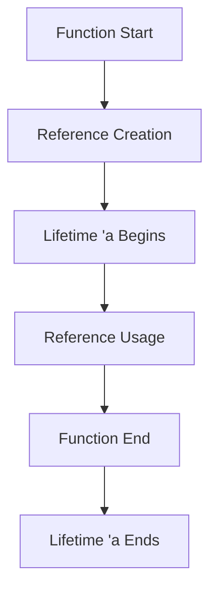

## 5.13. Effective Use of Lifetimes

In Rust, lifetimes are a powerful feature that ensures memory safety by enforcing rules about how long references are valid. Understanding and effectively using lifetimes is crucial for writing robust and efficient Rust programs. In this section, we will delve into the concept of lifetimes, explore common scenarios that require explicit lifetime annotations, and provide strategies for simplifying lifetime management. We will also include examples of functions and structs with lifetime parameters and explain how to interpret and resolve common lifetime errors from the compiler.

### Introduction to Lifetimes

Lifetimes in Rust are a way of expressing the scope for which a reference is valid. They are a part of Rust's ownership system, which ensures that references do not outlive the data they point to, preventing dangling references and ensuring memory safety without a garbage collector.

#### Purpose of Lifetimes

The primary purpose of lifetimes is to prevent dangling references, which occur when a reference points to data that has been deallocated. By using lifetimes, Rust can guarantee that references are always valid, thus avoiding undefined behavior and potential security vulnerabilities.

### Common Scenarios Requiring Lifetime Annotations

While Rust often infers lifetimes automatically, there are scenarios where explicit lifetime annotations are necessary. Let's explore some of these scenarios:

1. **Functions with Multiple References**: When a function takes multiple references as parameters and returns a reference, Rust needs to know how the lifetimes of these references relate to each other.

2. **Structs with References**: When a struct contains references, you must specify the lifetime of those references to ensure they do not outlive the data they point to.

3. **Complex Data Structures**: In cases where data structures have nested references, explicit lifetime annotations help maintain clarity and correctness.

### Simplifying Lifetime Management

Managing lifetimes can seem daunting at first, but with practice and the right strategies, it becomes more intuitive. Here are some tips for simplifying lifetime management:

- **Use Lifetime Elision**: Rust has rules for lifetime elision that allow you to omit lifetime annotations in many cases. Familiarize yourself with these rules to reduce the need for explicit annotations.

- **Minimize the Scope of References**: Keep the scope of references as small as possible to reduce the complexity of lifetime management.

- **Use Owned Types When Possible**: If ownership semantics fit your use case, prefer owned types over references to avoid lifetime issues altogether.

- **Leverage Rust's Compiler**: The Rust compiler provides detailed error messages and suggestions for resolving lifetime issues. Use these messages to guide your understanding and resolution of lifetime problems.

### Examples of Functions and Structs with Lifetime Parameters

Let's look at some examples to illustrate how lifetimes are used in functions and structs.

#### Function with Lifetime Parameters

```rust
fn longest<'a>(s1: &'a str, s2: &'a str) -> &'a str {
    if s1.len() > s2.len() {
        s1
    } else {
        s2
    }
}
```

In this example, the `longest` function takes two string slices with the same lifetime `'a` and returns a string slice with the same lifetime. This ensures that the returned reference is valid as long as both input references are valid.

#### Struct with Lifetime Parameters

```rust
struct Book<'a> {
    title: &'a str,
    author: &'a str,
}

impl<'a> Book<'a> {
    fn new(title: &'a str, author: &'a str) -> Self {
        Book { title, author }
    }
}
```

Here, the `Book` struct contains references to strings, and we specify a lifetime `'a` to ensure that these references do not outlive the data they point to.

### Interpreting and Resolving Common Lifetime Errors

The Rust compiler is your ally in managing lifetimes. It provides detailed error messages when lifetime issues arise. Let's explore some common lifetime errors and how to resolve them.

#### Example Error: Lifetime Mismatch

```rust
fn first_word<'a>(s: &'a str) -> &'a str {
    let words: Vec<&str> = s.split_whitespace().collect();
    words[0]
}
```

**Error Message**: `error[E0515]: cannot return value referencing local variable 'words'`

**Resolution**: The `words` vector is local to the function and will be deallocated when the function returns. To fix this, ensure that the returned reference is directly tied to the input reference:

```rust
fn first_word<'a>(s: &'a str) -> &'a str {
    s.split_whitespace().next().unwrap()
}
```

### Visualizing Lifetimes

To better understand how lifetimes work, let's visualize the relationship between lifetimes in a function.



**Diagram Description**: This diagram illustrates the lifecycle of a reference within a function. The reference is created at the start of the function, its lifetime `'a` begins, it is used within the function, and its lifetime ends when the function returns.

### Knowledge Check

- **Question**: What is the primary purpose of lifetimes in Rust?
- **Question**: When do you need to use explicit lifetime annotations in Rust?
- **Question**: How can you simplify lifetime management in Rust?

### Summary

In this section, we explored the concept of lifetimes in Rust, discussed common scenarios requiring explicit lifetime annotations, and provided strategies for simplifying lifetime management. We also included examples of functions and structs with lifetime parameters and explained how to interpret and resolve common lifetime errors from the compiler. Remember, mastering lifetimes is a journey, and with practice, you'll become more comfortable and confident in managing them.

## Quiz Time!



### What is the primary purpose of lifetimes in Rust?

- [x] To prevent dangling references
- [ ] To manage memory allocation
- [ ] To optimize code performance
- [ ] To enforce coding standards

> **Explanation:** Lifetimes in Rust are used to prevent dangling references by ensuring that references do not outlive the data they point to.

### When do you need to use explicit lifetime annotations in Rust?

- [x] When a function takes multiple references and returns a reference
- [ ] When using only owned types
- [ ] When writing simple functions
- [ ] When using primitive data types

> **Explanation:** Explicit lifetime annotations are needed when a function takes multiple references and returns a reference to ensure the returned reference is valid.

### How can you simplify lifetime management in Rust?

- [x] Use lifetime elision rules
- [x] Minimize the scope of references
- [ ] Avoid using references altogether
- [ ] Use global variables

> **Explanation:** Simplifying lifetime management involves using lifetime elision rules and minimizing the scope of references.

### What does the Rust compiler do when it encounters a lifetime error?

- [x] Provides detailed error messages and suggestions
- [ ] Automatically fixes the error
- [ ] Ignores the error
- [ ] Converts the error into a warning

> **Explanation:** The Rust compiler provides detailed error messages and suggestions to help resolve lifetime errors.

### Which of the following is a common scenario requiring explicit lifetime annotations?

- [x] Structs with references
- [ ] Functions with no parameters
- [ ] Functions returning owned types
- [ ] Functions using only primitive types

> **Explanation:** Structs with references require explicit lifetime annotations to ensure the references do not outlive the data they point to.

### What is lifetime elision in Rust?

- [x] A set of rules that allow omitting lifetime annotations
- [ ] A technique to extend the lifetime of references
- [ ] A method to reduce code size
- [ ] A way to optimize performance

> **Explanation:** Lifetime elision is a set of rules in Rust that allow you to omit lifetime annotations in certain cases.

### How does Rust ensure memory safety without a garbage collector?

- [x] Through ownership and borrowing rules
- [ ] By using a reference counting system
- [ ] By automatically deallocating unused memory
- [ ] By using a built-in garbage collector

> **Explanation:** Rust ensures memory safety through ownership and borrowing rules, which include lifetimes.

### What happens if a reference outlives the data it points to?

- [x] It leads to a dangling reference
- [ ] The program crashes immediately
- [ ] The reference is automatically updated
- [ ] The reference is converted to a null pointer

> **Explanation:** If a reference outlives the data it points to, it becomes a dangling reference, which can lead to undefined behavior.

### Can lifetimes be used with owned types in Rust?

- [ ] Yes, they are required for owned types
- [x] No, lifetimes are not needed for owned types
- [ ] Yes, but only in certain cases
- [ ] No, owned types cannot have lifetimes

> **Explanation:** Lifetimes are not needed for owned types because they do not involve references.

### True or False: Lifetimes in Rust are only necessary for complex data structures.

- [ ] True
- [x] False

> **Explanation:** Lifetimes are necessary for any situation involving references, not just complex data structures.



Remember, this is just the beginning. As you progress, you'll build more complex and interactive Rust programs. Keep experimenting, stay curious, and enjoy the journey!
