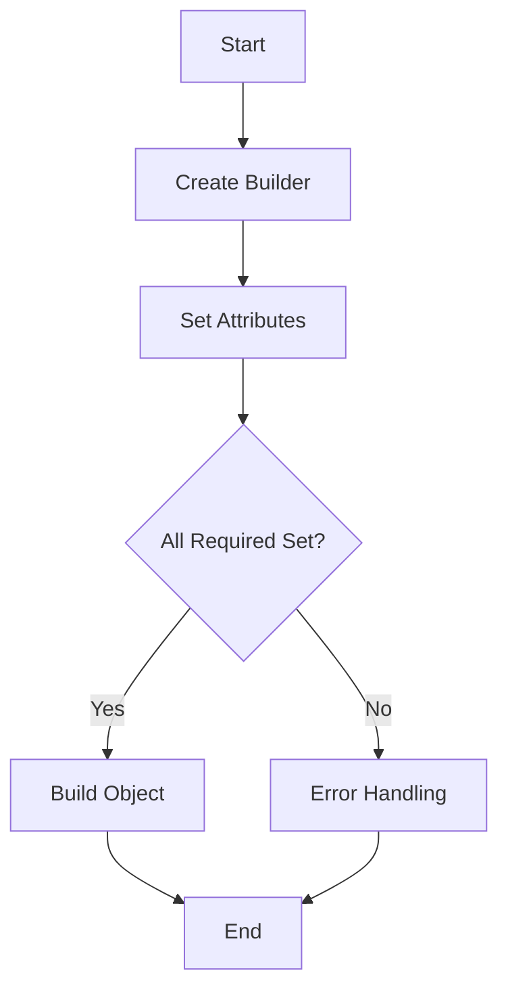

## 5.14. The Builder Pattern for Configuration

### Introduction

In the world of software design patterns, the Builder pattern stands out as a powerful tool for constructing complex objects. This pattern is particularly useful in Rust, where immutability and ownership principles can make object creation both challenging and rewarding. In this section, we will delve into the Builder pattern, exploring its intent, benefits, and implementation in Rust. We will also discuss how this pattern enhances readability and flexibility in object creation, making it an indispensable tool for Rust developers.

### What is the Builder Pattern?

The Builder pattern is a creational design pattern that allows for the step-by-step construction of complex objects. Unlike other creational patterns, the Builder pattern does not require that the object be fully constructed in a single step. Instead, it provides a way to construct an object incrementally, allowing for greater control over the configuration and initialization process.

#### Intent

The primary intent of the Builder pattern is to separate the construction of a complex object from its representation. This separation allows the same construction process to create different representations of the object. In Rust, this pattern is particularly useful for managing the complexity of object creation while adhering to the language's strict ownership and borrowing rules.

### Why Use the Builder Pattern in Rust?

Rust's emphasis on safety, concurrency, and performance makes it an ideal candidate for the Builder pattern. Here are some reasons why the Builder pattern is beneficial in Rust:

- **Immutable Types**: Rust encourages the use of immutable types, which can make object initialization cumbersome. The Builder pattern allows for the construction of immutable objects in a flexible and controlled manner.
- **Complex Initialization**: When objects require complex initialization logic, the Builder pattern provides a clear and organized way to handle this complexity.
- **Readability and Maintainability**: By breaking down the construction process into discrete steps, the Builder pattern enhances code readability and maintainability.
- **Flexibility**: The pattern allows for the creation of different configurations of an object without altering its construction logic.

### Implementing the Builder Pattern in Rust

Let's explore how to implement the Builder pattern in Rust through a practical example. We'll create a `Car` struct with various optional features that can be configured using a builder.

#### Step 1: Define the Struct

First, define the struct that represents the object to be built. In this case, we'll create a `Car` struct with several fields:

```rust
struct Car {
    make: String,
    model: String,
    color: String,
    year: u16,
    sunroof: bool,
    gps: bool,
}
```

#### Step 2: Create the Builder Struct

Next, create a builder struct that will be used to construct the `Car` object. This struct will have the same fields as the `Car` struct, but with optional types to allow for flexible configuration:

```rust
struct CarBuilder {
    make: Option<String>,
    model: Option<String>,
    color: Option<String>,
    year: Option<u16>,
    sunroof: Option<bool>,
    gps: Option<bool>,
}
```

#### Step 3: Implement the Builder Methods

Implement methods on the `CarBuilder` struct to set each field. These methods will return `self`, allowing for method chaining:

```rust
impl CarBuilder {
    fn new() -> Self {
        CarBuilder {
            make: None,
            model: None,
            color: None,
            year: None,
            sunroof: None,
            gps: None,
        }
    }

    fn make(mut self, make: &str) -> Self {
        self.make = Some(make.to_string());
        self
    }

    fn model(mut self, model: &str) -> Self {
        self.model = Some(model.to_string());
        self
    }

    fn color(mut self, color: &str) -> Self {
        self.color = Some(color.to_string());
        self
    }

    fn year(mut self, year: u16) -> Self {
        self.year = Some(year);
        self
    }

    fn sunroof(mut self, sunroof: bool) -> Self {
        self.sunroof = Some(sunroof);
        self
    }

    fn gps(mut self, gps: bool) -> Self {
        self.gps = Some(gps);
        self
    }

    fn build(self) -> Result<Car, &'static str> {
        Ok(Car {
            make: self.make.ok_or("Make is required")?,
            model: self.model.ok_or("Model is required")?,
            color: self.color.unwrap_or("Black".to_string()),
            year: self.year.unwrap_or(2020),
            sunroof: self.sunroof.unwrap_or(false),
            gps: self.gps.unwrap_or(false),
        })
    }
}
```

#### Step 4: Using the Builder

Now that we have our builder, we can use it to construct a `Car` object:

```rust
fn main() {
    let car = CarBuilder::new()
        .make("Toyota")
        .model("Corolla")
        .color("Red")
        .year(2021)
        .sunroof(true)
        .gps(true)
        .build()
        .unwrap();

    println!("Car: {} {} {} {}", car.make, car.model, car.color, car.year);
}
```

### Consuming vs. Borrowing in Builder Methods

In Rust, builder methods often consume `self` rather than borrowing it. This approach has several advantages:

- **Ownership Transfer**: Consuming `self` in builder methods allows for ownership transfer, which is idiomatic in Rust and avoids borrowing issues.
- **Method Chaining**: By returning `self`, builder methods enable method chaining, making the code more concise and readable.
- **Immutable Final Object**: Consuming `self` ensures that the final object is immutable, adhering to Rust's safety principles.

### Benefits of the Builder Pattern

The Builder pattern offers several benefits, particularly in the context of Rust:

- **Improved Readability**: By breaking down the construction process into discrete steps, the Builder pattern makes the code more readable and easier to understand.
- **Flexibility**: The pattern allows for the creation of different configurations of an object without altering its construction logic.
- **Error Handling**: The pattern provides a structured way to handle errors during object construction, ensuring that required fields are set.

### Visualizing the Builder Pattern

To better understand the Builder pattern, let's visualize the process using a flowchart:



**Figure 1**: Flowchart illustrating the Builder pattern process.

### Rust's Unique Features

Rust's unique features, such as ownership, borrowing, and immutability, make the Builder pattern particularly powerful:

- **Ownership and Borrowing**: The pattern leverages Rust's ownership model to ensure safe and efficient object construction.
- **Immutability**: By constructing objects in a controlled manner, the Builder pattern ensures that the final object is immutable, enhancing safety and reliability.

### Differences and Similarities with Other Patterns

The Builder pattern is often compared to other creational patterns, such as the Factory pattern. While both patterns deal with object creation, they serve different purposes:

- **Builder vs. Factory**: The Builder pattern focuses on constructing complex objects step by step, while the Factory pattern is concerned with creating objects without exposing the instantiation logic.
- **Configuration**: The Builder pattern provides more control over the configuration and initialization process, making it ideal for complex objects with multiple optional parameters.

### Try It Yourself

To deepen your understanding of the Builder pattern, try modifying the example code:

- **Add New Features**: Extend the `Car` struct with additional features, such as `engine_type` or `transmission`.
- **Optional Fields**: Experiment with making some fields optional and see how the builder handles default values.
- **Error Handling**: Implement custom error handling for missing required fields.

### Conclusion

The Builder pattern is a powerful tool for constructing complex objects in Rust. By providing control over configuration and initialization, the pattern enhances readability, flexibility, and safety. As you continue your journey with Rust, consider incorporating the Builder pattern into your projects to manage complexity and improve code quality.

### Key Takeaways

- The Builder pattern separates object construction from representation, allowing for flexible and controlled initialization.
- In Rust, the pattern is particularly useful for managing complex initialization logic and adhering to ownership and borrowing rules.
- By consuming `self`, builder methods enable method chaining and ensure immutability of the final object.
- The pattern enhances readability, flexibility, and error handling in object creation.

### References and Further Reading

- [Rust Design Patterns](https://rust-unofficial.github.io/patterns/)
- [The Rust Programming Language](https://doc.rust-lang.org/book/)
- [Rust by Example](https://doc.rust-lang.org/rust-by-example/)

## Quiz Time!



### What is the primary intent of the Builder pattern?

- [x] To separate the construction of a complex object from its representation.
- [ ] To create a single instance of a class.
- [ ] To provide a way to access the elements of an aggregate object sequentially.
- [ ] To define a family of algorithms.

> **Explanation:** The Builder pattern's primary intent is to separate the construction of a complex object from its representation, allowing the same construction process to create different representations.

### Why is the Builder pattern particularly useful in Rust?

- [x] Because Rust encourages the use of immutable types.
- [ ] Because Rust lacks a garbage collector.
- [ ] Because Rust does not support object-oriented programming.
- [ ] Because Rust has a dynamic type system.

> **Explanation:** The Builder pattern is useful in Rust because it allows for the construction of immutable objects in a flexible and controlled manner, adhering to Rust's emphasis on immutability.

### Which of the following is a benefit of using the Builder pattern?

- [x] Improved readability and maintainability.
- [ ] Increased runtime performance.
- [ ] Simplified memory management.
- [ ] Reduced code size.

> **Explanation:** The Builder pattern improves readability and maintainability by breaking down the construction process into discrete steps.

### How does the Builder pattern enhance error handling?

- [x] By providing a structured way to handle errors during object construction.
- [ ] By eliminating the need for error handling.
- [ ] By using exceptions to manage errors.
- [ ] By ignoring errors during construction.

> **Explanation:** The Builder pattern provides a structured way to handle errors during object construction, ensuring that required fields are set.

### What is a key difference between the Builder and Factory patterns?

- [x] The Builder pattern focuses on constructing complex objects step by step, while the Factory pattern is concerned with creating objects without exposing the instantiation logic.
- [ ] The Builder pattern is used for creating single instances, while the Factory pattern is used for creating multiple instances.
- [ ] The Builder pattern is only applicable to immutable objects, while the Factory pattern is not.
- [ ] The Builder pattern requires inheritance, while the Factory pattern does not.

> **Explanation:** The Builder pattern focuses on constructing complex objects step by step, while the Factory pattern is concerned with creating objects without exposing the instantiation logic.

### In Rust, why do builder methods often consume `self`?

- [x] To enable method chaining and ensure immutability of the final object.
- [ ] To improve runtime performance.
- [ ] To simplify memory management.
- [ ] To reduce code size.

> **Explanation:** Consuming `self` in builder methods enables method chaining and ensures immutability of the final object, which is idiomatic in Rust.

### What is the role of the `build` method in the Builder pattern?

- [x] To construct and return the final object.
- [ ] To initialize the builder.
- [ ] To reset the builder to its initial state.
- [ ] To validate the builder's configuration.

> **Explanation:** The `build` method constructs and returns the final object, completing the builder process.

### How does the Builder pattern improve flexibility in object creation?

- [x] By allowing for the creation of different configurations of an object without altering its construction logic.
- [ ] By reducing the number of lines of code.
- [ ] By eliminating the need for constructors.
- [ ] By using dynamic typing.

> **Explanation:** The Builder pattern improves flexibility by allowing for the creation of different configurations of an object without altering its construction logic.

### What is a common use case for the Builder pattern in Rust?

- [x] Constructing complex objects with multiple optional parameters.
- [ ] Implementing singletons.
- [ ] Managing memory allocation.
- [ ] Creating dynamic arrays.

> **Explanation:** A common use case for the Builder pattern in Rust is constructing complex objects with multiple optional parameters.

### True or False: The Builder pattern is only applicable to mutable objects.

- [ ] True
- [x] False

> **Explanation:** False. The Builder pattern is particularly useful for constructing immutable objects in a flexible and controlled manner.



Remember, this is just the beginning. As you progress, you'll build more complex and interactive applications using the Builder pattern. Keep experimenting, stay curious, and enjoy the journey!

---
