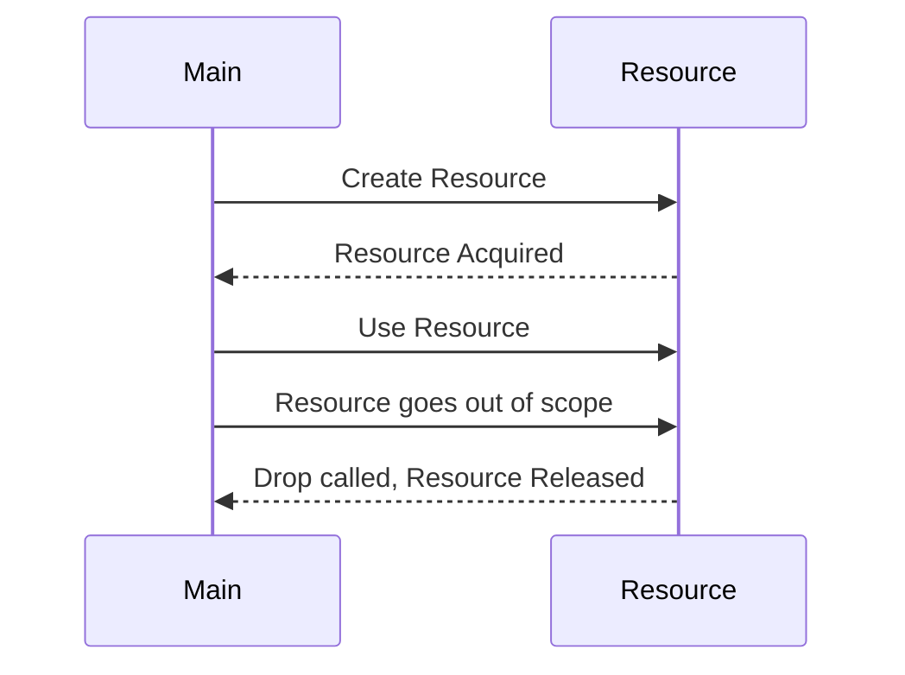

## 5.15. The RAII (Resource Acquisition Is Initialization) Pattern

In the world of systems programming, managing resources efficiently and safely is paramount. Rust, with its unique ownership model, provides a robust mechanism for resource management through the RAII (Resource Acquisition Is Initialization) pattern. This pattern ensures that resources such as memory, file handles, and locks are properly acquired and released, minimizing the risk of leaks and undefined behavior.

### Understanding RAII in Rust

**RAII** is a programming idiom that binds the lifecycle of resources to the lifetime of objects. In Rust, this is achieved through the ownership system and the `Drop` trait, which automatically handles resource cleanup when an object goes out of scope.

#### Key Concepts of RAII

- **Resource Acquisition**: Resources are acquired during the initialization of an object.
- **Resource Release**: Resources are automatically released when the object is destroyed.
- **Scope-Based Management**: The scope of an object determines the lifecycle of the resource it manages.

### The Role of Ownership and the `Drop` Trait

Rust's ownership model is central to implementing RAII. When an object goes out of scope, Rust automatically calls its destructor, defined by the `Drop` trait, to release any resources it holds.

```rust
struct Resource {
    name: String,
}

impl Drop for Resource {
    fn drop(&mut self) {
        println!("Releasing resource: {}", self.name);
    }
}

fn main() {
    let res = Resource { name: String::from("File Handle") };
    // Resource is automatically released when it goes out of scope
}
```

In this example, the `Resource` struct implements the `Drop` trait, ensuring that the resource is released when the object goes out of scope.

### Resource Management with RAII

RAII is particularly useful for managing various types of resources in Rust, such as:

- **Memory**: Rust's ownership model ensures memory is automatically deallocated when it is no longer needed.
- **File Handles**: File handles can be automatically closed when they go out of scope.
- **Locks**: Mutex guards can be released automatically, preventing deadlocks.

#### Example: Managing File Handles

Let's explore how RAII can be used to manage file handles in Rust.

```rust
use std::fs::File;
use std::io::{self, Write};

fn write_to_file() -> io::Result<()> {
    let mut file = File::create("example.txt")?;
    writeln!(file, "Hello, RAII!")?;
    // File is automatically closed when it goes out of scope
    Ok(())
}

fn main() {
    if let Err(e) = write_to_file() {
        eprintln!("Error writing to file: {}", e);
    }
}
```

In this example, the `File` object is automatically closed when it goes out of scope, thanks to the RAII pattern.

#### Example: Managing Mutex Guards

RAII is also effective in managing concurrency primitives like mutexes.

```rust
use std::sync::{Arc, Mutex};
use std::thread;

fn main() {
    let data = Arc::new(Mutex::new(0));

    let handles: Vec<_> = (0..10).map(|_| {
        let data = Arc::clone(&data);
        thread::spawn(move || {
            let mut num = data.lock().unwrap();
            *num += 1;
            // Mutex is automatically unlocked when `num` goes out of scope
        })
    }).collect();

    for handle in handles {
        handle.join().unwrap();
    }

    println!("Result: {}", *data.lock().unwrap());
}
```

Here, the mutex is automatically unlocked when the `num` variable goes out of scope, ensuring safe concurrent access.

### Benefits of Automatic Resource Management

The RAII pattern offers several benefits:

- **Safety**: Reduces the risk of resource leaks and undefined behavior.
- **Simplicity**: Simplifies code by eliminating the need for explicit resource management.
- **Concurrency**: Facilitates safe concurrent programming by automatically managing locks.

### RAII in Rust vs. Other Languages

RAII is a concept that originated in C++, but Rust's implementation is more robust due to its ownership model. In C++, developers must be cautious about copying and moving objects, which can lead to resource leaks. Rust's strict ownership rules prevent such issues, making RAII more reliable.

### Visualizing RAII in Rust

To better understand how RAII works in Rust, let's visualize the lifecycle of a resource using a sequence diagram.



This diagram illustrates the sequence of events in the RAII pattern, from resource acquisition to release.

### Try It Yourself

To deepen your understanding of RAII, try modifying the examples above:

- **Experiment with different resources**: Try managing other types of resources, such as network sockets or database connections.
- **Implement custom destructors**: Create your own structs and implement the `Drop` trait to manage resources.
- **Explore concurrency**: Use RAII to manage locks and other concurrency primitives in multi-threaded applications.

### Knowledge Check

- **What is RAII, and why is it important in Rust?**
- **How does the `Drop` trait facilitate RAII in Rust?**
- **What are some common resources managed using RAII?**
- **How does RAII in Rust differ from its implementation in C++?**

### Summary

The RAII pattern is a powerful tool in Rust for managing resources safely and efficiently. By leveraging Rust's ownership model and the `Drop` trait, developers can ensure that resources are properly acquired and released, reducing the risk of leaks and undefined behavior. As you continue your journey with Rust, remember to embrace RAII for robust and reliable resource management.

## Quiz Time!



### What does RAII stand for in Rust?

- [x] Resource Acquisition Is Initialization
- [ ] Resource Allocation Is Initialization
- [ ] Resource Allocation Is Immediate
- [ ] Resource Acquisition Is Immediate

> **Explanation:** RAII stands for Resource Acquisition Is Initialization, a pattern for managing resources.

### How does Rust ensure resources are released when they go out of scope?

- [x] By using the `Drop` trait
- [ ] By using garbage collection
- [ ] By using manual deallocation
- [ ] By using reference counting

> **Explanation:** Rust uses the `Drop` trait to automatically release resources when they go out of scope.

### Which of the following is NOT a benefit of RAII?

- [ ] Safety
- [ ] Simplicity
- [ ] Concurrency
- [x] Manual resource management

> **Explanation:** RAII eliminates the need for manual resource management, providing safety, simplicity, and concurrency benefits.

### In Rust, what happens when a `MutexGuard` goes out of scope?

- [x] The mutex is automatically unlocked
- [ ] The mutex remains locked
- [ ] The program panics
- [ ] The mutex is deleted

> **Explanation:** When a `MutexGuard` goes out of scope, the mutex is automatically unlocked.

### How does RAII in Rust differ from C++?

- [x] Rust's ownership model prevents resource leaks
- [ ] C++ has a more robust RAII implementation
- [ ] Rust requires manual resource management
- [ ] C++ uses garbage collection

> **Explanation:** Rust's ownership model makes RAII more reliable by preventing resource leaks, unlike C++.

### Which trait is used in Rust to define custom destructors?

- [x] `Drop`
- [ ] `Clone`
- [ ] `Copy`
- [ ] `Debug`

> **Explanation:** The `Drop` trait is used to define custom destructors in Rust.

### What is the primary purpose of RAII?

- [x] To manage resources automatically
- [ ] To allocate memory manually
- [ ] To handle errors
- [ ] To optimize performance

> **Explanation:** The primary purpose of RAII is to manage resources automatically.

### Which resource is NOT typically managed using RAII?

- [ ] Memory
- [ ] File handles
- [ ] Locks
- [x] User interface components

> **Explanation:** RAII is typically used to manage resources like memory, file handles, and locks, not user interface components.

### What is the role of the `Drop` trait in RAII?

- [x] It defines the destructor for releasing resources
- [ ] It allocates resources
- [ ] It initializes resources
- [ ] It copies resources

> **Explanation:** The `Drop` trait defines the destructor for releasing resources when they go out of scope.

### True or False: RAII in Rust requires manual deallocation of resources.

- [ ] True
- [x] False

> **Explanation:** RAII in Rust automatically manages resource deallocation, eliminating the need for manual deallocation.



Remember, this is just the beginning. As you progress, you'll build more complex and interactive applications. Keep experimenting, stay curious, and enjoy the journey!
