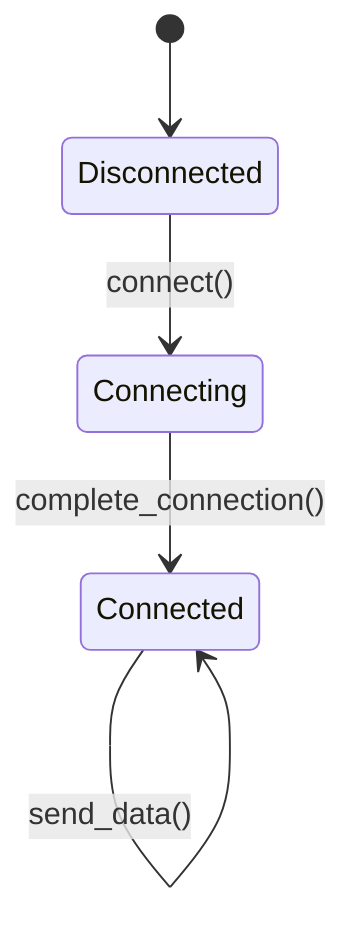

## 5.16. The Phantom Type Pattern

In the world of Rust programming, the Phantom Type Pattern is a powerful tool that allows developers to enforce compile-time constraints without storing data of that type. This pattern leverages Rust's strong type system to enhance code safety and robustness. In this section, we'll explore what phantom types are, how they work in Rust, and how you can use them to improve your code.

### What Are Phantom Types?

Phantom types are a design pattern in Rust that uses type parameters to enforce constraints at compile time. These types are called "phantom" because they do not correspond to actual data stored in the program. Instead, they serve as markers or tags that the compiler can use to enforce certain rules.

#### Key Characteristics of Phantom Types

- **Type Parameters**: Phantom types use generic type parameters to represent types that are not actually used in the data structure.
- **Compile-Time Safety**: By using phantom types, you can enforce constraints and invariants at compile time, reducing runtime errors.
- **No Runtime Overhead**: Since phantom types do not store actual data, they do not incur any runtime overhead.

### The `PhantomData` Marker Type

In Rust, the `PhantomData` marker type is used to declare phantom types. It is a zero-sized type that indicates to the compiler that a type parameter is being used, even though it is not stored in the struct.

#### Using `PhantomData`

Here's a simple example of how `PhantomData` can be used:

```rust
use std::marker::PhantomData;

// A struct with a phantom type parameter
struct MyStruct<T> {
    _marker: PhantomData<T>,
}

impl<T> MyStruct<T> {
    fn new() -> Self {
        MyStruct {
            _marker: PhantomData,
        }
    }
}

fn main() {
    let instance: MyStruct<i32> = MyStruct::new();
}
```

In this example, `MyStruct` has a phantom type parameter `T`. The `_marker` field is of type `PhantomData<T>`, which tells the compiler that `T` is a relevant type parameter, even though it is not used to store any data.

### Enforcing Type Safety with Phantom Types

Phantom types can be used to enforce type safety by restricting how certain operations can be performed. For example, you can use phantom types to represent different states of an object and ensure that only valid transitions between states are allowed.

#### Example: State Representation

Consider a scenario where you have a network connection that can be in different states: `Disconnected`, `Connecting`, and `Connected`. You can use phantom types to represent these states and ensure that operations are only performed in valid states.

```rust
use std::marker::PhantomData;

// State marker types
struct Disconnected;
struct Connecting;
struct Connected;

// A network connection with a phantom state type
struct NetworkConnection<State> {
    _state: PhantomData<State>,
}

impl NetworkConnection<Disconnected> {
    fn new() -> Self {
        NetworkConnection {
            _state: PhantomData,
        }
    }

    fn connect(self) -> NetworkConnection<Connecting> {
        println!("Connecting...");
        NetworkConnection {
            _state: PhantomData,
        }
    }
}

impl NetworkConnection<Connecting> {
    fn complete_connection(self) -> NetworkConnection<Connected> {
        println!("Connected!");
        NetworkConnection {
            _state: PhantomData,
        }
    }
}

impl NetworkConnection<Connected> {
    fn send_data(&self, data: &str) {
        println!("Sending data: {}", data);
    }
}

fn main() {
    let conn = NetworkConnection::<Disconnected>::new();
    let conn = conn.connect();
    let conn = conn.complete_connection();
    conn.send_data("Hello, world!");
}
```

In this example, the `NetworkConnection` struct uses a phantom type parameter to represent its state. The methods `connect`, `complete_connection`, and `send_data` are only available in the appropriate states, ensuring that invalid operations cannot be performed.

### Advanced Uses: Typestate Programming

Typestate programming is an advanced technique that uses phantom types to represent different states of an object and enforce state transitions at compile time. This approach can be particularly useful in scenarios where state management is critical, such as in protocol implementations or resource management.

#### Example: File Handling with Typestate

Let's consider a file handling example where a file can be in one of three states: `Closed`, `Open`, and `ReadOnly`. We can use phantom types to enforce valid state transitions and operations.

```rust
use std::marker::PhantomData;
use std::fs::File;
use std::io::{self, Read, Write};

// State marker types
struct Closed;
struct Open;
struct ReadOnly;

// A file handler with a phantom state type
struct FileHandler<State> {
    file: Option<File>,
    _state: PhantomData<State>,
}

impl FileHandler<Closed> {
    fn new() -> Self {
        FileHandler {
            file: None,
            _state: PhantomData,
        }
    }

    fn open(self, path: &str) -> io::Result<FileHandler<Open>> {
        let file = File::create(path)?;
        Ok(FileHandler {
            file: Some(file),
            _state: PhantomData,
        })
    }

    fn open_read_only(self, path: &str) -> io::Result<FileHandler<ReadOnly>> {
        let file = File::open(path)?;
        Ok(FileHandler {
            file: Some(file),
            _state: PhantomData,
        })
    }
}

impl FileHandler<Open> {
    fn write_data(&mut self, data: &[u8]) -> io::Result<()> {
        if let Some(ref mut file) = self.file {
            file.write_all(data)?;
        }
        Ok(())
    }

    fn close(self) -> FileHandler<Closed> {
        FileHandler {
            file: None,
            _state: PhantomData,
        }
    }
}

impl FileHandler<ReadOnly> {
    fn read_data(&mut self, buffer: &mut Vec<u8>) -> io::Result<usize> {
        if let Some(ref mut file) = self.file {
            return file.read_to_end(buffer);
        }
        Ok(0)
    }

    fn close(self) -> FileHandler<Closed> {
        FileHandler {
            file: None,
            _state: PhantomData,
        }
    }
}

fn main() -> io::Result<()> {
    let file_handler = FileHandler::<Closed>::new();
    let mut file_handler = file_handler.open("example.txt")?;
    file_handler.write_data(b"Hello, Rust!")?;
    let file_handler = file_handler.close();

    let mut file_handler = file_handler.open_read_only("example.txt")?;
    let mut buffer = Vec::new();
    file_handler.read_data(&mut buffer)?;
    println!("Read data: {:?}", String::from_utf8_lossy(&buffer));
    file_handler.close();

    Ok(())
}
```

In this example, the `FileHandler` struct uses phantom types to represent its state. The methods `open`, `open_read_only`, `write_data`, `read_data`, and `close` are only available in the appropriate states, ensuring that invalid operations cannot be performed.

### Scenarios Where Phantom Types Improve Code Robustness

Phantom types can be particularly useful in scenarios where you need to enforce invariants or constraints at compile time. Here are some examples:

- **Protocol Implementations**: Use phantom types to represent different states of a protocol and enforce valid state transitions.
- **Resource Management**: Use phantom types to represent the state of a resource (e.g., open or closed) and ensure that operations are only performed in valid states.
- **Type Safety**: Use phantom types to enforce type safety and prevent invalid operations.

### Design Considerations

When using phantom types, it's important to consider the following:

- **Complexity**: While phantom types can improve safety, they can also add complexity to your code. Use them judiciously and only when the benefits outweigh the costs.
- **Documentation**: Clearly document the purpose and usage of phantom types in your code to ensure that other developers understand their role.
- **Testing**: Even though phantom types enforce constraints at compile time, it's still important to thoroughly test your code to ensure that it behaves as expected.

### Rust Unique Features

Rust's strong type system and zero-cost abstractions make it an ideal language for implementing phantom types. The `PhantomData` marker type is a unique feature of Rust that allows developers to declare phantom types without incurring runtime overhead.

### Differences and Similarities

Phantom types are similar to other type-level programming techniques, such as type-level enums or type-level integers. However, phantom types are unique in that they do not correspond to actual data stored in the program, making them a lightweight and efficient way to enforce constraints.

### Try It Yourself

To get a better understanding of phantom types, try modifying the examples provided in this section. For instance, you can add additional states to the `NetworkConnection` or `FileHandler` examples and implement new methods that are only available in those states. Experiment with different scenarios to see how phantom types can be used to enforce constraints and improve code safety.

### Visualizing Phantom Types

To help visualize how phantom types work, consider the following diagram that represents the state transitions of the `NetworkConnection` example:



This diagram illustrates the valid state transitions for a `NetworkConnection` object, with each state represented by a phantom type.

### References and Links

For further reading on phantom types and related concepts, consider the following resources:

- [Rust Documentation on PhantomData](https://doc.rust-lang.org/std/marker/struct.PhantomData.html)
- [Rust Design Patterns](https://rust-unofficial.github.io/patterns/)
- [Typestate Programming in Rust](https://blog.yoshuawuyts.com/typestate/)

### Knowledge Check

To reinforce your understanding of phantom types, consider the following questions:

1. What are phantom types, and how do they differ from regular types?
2. How does the `PhantomData` marker type work in Rust?
3. In what scenarios might you use phantom types to enforce type safety?
4. How can phantom types be used to represent different states of an object?
5. What are some potential drawbacks of using phantom types in your code?

### Embrace the Journey

Remember, mastering phantom types is just one step in your journey to becoming a Rust expert. As you continue to explore Rust's powerful type system and design patterns, you'll discover new ways to write safe, efficient, and robust code. Keep experimenting, stay curious, and enjoy the journey!

## Quiz Time!



### What is a phantom type in Rust?

- [x] A type parameter used to enforce compile-time constraints without storing data
- [ ] A type that stores data but is not used
- [ ] A type that is only used at runtime
- [ ] A type that is automatically generated by the compiler

> **Explanation:** Phantom types are used to enforce compile-time constraints without storing data of that type.

### What is the purpose of the `PhantomData` marker type in Rust?

- [x] To indicate that a type parameter is being used without storing data
- [ ] To store data of a specific type
- [ ] To automatically generate type parameters
- [ ] To enforce runtime constraints

> **Explanation:** `PhantomData` is a zero-sized type used to indicate that a type parameter is relevant, even if it is not used to store data.

### How can phantom types improve code safety?

- [x] By enforcing constraints and invariants at compile time
- [ ] By reducing runtime errors through dynamic checks
- [ ] By automatically generating safe code
- [ ] By storing additional metadata

> **Explanation:** Phantom types enforce constraints and invariants at compile time, reducing the likelihood of runtime errors.

### In the `NetworkConnection` example, what does the `connect` method return?

- [x] `NetworkConnection<Connecting>`
- [ ] `NetworkConnection<Connected>`
- [ ] `NetworkConnection<Disconnected>`
- [ ] `NetworkConnection<Open>`

> **Explanation:** The `connect` method transitions the state from `Disconnected` to `Connecting`.

### What is typestate programming?

- [x] A technique that uses phantom types to represent different states of an object
- [ ] A programming paradigm focused on dynamic typing
- [ ] A method for optimizing runtime performance
- [ ] A way to automatically generate state transitions

> **Explanation:** Typestate programming uses phantom types to represent different states of an object and enforce valid state transitions.

### What is a potential drawback of using phantom types?

- [x] Increased code complexity
- [ ] Reduced runtime performance
- [ ] Inability to enforce compile-time constraints
- [ ] Lack of support in Rust

> **Explanation:** While phantom types improve safety, they can also add complexity to the code.

### How does the `FileHandler` example ensure valid state transitions?

- [x] By using phantom types to represent states and restricting method availability
- [ ] By dynamically checking states at runtime
- [ ] By storing state information in a separate data structure
- [ ] By using global variables to track states

> **Explanation:** The `FileHandler` example uses phantom types to represent states and restricts method availability based on the current state.

### What is the runtime overhead of using phantom types?

- [x] None, since phantom types do not store data
- [ ] Minimal, due to additional type checks
- [ ] Significant, due to increased memory usage
- [ ] Variable, depending on the complexity of the types

> **Explanation:** Phantom types do not store data, so they do not incur any runtime overhead.

### Which of the following is a valid use case for phantom types?

- [x] Enforcing protocol state transitions
- [ ] Storing large amounts of data
- [ ] Optimizing runtime performance
- [ ] Automatically generating code

> **Explanation:** Phantom types are useful for enforcing protocol state transitions and other compile-time constraints.

### True or False: Phantom types can be used to represent actual data stored in a program.

- [ ] True
- [x] False

> **Explanation:** Phantom types do not correspond to actual data stored in the program; they are used to enforce constraints at compile time.


