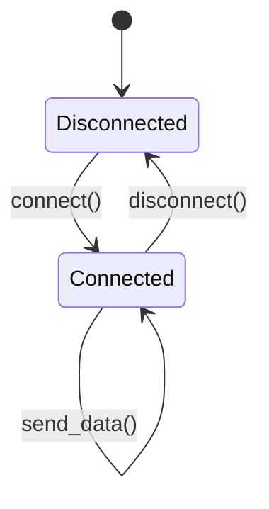

## 5.17. The Typestate Pattern

### Introduction

The Typestate Pattern is a powerful design pattern that leverages Rust's type system to encode the states of an object at compile time. This pattern ensures that invalid state transitions are caught during compilation, leading to safer and more reliable code. By using Rust's generics and traits, developers can model different states and enforce correct usage patterns without runtime checks.

### Understanding the Typestate Pattern

The Typestate Pattern is a concept that originated from the idea of using types to represent the state of an object. Unlike traditional state machines, where state transitions are managed at runtime, the Typestate Pattern uses the type system to enforce state transitions at compile time. This approach provides several advantages, including eliminating certain classes of runtime errors and improving code clarity.

#### Purpose of the Typestate Pattern

The primary purpose of the Typestate Pattern is to ensure that an object is used correctly by encoding its valid states and transitions in the type system. This pattern is particularly useful in scenarios where an object must go through a series of states in a specific order, such as file handling, network connections, or protocol implementations.

### Modeling States with Generics and Traits

Rust's powerful type system, including generics and traits, provides the necessary tools to implement the Typestate Pattern. By defining different states as distinct types, we can use generics to parameterize an object over its state. Traits can be used to define the behavior associated with each state, ensuring that only valid operations are performed.

#### Using Generics to Represent States

Generics allow us to parameterize a struct or function over a type, which can be used to represent the state of an object. By defining a generic type parameter for the state, we can create a single struct that can be in multiple states.

```rust
struct Connection<State> {
    state: State,
}
```

In this example, `Connection` is a struct that can be in different states, represented by the generic type `State`.

#### Defining State Traits

Traits can be used to define the behavior associated with each state. By implementing different traits for each state, we can ensure that only valid operations are available in a given state.

```rust
trait Connected {
    fn send_data(&self, data: &[u8]);
}

trait Disconnected {
    fn connect(&self) -> Connection<ConnectedState>;
}
```

Here, we define two traits, `Connected` and `Disconnected`, representing the operations available in each state.

### Implementing the Typestate Pattern

Let's implement a simple example of the Typestate Pattern using a network connection. We'll define a `Connection` struct that can be in either a `Connected` or `Disconnected` state.

#### Defining State Types

First, we define the types representing each state.

```rust
struct ConnectedState;
struct DisconnectedState;
```

These types will be used as the state parameter for the `Connection` struct.

#### Implementing the Connection Struct

Next, we implement the `Connection` struct with a generic state parameter.

```rust
struct Connection<State> {
    state: State,
}

impl Connection<DisconnectedState> {
    fn new() -> Self {
        Connection {
            state: DisconnectedState,
        }
    }

    fn connect(self) -> Connection<ConnectedState> {
        // Logic to establish a connection
        Connection {
            state: ConnectedState,
        }
    }
}

impl Connection<ConnectedState> {
    fn send_data(&self, data: &[u8]) {
        // Logic to send data
    }

    fn disconnect(self) -> Connection<DisconnectedState> {
        // Logic to disconnect
        Connection {
            state: DisconnectedState,
        }
    }
}
```

In this implementation, the `Connection` struct can transition between `Connected` and `Disconnected` states. The `connect` method transitions from `DisconnectedState` to `ConnectedState`, while the `disconnect` method transitions back.

### Benefits of Compile-Time Checks

The Typestate Pattern provides several benefits by enforcing state transitions at compile time:

- **Safety**: By catching invalid state transitions during compilation, we eliminate certain classes of runtime errors.
- **Clarity**: The type system provides clear documentation of the valid states and transitions, making the code easier to understand and maintain.
- **Performance**: Since state transitions are checked at compile time, there is no runtime overhead associated with managing states.

### Visualizing the Typestate Pattern

To better understand the Typestate Pattern, let's visualize the state transitions using a state diagram.



This diagram represents the possible states and transitions for the `Connection` struct. The `connect` method transitions from `Disconnected` to `Connected`, while the `disconnect` method transitions back. The `send_data` method is only available in the `Connected` state.

### Trade-offs and Complexity

While the Typestate Pattern offers significant benefits, it also introduces some complexity. Here are a few trade-offs to consider:

- **Increased Complexity**: Implementing the Typestate Pattern can result in more complex code, especially for objects with many states and transitions.
- **Limited Flexibility**: The pattern enforces strict state transitions, which may limit flexibility in some scenarios.
- **Learning Curve**: Understanding and applying the Typestate Pattern requires a solid understanding of Rust's type system, generics, and traits.

### Try It Yourself

To get a better feel for the Typestate Pattern, try modifying the example code to add additional states or transitions. For instance, you could add a `Connecting` state to represent the process of establishing a connection.

### Conclusion

The Typestate Pattern is a powerful tool in Rust's arsenal, allowing developers to leverage the type system to manage object states at compile time. By encoding states and transitions in the type system, we can ensure safe and correct usage patterns, leading to more reliable and maintainable code. While the pattern introduces some complexity, the benefits of compile-time safety and clarity often outweigh the trade-offs.

### Further Reading

For more information on the Typestate Pattern and related concepts, consider exploring the following resources:

- [Rust Programming Language Documentation](https://doc.rust-lang.org/)
- [Rust Design Patterns](https://rust-unofficial.github.io/patterns/)
- [State Machines in Rust](https://state-machine.rs/)

## Quiz Time!



### What is the primary purpose of the Typestate Pattern?

- [x] To ensure correct usage of an object by encoding its valid states and transitions in the type system.
- [ ] To manage runtime state transitions more efficiently.
- [ ] To simplify the implementation of state machines.
- [ ] To improve the performance of state transitions.

> **Explanation:** The Typestate Pattern uses the type system to ensure correct usage by encoding valid states and transitions, catching errors at compile time.

### Which Rust features are primarily used to implement the Typestate Pattern?

- [x] Generics and Traits
- [ ] Macros and Procedural Macros
- [ ] Enums and Pattern Matching
- [ ] Closures and Higher-Order Functions

> **Explanation:** Generics and traits are used to model different states and define behavior in the Typestate Pattern.

### What is a potential trade-off of using the Typestate Pattern?

- [x] Increased complexity in code
- [ ] Reduced performance due to runtime checks
- [ ] Limited use of Rust's type system
- [ ] Difficulty in implementing state transitions

> **Explanation:** The Typestate Pattern can increase code complexity due to the need to define multiple types and transitions.

### In the provided example, which method transitions the `Connection` from `DisconnectedState` to `ConnectedState`?

- [x] `connect()`
- [ ] `send_data()`
- [ ] `disconnect()`
- [ ] `new()`

> **Explanation:** The `connect()` method transitions the `Connection` from `DisconnectedState` to `ConnectedState`.

### What is a benefit of compile-time checks for state transitions?

- [x] Eliminates certain classes of runtime errors
- [ ] Increases runtime performance
- [ ] Simplifies code implementation
- [ ] Enhances flexibility in state management

> **Explanation:** Compile-time checks eliminate certain runtime errors by ensuring valid state transitions before execution.

### How does the Typestate Pattern improve code clarity?

- [x] By providing clear documentation of valid states and transitions in the type system
- [ ] By reducing the number of lines of code
- [ ] By simplifying the logic of state transitions
- [ ] By using fewer types and traits

> **Explanation:** The type system provides clear documentation of valid states and transitions, improving code clarity.

### Which of the following is NOT a state in the provided example?

- [x] `ConnectingState`
- [ ] `ConnectedState`
- [ ] `DisconnectedState`
- [ ] `Connection`

> **Explanation:** `ConnectingState` is not defined in the provided example; only `ConnectedState` and `DisconnectedState` are used.

### What is a potential downside of the Typestate Pattern?

- [x] Limited flexibility in some scenarios
- [ ] Increased runtime errors
- [ ] Reduced code readability
- [ ] Difficulty in understanding Rust's type system

> **Explanation:** The Typestate Pattern enforces strict state transitions, which may limit flexibility in some scenarios.

### True or False: The Typestate Pattern eliminates the need for runtime state checks.

- [x] True
- [ ] False

> **Explanation:** The Typestate Pattern uses compile-time checks to ensure valid state transitions, eliminating the need for runtime checks.

### What is a common use case for the Typestate Pattern?

- [x] Managing protocol implementations
- [ ] Simplifying algorithm complexity
- [ ] Enhancing UI design
- [ ] Improving database performance

> **Explanation:** The Typestate Pattern is commonly used for managing protocol implementations, where specific state transitions are required.



Remember, this is just the beginning. As you progress, you'll discover more ways to leverage Rust's type system for safe and efficient programming. Keep experimenting, stay curious, and enjoy the journey!
