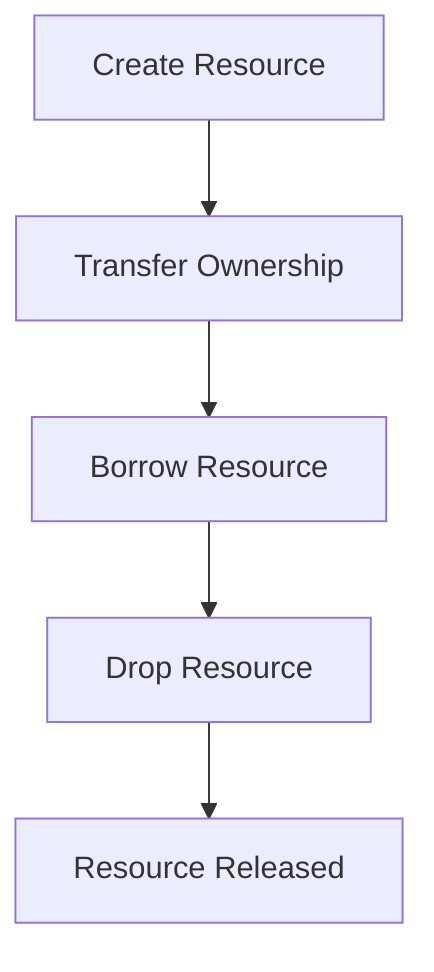

## 5.18. The Ownership-Based Resource Management Pattern

In Rust, the Ownership-Based Resource Management Pattern is a fundamental concept that leverages the language's unique ownership system to manage resources effectively. This pattern ensures that resources are properly released, preventing resource leaks and other common issues such as double-free errors. In this section, we'll delve into how Rust's ownership model, along with the `Drop` trait, facilitates resource management, and we'll explore patterns for transferring ownership and borrowing.

### Understanding Ownership in Rust

Ownership is a core concept in Rust that dictates how memory and other resources are managed. Each value in Rust has a single owner, and when the owner goes out of scope, the value is automatically dropped, freeing the associated resources. This system eliminates the need for a garbage collector and ensures memory safety by design.

#### Key Principles of Ownership

1. **Each value has a single owner.**
2. **Ownership can be transferred.**
3. **When the owner goes out of scope, the value is dropped.**

These principles form the basis of Rust's memory safety guarantees, preventing issues like use-after-free and double-free errors.

### The `Drop` Trait

The `Drop` trait in Rust provides a way to customize what happens when a value goes out of scope. By implementing the `Drop` trait, you can specify how resources should be released, ensuring that any necessary cleanup is performed.

```rust
struct Resource {
    name: String,
}

impl Drop for Resource {
    fn drop(&mut self) {
        println!("Dropping resource: {}", self.name);
    }
}

fn main() {
    let _res = Resource { name: String::from("MyResource") };
    // Resource will be automatically dropped here
}
```

In this example, the `Resource` struct implements the `Drop` trait, and when an instance of `Resource` goes out of scope, the `drop` method is called, printing a message to the console.

### Ownership and Safe Resource Usage

Ownership ensures safe resource usage by enforcing strict rules about how resources can be accessed and modified. This prevents common issues like data races and memory leaks.

#### Transferring Ownership

Ownership can be transferred using move semantics. When a value is moved, the original owner relinquishes control, and the new owner takes over.

```rust
fn take_ownership(resource: Resource) {
    println!("Taking ownership of: {}", resource.name);
}

fn main() {
    let res = Resource { name: String::from("MyResource") };
    take_ownership(res);
    // res is no longer valid here
}
```

In this example, the `take_ownership` function takes ownership of the `Resource`, and the original owner can no longer use it after the transfer.

#### Borrowing and References

Borrowing allows you to access a value without taking ownership. Rust enforces borrowing rules to ensure memory safety, such as allowing either one mutable reference or multiple immutable references at a time.

```rust
fn borrow_resource(resource: &Resource) {
    println!("Borrowing resource: {}", resource.name);
}

fn main() {
    let res = Resource { name: String::from("MyResource") };
    borrow_resource(&res);
    // res is still valid here
}
```

Here, the `borrow_resource` function borrows the `Resource` without taking ownership, allowing the original owner to continue using it.

### Avoiding Common Resource Management Issues

Rust's ownership model helps avoid common resource management issues found in languages without ownership systems, such as C++ or Java.

#### Double-Free and Use-After-Free

In languages like C++, manual memory management can lead to double-free or use-after-free errors. Rust's ownership system prevents these issues by ensuring that each value has a single owner responsible for its cleanup.

#### Memory Leaks

While Rust's ownership system prevents many memory leaks, it's still possible to create leaks if resources are not properly managed. For example, creating reference cycles with `Rc` and `RefCell` can lead to memory leaks.

```rust
use std::rc::Rc;
use std::cell::RefCell;

struct Node {
    value: i32,
    next: Option<Rc<RefCell<Node>>>,
}

fn main() {
    let first = Rc::new(RefCell::new(Node { value: 1, next: None }));
    let second = Rc::new(RefCell::new(Node { value: 2, next: Some(Rc::clone(&first)) }));
    first.borrow_mut().next = Some(Rc::clone(&second));
    // This creates a reference cycle, leading to a memory leak
}
```

In this example, a reference cycle is created between `first` and `second`, preventing the nodes from being dropped and causing a memory leak.

### Comparing with Other Languages

In languages without ownership systems, resource management is often handled manually or through garbage collection. This can lead to issues like memory leaks, double-free errors, and data races.

#### C++ Resource Management

In C++, resource management is typically handled using RAII (Resource Acquisition Is Initialization), where resources are tied to object lifetimes. However, this requires careful management to avoid issues like double-free errors.

#### Java Resource Management

Java uses garbage collection to manage memory, which can lead to unpredictable performance and memory leaks if resources are not properly released.

### Rust's Unique Features

Rust's ownership system provides unique advantages for resource management, including:

- **Memory Safety**: Ownership ensures that resources are safely accessed and modified, preventing data races and memory leaks.
- **Performance**: Rust's lack of a garbage collector allows for predictable performance and low overhead.
- **Concurrency**: Ownership and borrowing rules enable safe concurrency, preventing data races and other concurrency issues.

### Design Considerations

When using the Ownership-Based Resource Management Pattern, consider the following:

- **Resource Lifetimes**: Ensure that resources are properly scoped and dropped when no longer needed.
- **Ownership Transfer**: Use move semantics to transfer ownership when necessary, and ensure that the original owner no longer uses the resource.
- **Borrowing**: Use borrowing to access resources without taking ownership, and adhere to Rust's borrowing rules to ensure memory safety.

### Visualizing Ownership and Borrowing

To better understand ownership and borrowing, let's visualize the process using a flowchart.



This flowchart illustrates the lifecycle of a resource in Rust, from creation to release, highlighting the key steps of ownership transfer, borrowing, and dropping.

### Try It Yourself

To solidify your understanding of the Ownership-Based Resource Management Pattern, try modifying the code examples provided. Experiment with transferring ownership, borrowing resources, and implementing the `Drop` trait for custom cleanup.

### Knowledge Check

- **What is the primary purpose of the ownership system in Rust?**
- **How does the `Drop` trait facilitate resource management?**
- **What are the key differences between ownership and borrowing?**
- **How does Rust prevent common resource management issues like double-free errors?**

### Summary

In this section, we've explored the Ownership-Based Resource Management Pattern in Rust, highlighting how the ownership system, along with the `Drop` trait, facilitates safe and efficient resource management. By leveraging Rust's unique features, you can prevent common issues like memory leaks and data races, ensuring that your programs are both safe and performant.

Remember, this is just the beginning. As you progress, you'll build more complex and interactive applications. Keep experimenting, stay curious, and enjoy the journey!

## Quiz Time!



### What is the primary purpose of Rust's ownership system?

- [x] To ensure memory safety and prevent resource leaks
- [ ] To provide garbage collection
- [ ] To allow multiple owners for each resource
- [ ] To simplify syntax

> **Explanation:** Rust's ownership system ensures memory safety and prevents resource leaks by enforcing strict rules about how resources are accessed and modified.

### How does the `Drop` trait facilitate resource management?

- [x] By allowing custom cleanup when a value goes out of scope
- [ ] By preventing resource allocation
- [ ] By enabling multiple ownership
- [ ] By providing automatic garbage collection

> **Explanation:** The `Drop` trait allows you to specify custom cleanup logic for when a value goes out of scope, ensuring that resources are properly released.

### What is the key difference between ownership and borrowing in Rust?

- [x] Ownership transfers control of a resource, while borrowing allows access without transfer
- [ ] Ownership allows multiple references, while borrowing does not
- [ ] Ownership is temporary, while borrowing is permanent
- [ ] Ownership is only for primitive types, while borrowing is for complex types

> **Explanation:** Ownership involves transferring control of a resource, while borrowing allows access to a resource without transferring ownership.

### How does Rust prevent double-free errors?

- [x] By ensuring each value has a single owner responsible for cleanup
- [ ] By using a garbage collector
- [ ] By allowing multiple owners for each resource
- [ ] By preventing resource allocation

> **Explanation:** Rust's ownership system ensures that each value has a single owner responsible for its cleanup, preventing double-free errors.

### What is a potential issue when using `Rc` and `RefCell`?

- [x] Creating reference cycles that lead to memory leaks
- [ ] Preventing resource allocation
- [ ] Allowing multiple mutable references
- [ ] Disabling the `Drop` trait

> **Explanation:** Using `Rc` and `RefCell` can create reference cycles, which prevent resources from being dropped and lead to memory leaks.

### Which of the following is a benefit of Rust's ownership system?

- [x] Memory safety without a garbage collector
- [ ] Automatic garbage collection
- [ ] Multiple ownership for each resource
- [ ] Simplified syntax

> **Explanation:** Rust's ownership system provides memory safety without the need for a garbage collector, ensuring predictable performance and low overhead.

### What is the purpose of borrowing in Rust?

- [x] To access a resource without taking ownership
- [ ] To transfer ownership of a resource
- [ ] To prevent resource allocation
- [ ] To enable automatic garbage collection

> **Explanation:** Borrowing allows you to access a resource without taking ownership, adhering to Rust's borrowing rules to ensure memory safety.

### How does Rust's ownership system enable safe concurrency?

- [x] By enforcing borrowing rules that prevent data races
- [ ] By using a garbage collector
- [ ] By allowing multiple owners for each resource
- [ ] By simplifying syntax

> **Explanation:** Rust's ownership system enforces borrowing rules that prevent data races, enabling safe concurrency.

### What is the role of the `Drop` trait in Rust?

- [x] To specify custom cleanup logic for when a value goes out of scope
- [ ] To prevent resource allocation
- [ ] To enable multiple ownership
- [ ] To provide automatic garbage collection

> **Explanation:** The `Drop` trait allows you to specify custom cleanup logic for when a value goes out of scope, ensuring that resources are properly released.

### True or False: Rust's ownership system allows for multiple owners of a single resource.

- [ ] True
- [x] False

> **Explanation:** Rust's ownership system ensures that each value has a single owner, preventing issues like double-free errors and ensuring memory safety.


