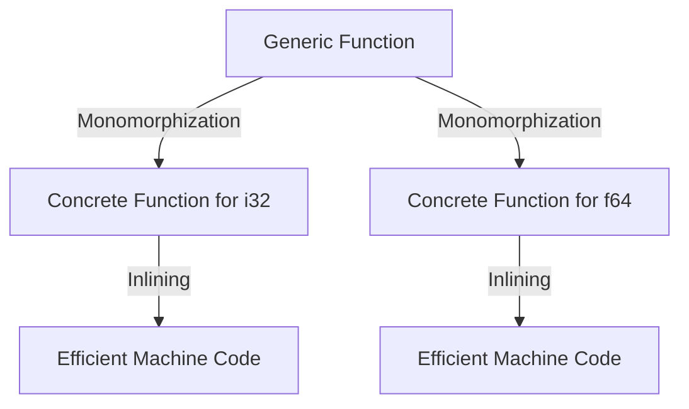

## 5.2. Zero-Cost Abstractions

In the world of systems programming, performance is paramount. Developers often face a trade-off between writing expressive, high-level code and maintaining the low-level efficiency required for system-critical applications. Rust, however, offers a unique proposition: zero-cost abstractions. This concept allows developers to write high-level, expressive code without incurring runtime overhead, thus combining the best of both worlds—performance and safety.

### Understanding Zero-Cost Abstractions

Zero-cost abstractions are a design philosophy where the abstractions provided by a programming language do not add any additional runtime cost compared to equivalent hand-written low-level code. In Rust, this means that you can use high-level constructs like iterators, closures, and generics without worrying about performance penalties.

#### Why Zero-Cost Abstractions Matter

1. **Performance**: In systems programming, every cycle counts. Zero-cost abstractions ensure that the abstractions you use do not introduce unnecessary overhead, allowing your code to run as efficiently as possible.

2. **Readability and Maintainability**: High-level abstractions make code more readable and maintainable. They allow developers to express their intent clearly without delving into low-level details.

3. **Safety**: Rust's abstractions are designed with safety in mind. They leverage the language's ownership model to prevent common bugs like null pointer dereferences and data races.

4. **Expressiveness**: Developers can write expressive code that is both safe and performant, enabling them to focus on solving problems rather than managing low-level details.

### Key Rust Features Enabling Zero-Cost Abstractions

Rust achieves zero-cost abstractions through several key features:

#### Monomorphization

Monomorphization is the process by which Rust generates specific versions of generic functions and types for each concrete type they are used with. This means that when you use a generic function, Rust compiles it into a version that is specific to the types you are using, eliminating any abstraction overhead.

```rust
fn add<T: std::ops::Add<Output = T>>(a: T, b: T) -> T {
    a + b
}

fn main() {
    let int_sum = add(5, 10); // Monomorphized to use i32
    let float_sum = add(5.0, 10.0); // Monomorphized to use f64
}
```

In the above example, the `add` function is monomorphized for both `i32` and `f64`, resulting in efficient machine code for each type.

#### Inlining

Inlining is a compiler optimization that replaces a function call with the actual code of the function. Rust's compiler aggressively inlines functions, especially small ones, to eliminate the overhead of function calls.

```rust
#[inline(always)]
fn square(x: i32) -> i32 {
    x * x
}

fn main() {
    let result = square(5); // Inlined, no function call overhead
}
```

By using the `#[inline(always)]` attribute, we can suggest to the compiler that it should always inline the `square` function, further reducing overhead.

#### Ownership and Borrowing

Rust's ownership model is central to its zero-cost abstractions. By enforcing strict ownership rules at compile time, Rust eliminates the need for garbage collection, which can introduce runtime overhead.

```rust
fn process_data(data: &Vec<i32>) {
    // Safe access to data without copying
    for &item in data.iter() {
        println!("{}", item);
    }
}

fn main() {
    let data = vec![1, 2, 3, 4, 5];
    process_data(&data); // Borrowing, no ownership transfer
}
```

In this example, the `process_data` function borrows the vector, allowing it to access the data without taking ownership or making a copy, thus maintaining performance.

### Comparing with Other Languages

In many languages, high-level abstractions can introduce significant overhead. For example, in languages with garbage collection, such as Java or C#, the cost of memory management can be substantial. Similarly, in languages like Python, dynamic typing and interpreted execution can lead to slower performance.

Rust, by contrast, compiles to native code and uses static typing, allowing it to optimize abstractions away entirely. This means that Rust code can often match or exceed the performance of equivalent C or C++ code, while still providing higher-level abstractions.

### Examples of Zero-Cost Abstractions in Rust

#### Iterators

Rust's iterator pattern is a prime example of zero-cost abstractions. Iterators in Rust are lazy, meaning they do not perform any computation until they are consumed. This allows for efficient chaining of operations without intermediate allocations.

```rust
fn main() {
    let numbers = vec![1, 2, 3, 4, 5];
    let sum: i32 = numbers.iter().map(|x| x * 2).filter(|x| x > 5).sum();
    println!("Sum: {}", sum);
}
```

In this example, the iterator operations are compiled into a single loop, with no intermediate collections, thanks to Rust's zero-cost abstractions.

#### Closures

Closures in Rust are another example of zero-cost abstractions. They are compiled into structs that implement the `Fn`, `FnMut`, or `FnOnce` traits, allowing them to be optimized away by the compiler.

```rust
fn apply<F>(f: F, x: i32) -> i32
where
    F: Fn(i32) -> i32,
{
    f(x)
}

fn main() {
    let double = |x| x * 2;
    let result = apply(double, 5);
    println!("Result: {}", result);
}
```

Here, the closure `double` is compiled into an efficient function call, with no runtime overhead.

### Writing Expressive Code Without Performance Penalties

Rust encourages developers to write expressive code by providing powerful abstractions that do not compromise performance. This allows developers to focus on solving problems rather than worrying about the cost of abstractions.

#### Example: Using Traits for Polymorphism

Traits in Rust provide a way to achieve polymorphism without the overhead of virtual function calls, as seen in other languages.

```rust
trait Shape {
    fn area(&self) -> f64;
}

struct Circle {
    radius: f64,
}

impl Shape for Circle {
    fn area(&self) -> f64 {
        std::f64::consts::PI * self.radius * self.radius
    }
}

struct Square {
    side: f64,
}

impl Shape for Square {
    fn area(&self) -> f64 {
        self.side * self.side
    }
}

fn print_area(shape: &dyn Shape) {
    println!("Area: {}", shape.area());
}

fn main() {
    let circle = Circle { radius: 2.0 };
    let square = Square { side: 3.0 };

    print_area(&circle);
    print_area(&square);
}
```

In this example, the use of traits allows for polymorphism without the overhead of dynamic dispatch, thanks to Rust's efficient trait object implementation.

### Visualizing Zero-Cost Abstractions

To better understand how Rust achieves zero-cost abstractions, let's visualize the process of monomorphization and inlining using Mermaid.js diagrams.



**Diagram Description**: This diagram illustrates how a generic function is monomorphized into concrete functions for specific types (`i32` and `f64`), which are then inlined to produce efficient machine code.

### Key Takeaways

- **Zero-cost abstractions** in Rust allow developers to write high-level, expressive code without sacrificing performance.
- **Monomorphization** and **inlining** are key techniques that enable Rust to eliminate abstraction overhead.
- **Ownership and borrowing** provide safety without the need for garbage collection, maintaining performance.
- Rust's abstractions often outperform those in other languages, making it an excellent choice for systems programming.

### Embrace the Journey

Remember, mastering zero-cost abstractions in Rust is just the beginning. As you continue to explore Rust's powerful features, you'll find new ways to write expressive, efficient, and safe code. Keep experimenting, stay curious, and enjoy the journey!

## Quiz Time!



### What is the primary benefit of zero-cost abstractions in Rust?

- [x] They allow high-level code to run as efficiently as low-level code.
- [ ] They simplify the syntax of the Rust language.
- [ ] They enable dynamic typing in Rust.
- [ ] They provide automatic memory management.

> **Explanation:** Zero-cost abstractions ensure that high-level code incurs no additional runtime cost compared to equivalent low-level code.

### How does Rust achieve zero-cost abstractions?

- [x] Through monomorphization and inlining.
- [ ] By using a garbage collector.
- [ ] By interpreting code at runtime.
- [ ] By using dynamic typing.

> **Explanation:** Rust uses monomorphization and inlining to eliminate the overhead of abstractions.

### What is monomorphization in Rust?

- [x] The process of generating specific versions of generic functions for each concrete type.
- [ ] The process of interpreting code at runtime.
- [ ] The process of garbage collection.
- [ ] The process of dynamic typing.

> **Explanation:** Monomorphization generates specific versions of generic functions for each concrete type, eliminating abstraction overhead.

### What role does inlining play in zero-cost abstractions?

- [x] It replaces function calls with the actual code of the function.
- [ ] It interprets code at runtime.
- [ ] It manages memory automatically.
- [ ] It provides dynamic typing.

> **Explanation:** Inlining replaces function calls with the actual code of the function, reducing overhead.

### Which Rust feature eliminates the need for garbage collection?

- [x] Ownership and borrowing.
- [ ] Dynamic typing.
- [ ] Monomorphization.
- [ ] Inlining.

> **Explanation:** Ownership and borrowing eliminate the need for garbage collection by enforcing strict ownership rules at compile time.

### How do iterators in Rust exemplify zero-cost abstractions?

- [x] They are compiled into a single loop with no intermediate allocations.
- [ ] They introduce runtime overhead.
- [ ] They require garbage collection.
- [ ] They use dynamic typing.

> **Explanation:** Iterators in Rust are compiled into a single loop with no intermediate allocations, exemplifying zero-cost abstractions.

### What is the advantage of using traits for polymorphism in Rust?

- [x] They provide polymorphism without the overhead of dynamic dispatch.
- [ ] They require garbage collection.
- [ ] They introduce runtime overhead.
- [ ] They use dynamic typing.

> **Explanation:** Traits provide polymorphism without the overhead of dynamic dispatch, thanks to Rust's efficient trait object implementation.

### How do closures in Rust achieve zero-cost abstractions?

- [x] They are compiled into structs that implement the `Fn`, `FnMut`, or `FnOnce` traits.
- [ ] They require garbage collection.
- [ ] They introduce runtime overhead.
- [ ] They use dynamic typing.

> **Explanation:** Closures in Rust are compiled into structs that implement the `Fn`, `FnMut`, or `FnOnce` traits, achieving zero-cost abstractions.

### What is a key difference between Rust and languages with garbage collection regarding zero-cost abstractions?

- [x] Rust eliminates the need for garbage collection, maintaining performance.
- [ ] Rust uses dynamic typing.
- [ ] Rust interprets code at runtime.
- [ ] Rust introduces runtime overhead.

> **Explanation:** Rust eliminates the need for garbage collection, maintaining performance, unlike languages with garbage collection.

### True or False: Zero-cost abstractions in Rust allow developers to write expressive code without performance penalties.

- [x] True
- [ ] False

> **Explanation:** Zero-cost abstractions in Rust allow developers to write expressive code without performance penalties, combining safety and efficiency.


