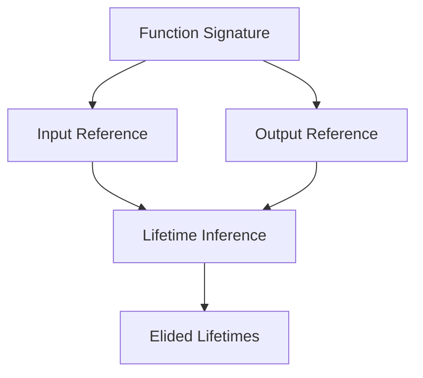

## 5.20. The Borrow Checker and Lifetime Elision Patterns

In Rust, the borrow checker and lifetime elision are fundamental concepts that ensure memory safety and efficient resource management. Understanding these patterns is crucial for writing idiomatic and performant Rust code. In this section, we will delve into the intricacies of the borrow checker, explore the rules of lifetime elision, and provide practical examples to illustrate these concepts.

### Understanding the Borrow Checker

The borrow checker is a core component of Rust's compiler that enforces the language's strict ownership and borrowing rules. Its primary role is to ensure that references to data do not outlive the data they point to, preventing dangling references and data races.

#### Key Concepts of the Borrow Checker

1. **Ownership**: Each value in Rust has a single owner, and when the owner goes out of scope, the value is dropped.
2. **Borrowing**: Rust allows references to data through borrowing, which can be either mutable or immutable.
3. **Lifetimes**: Lifetimes are annotations that describe the scope for which a reference is valid.

The borrow checker analyzes code to ensure that these rules are adhered to, preventing common programming errors related to memory safety.

### Lifetime Elision: Simplifying Lifetimes

Lifetime elision is a feature in Rust that allows the compiler to infer lifetimes in certain situations, reducing the need for explicit lifetime annotations. This makes the code cleaner and easier to read.

#### Lifetime Elision Rules

Rust applies lifetime elision rules in function signatures to determine the lifetimes of references without explicit annotations. The rules are as follows:

1. **Each parameter that is a reference gets its own lifetime parameter.**
2. **If there is exactly one input lifetime parameter, that lifetime is assigned to all output lifetime parameters.**
3. **If there are multiple input lifetime parameters, but one of them is `&self` or `&mut self`, the lifetime of `self` is assigned to all output lifetime parameters.**

These rules cover most common cases, allowing developers to write concise and readable code without manually specifying lifetimes.

### Examples of Lifetime Elision

Let's explore some examples where lifetime elision applies, making explicit lifetimes unnecessary.

#### Example 1: Simple Function with One Reference

```rust
fn first_word(s: &str) -> &str {
    let bytes = s.as_bytes();
    for (i, &item) in bytes.iter().enumerate() {
        if item == b' ' {
            return &s[0..i];
        }
    }
    &s[..]
}
```

In this example, the function `first_word` takes a reference to a string slice and returns a reference to a string slice. The lifetime of the input reference is the same as the output reference, so the compiler can infer the lifetimes without explicit annotations.

#### Example 2: Method with `&self`

```rust
impl Book {
    fn title(&self) -> &str {
        &self.title
    }
}
```

Here, the method `title` returns a reference to a string slice that is part of the `Book` struct. The lifetime of the returned reference is tied to the lifetime of `self`, which the compiler infers automatically.

### Benefits of Understanding Lifetime Elision

Understanding lifetime elision can lead to cleaner and more maintainable code. By leveraging the compiler's ability to infer lifetimes, developers can focus on the logic of their code rather than managing lifetimes explicitly.

#### Tips for Writing Functions with Lifetime Elision

1. **Keep Function Signatures Simple**: Design functions with clear input and output references to allow the compiler to apply lifetime elision rules effectively.
2. **Use Struct Methods**: Methods on structs often benefit from lifetime elision, especially when using `&self`.
3. **Avoid Unnecessary Annotations**: Trust the compiler to infer lifetimes in straightforward cases, adding annotations only when necessary for complex scenarios.

### Visualizing Lifetime Elision

To better understand how lifetime elision works, let's visualize the process with a diagram.



**Diagram Description**: This diagram illustrates the process of lifetime elision in Rust. The function signature includes input and output references, which the compiler uses to infer lifetimes, resulting in elided lifetimes.

### Common Pitfalls and How to Avoid Them

While lifetime elision simplifies many scenarios, there are cases where explicit lifetimes are necessary. Here are some common pitfalls and tips to avoid them:

1. **Complex Relationships**: When references have complex relationships, such as multiple inputs affecting the output, explicit lifetimes may be needed.
2. **Static Lifetimes**: Be cautious when using `'static` lifetimes, as they can lead to overly conservative code.
3. **Borrow Checker Errors**: If you encounter borrow checker errors, review the function signature and consider whether explicit lifetimes could clarify the relationships.

### Conclusion

The borrow checker and lifetime elision are powerful features of Rust that ensure memory safety and simplify code. By understanding these concepts and applying lifetime elision patterns, developers can write efficient and idiomatic Rust code. Remember, this is just the beginning. As you progress, you'll build more complex and interactive applications. Keep experimenting, stay curious, and enjoy the journey!

## Quiz Time!



### What is the primary role of Rust's borrow checker?

- [x] To ensure memory safety by enforcing ownership and borrowing rules.
- [ ] To optimize code for performance.
- [ ] To provide syntax highlighting in the editor.
- [ ] To manage external dependencies.

> **Explanation:** The borrow checker ensures memory safety by enforcing Rust's ownership and borrowing rules, preventing common programming errors like dangling references and data races.

### Which of the following is a rule of lifetime elision in Rust?

- [x] Each parameter that is a reference gets its own lifetime parameter.
- [ ] Lifetimes are always explicitly defined by the programmer.
- [ ] All references share a single global lifetime.
- [ ] Lifetimes are automatically assigned to variables.

> **Explanation:** One of the lifetime elision rules is that each parameter that is a reference gets its own lifetime parameter, allowing the compiler to infer lifetimes in many cases.

### In which scenario is lifetime elision most beneficial?

- [x] When writing functions with simple input and output references.
- [ ] When dealing with complex data structures.
- [ ] When using static lifetimes.
- [ ] When writing macros.

> **Explanation:** Lifetime elision is most beneficial when writing functions with simple input and output references, as it allows the compiler to infer lifetimes without explicit annotations.

### What can lead to borrow checker errors?

- [x] Complex relationships between references.
- [ ] Using too many comments in code.
- [ ] Writing functions without parameters.
- [ ] Using only immutable references.

> **Explanation:** Complex relationships between references can lead to borrow checker errors, as the compiler may not be able to infer lifetimes correctly without explicit annotations.

### How can you avoid unnecessary lifetime annotations?

- [x] Trust the compiler to infer lifetimes in straightforward cases.
- [ ] Always use `'static` lifetimes.
- [ ] Avoid using references altogether.
- [ ] Use explicit lifetimes in every function.

> **Explanation:** Trusting the compiler to infer lifetimes in straightforward cases can help avoid unnecessary lifetime annotations, leading to cleaner code.

### What is a potential pitfall of using `'static` lifetimes?

- [x] They can lead to overly conservative code.
- [ ] They are not supported in Rust.
- [ ] They cause syntax errors.
- [ ] They make code run slower.

> **Explanation:** Using `'static` lifetimes can lead to overly conservative code, as it implies that the reference is valid for the entire duration of the program, which may not always be necessary.

### What is the benefit of using struct methods with lifetime elision?

- [x] Methods on structs often benefit from lifetime elision, especially when using `&self`.
- [ ] They eliminate the need for the borrow checker.
- [ ] They automatically optimize code for performance.
- [ ] They allow for dynamic memory allocation.

> **Explanation:** Methods on structs often benefit from lifetime elision, especially when using `&self`, as the compiler can infer the lifetimes based on the method's context.

### What should you do if you encounter borrow checker errors?

- [x] Review the function signature and consider whether explicit lifetimes could clarify the relationships.
- [ ] Ignore the errors and proceed with compilation.
- [ ] Remove all references from the code.
- [ ] Use only mutable references.

> **Explanation:** If you encounter borrow checker errors, reviewing the function signature and considering explicit lifetimes can help clarify the relationships and resolve the errors.

### What does the borrow checker prevent?

- [x] Dangling references and data races.
- [ ] Compilation of large binaries.
- [ ] Use of external libraries.
- [ ] Syntax errors in code.

> **Explanation:** The borrow checker prevents dangling references and data races by enforcing Rust's ownership and borrowing rules.

### True or False: Lifetime elision always requires explicit annotations.

- [ ] True
- [x] False

> **Explanation:** False. Lifetime elision allows the compiler to infer lifetimes in many cases without explicit annotations, simplifying the code.


