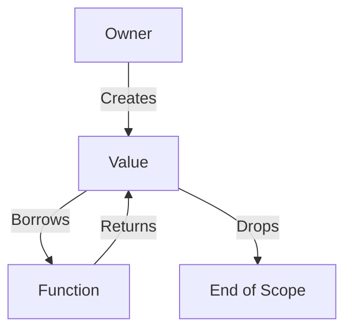

## 5.3. Using Ownership and Borrowing Effectively

Rust's ownership and borrowing system is one of its most distinctive features, providing memory safety without a garbage collector. In this section, we'll delve into the principles of ownership and borrowing, explore strategies for managing resources efficiently, and discuss common patterns for passing data between functions and threads. We'll also offer tips on avoiding issues like unnecessary cloning or lifetime complexities, and provide examples of idiomatic code that makes effective use of ownership.

### Understanding Ownership and Borrowing

Ownership is a set of rules that governs how a Rust program manages memory. At its core, ownership ensures that each piece of data has a single owner at any given time, and when the owner goes out of scope, the data is cleaned up. This system prevents memory leaks and ensures thread safety.

#### The Three Rules of Ownership

1. **Each value in Rust has a variable that's its owner.**
2. **There can only be one owner at a time.**
3. **When the owner goes out of scope, the value will be dropped.**

Borrowing allows you to reference data without taking ownership. This is crucial for passing data around without transferring ownership, which can be expensive in terms of performance.

#### Borrowing Rules

1. **You can have either one mutable reference or any number of immutable references to a piece of data at a time.**
2. **References must always be valid.**

### Strategies for Managing Resources Efficiently

Efficient resource management in Rust involves understanding when to use ownership, borrowing, and references. Here are some strategies to consider:

#### 1. Prefer Borrowing Over Cloning

Cloning data can be expensive, especially for large data structures. Instead, prefer borrowing data when you don't need ownership. This reduces memory usage and improves performance.

```rust
fn print_length(s: &String) {
    println!("The length of the string is {}", s.len());
}

fn main() {
    let s = String::from("Hello, Rust!");
    print_length(&s); // Borrowing the string
    println!("The string is still accessible: {}", s);
}
```

#### 2. Use References to Avoid Ownership Transfer

When a function doesn't need to own a value, pass a reference instead. This avoids unnecessary ownership transfers and potential performance hits.

```rust
fn calculate_area(width: &u32, height: &u32) -> u32 {
    width * height
}

fn main() {
    let width = 30;
    let height = 50;
    let area = calculate_area(&width, &height);
    println!("The area is {}", area);
}
```

#### 3. Leverage Lifetimes to Manage References

Lifetimes are a way of expressing the scope of references. They ensure that references are always valid and prevent dangling references.

```rust
fn longest<'a>(x: &'a str, y: &'a str) -> &'a str {
    if x.len() > y.len() {
        x
    } else {
        y
    }
}

fn main() {
    let string1 = String::from("long string is long");
    let string2 = "xyz";
    let result = longest(string1.as_str(), string2);
    println!("The longest string is {}", result);
}
```

### Common Patterns for Passing Data Between Functions and Threads

Passing data between functions and threads efficiently is crucial for performance and safety. Here are some common patterns:

#### 1. Using `Arc` for Shared Ownership Across Threads

`Arc` (Atomic Reference Counting) allows multiple threads to own the same data. It's useful when you need shared ownership in a concurrent context.

```rust
use std::sync::Arc;
use std::thread;

fn main() {
    let data = Arc::new(vec![1, 2, 3]);

    let handles: Vec<_> = (0..3).map(|i| {
        let data = Arc::clone(&data);
        thread::spawn(move || {
            println!("Thread {} sees data: {:?}", i, data);
        })
    }).collect();

    for handle in handles {
        handle.join().unwrap();
    }
}
```

#### 2. Using `Mutex` for Mutability in Concurrent Contexts

`Mutex` provides interior mutability, allowing you to mutate data safely across threads.

```rust
use std::sync::{Arc, Mutex};
use std::thread;

fn main() {
    let counter = Arc::new(Mutex::new(0));
    let handles: Vec<_> = (0..10).map(|_| {
        let counter = Arc::clone(&counter);
        thread::spawn(move || {
            let mut num = counter.lock().unwrap();
            *num += 1;
        })
    }).collect();

    for handle in handles {
        handle.join().unwrap();
    }

    println!("Result: {}", *counter.lock().unwrap());
}
```

### Tips on Avoiding Common Pitfalls

#### 1. Avoid Unnecessary Cloning

Cloning can lead to performance issues if overused. Always consider whether you can borrow data instead.

#### 2. Understand Lifetime Annotations

Lifetimes can seem complex, but they are essential for ensuring references are valid. Practice using them to gain confidence.

#### 3. Be Mindful of Mutable References

Rust enforces a strict borrowing rule to prevent data races. Ensure you understand when and why you need mutable references.

### Idiomatic Code Examples

Let's look at some idiomatic Rust code that effectively uses ownership and borrowing.

#### Example: Implementing a Simple Cache

```rust
use std::collections::HashMap;

struct Cache {
    map: HashMap<String, String>,
}

impl Cache {
    fn new() -> Cache {
        Cache {
            map: HashMap::new(),
        }
    }

    fn insert(&mut self, key: String, value: String) {
        self.map.insert(key, value);
    }

    fn get(&self, key: &str) -> Option<&String> {
        self.map.get(key)
    }
}

fn main() {
    let mut cache = Cache::new();
    cache.insert("key1".to_string(), "value1".to_string());
    if let Some(value) = cache.get("key1") {
        println!("Found: {}", value);
    }
}
```

### Visualizing Ownership and Borrowing

Below is a diagram illustrating the flow of ownership and borrowing in a Rust program:



**Diagram Description**: This diagram shows how a value is created by an owner, borrowed by a function, and eventually dropped at the end of its scope.

### Try It Yourself

Experiment with the code examples provided. Try modifying the cache example to handle more complex data types or add additional methods. Consider how ownership and borrowing affect your design choices.

### References and Further Reading

- [Rust Book: Ownership](https://doc.rust-lang.org/book/ch04-00-understanding-ownership.html)
- [Rust Book: References and Borrowing](https://doc.rust-lang.org/book/ch04-02-references-and-borrowing.html)
- [Rust Book: Lifetimes](https://doc.rust-lang.org/book/ch10-03-lifetime-syntax.html)

### Knowledge Check

- What are the three rules of ownership in Rust?
- How does borrowing differ from ownership?
- Why is cloning often discouraged in Rust?
- What is the purpose of lifetimes in Rust?
- How can you safely share data across threads in Rust?

### Embrace the Journey

Remember, mastering ownership and borrowing is a journey. As you progress, you'll find these concepts become second nature, allowing you to write more efficient and safe Rust code. Keep experimenting, stay curious, and enjoy the journey!

## Quiz Time!



### What is the primary purpose of Rust's ownership system?

- [x] To ensure memory safety without a garbage collector
- [ ] To allow multiple owners of the same data
- [ ] To simplify syntax for beginners
- [ ] To enforce functional programming paradigms

> **Explanation:** Rust's ownership system ensures memory safety without the need for a garbage collector by enforcing strict rules about how data is accessed and modified.

### How many mutable references can you have to a piece of data at one time?

- [x] One
- [ ] Two
- [ ] Unlimited
- [ ] None

> **Explanation:** Rust allows only one mutable reference to a piece of data at a time to prevent data races.

### What is a common alternative to cloning data in Rust?

- [x] Borrowing
- [ ] Copying
- [ ] Moving
- [ ] Dropping

> **Explanation:** Borrowing is a common alternative to cloning, as it allows you to access data without taking ownership, thus avoiding the overhead of cloning.

### What does the `Arc` type provide in Rust?

- [x] Shared ownership across threads
- [ ] Exclusive ownership
- [ ] Immutable references
- [ ] Mutable references

> **Explanation:** `Arc` (Atomic Reference Counting) provides shared ownership of data across threads, allowing multiple threads to access the same data safely.

### What is the role of lifetimes in Rust?

- [x] To ensure references are valid for the duration of their use
- [ ] To manage memory allocation
- [ ] To simplify syntax
- [ ] To enforce type safety

> **Explanation:** Lifetimes in Rust ensure that references are valid for the duration of their use, preventing dangling references and ensuring memory safety.

### Which of the following is a benefit of using borrowing over cloning?

- [x] Reduced memory usage
- [ ] Increased complexity
- [ ] Slower performance
- [ ] More ownership transfers

> **Explanation:** Borrowing reduces memory usage by allowing data to be accessed without creating a copy, which can improve performance.

### What does the `Mutex` type provide in Rust?

- [x] Interior mutability in concurrent contexts
- [ ] Immutable references
- [ ] Shared ownership
- [ ] Exclusive ownership

> **Explanation:** `Mutex` provides interior mutability, allowing data to be safely mutated across threads in concurrent contexts.

### How can you avoid unnecessary cloning in Rust?

- [x] By using references
- [ ] By using `Rc`
- [ ] By using `Box`
- [ ] By using `Copy`

> **Explanation:** Using references allows you to access data without taking ownership, avoiding the need for cloning.

### What is the significance of the `Deref` trait in Rust?

- [x] It allows smart pointers to behave like references
- [ ] It provides interior mutability
- [ ] It manages memory allocation
- [ ] It enforces type safety

> **Explanation:** The `Deref` trait allows smart pointers to behave like references, enabling seamless access to the data they point to.

### True or False: Rust's ownership system eliminates the need for a garbage collector.

- [x] True
- [ ] False

> **Explanation:** True. Rust's ownership system ensures memory safety and resource management without the need for a garbage collector.


