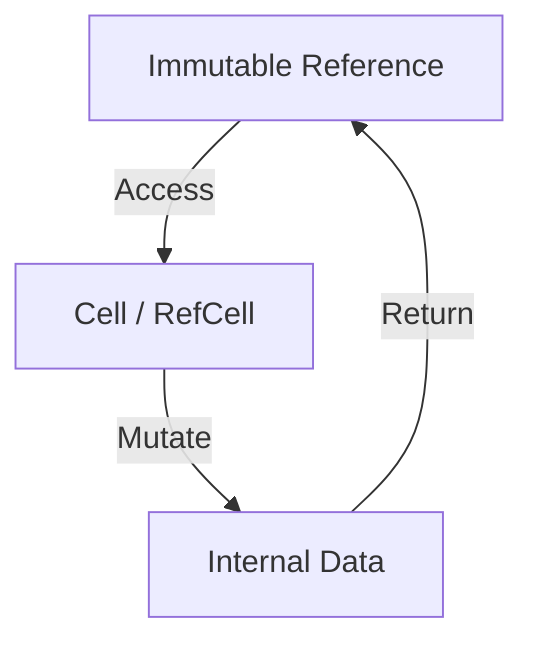

## 5.4. Interior Mutability with `Cell` and `RefCell`

In Rust, the concept of **interior mutability** allows you to mutate data even when there are immutable references to it. This might seem counterintuitive at first, given Rust's strict rules around ownership and borrowing, but it is a powerful tool when used correctly. In this section, we'll explore the interior mutability pattern, focusing on the `Cell<T>` and `RefCell<T>` types, which enable this behavior.

### Understanding Interior Mutability

**Interior mutability** is a design pattern in Rust that allows you to mutate data even when there are immutable references to it. This is achieved through types that provide a controlled way to bypass Rust's usual borrowing rules. The primary use case for interior mutability is when you need to mutate data within a data structure that is otherwise immutable.

#### Why Interior Mutability?

Rust's ownership model ensures memory safety by enforcing strict rules about how data can be accessed and modified. However, there are scenarios where you might need to modify data that is logically mutable but structurally immutable. For example:

- **Caching**: You might want to cache the result of a computation within an immutable object.
- **Lazy Initialization**: You might want to delay the initialization of a value until it is actually needed.
- **Shared State**: In concurrent programming, you might need to share mutable state across threads.

### Introducing `Cell<T>` and `RefCell<T>`

Rust provides two primary types for interior mutability: `Cell<T>` and `RefCell<T>`. Both types allow you to mutate data through immutable references, but they do so in different ways and are suited to different use cases.

#### `Cell<T>`

`Cell<T>` is a simple container for a value that provides interior mutability. It allows you to get and set the value it contains, but it does not allow you to borrow the value. This makes `Cell<T>` suitable for types that implement the `Copy` trait.

```rust
use std::cell::Cell;

fn main() {
    let cell = Cell::new(5);
    println!("Initial value: {}", cell.get());

    cell.set(10);
    println!("Updated value: {}", cell.get());
}
```

**Key Points about `Cell<T>`:**

- **Copy Types**: `Cell<T>` is best used with types that implement `Copy`, as it allows you to get and set values without borrowing.
- **No Borrowing**: You cannot borrow the value inside a `Cell<T>`, only get or set it.
- **Thread Safety**: `Cell<T>` is not thread-safe. It should only be used in single-threaded contexts.

#### `RefCell<T>`

`RefCell<T>` is a more flexible container that allows interior mutability for any type. It provides runtime borrow checking to ensure that you do not violate Rust's borrowing rules.

```rust
use std::cell::RefCell;

fn main() {
    let ref_cell = RefCell::new(vec![1, 2, 3]);

    {
        let mut borrowed = ref_cell.borrow_mut();
        borrowed.push(4);
    }

    println!("Updated vector: {:?}", ref_cell.borrow());
}
```

**Key Points about `RefCell<T>`:**

- **Runtime Borrow Checking**: `RefCell<T>` enforces borrowing rules at runtime, allowing only one mutable borrow or multiple immutable borrows at a time.
- **Flexibility**: It can be used with any type, not just `Copy` types.
- **Single-threaded**: Like `Cell<T>`, `RefCell<T>` is not thread-safe and should only be used in single-threaded contexts.

### Trade-offs and Pitfalls

While interior mutability is a powerful tool, it comes with trade-offs and potential pitfalls that you should be aware of.

#### Trade-offs

- **Runtime Overhead**: `RefCell<T>` incurs a runtime cost for borrow checking, which can impact performance.
- **Borrowing Errors**: Violating borrowing rules with `RefCell<T>` will cause your program to panic at runtime, unlike compile-time errors with standard borrowing.
- **Complexity**: Using interior mutability can make your code more complex and harder to reason about, especially in concurrent contexts.

#### Potential Pitfalls

- **Misuse of `RefCell<T>`**: Overusing `RefCell<T>` can lead to runtime panics if borrowing rules are violated.
- **Thread Safety**: Neither `Cell<T>` nor `RefCell<T>` is thread-safe. For concurrent contexts, consider using `Mutex<T>` or `RwLock<T>`.

### Using `Cell<T>` and `RefCell<T>` Safely

To use `Cell<T>` and `RefCell<T>` safely, follow these best practices:

- **Limit Scope**: Keep the scope of mutable borrows as small as possible to reduce the risk of runtime panics.
- **Check Borrows**: Always check for existing borrows before attempting to borrow mutably.
- **Use Sparingly**: Prefer standard borrowing and mutability patterns when possible, and use interior mutability only when necessary.

### When to Prefer Interior Mutability

Interior mutability should be used when:

- You need to mutate data within an immutable data structure.
- You are implementing patterns like caching or lazy initialization.
- You are working in a single-threaded context where thread safety is not a concern.

### Visualizing Interior Mutability

To better understand how `Cell<T>` and `RefCell<T>` work, let's visualize their behavior using a simple diagram.



**Diagram Description**: This diagram illustrates how an immutable reference can access a `Cell<T>` or `RefCell<T>`, mutate the internal data, and return the updated value.

### Try It Yourself

Experiment with the following code examples to deepen your understanding of interior mutability:

1. **Modify the `Cell<T>` Example**: Try using a non-`Copy` type with `Cell<T>` and observe the compiler error.
2. **Experiment with `RefCell<T>`**: Create a `RefCell<T>` containing a complex data structure and perform multiple borrows to see how runtime borrow checking works.

### References and Further Reading

- [Rust Documentation on Cell](https://doc.rust-lang.org/std/cell/struct.Cell.html)
- [Rust Documentation on RefCell](https://doc.rust-lang.org/std/cell/struct.RefCell.html)
- [The Rust Programming Language Book](https://doc.rust-lang.org/book/)

### Knowledge Check

- What is interior mutability, and why is it useful?
- How does `Cell<T>` differ from `RefCell<T>`?
- What are the trade-offs of using `RefCell<T>`?
- When should you prefer interior mutability over standard mutability patterns?

### Embrace the Journey

Remember, mastering interior mutability is just one step in your Rust journey. As you continue to explore Rust's powerful features, you'll find new ways to write safe, efficient, and expressive code. Keep experimenting, stay curious, and enjoy the journey!

## Quiz Time!



### What is the primary purpose of interior mutability in Rust?

- [x] To allow mutation of data even when there are immutable references
- [ ] To enforce stricter compile-time checks
- [ ] To improve performance by avoiding runtime checks
- [ ] To simplify the ownership model

> **Explanation:** Interior mutability allows data to be mutated even when there are immutable references, which is useful in certain scenarios like caching and lazy initialization.

### Which type is best suited for types that implement the `Copy` trait?

- [x] `Cell<T>`
- [ ] `RefCell<T>`
- [ ] `Mutex<T>`
- [ ] `Rc<T>`

> **Explanation:** `Cell<T>` is best suited for types that implement the `Copy` trait because it allows getting and setting values without borrowing.

### What happens if you violate borrowing rules with `RefCell<T>`?

- [ ] The program will compile with warnings
- [ ] The program will run with reduced performance
- [x] The program will panic at runtime
- [ ] The program will silently ignore the violation

> **Explanation:** Violating borrowing rules with `RefCell<T>` will cause the program to panic at runtime, as `RefCell<T>` enforces borrowing rules at runtime.

### Which of the following is NOT a trade-off of using `RefCell<T>`?

- [ ] Runtime overhead
- [ ] Borrowing errors causing panics
- [ ] Increased code complexity
- [x] Improved compile-time safety

> **Explanation:** `RefCell<T>` does not improve compile-time safety; it enforces borrowing rules at runtime, which can lead to panics if violated.

### When should you prefer interior mutability?

- [x] When you need to mutate data within an immutable data structure
- [ ] When you need to enforce compile-time borrowing rules
- [ ] When you need to share data across threads
- [ ] When you need to avoid runtime checks

> **Explanation:** Interior mutability is preferred when you need to mutate data within an immutable data structure, such as for caching or lazy initialization.

### Which type provides runtime borrow checking?

- [ ] `Cell<T>`
- [x] `RefCell<T>`
- [ ] `Mutex<T>`
- [ ] `Arc<T>`

> **Explanation:** `RefCell<T>` provides runtime borrow checking, allowing only one mutable borrow or multiple immutable borrows at a time.

### What is a potential pitfall of using `RefCell<T>`?

- [x] Runtime panics due to borrowing violations
- [ ] Compile-time errors due to ownership rules
- [ ] Increased memory usage
- [ ] Reduced code readability

> **Explanation:** A potential pitfall of using `RefCell<T>` is runtime panics due to borrowing violations, as it enforces borrowing rules at runtime.

### Which of the following is true about `Cell<T>`?

- [x] It does not allow borrowing the value inside
- [ ] It is thread-safe
- [ ] It allows multiple mutable borrows
- [ ] It is best used with non-`Copy` types

> **Explanation:** `Cell<T>` does not allow borrowing the value inside; it only allows getting and setting the value.

### What is the main difference between `Cell<T>` and `RefCell<T>`?

- [x] `Cell<T>` is for `Copy` types, while `RefCell<T>` can be used with any type
- [ ] `Cell<T>` is thread-safe, while `RefCell<T>` is not
- [ ] `Cell<T>` allows borrowing, while `RefCell<T>` does not
- [ ] `Cell<T>` has runtime borrow checking, while `RefCell<T>` does not

> **Explanation:** `Cell<T>` is best used with `Copy` types, while `RefCell<T>` can be used with any type and provides runtime borrow checking.

### True or False: `RefCell<T>` is thread-safe and can be used in concurrent contexts.

- [ ] True
- [x] False

> **Explanation:** False. `RefCell<T>` is not thread-safe and should only be used in single-threaded contexts.




